# 强化学习指南:用 Python 从零开始解决多臂土匪问题

> 原文：<https://medium.com/analytics-vidhya/reinforcement-learning-guide-solving-the-multi-armed-bandit-problem-from-scratch-in-python-cecd1f093a02?source=collection_archive---------1----------------------->


你在城镇里有最喜欢的咖啡店吗？当你想喝咖啡时，你可能会去这个地方，因为你几乎可以肯定你会得到最好的咖啡。但这意味着你错过了这个地方的同城竞争对手提供的咖啡。

如果你一个接一个地尝试所有的咖啡场所，品尝到你一生中最糟糕的咖啡的概率会相当高！但是话说回来，你有机会找到一个更好的咖啡冲泡器。但是所有这些和强化学习有什么关系呢？

很高兴你这么问。

我们品尝咖啡实验中的困境来自于不完整的信息。换句话说，我们需要收集足够的信息来制定最佳的总体战略，然后探索新的行动。这将最终导致整体不良经历的最小化。

**多臂土匪是这个比喻的简化形式**。它被用来表示类似的问题，找到一个好的策略来解决这些问题已经帮助了很多行业。

在本文中，我们将首先了解什么是多臂土匪问题，它在现实世界中的各种用例，然后探讨一些如何解决它的策略。然后，我将向您展示如何使用点击率优化数据集在 Python 中解决这一挑战。

# 什么是多武装匪徒问题(MABP)？

强盗被定义为偷你钱的人。独臂强盗是一个简单的吃角子老虎机，你将一枚硬币投入机器，拉动杠杆，立即获得奖励。但是为什么叫土匪呢？原来所有的赌场都以这样一种方式配置这些老虎机，所有的赌徒最后都会输钱！

多臂强盗是一种复杂的吃角子老虎机，其中不是一个，而是有几个杠杆，游戏者可以拉，每个杠杆给出不同的回报。对应于每个级别的奖励的概率分布是不同的，并且对于游戏者来说是未知的。

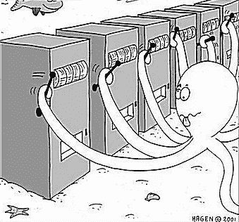

任务是在给定的一组试验后，确定拉哪个杠杆以获得最大的回报。这个问题陈述就像一个单步马尔可夫决策过程，我在[这篇文章](https://www.analyticsvidhya.com/blog/2018/09/reinforcement-learning-model-based-planning-dynamic-programming/)中讨论过。选择的每一只手臂都相当于一个动作，而这个动作会立即带来回报。

**伯努利 MABP 背景下的勘探开发**

下表显示了具有标记为 1、2、3、4 和 5 的臂的 5 臂 Bernoulli bandit 的样本结果:

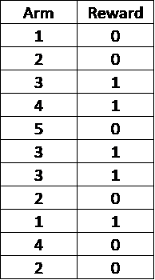

这被称为伯努利，因为返回的回报不是 1 就是 0。在这个例子中，看起来 3 号手臂给出了最大回报，因此一个想法是继续玩这个手臂，以获得最大回报(纯粹的剥削)。

仅根据给定样本的知识，5 可能看起来像是一个不好的手臂，但我们需要记住，我们只玩过这个手臂一次，也许我们应该多玩几次(探索)才能更有信心。只有这样，我们才应该决定使用哪只手臂(剥削)。

# 用例

Bandit 算法正被用于行业内的许多研究项目中。我在这一节中列出了它们的一些用例。

# 临床试验

临床试验期间患者的健康与研究的实际结果同样重要。在这里，探索相当于确定最佳治疗方法，而开发则是在试验过程中尽可能有效地治疗病人。


# 网络路由

路由是为网络(如电话网络或计算机网络(互联网))中的流量选择路径的过程。将信道分配给正确的用户，使得总吞吐量最大化，这可以用 MABP 来表示。

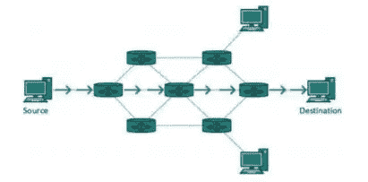

# 在线广告

广告活动的目标是从展示广告中获得最大收益。每当网络用户点击一个报价，广告商就获得收入。与 MABP 类似，在探索和利用之间也有一个权衡，探索的目标是利用点击率收集广告表现的信息，而利用则是我们坚持使用迄今为止表现最好的广告。


# 游戏设计

打造一款热门游戏极具挑战性。MABP 可以用来测试游戏/界面的实验性变化，并利用这些变化为玩家带来积极的体验。


# 解决方案策略

在这一节中，我们将讨论一些解决多臂土匪问题的策略。但在此之前，让我们先熟悉一下从现在开始我们将使用的几个术语。

# 动作值函数

预期收益或预期回报也可以称为行动价值函数。它用 q(a)表示，定义了在时间 t 时每个行为的平均回报。

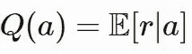

假设一个 K 臂强盗的奖励概率由{P1，P2，P3 …… Pk}给出。如果在时间 t 选择了具有臂的*，则 Qt(a) = Pi。*

问题是，我们如何决定一个给定的策略是否优于其他策略？一个直接的方法是比较我们在 *n* 次试验后每种策略得到的总回报或平均回报。如果我们已经知道对于给定的土匪问题的最佳行动，那么一个有趣的方式来看这是后悔的概念。

# 遗憾

让我们说，我们已经知道对于给定的土匪问题的最佳手臂拉。如果我们不断重复拉动这条手臂，我们将获得一个最大的预期回报，可以用一条水平线来表示(如下图所示):

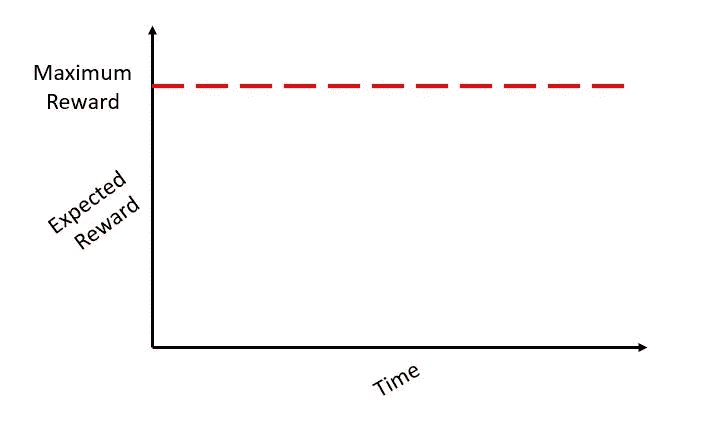

但是在一个真正的问题陈述中，我们需要通过拉不同的手臂进行重复的试验，直到我们大致确定拉哪只手臂在某个时间 *t* 获得最大的平均回报。**我们因学习花费的时间/轮次而招致的损失叫做后悔。**换句话说，即使在学习阶段，我们也想让我的回报最大化。后悔的名字非常恰当，因为它准确地量化了你后悔没有选择最佳手臂的程度。

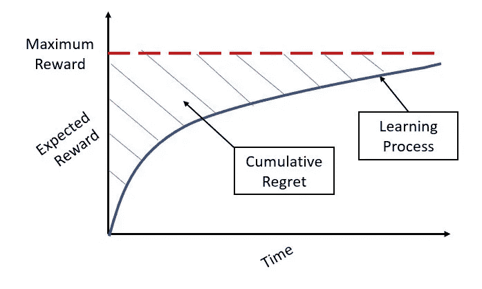

现在，有人可能会好奇，如果我们遵循的方法没有进行足够的探索，并最终利用了一个次优的分支，后悔会如何改变。最初可能后悔程度较低，但总的来说，我们远低于给定问题的最大可实现奖励，如下图中绿色曲线所示。

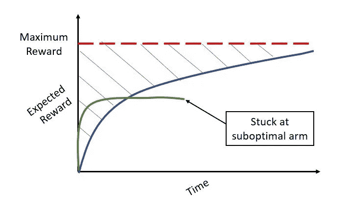

根据勘探的方式，有几种方法可以求解 MABP。接下来，我们将讨论一些可能的解决策略。

# 没有探索(贪婪的方法)

一种简单的方法是在每个时间步计算所有臂的 q 或动作值函数。从该点开始，选择一个给出最大 q 值的动作。每个动作的动作值将由以下函数在每个时间步长存储:

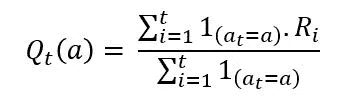

然后，它在每个时间步选择最大化上述表达式的动作，由下式给出:

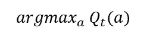

然而，为了在每个时间 t 评估这个表达式，我们需要计算整个奖励的历史。我们可以通过运行求和来避免这种情况。因此，在每个时间 t，每个动作的 q 值可以使用奖励来计算:

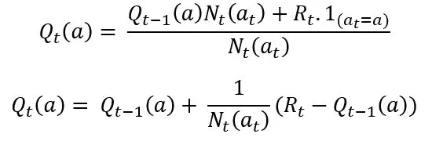

这里的问题是，这种方法只是利用，因为它总是选择相同的行动，而不担心探索可能会带来更好回报的其他行动。为了找到最佳的手臂，一些探索是必要的，否则我们可能会永远拉着次优的手臂。

# ε贪婪方法

一个可能的解决方案是现在，然后我们可以探索新的行动，以确保我们不会错过更好的选择。有了ε概率，我们会选择一个随机动作(探索)，选择一个 qt(a)最大的动作，概率为 1-ε。

***以概率 1-ε—我们选择最大值的动作(argmaxa Qt(a))***

***概率为ε—我们从一组所有动作 A*** 中随机选择一个动作

例如，如果我们对两个操作(A 和 B)有问题，则ε贪婪算法的工作方式如下所示:

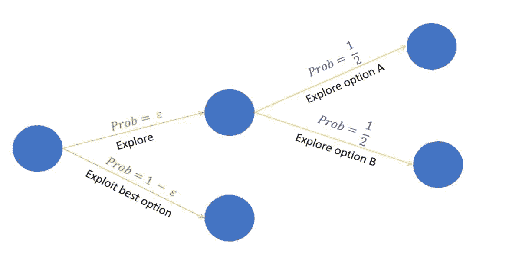

这比贪婪的方法好得多，因为我们在这里有一个探索的元素。然而，如果两个动作的 q 值相差很小，那么即使这个算法也只会选择概率比其他动作高的那个动作。

# Softmax 探索

解决方案是使选择动作的概率与 q 成比例。这可以使用 softmax 函数来完成，其中在每一步选择动作 *a* 的概率由以下表达式给出:

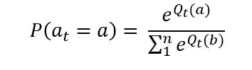

# 腐朽的贪婪的ε

ε的值对于决定ε贪婪算法对于给定问题的效果非常重要。我们可以通过保持ε依赖于时间来避免设置这个值。例如，ε可以保持等于 *1/log(t+0.00001)* 。它将不断减少久而久之，直到我们开始探索越来越少，因为我们对最佳行动或手臂越来越有信心。

随机选择动作的问题是，在足够的时间步长后，即使我们知道某个 arm 是坏的，该算法也会以概率*ε/n*继续选择。本质上，我们正在探索一个听起来不是很有效的坏行为。解决这一问题的办法可能是支持开发潜力大的武器，以获得最佳价值。

# 置信上限

置信上限(UCB)是多臂土匪问题最广泛使用的解决方法。这种算法基于面对不确定性时的乐观原则。

换句话说，我们对一条手臂越不确定，探索这条手臂就变得越重要。

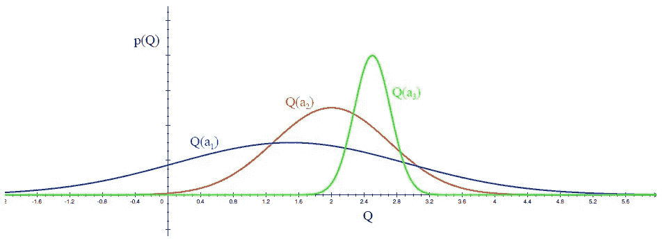

*   经过几次试验后，3 个不同臂 a1、a2 和 a3 的作用值函数分布如上图所示。该分布显示 a1 的行动值具有最高的方差，因此具有最大的不确定性。
*   UCB 说，我们应该选择手臂 a1，并接受奖励，让我们对它的行动价值不那么确定。对于下一个试验/时间步，如果我们仍然对 a1 非常不确定，我们将再次选择它，直到不确定性降低到阈值以下。

这样做的直观原因是，当以这种方式乐观行事时，会发生以下两种情况之一:

*   乐观是合理的，我们会得到积极的回报，这是最终的目标
*   这种乐观是没有道理的。在这种情况下，我们玩一手牌，我们认为这手牌可能会给我们很大的奖励，但实际上并没有。如果这种情况发生得足够频繁，那么我们将会知道这种行为的真正收益是什么，而不会在未来选择它。

UCB 实际上是一个算法家族。在这里，我们将讨论 UCB1。

**UC B1 涉及的步骤:**

*   *将 K 个动作中的每个动作玩一次，在*给出每个动作对应的平均奖励的初始值
*   *对于每一轮 t = K:*
*   *让 Nt(a)表示到目前为止动作 a 被播放的次数*
*   *扮演最大化以下表达式的动作:*

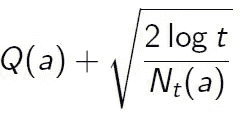

*   *观察奖励并更新所选行动的平均奖励或预期回报*

我们将不深入研究 UCB 的数学证明。然而，理解与我们选择的动作相对应的表达式是很重要的。记住，在随机探索中，我们只有 Q(a)最大化，而这里我们有两个项。第一个是动作值函数，第二个是置信项。

*   每次选择 *a* 时，不确定性大概会减少:Nt(a)增加，并且，当它出现在分母中时，不确定性项减少。

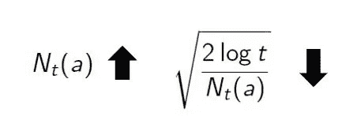

*   另一方面，每次选择除了 *a* 之外的动作时，t 增加，但是 Nt(a)不增加；因为 t 出现在分子中，不确定性估计增加。

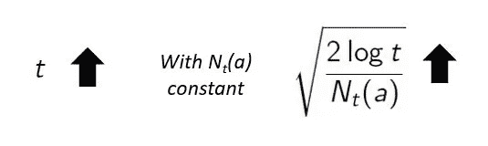

*   自然对数的使用意味着随着时间的推移，增量变小；最终将选择所有动作，但是具有较低估计值的动作，或者已经被频繁选择的动作，将随着时间的推移以降低的频率被选择。
*   这将最终导致最优行动最终被反复选择。

**后悔对比**

在本文给出的所有算法中，只有 UCB 算法提供了一种后悔随着 log(t)增加的策略，而在其他算法中，我们得到了不同斜率的线性后悔。

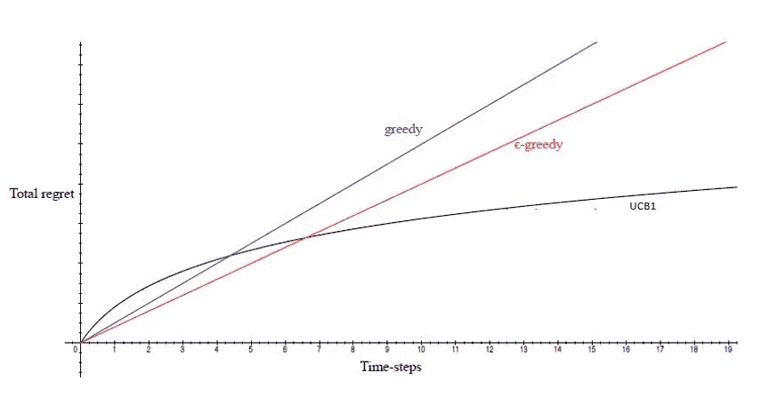

# 非平稳 Bandit 问题

我们在这里做的一个重要假设是，我们与同一个 bandit 一起工作，并且在每个时间步中被采样的奖励分布保持不变。这就是所谓的稳态问题。再用一个例子来解释，比如说你每抛一次硬币就获得 1 的奖励，结果是正面。假设在 1000 次硬币投掷后，由于磨损和撕裂，硬币变得有偏差，那么这将成为一个不稳定的问题。

为了解决一个非平稳问题，更新的样本将是重要的，因此我们可以使用一个常数贴现因子α，我们可以将更新方程改写如下:

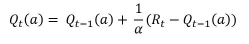

注意，我们在这里用常数α代替了 Nt(at ),这确保了最近的样本被赋予更高的权重，并且增量更多地由这些最近的样本决定。还有其他技术，提供不同的解决方案，强盗与非固定奖励。你可以在这篇[论文](https://arxiv.org/abs/0805.3415)中读到更多关于他们的内容。

# 从头开始为广告中心优化实施 Python

如用例部分所述，MABP 在在线广告领域有很多应用。

假设一家广告公司在一个网页上投放了 10 个不同的广告，目标是相似的人群。我们有用户点击广告的结果[这里](https://drive.google.com/open?id=1whkIInL4FKeHg2IfdcbT1j18L26fg9aF)。每个列索引代表一个不同的广告。如果广告被用户点击，我们得到 1，如果没有被点击，我们得到 0。原始数据集中的一个示例如下所示:

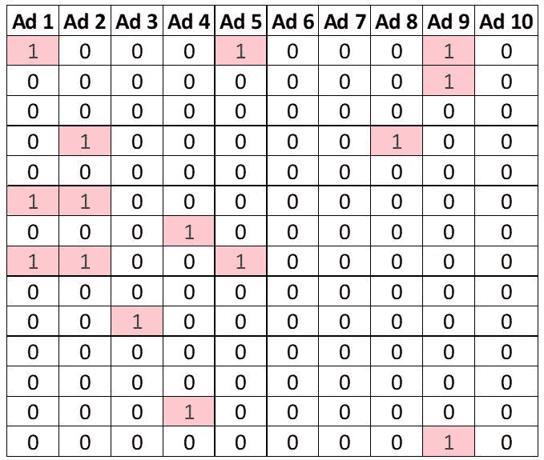

这是一个模拟数据集，它将 Ad #5 作为给出最大奖励的数据集。

首先，我们将尝试一种随机选择技术，我们随机选择任意一个广告并展示给用户。如果用户点击广告，我们得到报酬，如果没有，就没有利润。

```
# Random Selection

# Importing the libraries
import numpy as np
import matplotlib.pyplot as plt
import pandas as pd

# Importing the dataset
dataset = pd.read_csv('Ads_Optimisation.csv')

# Implementing Random Selection
import random
N = 10000
d = 10
ads_selected = []
total_reward = 0
for n in range(0, N):
    ad = random.randrange(d)
    ads_selected.append(ad)
    reward = dataset.values[n, ad]
    total_reward = total_reward + reward
```

随机选择算法的总奖励是 1170。由于这个算法没有学习任何东西，它不会聪明地选择任何给出最大回报的广告。因此，即使我们查看过去的 1000 次试验，也无法找到最佳广告。

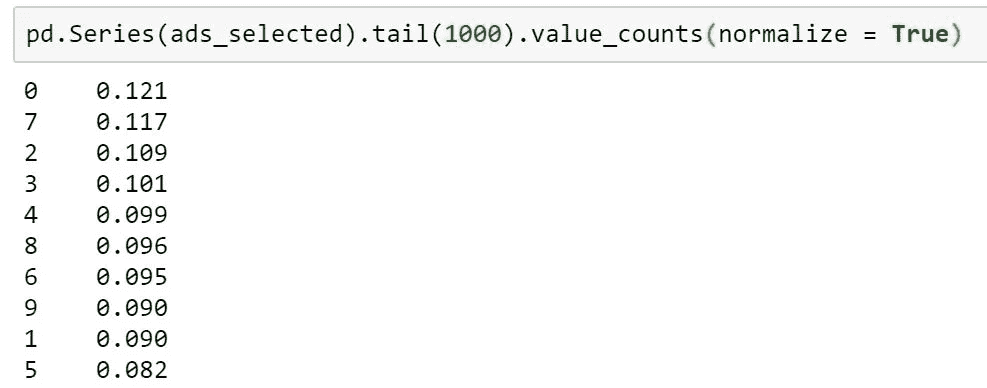

现在，让我们尝试置信上限算法来做同样的事情:

```
# Implementing UCB
import math
N = 10000
d = 10
ads_selected = []
numbers_of_selections = [0] * d
sums_of_reward = [0] * d
total_reward = 0

for n in range(0, N):
    ad = 0
    max_upper_bound = 0
    for i in range(0, d):
        if (numbers_of_selections[i] > 0):
            average_reward = sums_of_reward[i] / numbers_of_selections[i]
            delta_i = math.sqrt(2 * math.log(n+1) / numbers_of_selections[i])
            upper_bound = average_reward + delta_i
        else:
            upper_bound = 1e400
        if upper_bound > max_upper_bound:
            max_upper_bound = upper_bound
            ad = i
    ads_selected.append(ad)
    numbers_of_selections[ad] += 1
    reward = dataset.values[n, ad]
    sums_of_reward[ad] += reward
    total_reward += reward
```

UCB 的*总奖励*是 2125。显然，这比随机选择好得多，而且确实是一种聪明的探索技术，可以显著改善我们解决 MABP 的策略。

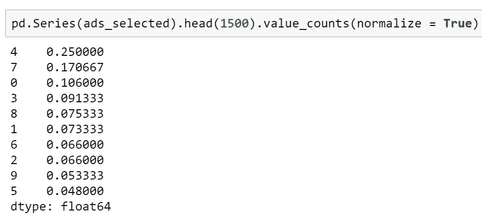

仅仅经过 1500 次试验，UCB 就已经倾向于广告#5(索引 4 ),它恰好是最佳广告，并且对于给定的问题获得了最大的回报。

# 结束注释

作为一个活跃的研究领域，MABP 将渗透到行业的其他各个领域。这些算法如此简单而强大，以至于越来越多的小型科技公司都在使用它们，因为它们所需的计算资源通常很低。

展望未来，还有其他基于概率模型的技术，如巴拉拉曼教授在这个令人惊叹的[视频](https://www.youtube.com/watch?v=H2OWTxdauqA)中解释的汤普森抽样。

你也可以在班加罗尔举行的 DataHack Summit 2018 上参加他关于强化学习的备受期待且极其有用的演讲！更多详情请访问[https://www.analyticsvidhya.com/datahack-summit-2018/](https://www.analyticsvidhya.com/datahack-summit-2018/)。

*原载于 2018 年 9 月 24 日*[*www.analyticsvidhya.com*](https://www.analyticsvidhya.com/blog/2018/09/reinforcement-multi-armed-bandit-scratch-python/)*。*