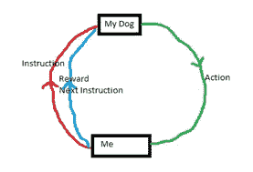
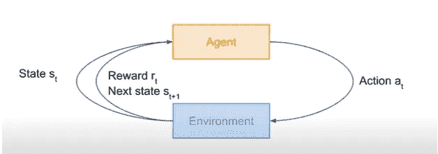

# 投资组合管理中的强化学习

> 原文：<https://medium.com/analytics-vidhya/reinforcement-learning-in-portfolio-management-4e4eed75961d?source=collection_archive---------15----------------------->

强化学习(RL)是继监督学习和非监督学习之后的一种机器学习技术。深度强化学习侧重于使用神经网络的学习。在这篇文章中，我将尝试用一种非常简单的方式来解释 RL 的数学概念。

什么是 RL，它与有监督和无监督的机器学习问题有什么不同？

监督学习——我们有一个带有标记目标变量的**结构化数据，我们**为一个类似的未标记结构化数据集预测目标**。分类和回归就是例子。**

无监督学习——我们有一个**未标记和非结构化的数据集**,我们**学习数据的潜在模式**。聚类和降维就是例子。

强化学习不同于监督学习和非监督学习。它用于解决基于奖励的问题。让我们看看这个例子就明白了。

你有没有见过，一只宠物狗是怎么被训练成坐着握手的，每次它做对了，我们就奖励它。在下面(真的很可怕)的图中，我们可以看到我给狗一个指令，它采取一个行动，这给他一个奖励和下一个指令，直到它学会一切。

RL 是一种类似的基于奖励的学习方式。在 RL 中，我们有一个类似的设置如下，(但一个更好更漂亮的图片)。

这里，环境是我，代理是我的狗，状态是指令，下一个状态是下一个指令，动作是动作。环境给出一个状态，该状态触发代理接收奖励的动作，这一直持续到环境停止给出下一个状态。RL 的著名应用有

1.网络游戏围棋

2.雅达利游戏

3.让人形机器人行走

4.管理投资组合

RL 可以通过称为马尔可夫决策过程(MDP)的随机过程在数学上形式化。MDP 是安德烈·马尔科夫著名的马尔科夫链的延伸。

什么是马尔可夫链和 MDP？

马尔可夫链根据代理的当前状态和转移概率预测代理的下一个状态。并且这种预测可以持续到收敛，因此被称为链。例如:假设市场上有 3 家著名的零售店，分别是 X、Y 和 Z，那么我们可以根据今天光顾该店的顾客数量以及该顾客可能光顾同一家店的概率来预测第二天会有多少顾客光顾同一家店。

MDP 是马尔可夫链的一种扩展，在连续的状态中有更少的元素，如动作和奖励，就像在训练狗的例子中一样。

数学上 MDP 被定义为使总收益最大化的元组(s，a，p，ɣ，r)，元组被定义为:

1.s 是状态的有限集合

2.a 是一组有限的动作

3.p 是状态转移概率分布

4.ɣ是贴现因子，属于[0，1]

5.r 是奖励函数

总收益定义为

R(s0)+ɣ R(s1)+ɣ*ɣ*R(s2)+….

这个等式只不过是以ɣ为贴现因子的未来回报的现值。ɣ倾向于权衡眼前的未来回报，而不是延迟的未来回报。

RL 的一个很好的应用是在项目组合管理中，如论文“*项目组合管理中的对抗性深度强化学习*”中所述。

投资组合管理问题可以定义为-在给定的时间段内，股票经纪人应该如何重新分配投资组合，以使利润最大化。在 MDP，我们有连续的市场环境，收盘价等于第二天的开盘价。这里的元组(s，a，p，ɣ，r)应该是:

一种状态包括固定窗口中的先前的开盘价、收盘价、最高价、最低价、成交量或一些其他财务指标。

a-动作是分配给每个资产的权重，使得权重之和等于 1。

r——回报是每次行动后财富的波动减去交易成本

P —转移概率分布

ɣ —折扣系数

在投资组合管理领域，由于 T 时刻积累的财富会在 t+1 时刻重新分配，这表明 T 时刻的财富是连续的乘积形式，而不是总和。因此总收益是

R(s0)*ɣ R(s1)*ɣ*ɣ*R(s2)*….运筹学

log(r(s0))+log(ɣr(s1))+log(ɣ*ɣ*r(s2))+….

谢谢你

你也可以看看 neptune.ai 的这个博客，详细的解释和可视化。

https://Neptune . ai/blog/Markov-决策-过程-强化-学习