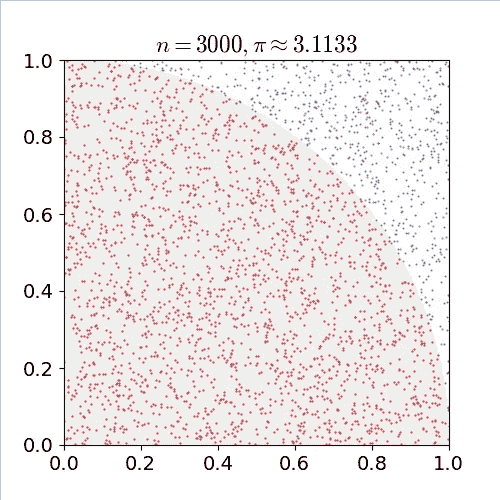
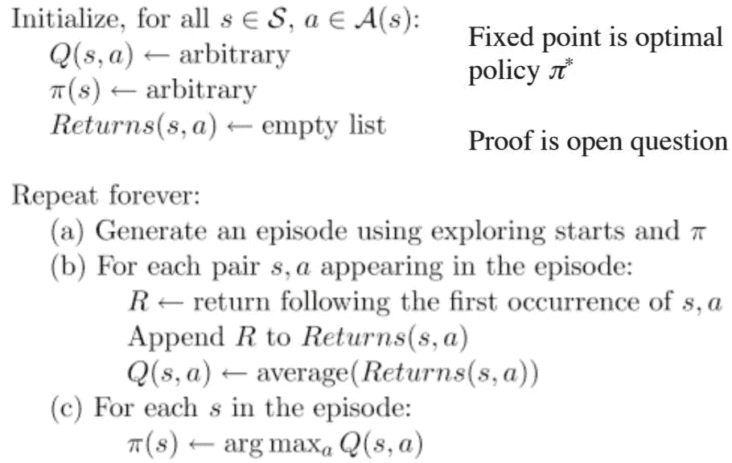

# 强化学习:使用 OpenAI Gym 工具包介绍蒙特卡罗学习

> 原文：<https://medium.com/analytics-vidhya/reinforcement-learning-introduction-to-monte-carlo-learning-using-the-openai-gym-toolkit-4efef9375648?source=collection_archive---------0----------------------->

听到“强化学习”这四个字，你首先想到的是什么？最常见的想法是——太复杂，数学太多。但是我在这里向你保证，这是一个非常迷人的研究领域——我的目标是在我的文章中将这些技术分解成易于理解的概念。

我相信你一定听说过 OpenAI 和 DeepMind。这是两个领先的人工智能组织，他们在该领域取得了重大进展。一个 OpenAI 机器人团队在 Dota 2 中击败了一个业余玩家团队，这是一个非常受欢迎和复杂的战斗竞技场游戏。


不幸的是，这是一个不去。状态实在是太多了(数以百万计)，收集 DOTA 2 的所有细节是一项不可能完成的任务。这就是我们进入强化学习或者更具体地说无模型学习领域的地方。

在本文中，我们将尝试了解蒙特卡洛学习的基础知识。当没有环境的先验信息，并且所有信息基本上都是通过经验收集的时候，就使用它。我们将使用 Python 中的 OpenAI Gym 工具包来实现这个方法。

让我们开始吧！

*如果你是这一领域的初学者，或者需要快速复习一些基本的强化学习术语，我强烈推荐你阅读下面的文章，以便从这篇文章中获得最大的收获:*

1.  [*强化学习简易入门&其实现*](https://www.analyticsvidhya.com/blog/2017/01/introduction-to-reinforcement-learning-implementation/)
2.  [*螺母&螺栓的强化学习:基于模型的规划使用动态编程*](https://www.analyticsvidhya.com/blog/2018/09/reinforcement-learning-model-based-planning-dynamic-programming/)
3.  [*强化学习指南:用 Python 从零开始解决多臂土匪问题*](https://www.analyticsvidhya.com/blog/2018/09/reinforcement-multi-armed-bandit-scratch-python/)

# 目录

1.  基于模型的学习与无模型的学习
2.  蒙特卡罗方法——一个例子
3.  蒙特卡洛强化学习
    1。蒙特卡洛预测
    2。蒙特卡洛控制
4.  使用 OpenAI Gym 在 Python 中实现

# 基于模型的学习与无模型的学习

我们知道，动态编程用于解决环境的底层模型事先已知的问题(或者更准确地说，基于模型的学习)。强化学习就是在玩游戏中从经验中学习。然而，在所有的动态编程算法中，我们都没有真正地玩游戏/体验环境。我们有一个完整的环境模型，包括所有的状态转移概率。

然而，正如我们在引言中看到的，在大多数现实生活情况下，从一个状态到另一个状态的转移概率(或所谓的环境模型)是事先不知道的。任务甚至不必遵循马尔可夫性质。


比方说，我们想训练一个机器人学习如何下棋。考虑将象棋环境转换为 MDP。

现在，根据棋子的定位，这个环境将有许多状态(超过 1050 个)，以及大量可能的动作。这种环境的模型几乎无法设计！

一个潜在的解决方案可能是重复地玩一盘完整的棋，在每局结束时，赢了得到正的奖励，输了得到负的奖励。这叫从经验中学习。

# 蒙特卡罗方法——一个例子

任何通过产生合适的随机数并观察服从某种性质的那部分数来解决问题的方法，都可以归类为蒙特卡罗方法。

让我们做一个有趣的练习，用纸和笔找出圆周率的值。我们画一个单位长度的正方形，用单位长度半径画一个四分之一圆。现在，我们有一个助手机器人 C3PO。它的任务是在正方形上随机放置尽可能多的点 3000 次，结果如下图所示:



C3PO 每次在一个圆里放一个点都需要计数。因此，圆周率的值由下式给出:


其中 N 是一个点被放入圆中的次数。正如你所看到的，我们没有做任何事情，除了数落在圆内的随机点，然后用一个比率来近似圆周率的值。

# 蒙特卡洛强化学习

用于强化学习的蒙特卡罗方法直接从经验片断中学习，而不需要任何 MDP 跃迁的先验知识。在这里，随机成分是回报或奖励。

*有一点需要注意的是，它只能应用于偶发的 MDP*。在这一点上，有理由问为什么。原因是这一集必须在之前结束*，我们才能计算任何回报。在这里，我们不是在每一个动作之后做一个更新，而是在每一集之后。它使用了最简单的想法——该值是每个状态的所有样本轨迹的平均回报。*

回想一下这篇[文章](https://www.analyticsvidhya.com/blog/2018/09/reinforcement-multi-armed-bandit-scratch-python/)中讨论的多武装匪徒的想法，每个州都是一个独立的多武装匪徒问题，这个想法是让所有多武装匪徒同时表现最佳。

与动态规划类似，还有一个策略评估(为给定的随机策略寻找值函数)和策略改进步骤(寻找最优策略)。我们将在接下来的两节中介绍这两个步骤。

# 蒙特卡洛政策评估

同样，这里的目标是从政策 pi 下的经验中学习价值函数 vpi(s)。回想一下，回报是总折扣奖励:

*S1，A1，R2，…Sk ~ pi*

还记得价值函数是预期收益:


我们知道，只需将样本相加，然后除以样本总数，就可以估算出任何期望值:


*   i —情节索引
*   s——状态指数

问题是我们如何获得这些样本回报？为此，我们需要播放一系列剧集并生成它们。

对于我们播放的每一集，我们都会有一系列的状态和奖励。而从这些回报中，我们可以根据定义计算出回报，这只是所有未来回报的总和。


***第一次访问蒙特卡洛:*** 平均回报只针对第一次 s 被访问的一集。

以下是该算法工作原理的分步视图:

1.  初始化策略、状态值函数
2.  首先根据当前策略
    1 生成一集。记录该事件中遇到的状态
3.  在 2.1
    1 中选择一个状态。将此状态
    2 首次出现后收到的返回添加到列表中。所有回报的平均值
    3。将状态值设置为计算出的平均值
4.  重复步骤 3
5.  重复 2–4 直到满意为止

***每次访问蒙特卡洛:*** 每集 s 每次被访问的平均回报。

对于该算法，我们只需将步骤#3.1 更改为“将每次出现该状态后收到的返回添加到列表中”。

让我们考虑一个简单的例子来进一步理解这个概念。假设在一个环境中，我们有两种状态——A 和 b。假设我们观察到两个样本集:


A+3 => A 表示从状态 A 到状态 A 的转换，奖励为+3。让我们用两种方法找出价值函数:


# 增量平均值

将均值回报转换为增量更新是很方便的，这样均值可以随着每集更新，我们可以了解每集取得的进展。我们在解决多臂强盗问题时已经学到了这一点。

我们在剧集结束后逐步更新 v(s)。对于每个状态 St，返回 Gt:


在非平稳问题中，跟踪运行均值(即忘记旧事件)可能是有用的:

V(St)←V(St)+α(Gt V(St))

# 蒙特卡洛控制

类似于动态规划，一旦我们有了随机策略的价值函数，剩下的重要任务就是使用蒙特卡罗找到最优策略。

回想一下，DP 中的政策改进公式需要环境模型，如下式所示:


这个等式通过寻找使回报总和最大化的行动来找出最优策略。然而，这里的一个主要警告是，它使用转移概率，这在无模型学习的情况下是未知的。

由于我们不知道状态转移概率 *p(s '，r/s，a)* ，我们不能像 DP 一样进行前瞻搜索。因此，所有信息都是通过玩游戏或探索环境的经验获得的。

通过使策略相对于当前值函数变得贪婪来完成策略改进。在这种情况下，我们有一个动作值函数，因此不需要模型来构建贪婪策略。


一个贪婪的策略(就像上面提到的)将总是倾向于某个特定的行为，如果大多数行为没有被适当地探索的话。对此有两种解决方案:

**蒙特卡洛探索开始**

在该算法中，所有状态动作对都有非零概率成为起始对。这将确保播放的每一集将代理带到新的状态，因此，有更多的环境探索。



**蒙特卡罗与ε-Soft**

如果一个环境(例如，一盘棋)只有一个起点，该怎么办？在这种情况下，探索起点并不是正确的选择。回想一下，在多臂土匪问题中，我们讨论了[ε贪婪方法](https://www.analyticsvidhya.com/blog/2018/09/reinforcement-multi-armed-bandit-scratch-python/)。

确保持续探索的最简单想法所有行动都以非零概率尝试 1-ε选择最大化行动价值函数的行动，以概率ε随机选择行动。


现在我们已经了解了蒙特卡罗控制和预测的基础，让我们用 Python 实现这个算法。我们将从流行的 OpenAI 健身房工具包中导入冰冻的湖泊环境。

# 用 Python 实现蒙特卡罗

# 冰冻湖泊环境

代理控制网格世界中角色的移动。网格的一些瓦片是可行走的，其他的导致代理人掉进水里。此外，代理的移动方向是不确定的，并且仅部分取决于所选择的方向。代理人因找到一条通往目标方块的可行走路径而获得奖励。

使用如下所示的网格来描述表面:


(S:起点，安全)，(F:冰面，安全)，(H:洞，摔到你的末日)，(G:球门)

这个想法是通过只在冰冻的表面上行走并避开所有的洞，从起点到达目标。OpenAI Gym 的安装细节和文档可通过此[链接](https://gym.openai.com/docs/)获得。我们开始吧！

­­

首先，我们将定义几个辅助函数来设置蒙特卡罗算法。

**创造环境**

```
import gym
import numpy as np
import operator
from IPython.display import clear_output
from time import sleep
import random
import itertools
import tqdm

tqdm.monitor_interval = 0
```

**随机策略功能**

```
def create_random_policy(env):
     policy = {}
     for key in range(0, env.observation_space.n):
          current_end = 0
          p = {}
          for action in range(0, env.action_space.n):
               p[action] = 1 / env.action_space.n
          policy[key] = p
     return policy
```

**用于存储状态动作值的字典**

```
def create_state_action_dictionary(env, policy):
    Q = {}
    for key in policy.keys():
         Q[key] = {a: 0.0 for a in range(0, env.action_space.n)}
    return Q
```

**播放剧集的功能**

```
def run_game(env, policy, display=True):
     env.reset()
     episode = []
     finished = False

     while not finished:
          s = env.env.s
          if display:
               clear_output(True)
               env.render()
               sleep(1)

          timestep = []
          timestep.append(s)
           n = random.uniform(0, sum(policy[s].values()))
           top_range = 0
           for prob in policy[s].items():
                 top_range += prob[1]
                 if n < top_range:
                       action = prob[0]
                       break 
           state, reward, finished, info = env.step(action)
           timestep.append(action)
           timestep.append(reward)

           episode.append(timestep)

     if display:
          clear_output(True)
          env.render()
          sleep(1)
     return episode
```

**测试策略和打印胜率的功能**

```
def test_policy(policy, env):
      wins = 0
      r = 100
      for i in range(r):
            w = run_game(env, policy, display=False)[-1][-1]
            if w == 1:
                  wins += 1
      return wins / r
```

**首次访问蒙特卡罗预测与控制**

```
def monte_carlo_e_soft(env, episodes=100, policy=None, epsilon=0.01):
    if not policy:
        policy = create_random_policy(env)  # Create an empty dictionary to store state action values    
    Q = create_state_action_dictionary(env, policy) # Empty dictionary for storing rewards for each state-action pair
    returns = {} # 3.

    for _ in range(episodes): # Looping through episodes
        G = 0 # Store cumulative reward in G (initialized at 0)
        episode = run_game(env=env, policy=policy, display=False) # Store state, action and value respectively 

        # for loop through reversed indices of episode array. 
        # The logic behind it being reversed is that the eventual reward would be at the end. 
        # So we have to go back from the last timestep to the first one propagating result from the future.

        for i in reversed(range(0, len(episode))):   
            s_t, a_t, r_t = episode[i] 
            state_action = (s_t, a_t)
            G += r_t # Increment total reward by reward on current timestep

            if not state_action in [(x[0], x[1]) for x in episode[0:i]]: # 
                if returns.get(state_action):
                    returns[state_action].append(G)
                else:
                    returns[state_action] = [G]   

                Q[s_t][a_t] = sum(returns[state_action]) / len(returns[state_action]) # Average reward across episodes

                Q_list = list(map(lambda x: x[1], Q[s_t].items())) # Finding the action with maximum value
                indices = [i for i, x in enumerate(Q_list) if x == max(Q_list)]
                max_Q = random.choice(indices)

                A_star = max_Q # 14.

                for a in policy[s_t].items(): # Update action probability for s_t in policy
                    if a[0] == A_star:
                        policy[s_t][a[0]] = 1 - epsilon + (epsilon / abs(sum(policy[s_t].values())))
                    else:
                        policy[s_t][a[0]] = (epsilon / abs(sum(policy[s_t].values())))

    return policy
```

现在，是时候运行此算法来解决一个 8×8 的冰湖环境，并检查奖励:


运行 50，000 集，我们得到 0.9 分。并且随着剧集越来越多，最终达到最优策略。

# 结束注释

蒙特卡洛学习的故事并没有到此结束。在此之下还有另一套算法，称为**非策略蒙特卡罗方法**。偏离策略方法试图使用从另一个策略生成的回报来学习最优策略。

本文中讨论的方法是关于政策方法的，基本上就像边做边学。而非政策方法类似于边看别人做工作边学习。我将在后续文章中介绍策略方法。

如果你对这篇文章有任何问题或建议，欢迎在下面的评论区联系我。

*原载于 2018 年 11 月 19 日*[*www.analyticsvidhya.com*](https://www.analyticsvidhya.com/blog/2018/11/reinforcement-learning-introduction-monte-carlo-learning-openai-gym/)*。*