# 强化学习——机器通过与世界互动来学习

> 原文：<https://medium.com/analytics-vidhya/reinforcement-learning-machines-learning-by-interacting-with-the-world-64e5862dbf19?source=collection_archive---------22----------------------->

在过去的几年里，人工智能领域一直在蓬勃发展。它取得了令人印象深刻的进步，并使计算机能够在各个领域不断挑战人类的表现。我们很多人都熟悉 AlphaGo，它是第一个在**围棋**比赛中毫无障碍地击败职业选手的计算机程序。它的继任者 [AlphaZero](https://en.wikipedia.org/wiki/AlphaZero) 目前被认为是世界上最好的围棋选手，也可能是国际象棋选手。

但是强化学习(RL)不仅仅擅长游戏。它在[金融](https://arxiv.org/ftp/arxiv/papers/1907/1907.04373.pdf)[网络安全](https://arxiv.org/pdf/1906.05799.pdf)[甚至教机器画画](https://arxiv.org/pdf/1903.04411.pdf)都有应用。这篇文章是解释强化学习重要概念的系列文章的第一篇。

我写这一系列文章是为了在阅读这本书的过程中巩固我对 RL 概念的理解: [**强化学习:简介**](https://web.stanford.edu/class/psych209/Readings/SuttonBartoIPRLBook2ndEd.pdf) 作者:安德鲁·巴尔托和理查德·萨顿。我将写下我对各种概念的理解以及相关的编程任务。

# 什么是强化学习？

假设，我们有一个代理人在一个代理人完全不知道其动态的环境中。代理可以通过采取一定数量的动作与环境进行交互，而环境反过来为该动作返回**奖励**。代理人应该最大化在与环境相互作用的**事件**中累积的总报酬。例如，玩游戏的机器人，或者在顾客离开后因清理桌子而获得奖励的餐馆机器人。

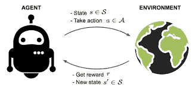

一个代理人采取行动与环境互动，并得到回报。[来源](https://lilianweng.github.io/lil-log/assets/images/RL_illustration.png)

目标是确保代理从试验和收到的反馈中学习策略，以最大化回报。

# 关键概念

在继续之前，让我们定义一些关键概念。**代理**在**环境**中行动。环境对代理交互的反应由环境的**模型**定义。在任何给定的时间点，代理都处于**状态(s∈S** )并且可以从一组**动作(a∈A)中采取任何**动作**。**在采取行动时，代理从状态 **s** 转换到**s’**。从 **s** 转换到**s’**的概率由**转换函数给出。**环境从一组**奖励中奖励代理人(r∈R)。**代理在一个状态下采取行动的策略称为**策略π(s)。在设计 RL 代理时，代理可能熟悉也可能不熟悉环境的模型。于是，就出现了两种不同的情况:
**1。基于模型的 RL:** 智能体熟悉环境的完整模型，或者在与环境的交互过程中了解它。这里，如果已知完整的模型，可以使用[动态编程](https://en.wikipedia.org/wiki/Dynamic_programming)找到最优解。
**2。** **模型自由 RL:** 智能体在没有任何模型知识的情况下学习一种与环境交互的策略，并不试图学习模型的环境。**

代理人的目标是采取行动，使总报酬最大化。每个状态都与一个**值** **函数 V(s)** 相关联，该函数预测通过采取相应的策略，我们在该状态下能够获得的预期未来奖励金额。换句话说，价值函数量化了一个状态有多好。

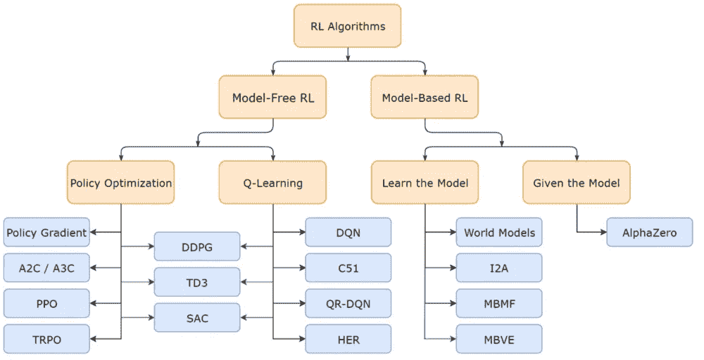

RL 方法以及每种方法的算法名称。[来源](https://spinningup.openai.com/en/latest/_images/rl_algorithms_9_15.svg)

代理人和环境之间的一系列相互作用被称为**事件**(也称为“轨迹”或“试验”)。一集由任意时刻的状态、动作和奖励组成， **t = 1，2，…，T.** 在时刻 **t，**观察到的状态、采取的动作和奖励分别用 **Sₜ、Aₜ和 Rₜ** 表示。因此，一集由以下部分组成: **Sₜ = S₁、A₁、R₁、S₂、A₂、…、Sₜ.
其他一些常用的关键术语:
1。On-policy** :使用来自**目标策略**的确定性结果或样本来训练算法。目标策略是当代理将被付诸行动而不是被训练时将要使用的策略。
**2** 。**非策略**:由不同行为策略而非目标策略产生的过渡或情节分布的培训。

# 什么是环境模型？

假设我们正在训练一个机器人步行到一个很远的地方。将其公式化为一个非常基本的任务，假设我们希望代理控制机器人的各个部分，以方便以直线姿势行走。机器人偏离垂直轴的角度不应超过 20°。机器人在角度标准内停留的每一个时间步长都会得到奖励，并且它越接近目的地，奖励就越高。这里，环境模型对机器人采取的每个动作做出反应，同时结合重力、动量等的结果。然后将下一个状态返回给代理。因此，决定行为者下一个状态的所有因素，以及它所获得的回报，都是环境模型的一部分。
一个模型有两个主要部分，过渡函数 **P** 和奖励函数 **R** 。

假设当我们处于状态 s 时，我们决定采取行动 a 以到达下一个状态 s '并获得奖励 r。这被称为一个**转换**步骤，由一个元组(s，a，s '，r)表示。如果我们处于状态 **s** ，采取行动 **a** 到达下一个状态**s’**并获得奖励 **r** 。这是一个单一的**转换:(s，a，s '，r)** 。

**转移函数 P** 记录采取行动 a 后从状态 s 转移到 s’的概率，同时获得奖励 r

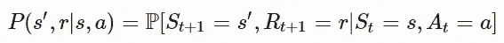

由此，我们可以确定状态转移函数:

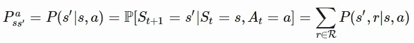

**奖励函数 R** 是在状态 **s** 采取行动 **a** 时获得奖励 **r** 的期望。

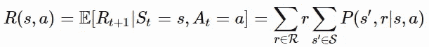

# 策略—代理的策略

策略 **(π)** 决定了代理的行为，即代理在状态 **s** 采取的动作 **a** 。策略可以是:
**1。确定性:**对于每一个状态，都有一个定义好的动作，代理将在该状态下采取该动作。 **π(s) = a
2。随机的:**该策略返回在状态 **s.** 中对所有可能的动作采取每个动作的概率(看起来神经网络在这里可能有用？). **π(a|s) = ℙ[A=a|S=s].**

# 价值函数——我的状态有多好

对于每一个状态，都有一个价值函数决定了未来可以获得的总回报。未来回报，也称为**回报**，是未来折现回报的总和。返回由 **Gₜ.表示**

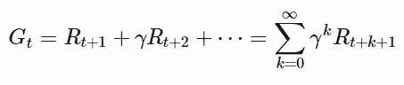

贴现因子 **γ∈[0，1]** 惩罚未来的奖励，因为:

*   未来的回报可能具有较高的不确定性；即股票市场。
*   未来的回报并不能带来直接的好处。
*   贴现提供了数学上的便利；也就是说，我们不需要永远跟踪未来的步骤来计算回报。

**状态值**是我们在时间 **t.** 处于状态 **s** 时可以获得的预期收益

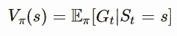

类似地，我们也有一个**动作值**。它是在时间 **t** 在状态 **s** 采取行动 **a** 的预期收益。它也被称为 **Q 值。**

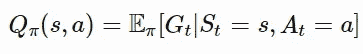

有一种方法可以让我们从 Q(s，a) 中确定 **V(s)。如果我们取一个状态下所有可能行动的行动值，乘以在该状态下采取那个行动的概率，会怎么样？这正是我们所做的:**

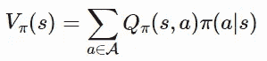

另一个很酷的是**优势功能。**它是状态 **s** 下一个动作 **a** 的 **Q 值**与状态**s**的值之差你可以这样想:我知道在我目前的状态下，我可以期待一定的回报。现在，如果我采取一项行动，我会处于多好的位置呢？

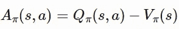

# **最优值和策略**

既然我们在讨论学习一个策略来使我们的回报最大化，那么肯定有某种**【最优】**形式。对吗？确实有。

**最优价值函数**是返回最大回报的策略 **π** 关联的价值函数。

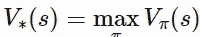

类似地，

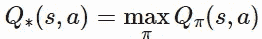

显然，最优策略是代理人试图学习的。在每个州采取尽可能好的行动以真正实现回报最大化的政策。

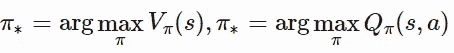

***结尾注释:***

这就是本教程的内容。下一集再见！

***引用:***

 [## 2019 年迄今为止最佳深度强化学习研究

### 在这篇文章中，我对 2019 年迄今为止的所有深度强化学习研究进行了非正式调查，并…

medium.com](/@ODSC/best-deep-reinforcement-learning-research-of-2019-so-far-e8e83a08c449) 

[https://lilian Weng . github . io/lil-log/2018/02/19/a-long-peek-into-reinforcement-learning . html # key-concepts](https://lilianweng.github.io/lil-log/2018/02/19/a-long-peek-into-reinforcement-learning.html#key-concepts)