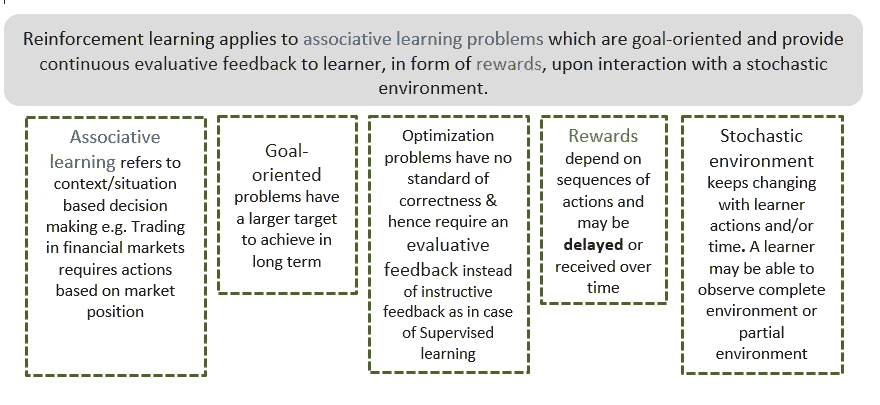

# 如何知道你的问题是否可以通过强化学习来解决

> 原文：<https://medium.com/analytics-vidhya/reinforcement-learning-next-step-in-ai-for-banking-and-financial-services-part-1-96e44a6a98cc?source=collection_archive---------23----------------------->

L 过去十年见证了银行和金融服务业的彻底转型，由于新兴技术的发展，该行业未来的转型速度将会更快。人工智能已经影响了银行的运营方式——基于人工智能的欺诈检测、产品推荐、风险评估等。不再是“概念验证”，而是生产部署的解决方案，创造价值。

为了开辟新的途径，我认为金融机构应该开始把目光放远，并确定能让它们更上一层楼的技术。其中一项新兴技术是深度强化学习。受人类或动物学习方式的启发，深度强化学习是一种新的决策方法。它可以处理超出传统机器学习能力的大型复杂学习问题。

**如何知道你的问题是否可以通过强化学习解决**

强化学习可以应用于一类特定的问题——*联想学习问题*，它们是*目标导向的*，并且在与*随机环境交互时，以*奖励*的形式向学习者提供*连续的评估反馈*。*

**关联学习**指基于背景/情况的决策，例如，金融市场中的交易需要基于市场地位的行动。

**目标导向**问题有一个更大的长期目标要实现。

**优化问题**没有正确性标准&因此需要评估性反馈，而不是像监督学习那样的指导性反馈

**奖励**取决于行动的顺序，可能会**延迟**或随着时间的推移而收到

**随机环境**随着学习者的行动和/或时间**不断变化。学习者可以观察完整的环境或部分的环境**

在下一篇文章中，我们将探讨银行和金融服务领域中哪些已确定的问题可以通过深度强化学习来解决，它们的解决方案以及如何制定和实施强化学习解决方案。

谢谢大家！