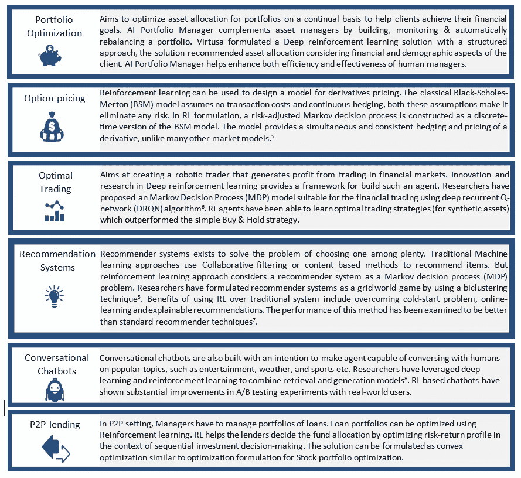

# 银行和金融服务的强化学习用例

> 原文：<https://medium.com/analytics-vidhya/reinforcement-learning-next-step-in-ai-for-banking-and-financial-services-part-2-de41b453cdfe?source=collection_archive---------8----------------------->

在银行和金融服务业，强化学习似乎非常适合交易和投资管理中的许多活动。我们通过研究、开发和分析已发表的研究成果，探索了强化学习在金融领域的潜在应用。下面讨论一些流行的用例。

**投资组合优化:**旨在持续优化投资组合的资产配置，帮助客户实现其财务目标。AI Portfolio Manager 通过构建、监控自动重新平衡投资组合来补充资产管理器。Virtusa 用结构化方法制定了深度强化学习解决方案，该解决方案建议考虑客户的财务和人口统计方面的资产分配。人工智能投资组合管理器有助于提高人类管理者的效率和效力。

**期权定价:**强化学习可以用来设计衍生品定价的模型。经典的 Black-Scholes-Merton (BSM)模型假设没有交易成本和连续套期保值，这两个假设使其消除了任何风险。在 RL 公式中，风险调整的马尔可夫决策过程被构造为 BSM 模型的离散时间版本。与许多其他市场模型不同，该模型提供了衍生产品的同步和一致的套期保值和定价。(参考文献:1)

**最优交易:**旨在创造一个机器人交易员，从金融市场的交易中获利。深度强化学习的创新和研究为构建这样一个代理提供了一个框架。研究人员已经提出了一种适用于金融交易的马尔可夫决策过程(MDP)模型，该模型使用深度递归 Q 网络(DRQN)算法(2)。RL 代理已经能够学习优于简单买入持有策略的最优交易策略(对于合成资产)。

推荐系统:推荐系统的存在是为了解决在众多推荐系统中选择一个的问题。传统的机器学习方法使用协作过滤或基于内容的方法来推荐项目。但是强化学习方法将推荐系统视为一个马尔可夫决策过程(MDP)问题。研究人员通过使用双聚类技术将推荐系统公式化为网格世界游戏(3)。与传统系统相比，使用 RL 的好处包括克服冷启动问题、在线学习和可解释的建议。这种方法的性能已经被检验为优于标准推荐技术。

对话型聊天机器人:对话型聊天机器人也是为了让智能体能够与人类就热门话题进行对话而构建的，比如娱乐、天气和体育等。研究人员利用深度学习和强化学习来结合检索和生成模型(4)。基于 RL 的聊天机器人在现实世界用户的 A/B 测试实验中显示出了实质性的改进。

**P2P 贷款:**在 P2P 环境下，管理者必须管理贷款组合。贷款组合可以使用强化学习进行优化。RL 通过在连续投资决策的背景下优化风险回报状况来帮助贷方决定资金分配。该解可以公式化为凸优化，类似于股票投资组合优化的优化公式化。

在下一篇文章中，我们将探讨强化学习问题的**实现框架。**

参考资料:

1)QLBS:Black-Scholes(-Merton)世界中的 Q 学习者，Igor Halperin

2)作为游戏的金融交易:深度强化学习方法，黄，简一

3)使用双聚类技术的基于强化学习的推荐系统，Sungwoon Choi 等人

4)深度强化学习聊天机器人，Iulian V. Serban 等人