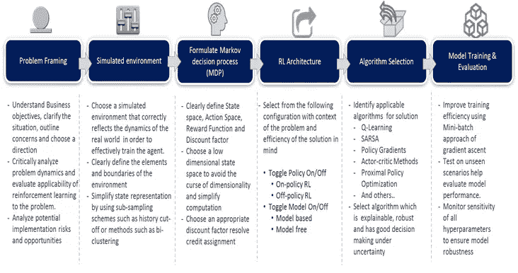

# 强化学习的实现框架

> 原文：<https://medium.com/analytics-vidhya/reinforcement-learning-next-step-in-ai-for-banking-and-financial-services-part-3-563c6b0af763?source=collection_archive---------25----------------------->

结构化的方法和对业务问题、代理、环境、状态、行动和回报的清晰理解对于任何强化学习解决方案的制定都是至关重要的。

**第一步:选择合适的技术组合**

应用——开发者可以从一系列开发**平台、编程语言和深度学习框架**中进行选择。选择标准应包括*功能、效率*和*易用性*。大多数流行的框架都提供了关键的功能，但是在效率和易用性上有所不同。一些框架由于其计算方法而具有更高的效率，而另一些框架由于具有更少代码行的预建函数而更易于使用。

**第二步:为近乎无限的体验奉献时间、精力和数据**

强化学习代理需要大量的训练；一个典型的代理可能需要大约 1-2 亿帧的经验才能达到人类的表现水平。因此，数据可用性大的问题比数据有限的问题更容易解决。它还需要相当多的时间和计算能量，这在某种程度上可以通过更好更快的底层硬件来解决。

**步骤 3:遵循强化学习模型开发生命周期**

DRL 执行框架

**问题框架:**

*   理解业务目标，阐明情况，概述关注点并选择方向
*   批判性地分析问题动态，评估强化学习对问题的适用性。
*   分析潜在的实施风险和机会

**模拟环境**

*   选择正确反映真实世界动态的模拟环境，以便有效地训练代理。
*   清楚地定义环境的元素和边界
*   通过使用子采样方案(如历史截止)或方法(如双聚类)来简化状态表示

**公式化马尔可夫决策过程(MDP)**

*   明确定义状态空间、行动空间、奖励函数和折扣因子
*   选择低维状态空间以避免维数灾难并简化计算
*   选择适当的折扣系数来解决信用分配

**RL 架构**

根据问题的背景和解决方案的效率，从以下配置中进行选择

开启/关闭策略:开启策略 RL；非政策 RL

*   打开/关闭模型:基于模型；无模型

**算法选择**

*   确定解决方案的适用算法:Q-Learning；萨尔萨；政策梯度；演员-评论家方法；最接近的策略优化和其他..
*   选择可解释的、稳健的、在不确定情况下具有良好决策能力的算法

**模特培训&测评**

*   使用梯度上升的小批量方法提高训练效率
*   对未知场景测试有助于评估模型性能。
*   监控所有超参数的灵敏度，以确保模型的稳健性

谢谢大家！