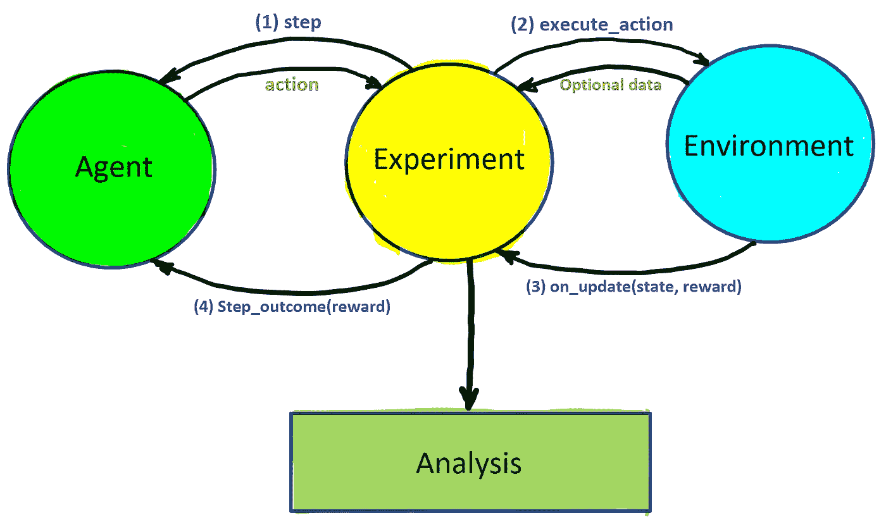
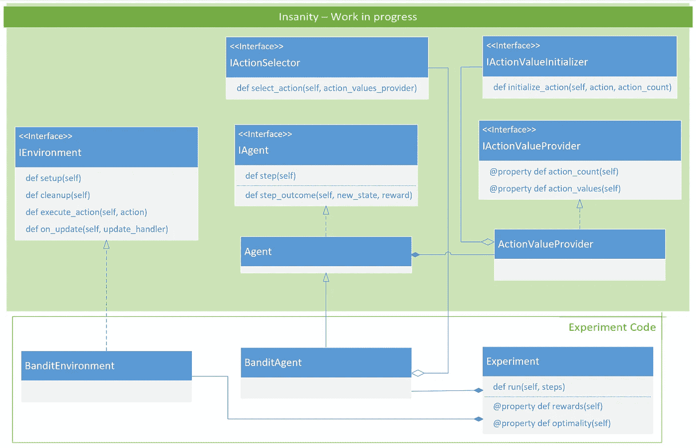

# 强化学习—第二部分

> 原文：<https://medium.com/analytics-vidhya/reinforcement-learning-part-02-299026af170e?source=collection_archive---------12----------------------->

## 多武装匪徒

[强化学习—第 01 部分](/@farbluestar/reinforcement-learning-part-01-e6b78118422d)
[强化学习—第 03 部分](/@farbluestar/reinforcement-learning-part-03-355be5c7cae4)

在本系列的前一篇文章—[参见第 1 部分](/@farbluestar/reinforcement-learning-part-01-e6b78118422d)——我们介绍了 RL 的基本概念和术语。如果您没有看到这篇文章，或者您不熟悉 RL 的基础知识，请先阅读它。我们将建立在那里介绍的概念之上。

拉我的任何一只胳膊，你可能会得到一颗珍珠…或者一根刺！

我不是一个赌博的人，事实上，我从来没有去过赌场——好吧，我去过一次，当我听说他们有一个非常实惠的餐厅，有大量的食物！但如果你以前去过赌场，你可能会熟悉强盗机。这个想法是，你拉一只胳膊，如果你“幸运”，你可能会得到一些钱作为回报。我们这里要讨论的机器有多个手臂，就像图中的章鱼一样。

这个多臂强盗机的例子很简单，但是它包含了 RL 的所有核心思想。你可能会问，有多简单？我们可以将 RL 方法分为两大类:

1.  **表格法**:状态数量少，可能动作数量少的问题。用更好的术语来说，状态和动作 ***空间*** 都很小。这些问题的值函数可以表示为表格，因此得名。我们通常可以很容易地找到这些问题的精确最优解。但是，属于这一类的现实生活问题非常有限。
2.  **近似方法**:可以有任意多的状态和动作，通常很难处理的问题。对于属于这一类的系统，我们通常满足于近似的解决方案——而且有很多。

多武装盗匪不仅属于第一类，而且只有一种状态。换句话说，环境的状态是固定的，我们在这里并不真正需要处理它，我们只需要专注于决定采取哪种行动，而不需要将我们的决定与特定的状态关联起来——这被称为 ***非关联*** 设置。事不宜迟，让我们详细描述一下实验设置…

# k-武装土匪设置

在这个场景中，我们有一个多臂的强盗机器——k 臂。我们的动作仅仅是拉一下手臂，我们有 k 种可能的动作可供选择。每次我们采取一个行动(拉一只胳膊)，我们都会得到一个随机的奖励。一个行动的价值被定义为如果我们继续采取这个行动，我们会得到的预期回报。

为了理解这个等式，假设你有许多相似的机器。在时间 t，你选择同样的手臂(动作 a)并拉它。你会从每台机器上获得一些随机奖励。q*是这些奖励的平均值。从另一个角度来看，如果你多次重复这个动作，它就是每一时间步的回报。

不幸的是，这个量对我们来说是未知的(这就是星号下标的意思，表示它是真实的动作值，而不是我们的估计值，通常用 Q(a)表示)。如果行动值是已知的，我们将简单地坚持具有最大值的行动，并继续拉这只手臂——剥削。但事实并非如此。

这就是探索拯救世界的地方。我们可以先选择一些随机的行为，当我们从这些行为中获得回报时，我们会尽力去估计它们的价值。这个评估过程可以通过简单地记录我们从每个行动中得到的回报来完成。然后我们计算每个时间点的平均回报。我们将很快讨论这个过程的细节。

> 这种估计动作值的方法称为**样本平均法**。

当我们找到所有可能的动作时，我们最终会得到所有动作值的一些估计值。这是我们可以通过选择具有最大价值的行动来开始利用这些知识的地方。我们仍然需要继续探索，因为我们探索得越多，我们为每个行动收集的数据就越多，我们对行动价值的估计就越准确。一个现在看来是最佳的行动可能在以后变成次优。

> 使用动作价值估算来决定选择哪个动作的方法被称为 ***动作价值方法*** 。

对于我们的 bandit 机器，我们将执行 1000 次拉动的**运行**。由于我们不能同时探索和利用——所谓的 ***探索和利用*** 之间的冲突，我们将以一定的概率探索ε并利用剩余的时间。这叫***ε-贪心*** 法。我们基于我们的价值估计采取的行动被称为 ***贪婪行动*** 。

由于这是一个随机过程，用不同的 bandit 机器进行多次运行(每次 1000 次拉动)将会产生不同的结果。我们需要取这些结果的平均值来捕捉学习算法的平均行为，不要被过程中的随机波动所迷惑。

> 总结:⇨执行 1000 次操作中的 1 次运行，⇨执行 2000 次运行，取平均值。

S&B(萨顿和巴尔托的书)建议平均超过 2000 个不同的土匪机器。正如我们将在后面看到的，我发现从实用的角度来看，200 已经足够了。现在，让我们把注意力转向估计行动价值的细节…

# 行动价值估计

我在上面提到过，我们可以通过跟踪采取行动时获得的奖励来估计任何行动的价值，然后使用这些数据来计算每个时间步的平均值。这种方法有两个问题:

1.  我们必须把所有的奖励都保存在内存中，如果我们有大量的时间步长，这就不太好了。
2.  我们必须计算平均值，因此在每一个时间点上，我们要计算所有奖励的总和。这显然是浪费 CPU 时间。

如果我们只能在内存中保存最新的动作值，那么效率会更高，并且在每个时间步，我们只需执行简单的修正来获得新值。这就是所谓的 ***移动平均线*** (跑步、移动或滚动都是你会听到的术语！).

S&B 的第 2.4 节对这种方法有一个简单而详细的推导，它是直截了当的。我建议你至少自己推导一次。结果如下:

这里值得注意的是我们如何解释和推广这个简单的公式。请注意以下几点:

*   Rn - Qn 是我们收到的实际奖励和我们目前的估计之间的差异。它本质上是一个 ***错误术语*** 。
*   我们实际上是在每个时间步对 Qn 做了微小的修正。
*   1/n 是 ***步长***——它决定了我们使用多少误差来校正我们当前的估计。它有时用α表示。
*   步长逐级变化，n 越大越小。随着 n 趋于无穷大，我们知道 Qn 现在是正确的估计值，步长为零。

## 加权平均值

步长为 1/n 的方法适用于稳态问题。对于非平稳问题(回报概率是时间的函数)，给予最近的回报更大的权重(相对于平稳情况下的较小权重)更有意义。实现这一点的一个流行的方法是使用恒定的步长，这样它的影响将随着我们在时间上的前进而被放大。一般来说，该等式看起来像:

如果我们递归地应用这个(见 S&B 2.5)，我们得到:

在这里我们可以看到:

*   随着我们追溯到更远的过去，权重呈指数衰减——因此，它有时被称为 ***指数最近加权平均值*** 。
*   当 n 趋于无穷大时，步长 1/n 保证收敛到实际动作值。这不是使用恒定步长的情况。收敛的理论条件见 S&B 方程 2.7。

现在让我们找点乐子，实现这些想法吧…

# k 臂强盗机 RL 算法的实现

我不得不承认我不是 python 专家，但这不能阻止我。为了让 python 爱好者不那么高兴，我必须说我在这个练习中使用 python 的体验并不是最佳的，但是我离题了…然而 Python 有一个令人惊叹的社区和一个奇妙的 echo 系统，其中有许多用于数据科学、绘图、统计等的库。这使得它成为一个不可或缺的工具。

我们可以用最少的努力在一个 python 文件中编写 bandit 机器码。然而，这样做可能会受到限制，并且会阻止我们尝试不同的想法和算法。总的来说，这个实验是 RL 和 AI 的关键活动。出于这个原因，我要把事情复杂化一点——而且我通常不需要理由就能把事情复杂化！😀最后我会在 GitHub 上提供完整代码的链接。

## 基本原则

我的目标是抽象出我上一篇文章中描述的 RL 的各种组件(请参见[第 01 部分](/@farbluestar/reinforcement-learning-part-01-e6b78118422d)中的图表进行快速回顾),并实现以下目标:

*   创建一个紧密映射到 RL 对象(环境、代理等)的对象模型。)并且不知道任何特定的问题配置。
*   确保组件是松散耦合的，并且可以轻松替换以添加/更改功能。
*   确保不同的算法可以在实验过程中插入和拔出。
*   拥有足够的灵活性来展示监控环境和绘图所需的任何指标。
*   允许简单直观的实验代码。

## 代码结构—高级别

*   **环境对象:**隐藏环境的所有细节——在本例中是 bandit 机器。环境公开了以下接口: *execute_action* 和 *on_update* 。你调用第一个来请求环境执行一个动作的任务。对于第二种情况，您通过传递状态更改处理程序来订阅环境状态更改事件。
*   **代理对象:**执行所有的决策。它有如下界面:*步骤*，*步骤 _ 结果*。调用 step_outcome 向代理提供采取行动的奖励。
*   **实验对象:**充当指挥者，驱动所有活动，收集有趣的数据进行分析和绘图。
*   **选择器**:抽象动作选择的过程，供代理使用。
*   **动作值提供者**:负责动作值的存储、更新和检索。
*   **初始化器**:抽象动作值初始化的过程，供动作值提供者使用。
*   **公用设施**:普通公用设施。

> 这些形成了一个包，我称之为“ ***精神错乱***”——就像“精神错乱的定义”一样！这不仅仅是一个代码框架，更是一种思维框架，允许我在编写实验代码时，根据 RL 概念进行思考。这是我第一次尝试，它可能会改变和发展。目前的结果是:一个几乎微不足道的实验代码。

下面是一个图表，显示了您需要提供的主要类和典型的实验流程:

RL 实验的典型流程

现在让我们看一下实验代码:

我们看到实验班执行以下简单任务:

*   创造了一个强盗环境。
*   倾听来自环境的呼叫，宣布它的最新状态，并向我们提供奖励。
*   创建一个 bandit 代理，并传递我们想要在这个实验中使用的初始化器和选择器。
*   实现 run()方法。这就是时间前进的地方。它调用我们的代理，接收动作，将其传递给环境，并收集它需要保留的任何数据。

差不多就是这样。我们收集两条数据:奖励和标志，以告诉我们行动是否是最优的。分析代码获取这些信息并绘制成图表。以下是结果(在我的低功率笔记本电脑上运行):

S&B 建议运行 2000 次，我看 200 次就足够了。随意探索。

从上面的图中，您会注意到以下情况:

1.  贪婪方法表现最差，正如所料。
2.  探索确实有帮助，因为两个ε贪婪的结果都超过了贪婪的结果。
3.  尽管ε=0.1 似乎会提前达到更高的平均回报，但ε=0.01 实际上表现更好，因为它将在长期内达到并超过ε=0.1。右边的图解释了原因。你可以看到时间百分比ε=0.1 选择最佳行动平台较早，然而，它继续增加ε=0.01。%最佳行动图是使用额外指标(除奖励外)来评估我们学习算法性能的一个例子。这是一个需要掌握的好技能。

这本书没有超过 1000 拉，所以情节并没有真正显示长期的结果。但是现在我们已经实现了这一点，我们可以尝试一下！这是 5000 步的结果，我希望不会有什么意外:

其余的代码非常简单，除了代理和环境实现之外，还包括一个 bandit 类和一个用于计算运行平均值的小工具。请随意查看完整的 [**代码**](https://github.com/bluephoton/rl-insanity) 并进行实验，如果您有问题，请告诉我。也可以随意克隆和改进它。这是一个粗略的图表，解释了所有的部分是如何组合在一起的。

精神错乱的粗略描述！

现在，我该去读更多的书了。希望我能学到一些新的东西来分享。在此之前，希望这些信息对你有用…