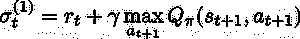

# 强化学习降低建筑能耗

> 原文：<https://medium.com/analytics-vidhya/reinforcement-learning-to-reduce-building-energy-consumption-bb7e7ffa13b2?source=collection_archive---------4----------------------->

资料来源:哥伦比亚大学地球研究所

仅建筑物的供暖、通风和空调就占全球能源需求**【1】**的近 *40%* *。*

> 节约能源的需求日益成为对抗气候变化的基础。我们一直在研究一种基于云的 RL 算法，该算法可以改造现有的 HVAC 控制以获得实质性的结果。

在过去的十年中，已经提出了一种依靠人工智能的新型控制。特别是，我们将强调基于*强化学习* (RL)的数据驱动控制，因为它们从一开始就显示出作为 HVAC 控制**【2】**的有希望的结果。

使用 RL 升级空调系统有两种主要方式:在新系统上实施 RL 或改造现有系统。第一种方法适用于供暖和空调系统的制造商，而后者可以应用于任何可以远程控制的现有工厂。

我们设计了一种基于云的 RL 算法，通过远程读取环境数据来不断学习如何优化功耗，从而定义 HVAC 设置点。基于云的解决方案适合扩展到大量建筑。

> 我们的测试表明，两个不同位置的一次能源消耗降低了 5.4%至 9.4%，保证了一流控制的相同热舒适性。

传统上，HVAC 系统由基于*模型的*(例如，模型预测控制)和基于*规则的*控制来控制:

# 模型预测控制

基本的 MPC 概念可以总结如下。假设我们希望控制一个多输入多输出的过程，同时满足输入和输出变量的不等式约束。如果过程的相当精确的动态模型是可用的，则模型和当前测量可用于预测输出的未来值。然后，可以基于预测和测量来计算输入变量的适当变化。

本质上，MPC 可以适应复杂的热力学，并在单个建筑的节能方面取得优异的结果。沿着这个思路，有一个重要的问题:这种模型的改造应用需要为每一个既有建筑开发一个热能模型。同样，很明显，模型的性能依赖于它的质量，拥有一个相当精确的模型通常是昂贵的。高初始投资是基于模型方法的主要问题之一**【3】**。同样，对于建筑物的任何能效干预，都必须重新构建或调整模型，这又需要领域专家的昂贵参与。

# 基于规则的控制(RBC)

基于规则的建模是一种使用一组规则的方法，这些规则*间接地*指定了一个数学模型。当规则集明显比它所暗示的模型简单时，这种方法特别有效，因为模型是有限数量的模式的重复表现。

因此，红细胞是最先进的无模型质控品，代表了行业标准。无模型解决方案可能会扩大规模，因为没有模型使得解决方案可以轻松地应用于不同的建筑，而不需要领域专家。RBC 的主要缺点是它们很难被优化调整，因为它们对耦合的建筑和工厂热力学的内在复杂性的适应性不够。

# 强化学习(RL)控制

在介绍 RL 控件的优点之前，我们先简单说一下 RL 本身。用萨顿和巴尔托**【4】**的话说:

> *强化学习是学习做什么——如何将情况映射到行动——以便最大化数字奖励信号。学习者没有被告知要采取哪些行动，而是必须通过尝试来发现哪些行动会产生最大的回报。在最有趣和最具挑战性的案例中，行动不仅会影响眼前的奖励，还会影响下一个情境，进而影响所有后续的奖励。这两个特征——试错搜索和延迟奖励——是强化学习的两个最重要的区别特征。*

在我们的例子中，RL 算法直接与 HVAC 控制系统交互。它使用现场收集的实时数据不断适应受控环境，而无需访问建筑的热能模型。通过这种方式，RL 解决方案可以节省一次能源，降低运营成本，同时仍然适用于大规模应用。

因此，需要在运行成本较高的 HVAC 系统的大规模应用中引入 RL 控制，例如负责大量温度调节的应用。

可以方便地实现 RL 解决方案的建筑使用类之一是*超市*类。根据定义，超市是具有可变热负荷和复杂职业模式的分布广泛的建筑物，从 HVAC 控制的角度来看，这些建筑物引入了不可忽略的随机成分。

我们将通过使用强化学习的框架来形式化这个问题，让我们以一种更好的方式将它联系起来。

# 强化学习解决方案

在 RL 中，一个*代理*与一个*环境*交互，并学习最佳的行动顺序，由一个策略来表示，以达到期望的目标。如**【4】**所述:

> 学习者和决策者被称为代理人。它与之交互的东西，包括代理之外的一切，被称为环境。这些不断地相互作用，主体选择动作，环境响应这些动作并向主体呈现新的情况。

图 1 : [研究之门](https://www.researchgate.net/figure/The-agent-environment-interaction-process_fig2_321487567)

在我们的工作中，环境是一个超市建筑。奖励表达了代理的学习目标:返回给代理的标量值，它告诉我们代理相对于学习目标的行为。

代理人和环境之间的相互作用导致了一个决策过程:回报作为反馈。我们通过一个***m****arkov****d****决策* ***P*** *进程* ( **MDP** )来形式化这种交互，这通过一个有限有序列表来彻底描述，即一个*元组—* ***( S *A* 是动作的集合，*r*:*s*x*a*→r 是奖励函数，𝑃是一个状态-动作对到下一个状态𝑃的转移概率:*s*x*a*x*s*→*0，1* 。***

直观地说，只要我们知道我们在哪里( *S* )，我们可以采取哪些行动( *A* )，之前的行动是否好( *r* )以及我们过去关于环境的经验(收集的过渡集)，我们就可以*决定*如何解决一个决策问题。术语*马尔可夫*与*马尔可夫*假设相关，即代理观察到的状态最终代表了关于环境的有用信息。在实际应用中，我们已经将马尔可夫假设放宽到有利于"*准马尔可夫*"的条件，智能体无法观察到环境的完整表示:*"智能体观察到的状态接近实际状态"***【4】**。

> 为了建立一个准马尔可夫状态，我们需要仔细选择代理观察的信号。我们通过仅使用所有 HVAC 已经可用的信号获得了良好的状态，因为它们已经被 HVAC 监控系统使用。不需要其他硬件来以可扩展的方式应用该解决方案。

在一系列时间步骤(时间是离散的)中，代理改进它的策略，这代表它在环境中的行为，其中ℙ(是一组动作的概率分布。政策改进程序的目标是达到*最优政策* π*，定义为使*预期贴现回报*最大化的政策:

其中𝛾 ∈ [ *0，1*

再说一次，非正式地说，策略只不过是我们的代理人参与的"*动态*"策略。

将这种形式转化为 HVAC 控制系统，RL 算法的目标是在满足舒适性约束的同时节省能量。在这类问题中，我们必须考虑舒适组件和消耗的一次能源之间的权衡。

舒适约束被定义为内部空气温度的可接受区间[ *T，T* ]，其中 *T 和 T**都取决于季节。例如，间隔[ *T，T* ]在冬季固定为[16 *C* ，19 *C* ，在夏季固定为[23 *C* ，25*C***【5】**。*

*因此，每个时间步的回报是两个部分的总和，第一部分与*成本*相关，第二部分与*舒适度*相关:*

**

*这两个组件定义为:*

****

*其中 ***c*** 是电能和热能成本的总和，在每个时间步更新， **λ** 是舒适度和成本成分之间的折衷参数， ***p*** 是约束惩罚因子，定义为:*

**

*当温度超出舒适范围时，应用于 ***p*** 的指数函数说明了舒适分量的更大重要性。*

*在实际应用中，我们需要找到一种方法来估计受控区域的舒适度，以便调整参数 **λ** 。数学上，我们可以通过将舒适约束(即 *T* 在区间[ *T，T* ]内)视为*随机约束*来解决这个问题。其思想是，给定一个温度 *T* 和一个可能超过的值𝛥 *T* ，代理只能以有限的概率让温度超过 *T* +𝛥 *T* 。*

*从技术上讲，为了定义随机约束，我们首先计算一天中每小时记录的内部空气温度值 *T* 的经验概率密度函数。我们可以在图 2 中看到不同控制系统的密度示例。*

**

*图 2:冬季试验期间工作日通过 RL 方法(红色)和 RBC 方法(绿色)达到的温度示例。这些区域显示了开放时间内温度的经验 pdf，按小时分组。*

**RL 的超标量与 RBC 控制量完全相同(在一天的不同时间，在 16°C 时，查看蓝线下方)。在冬季供暖季节，理论上的最佳控制应该将温度保持在略高于 16°C，因为舒适约束得到满足，并且消耗最小。很明显，RL 比 RBC 更接近最佳行为。**

*如前所述，RL 算法通过收集关于环境动态的信息来不断改进其策略。为了完成我们的食谱，我们还需要一种配料:q 函数。从状态 *s* 开始，选择一个动作 *a* 并遵循一个策略π所获得的回报的期望值称为策略π的 *q 函数*:*

**

*我们的代理将为每一对 *(s，a)* 计算 *q* 的近似值(即 ***Q*** 或***Q-函数*** )。*

*最优策略满足*贝尔曼最优方程*:*

**

*这为迭代方法打开了许多大门，以便获得最佳 Q 函数。事实上，这导致了 Q 学习算法:在转换(即，时间步长)之后，Q 函数以如下方式更新:*

****

*其中𝛼 ∈ [ *0，1* ]是学习率。为了改进 Q 函数近似，甚至可以将这种形式扩展到 ***K*** 连续转换，也就是说，我们将记住多个时间步长并将它们引入 Q 函数的评估中，以便获得更精确的值。*

*当状态和动作空间有限且足够小时，Q 函数可以用*表格形式*表示，其近似以及控制策略推导都很简单。然而，当处理连续的或非常大的离散的状态和动作空间时，Q 函数不能再由每个状态-动作对有一个条目的表来表示。*

*在实践中，RL 在 HVAC 控制中的应用受到*维数灾难*的困扰:由于状态空间的高维性以及建筑物动态的非线性，它需要*非线性回归*算法。*

*为了克服这个*泛化*问题，一个特别吸引人的框架是 Ernst**【6】**使用的框架，它应用了*拟合值迭代*的思想(即****F****itted****Q****-****I****迭代)***

**FQI 属于*批处理模式* RL 算法家族。术语*“批处理模式”*指的是允许算法使用任意大小的转换集在单个步骤中产生其控制策略。基本上，FQI 假设一个*缓冲器*(即一组)过去的转换:**

****

**已被收集，其中 *t* 是当前时间步长。**

**然后，为了提高 q 函数近似 **Q̂** 的精度，它对转换集进行迭代回归。该算法通过使用多步 Q-Learning 来改进其对每个转变的响应变量值的近似:**

****

**第*n*步的 **Q̂** 近似器用于导出新策略，并因此获得新的转换。为了完整起见，我们将该算法的伪代码总结为***M****ulti-****S****TEP****F****itted****Q****-***I***迭代***

****

**图 3:拟合 Q 迭代算法伪代码。**

**为了进一步改进，我们将该算法与一个*ε-贪婪*策略相结合，以便探索环境并且不陷入局部最小值。**

**什么是 *ε贪婪*政策？**

**贪婪的行动选择总是利用当前的知识来最大化眼前的回报；它根本不花时间对明显低劣的行为进行取样，看看它们是否真的更好。一个简单的替代方案是在大多数时间里贪婪地行动，但是每隔一段时间，比如说以小概率ε，而不是从所有具有相等概率的行动中随机选择，独立于行动值估计。我们使用这种近乎贪婪的动作选择规则 *ε* 来调用方法——贪婪方法。**

**在我们的例子中，策略要求代理以概率 1-ε选择具有最大估计 Q 值的动作，并以概率ε选择随机动作。**

# **结论**

**通过使用之前介绍的 RL 框架，[*energy plus 8.5*](https://energyplus.net/)。开发建筑模型和[***B*******C****控件****V****irtual****T****est****B*( **BCVTB** )对于通信接口，我们定义了完整的仿真框架。***](https://simulationresearch.lbl.gov/projects/building-controls-virtual-test-bed)**

*我们的方法表明，RL 控制是一种可行的改造解决方案，特别是当设计值不再足以保证热舒适性要求时，因为 HVAC 系统的退化。由于 RL 控制通过与环境的交互来学习，它可以在每个气候带实现节能。为了最大限度地节省能量并获得接近最优的控制，在改变气候区时，应考虑重新调整 **λ** 权衡参数。*

> *虽然以前尝试**【8】**将 RL 应用于 HVAC 控制需要 100 个月的训练才能达到好的结果，但是我们的算法不需要超过 12 个月的训练，也就是说只有两个完整的夏季和冬季。*

# *参考*

****佩雷斯-伦巴第，l，j .奥尔蒂斯，c .普特* (2008，01)。建筑能耗信息综述。能源和建筑 40，394–398。***

*****【2】***吕朗斯，f .，s .亚科韦拉，b .克拉森，r .贝尔曼斯* (2015)。使用无模型强化学习的具有倒退策略的热泵恒温器的学习代理。能量 8 (8)，8300–8318。***

*****【3】***Sturzenegger，d .，D. Gyalistras，M. Morari，R. S. Smith* (2016)。瑞士办公楼的模型预测气候控制:实施、结果和成本效益分析。IEEE 控制系统技术汇刊 24(1)，1–12。***

***萨顿、R. S .和 A. G .巴尔托(1998 年)。强化学习导论，第 135 卷。麻省理工学院出版社剑桥。***

*****【5】***斯蒂安，L* 。(2001).Impianti di climatizzazione。暖通空调系统。应用程序]。Tecniche Nuove。***

*****【6】***恩斯特、d、p .格茨和 l .韦汉高* (2005)。基于树的批量模式强化学习。机器学习研究杂志 6，503–556。***

*****【7】***吉厄茨、p、d .恩斯特和 l .韦汉高* (2006)。极度随机化的树。机器学习 63(1)，3–42。***

*****【8】**天舒 W *。、*阎志 W. *、*朱七(2017)。[楼宇暖通空调控制深度强化学习](https://ywang393.expressions.syr.edu/wp-content/uploads/2016/07/Deep-reinforcement-learning-for-HVAC-control-in-smart-buildings.pdf)。***