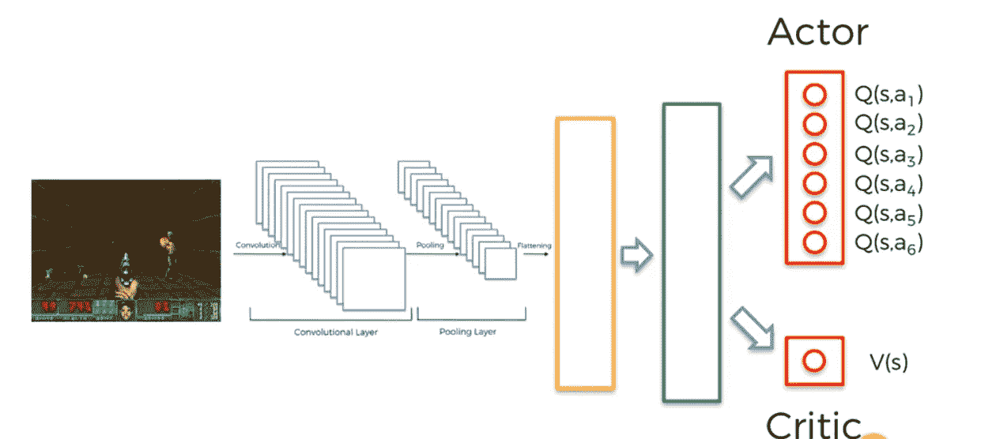
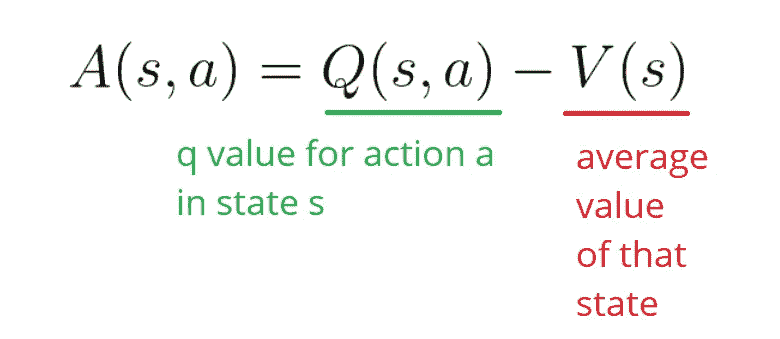
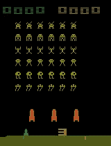

# 用 A3C 进行强化学习

> 原文：<https://medium.com/analytics-vidhya/reinforcement-learning-with-a3c-20837aafe0ca?source=collection_archive---------7----------------------->

乔治·特罗瓦托在 [Unsplash](https://unsplash.com?utm_source=medium&utm_medium=referral) 上的照片

这篇文章的动机来自我最近参加的一个比赛，我们必须在 Atari SpaceInvaders 游戏上训练一个模型，并最大化代理在 100 次运行中获得的分数。

鉴于这是我第一次体验强化学习，我从深度 Q 网络和它周围的变体开始。虽然测试分数对初学者来说很令人满意，但它相当不稳定，需要大量的训练才能获得好成绩。

接下来是 A3C——这是一种由谷歌 Deep Mind 开发的强化学习算法，它可以在短时间内达到的分数完全击败了像 Deep Q Networks (DQN)这样的大多数算法。

A3C 代表异步优势行动者-批评家，其中

## 异步的

意味着多重处理。在这里，多个代理一起解决同一个问题，并相互分享他们所学到的信息。随着许多人试图解决问题，解决方案以更快的方式达成。

这些代理中的每一个都同时与它自己的环境副本进行交互。这确实比只有一个代理更有效，因为每个代理的经历对其他代理来说都是独立和独特的。这样我们就有了不同的经验。

## 演员兼评论家

演员-评论家模型基本上是深度卷积 Q-学习模型，其中代理实现 Q-学习。这里的输入是图像(当前状态的快照)，它们被输入到一个深度卷积神经网络中。

鸣谢:安尼施·法德尼斯

在一个基本的深度卷积 Q-学习模型中，输出将是代理对给定状态可能采取的动作的 Q 值。然而在 A3C 中，有两个输出，一个是不同动作的 q 值，另一个是计算代理实际所处状态的值。

## 优势

优势是这样一个值，它告诉我们某个动作与基于该状态的预期平均值相比是否有改进。

Q(s，a)指的是 Q 值或在某一状态下采取行动的预期未来回报。V(s)指的是处于某种状态的价值。该模型的目标是最大化优势价值

现在我们已经建立了基本的理解，让我们一起来理解这个模型的完整工作。将它们结合在一起的一个主要组件是共享内存。

## 记忆

我们利用长短期记忆(LSTM)细胞来实现这一点。从深度卷积 Q 网络得到的输出现在被传递到 LSTM 层，该层将把值传递到全连接层。LSTM 层为模型提供了记忆，以记住过去的经验并据此做出决策。

全连接层的最终输出，从该层为参与者神经网络选择动作。该值还被传递到 critic 神经网络，在那里该值被更新。通过计算批评家的价值损失和执行者的策略损失来更新神经网络的权重，然后通过网络反向传播误差。

这种算法是目前强化学习领域的最新技术。它已被证明是成功的各种游戏环境的分数，这是很难实现的人类玩家在短时间内单独。

A3C 训练有素的模型玩太空入侵者

其中一个主要的进步是 AlphaGo，它是一个人工智能，在古代围棋比赛中击败了世界上最好的棋手。

如果你对游戏着迷，希望看到人工智能打败游戏，一定要多看看强化学习。这是一个非常有趣的领域，随着人们提出不同的策略和想法来解决问题，这个领域正在不断发展。很快强化学习将解决现实世界的情况，直到那时，继续学习，继续探索！

## 参考

*   [https://arxiv.org/abs/1602.01783](https://arxiv.org/abs/1602.01783)
*   [https://medium . com/emergent-future/simple-reinforcement-learning-with-tensor flow-part-8-asynchronous-actor-critic-agents-a3c-c 88 f 72 a5 e9 f 2](/@samsam23122001/the-advantage-of-the-asynchronous-actor-critic-algorithm-d15f5afbf52a)
*   【https://pathmind.com/wiki/deep-reinforcement-learning 
*   大卫·西尔弗的 RL 课程
*   [https://www.cs.toronto.edu/~vmnih/docs/dqn.pdf](https://www.cs.toronto.edu/~vmnih/docs/dqn.pdf)
*   [https://towards data science . com/dqn-part-1-vanilla-deep-q-networks-6 EB 4a 00 feb FB](https://towardsdatascience.com/dqn-part-1-vanilla-deep-q-networks-6eb4a00febfb)
*   [https://towards data science . com/welcome-to-deep-reinforcement-learning-part-1-dqn-C3 cab 4d 41 b 6 b](https://towardsdatascience.com/welcome-to-deep-reinforcement-learning-part-1-dqn-c3cab4d41b6b)

# 与我联系

*   [**领英**](https://www.linkedin.com/in/nihal-das/)
*   [GitHub](https://github.com/Nihal2409/)

*****感谢大家阅读本文。非常感谢您的建议！*****