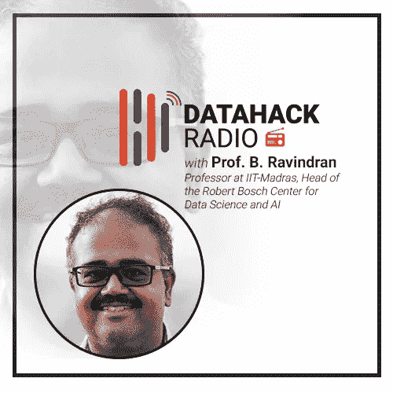
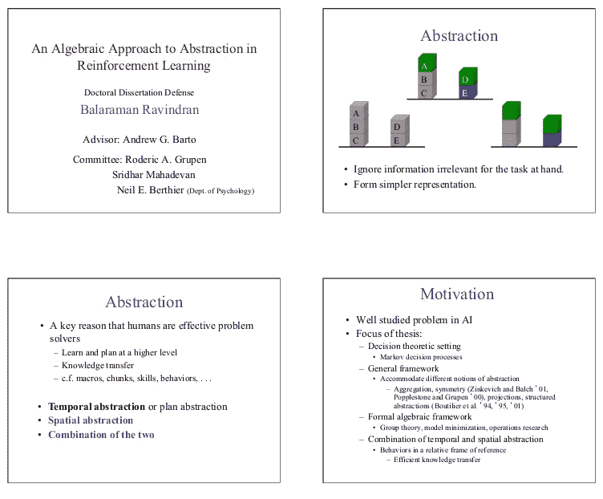
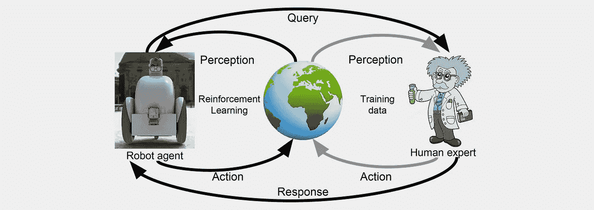

# 巴拉拉曼·拉文德兰教授的强化学习

> 原文：<https://medium.com/analytics-vidhya/reinforcement-learning-with-professor-balaraman-ravindran-415a3186daf?source=collection_archive---------0----------------------->

# 介绍

[强化学习](https://www.analyticsvidhya.com/blog/2017/01/introduction-to-reinforcement-learning-implementation/)是一个耐人寻味但又复杂的话题。这也是数据科学家可以添加到他们的投资组合中的最有前途的技能之一。强化学习在过去几年中涌现了一些最大的突破性发展，包括为谷歌 DeepMind 广受欢迎的 AlphaGo 程序提供动力。

除了印度最重要的强化学习研究者，还有谁能更好地揭开这个广阔领域的神秘面纱呢？是的，我们谈论的不是别人，正是著名的巴拉拉曼·拉文德兰教授！

B. Ravindran 教授在学术研究方面有着令人难以置信的丰富背景，他在强化学习方面的工作成为头条新闻。他的[谷歌学术](https://scholar.google.co.in/citations?hl=en&user=nGUcGrYAAAAJ&view_op=list_works&sortby=pubdate)个人资料显示他的研究论文被引用超过 2200 次！

他喜欢用即使初学者也能理解的语言解释最复杂的话题。这只是他在 DataHack Summit 2018 上的演讲在我们的社区中获得巨大成功的众多原因之一。

在本播客中，Kunal 采访了 Ravi 教授，讲述了他的背景、他对强化学习的兴趣和研究，以及该领域的错综复杂和微妙之处。

*所有 DataHack 电台剧集都可以在以下播客平台上获得。立即订阅！*

*   [**音云**](https://soundcloud.com/datahack-radio)
*   [**分析 Vidhya**](https://www.analyticsvidhya.com/blog/category/podcast/)
*   [**iTunes**](https://itunes.apple.com/in/podcast/datahack-radio/id1397786677?mt=2)
*   [**谷歌播客**](https://www.google.com/podcasts?feed=aHR0cDovL2ZlZWRzLnNvdW5kY2xvdWQuY29tL3VzZXJzL3NvdW5kY2xvdWQ6dXNlcnM6NDU5MzM1NzYwL3NvdW5kcy5yc3M%3D)

# 巴拉拉曼·拉文德兰教授的背景

神经网络在 20 世纪 90 年代风靡一时。鉴于 Ravi 教授对计算模型的热情，他开始钻研这个课题是不可避免的。

当他在硕士期间(从 IISc)探索最先进的神经网络时，他意识到这些方法正在远离解释人类如何学习。这导致他涉足强化学习的世界(对此我们都非常感激！).

随着他对强化学习的兴趣不断增长，他开始阅读关于神经科学的研究论文。那么 RL 当时的状态是怎样的呢？拉维教授的这段话完美地总结了这一点:

> “我是我的硕士班里唯一一个致力于强化学习的人。”

印度最大的缺点之一是没有单一的资源可以用来学习强化学习。因此，Ravi 教授和其他研究人员写了一份调查报告，并通过电子邮件发送出去。**这项调查加快了社区的步伐，甚至引起了牛津出版社的注意。他们要求 Ravi 教授和团队为他们的神经计算手册(1996 年出版)写一章关于 RL 的内容。**

# 强化学习博士，与安德鲁·巴尔托一起工作

这项调查是 Ravi 教授获得博士学位的敲门砖，他在麻省大学成功完成了博士学位。他的博士导师？不是别人，正是伟大的安德鲁·巴尔托！

拉维教授和安德鲁·巴尔托苦苦思索的问题之一是关于人类的心理。人类是如何如此善于学习一个问题并如此迅速地将其转移到另一个任务的？二人组试图在性质相似的任务中解决这个问题。

如果你想知道这里的“相似”是什么意思，你不是唯一一个！Ravi 教授的研究到了需要在他的研究背景下正式定义这个词的地步。这就是他们如何提出抽象代数和同态数学的概念。许多[迁移学习](https://www.analyticsvidhya.com/blog/2017/06/transfer-learning-the-art-of-fine-tuning-a-pre-trained-model/)框架实际上是建立在同态基础上的。

以下是他对相似性的正式定义:

> 如果我为情况 A 所做的一切，在情况 B 中有一个具有相似效果的决定，那么两件事是相似的

# Ravi 教授非常友好地分享了他关于这个主题的博士论文，你可以在这里下载。这是任何从事这一领域的人的必读之作。

后来，在和他的一个学生一起工作时，Ravi 教授发现 RL 中相似性的概念正是计算机科学家所说的图形。对该方法如何工作的精彩见解！

> “我们定义的相似性的数学概念都是基于一个抽象的世界模型。”

# IIT 马德拉斯大学的研究

拉维教授在获得博士学位后加入了 IIT-马德拉斯学院。在那里，他探索了多个研究领域，因为强化学习尚未兴起。他探索了自然语言理解和图形学习等领域。

回到 RL，拉维教授继续在 IIT-马德拉斯研究同态。他一直在研究的另一个方向是学习复杂的政策。他一直在探索的问题是如何设计能够模仿人类思维的智能体(这也是他和安德鲁·巴尔托一直在探索的问题)。

分层强化学习框架是另一个感兴趣和研究的领域(包括大量关于注意力建模的工作)。与之互补的是**深度强化学习**(在雅达利游戏上)，它在 2014 年真正起飞。这给了 Ravi 教授更多复杂的领域去研究。他用一个极好的类比解释了深层 RL 概念。这一部分是数据科学领域每个人的必听内容。即使你是这个领域的初学者，你也能理解这个解释。

**这部分是 B. Ravindran 教授教学方法背后的魔法的一个很好的缩影。**

拉维教授研究的另一个方向是超越奖励。在尝试 RL 方法时，我们通常会使用奖励，对吗？但在现实世界中，除此之外还有很多其他信号。如果我们要在一个以人类为中心的世界中整合强化学习，理解这一点至关重要。

# 拉维教授在工业界的工作

让 B. Ravindran 教授的经历与众不同的是，他的工作并不局限于学术和研究领域。他曾参与多个行业项目，包括:

*   语言(NLU)
*   多模态学习
*   利用网络学习

RL 具体项目呢？这些确实会出现，但不像人们想象的那样频繁。他曾经参与过 RL 项目，其中优化组件融入到问题中(没有预定义的模型)。

# 罗伯特·博世数据科学和人工智能中心

拉维教授也是 IIT 马德拉斯大学罗伯特·博世数据科学和人工智能中心的负责人。该中心成立于 2017 年，愿景是成为国际知名的数据科学研究中心，在这里，长期存在的跨学科基础研究问题将得到解决。

**我强烈推荐跟随他们的** [**GitHub 页面**](https://github.com/RBC-DSAI-IITM) **查看他们的最新作品。**

# 结束注释

我有幸在 DataHack Summit 2018 上见到了 Ravi 教授。他是一个非常踏实的人，对这个领域有着不可思议的热情。他身上有一种感染人的快乐，听他谈论 RL 感觉就像梦想成真。

所有这些品质在这一集里也展现出来了。与我们社区的顶尖人物之一的精彩一集。祝您听得愉快，请在下面与我们分享您的反馈。

*原载于 2019 年 2 月 7 日*[*【www.analyticsvidhya.com】*](https://www.analyticsvidhya.com/blog/2019/02/datahack-radio-reinforcement-learning-professor-balaraman-ravindran/)*。*