# 用 Python 进行强化学习

> 原文：<https://medium.com/analytics-vidhya/reinforcement-learning-with-python-e458895d8abc?source=collection_archive---------9----------------------->

***更新:*** *本文是一个系列的一部分，查看上一部分* [*这里*](/@randadpratik456/a-beginners-guide-to-reinforcement-learning-88a330d8d94e) *，学习强化学习的基础知识。*

为了应用强化学习，存在不同的算法，如:

1.  置信上限
2.  汤普森取样法

这里我们将使用 Python 实现置信上限算法


## 置信上限直觉:

想象一下，你在一个赌场里有一些钱，你想通过在吃角子老虎机上玩赢得更多。但是有 5 种不同的机器，每一种机器产生钱的机会都不一样，我们不知道。**这怎么解决？** 使用置信上限(UCB)算法我们有很好的机会找出最好的机器。

> 分析问题

每台机器都有不同的输出分配。

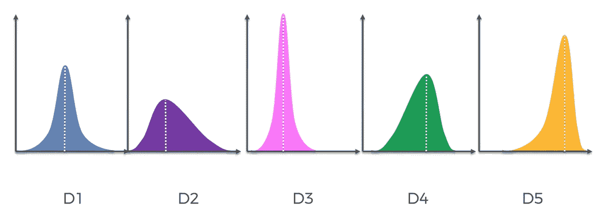

这些输出分布对我们来说是未知的。让我们在单个轴上绘制每台机器的假设平均输出，因为我们不知道我们假设所有机器具有相同的输出:

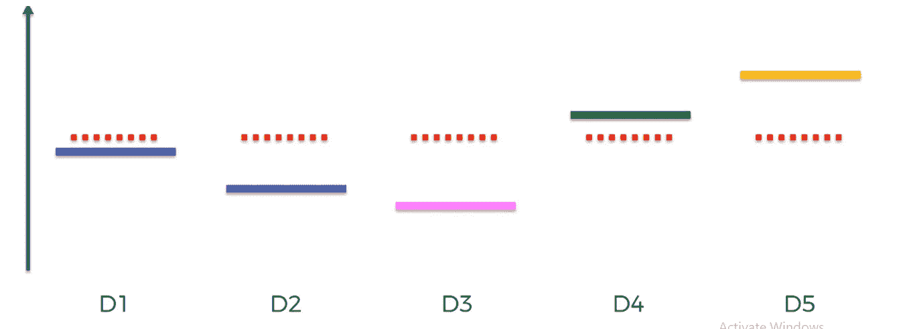

实际产出与假设产出

这里红色虚线表示假设的输出，其他线表示实际输出。
UCB 所做的是，对于每台机器，它将形成一个具有高度确定性的置信带，它将包括如图所示的实际预期回报。

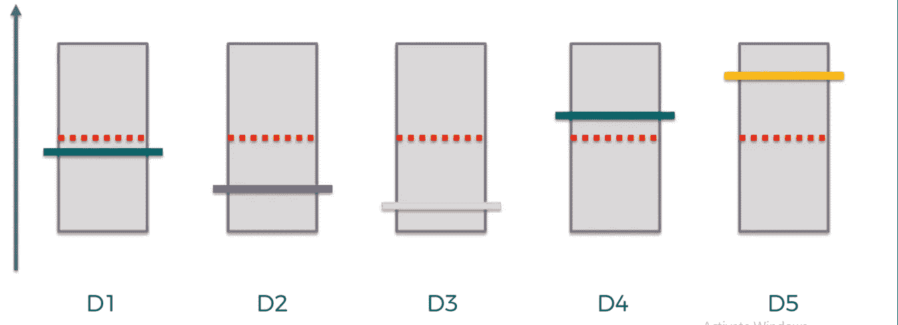

置信带

在第一轮中，我们将尝试每台机器，以便形成置信区间。
现在我们随机选择一台机器，假设选择 D3。该轮没有返回任何金额，因此其平均值增加了一个值，并降低了级别，因此置信区间变得更强，以涵盖实际产出，如下所示:

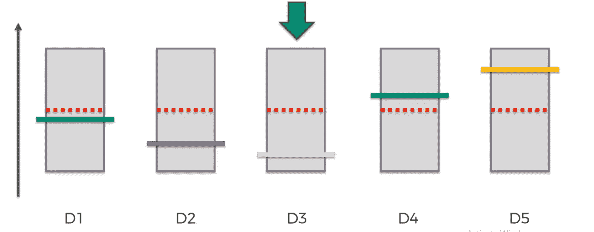

选择 D3

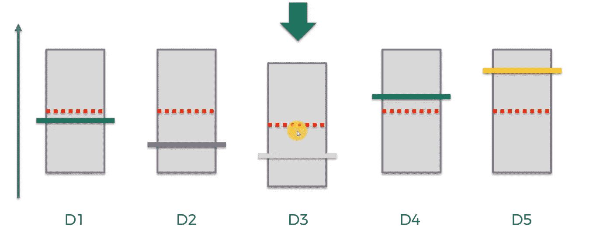

D3 假定值下降

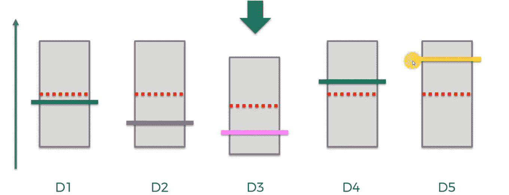

置信区间减小

这个置信区间最终会收敛到实际值。
现在选择随机加工 D4，重复相同的过程。

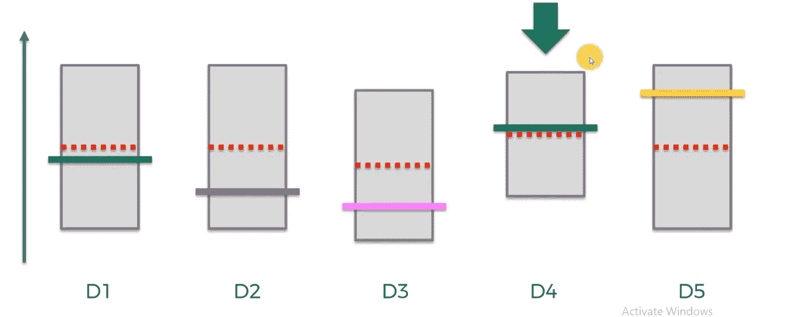

D4 被选中

以同样的方式，在最初的几轮中，选择所有的机器来获得一个初步的想法。
现在，对于下一次迭代，选择具有**最高上限水平**的机器进行下一次迭代。因此得名置信上限。

这个过程持续进行，并且对于每次迭代，只有具有最高 UCB 水平的机器被选择并被利用。这创造了 b/w 勘探与开发的平衡。

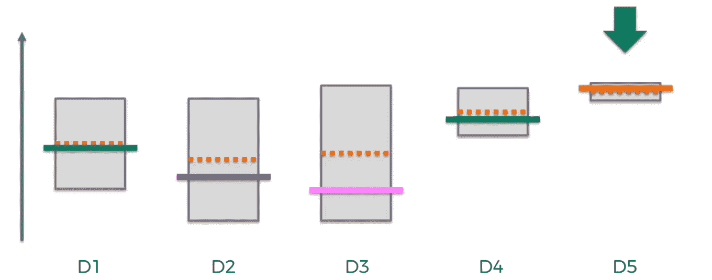

决赛成绩

这是我们发现和利用 D5 机器的长期结果，因为它是最好的机器。

# 用 Python 实现

在这里，我们将创建一个通用的解决方案，以便它可以用于任何数量的吃角子老虎机，广告等，并可以给出使用 UCB 的最佳机器的输出。

## 问题定义:

我们有 10 个不同的广告显示给用户。对于每次添加，用户将点击它或放手。根据这种互动，我们需要找出可以用于营销的最佳广告，以促进销售。
下面是所用数据集的一瞥:

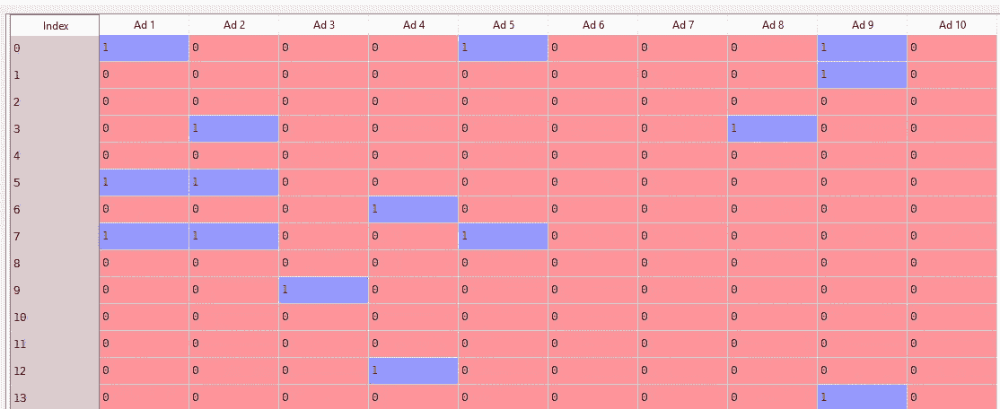

> 这个数据集显示了如果每个广告被显示给不同的用户时用户的反应。
> 示例:对于 10 个广告中 id=0 的用户，用户将点击广告 1、5、9。
> 我们需要找到一种方法，为用户谁登录到网站的下一个最佳广告必须使用 UCB 显示。

步骤:

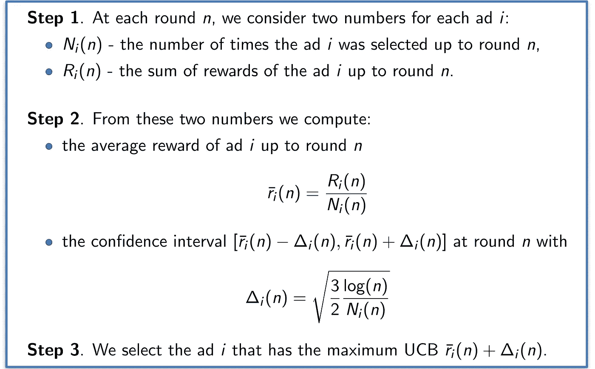

UCB

> 导入所需的库和数据集

```
# Importing the libraries
import numpy as np
import matplotlib.pyplot as plt
import pandas as pd# Importing the dataset
dataset = pd.read_csv(‘Ads_CTR_Optimisation.csv’)
```

> 第一步

```
#d is the no. of ads
d=10
# N is no. of times the ads is shown to different users
N=10000
# Ni(n)and Ri(n)vectors
number_of_selections=[0] * d
sum_of_rewards=[0] * d
#array of ads selected for each round
ads_selected=[]
#total reward generated 
total_reward=0
```

> 第二步和第三步

现在，在前 10 轮中，将选择每个广告，以便为创建信心带创造一些认知。然后，对于每个下一轮，具有最高上限的广告被选择，并且其奖励被添加到 *total_reward。* 该算法将在循环出借时获得最优广告。这里只需改变 N 和 d，它就可以用于任何数量的广告、吃角子老虎机等。

```
import math
for n in range(0,N):
 max_upper_bound=0
 ad=0
 for i in range(0,d):
 if(number_of_selections[i]>0):
 average_reward=sum_of_rewards[i]/ number_of_selections[i]
 confidence_interval=math.sqrt((3/2 * math.log(n) / number_of_selections[i]))
 upper_bound=confidence_interval + average_reward
 else:
 upper_bound=10e400
 if(upper_bound>max_upper_bound):
 max_upper_bound=upper_bound
 ad=i
 ads_selected.append(ad)
 number_of_selections[ad]+=1
 reward=dataset.values[n,ad]
 sum_of_rewards[ad]+=reward
 total_reward+=reward
```

选择的前 10 个广告与后 10 个广告

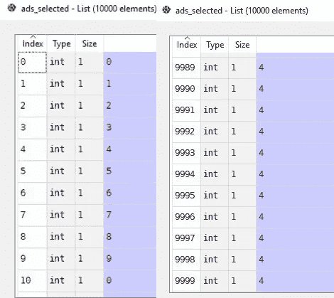

UCB 被选为最佳广告。
所选广告直方图显示最优广告。

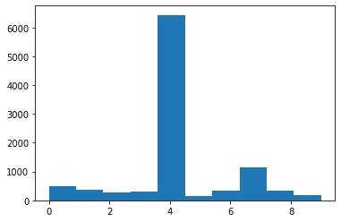

# 最终注释

这是我的第一篇系列文章，我希望你能学到一些东西！如果你们对这篇文章有什么想补充的，请随时留言，不要犹豫！我们真诚感谢任何形式的反馈。不要害怕分享这个！谢谢！