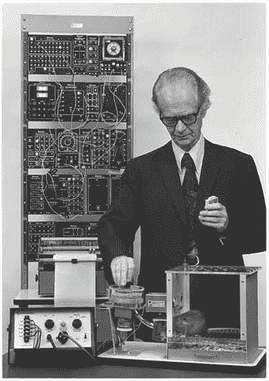
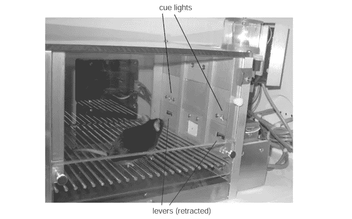
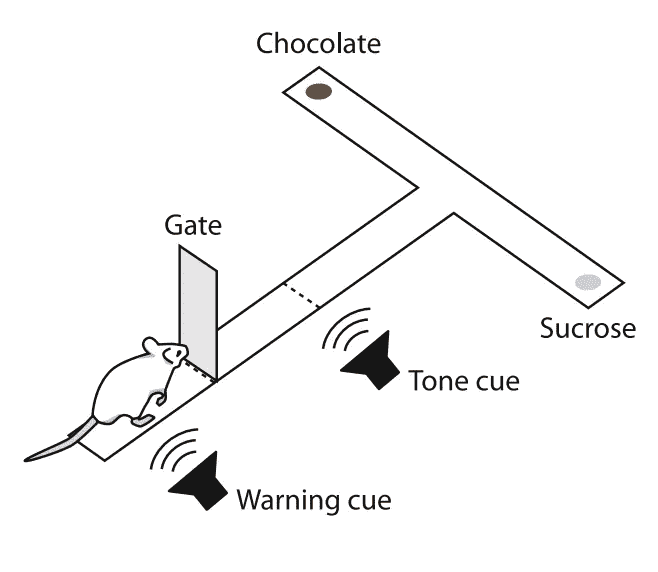
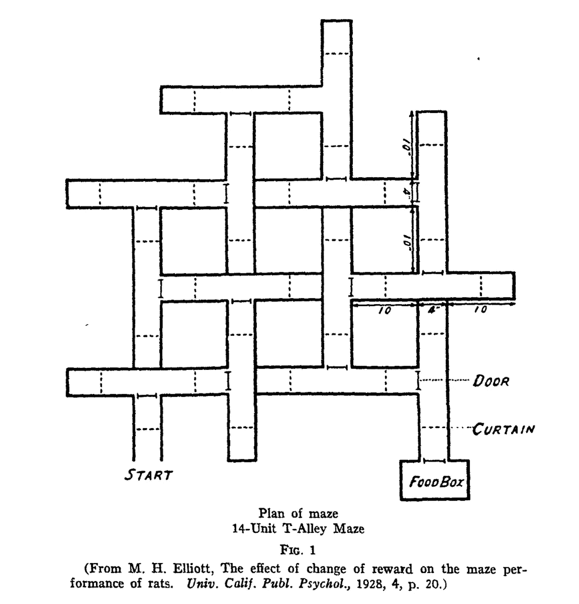
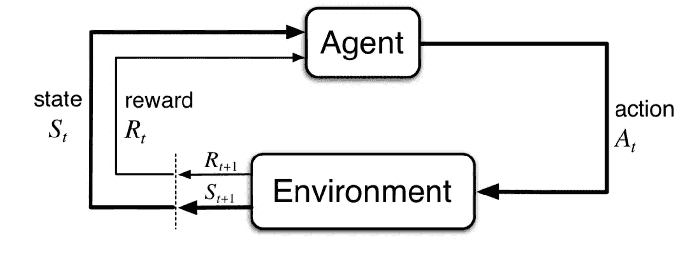
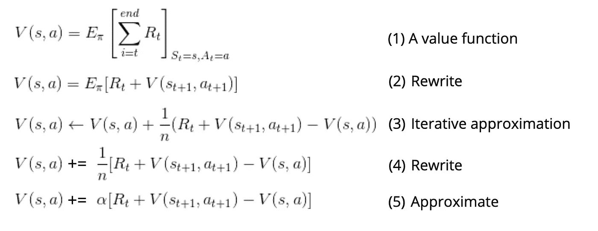
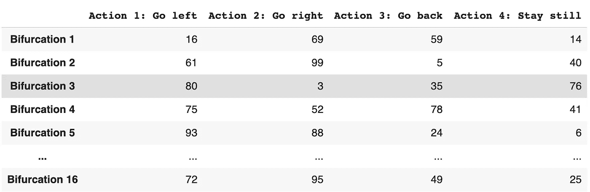
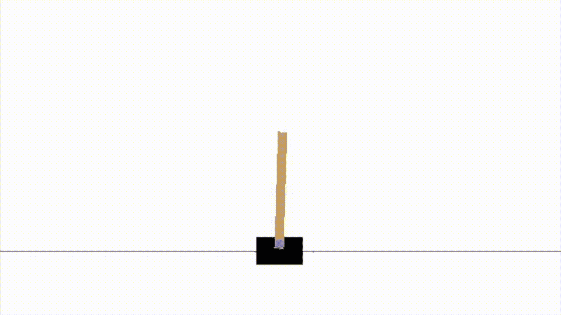
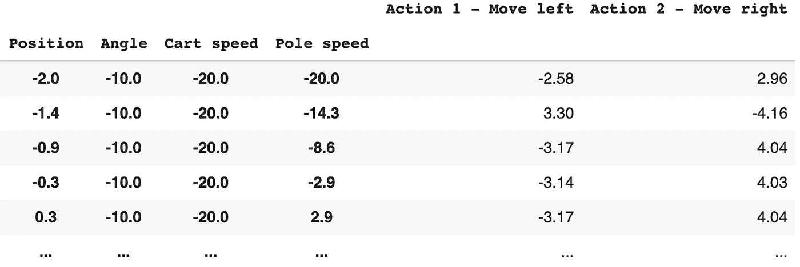

# 斯金纳的强化学习

> 原文：<https://medium.com/analytics-vidhya/reinforcement-learning-with-skinner-deacef0a281a?source=collection_archive---------12----------------------->

姆拉登·米利诺维奇在 [Unsplash](https://unsplash.com?utm_source=medium&utm_medium=referral) 上的照片

## 用神经科学的例子友好地介绍强化学习的问题

强化学习最近因诸如 [AlphaGo](https://www.nature.com/articles/nature16961) 的成就而进入聚光灯下，并且被认为是我们在人工一般智能方面最好的尝试之一——或者至少是更一般的智能。在这篇文章中，我将追溯它的一些历史，追溯到斯金纳对**操作性条件反射**的研究。

> 真正的问题不是机器是否思考，而是人类是否思考——b . f .斯金纳

B.f .斯金纳与他创造的操作性条件反射室一起工作。图片取自[此处](https://www.diarioliberdade.org/mundo/361-linguaeducacom/50965-o-modelo-did%C3%A1tico-do-ensino-programado,-segundo-b-f-skinner.html)。

斯金纳想了解动物如何发展适应行为，学习背后的规则是什么。那个时候，许多其他科学家对条件反射感兴趣，比如伊凡·巴甫洛夫——他因证明在给一个铃铛和一个牛肉配对后，狗对铃声垂涎三尺而闻名。

斯金纳和他的同行之间的主要区别是他在做非常受控的实验时的彻底性。斯金纳开发了一个小室——现在称为*操作性条件反射室，*或简称为*斯金纳箱——*，在这个小室里，动物，通常是老鼠和鸽子，可以与外界的声音、气味和光线隔离，并在每次实验中受到精确的刺激。马文·明斯基开玩笑地将斯金纳的一丝不苟与巴甫洛夫在一个满是笼子里的狗的实验室里进行的实验相比较，在照顾和控制方面相去甚远。

老鼠在调节室里。有两盏灯可以用来刺激动物，还有两个杠杆动物可以用来做出反应。蔗糖溶液由自动化系统控制。图片来自 Malkki 等人，2010 年

## 奖励和重复

动物将接受特定的刺激，如光、声音或气味，来自刺激的信息可用于获得一些食物或水(一种*强化物*)。但是老鼠需要执行一些特定的行动来得到强化物的奖励，在一小组可能采取的行动中做出正确的选择。可能会有一个歧视性的任务，其中一个灯会亮，如果灯是绿色的，动物会因为按下下面的控制杆而得到奖励。另一方面，如果灯是红色的，动物会因为按下对侧控制杆而得到奖励。

操作性条件反射任务的 t 型迷宫。图片来自史密斯、凯尔·s 和安·m·格雷贝尔，2013 年

经过一些尝试和错误之后，动物们开始以这样一种方式来增加它们的奖励率，就好像理解了指导它们奖励的规则，**就好像**理解了红色意味着“另一根杠杆”。此外，如果动物得到更高的奖励，它们(通常)会学得更快。受*斯金纳盒子的启发，大量受控空间被创造出来。*以这里显示的 *T 型迷宫*为例，有一个起始位置和一个决策点。根据播放的声音(*音调提示*),左臂或右臂将包含其各自的*增强器*。动物最终学会了根据声音去右臂，增加了它的奖励率。

> 在特定情况下产生令人满意效果的反应在该情况下更有可能再次出现，而产生令人不安效果的反应在该情况下不太可能再次出现——桑代克效果定律

对*操作性条件作用*的研究仍然非常活跃，有许多发展中的分支，如习惯化的动力学，例如，一种行为失去灵活性需要多少训练——变得对贬值有抵抗力——以及涉及哪些潜在过程。这篇文章没有过多地涉及我们大脑可能使用的算法，而是更侧重于描述这个问题。研究人工智能的人特别感兴趣的是顺序任务，其中在获得回报之前需要采取许多行动。

## 顺序任务

顺序任务的一个很好的例子是迷宫。还有许多其他情况，其中每一步的偶然性都取决于前一步。但是在迷宫中，顺序方面是空间分布的，所以它尽可能的清晰。想象动物跑着探索迷宫，直到它找到奖励(并被移出迷宫重新开始)。严格遵循效果法则，动物们会尝试在迷宫周围重复同样的准随机罐子，直到它们以同样的方式再次找到奖励，但这显然是低效的。事实上，从实验中可以清楚地看出，动物在训练中变得更有效率，直到试验中它们不犯任何“错误”直接获得奖励。

动物要应对的问题是*信用分配*问题，即如何强化那些真正有助于带来回报的行为，而不强化那些恰好在接近回报时发生的行为？事实上，有许多记录在案的例子，鸽子和猫在按下杠杆之前会重复做一些完全不必要的动作(如 Guthrie 1946)，在这些例子中，信用分配显然不是最优的。这是一个大问题，这个方向上的每一个进步都是对我们创造的强化学习系统的潜在巨大改进。

明确地说，这不是一个边缘问题:这是强化学习解决的核心问题。在这种情况下，行动与回报相去甚远，甚至连“完美的回应”都没有很好的定义。与监督学习相比，监督学习在每一步都指定并显示“正确”的答案。额外的困难正是强化学习如此广泛的原因，也是我们对人工智能的最佳尝试。

## 强化学习形式主义——一个草图

RL 类似于剥皮盒。一个**代理**可以访问指定的一组**状态**中的一个状态(在前面的例子中，这可能是特定的左绿灯亮了)，并且可以选择一些**动作**(按下左杆、右杆、不按下……)。然后，在环境中行动之后，**代理**接收到**奖励**(例如，食物，什么都没有……)，并感知自己处于新的**状态**。

> 学习就是:提高报酬率

图片来自萨顿&巴尔托事务所，2018 年

为了增加任务中的奖励数量，代理人必须考虑“在每个状态下哪一个是最佳行动”。这就产生了一个**最优策略**——一个决定行动的程序——**，**达到最大期望报酬率。当满足以下两个标准中的任何一个时,**最优策略**的存在在数学上是明确定义的:

1.  任务是有限的，或者
2.  未来晚些时候的奖励没有更接近现在的奖励有价值(有一个*贴现率*)。

在操作性条件反射的情况下，任务显然是有限的，但这并不意味着缺乏折扣。事实上，有一个非常当代的讨论围绕着*延迟贴现*及其对人类生活的影响，例如，它与药物滥用的关系(比克尔和马希，2001)。

另一方面，对于执行连续任务的人工智能体训练(像玩《我的世界》，它不是有限的)，重要的是要有一个小的折扣因子，以确保存在一个最优策略供智能体学习。

## 使用该算法

好的，所以我们不能结束强化学习的介绍，而不去探究一下让它在计算机中成为可能的方程式。我将绕过形式主义，而是给出一个小而直观的算法推导，该算法可用于寻找最优策略。我这样做是为了说明我们从理论到算法有多快。在进入图像之前，我们只需要对行动的价值建立一个小小的直觉:

1.  最佳行动是使未来预期报酬最大化的行动。
2.  如果我们知道采取每一个行动的未来预期回报，那么我们总是可以选择最好的行动。
3.  如果我们总能知道最佳行动，那么我们就达到了最优政策。

这里的想法是找到这个*值*函数，它输出在一个状态中采取行动的预期返回值。你会看到我们从(1)中的价值函数定义开始，到(5)中的算法结束。

一些简化的 SARSA 算法。最后一个等式可以在与环境交互的循环中在线使用。这里贴现率设为 1，为简单起见，Q 函数称为 V。

有了这个算法，就有可能通过与环境的交互来迭代学习。在每一步中，代理观察其状态 *s* 并采取动作 *a* ，根据收到的奖励和下一个状态-动作对更新其*值*。还记得迷宫问题吗？因为它有一组离散和有限的状态(决策点，分叉)和动作(例如向左，向右)，我们可以使用类似下面的 *Q 表*来解决它。

使用此 *Q-table* ，代理将在第三个分叉处左转，因为动作 1 的值最高。该表将在每一步进行更新，最终收敛到一个最优策略。在这里，我展示了一个非常简单的代理，它使用这个算法学习如何握住杆子！

你可以看到，它需要大量的重复来执行可以接受的，但这是因为有很多改进可以为这个设置。

离散化 CartPole 的截断 Q 表。对于每个维度的 20 个箱的不太精细的离散化，存在 20⁴ = 160，000 个状态的庞大总数。在这些情况下，函数逼近器是可行的方法。

因为状态是连续的，我们可以在离散化的基础上改进很多，使用连续函数逼近器，比如神经网络！尽管如此，问题的表述仍然是一样的，介绍这个问题是这篇博文的中心目的。

## 结论

这篇文章是对强化学习和操作性条件反射的非常简短的介绍，我打算写后续文章，更深入地研究这两者背后的理论和数学，展示越来越好和越来越复杂的算法，并将它们与神经科学联系起来。

希望能让你和我一样对强化学习感兴趣！我相信(正如许多人一样)神经科学可以为人工智能领域提供很多东西，尤其是高水平的洞察力。请评论反馈，感谢阅读！

## 进一步阅读

[由 *neptune.ai* 撰写的这篇文章](https://neptune.ai/blog/best-reinforcement-learning-tutorials-examples-projects-and-courses)有很多有趣的资源，可以深入到强化学习领域，从教程到完整的课程。

如果你想了解更多关于神经科学的知识，试试 medium 上的尖峰信号。

## 参考

比克尔，W. K .，，马希，洛杉矶(2001 年)。对药物依赖的行为经济学理解:延迟贴现过程。*瘾*， *96* (1)，73–86。

Dam，g .，Kording，k .，，Wei，K. (2013)。运动强化学习中的学分分配。 *PLoS One* ， *8* (2)，e55352。

格思里，E. R .，&霍顿，G. P. (1946)。拼图盒里的猫。

马尔基，H. A .，东加，L. A .，德格鲁特，S. E .，巴塔格利亚，F. P .，&彭纳茨，C. M. (2010)。小鼠的食欲操作条件反射:训练阶段的遗传性和分离性。*行为神经科学前沿*， *4* ，171

K. S .史密斯和 A. M .格雷贝尔(2013 年)。反映皮层和纹状体动力学的习惯性行为的双重操作者观点。*神经元*， *79* (2)，361–374。

萨顿和巴尔托(2018 年)。强化学习:简介。麻省理工出版社。