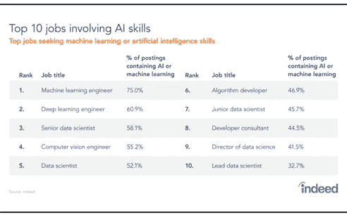

# 选择人工智能，重塑你的职业生涯

> 原文：<https://medium.com/analytics-vidhya/reinvent-your-career-by-choosing-artificial-intelligence-99a0522ec0aa?source=collection_archive---------22----------------------->

互联网、可再生能源和绿色技术的繁荣打破了我们当前的商业模式。多种商业趋势的迅速发展实际上正在影响着每个行业。也就是说，随着我们不断推动可能性的极限，人工智能正在为所有企业创造新的可能性。

几年前，餐馆里的外卖食品还是一种幻想。现在，我们不仅有送货上门服务，还根据我们的兴趣提供个性化的餐厅建议。这就是人工智能的成长轨迹。你可能会认为人工智能只是大型科技巨头关注的事情。但在现实中，人工智能创造了补充人类智能的机会，从而丰富了人们的生活和工作方式。

许多企业现在都将人工智能作为其数据战略中最重要的一部分。这是为什么呢？这可以归因于这样一个事实，即为了增加利润，跟上技术智能的指数级增长是极其重要的。根据 Gartner 的数据，2022 年 AI 创造的商业价值将达到 3.9 万亿美元。

用人工智能培育企业智能— Gartner

人工智能在生活的许多方面创造价值的影响正在以压倒性的速度在许多领域增长，从医疗保健，研究，制造，旅行和旅游，移动，零售，能源，等等。从制造业的自动化预防性维护，零售商投资 AR 和 VR 以改善用户体验，建筑行业试图减少人为错误和更好地利用大数据，人工智能是下一个前沿领域，现在已经准备好颠覆我们的世界。

虽然人工智能凭借其能力正在成为主流，但领导者面临的挑战是，向人工智能驱动的生活方式的过渡可能会让人类出局。虽然这可能是真的，但它也为年轻人创造了大量的就业机会。求职网站确实显示，从 2018 年 5 月到 2019 年 5 月，人工智能角色的职位空缺增加了 29%。

的确如此——涉及人工智能技能的十大工作

想过渡到人工智能行业吗？这些应该是你的主要技能。

自动化、数据分析、网络、数学和复杂计算机程序的使用是人工智能职业的特征。虽然与人工智能合作需要有一个分析性的思维过程，但对技术创新有良好的预见也很重要。最后，这些专业人员必须有能力将复杂的技术信息转换成简单的业务术语，以便能够完成工作。

**人工智能如何入门**

虽然拥有软件工程学位和数学专业知识很重要，但对于入门级职位来说，了解 Python 和 R 也是有益的。贝叶斯网络、图形建模、数据科学和/或统计概念方面的其他专业将有助于进入更高的排名。IT 架构师和 DevOps 专业人员可以轻松过渡到 AI 科学家角色。

**人工智能的子领域**

机器学习已经成为新的时髦词汇，但许多人没有意识到的是，ML 是人工智能的子集或子域。其他较少被提及的子域名包括

深度学习

自然语言处理

机器人学

优化和模拟

集装箱化和云基础设施

遗传计算

**人工智能四大职业道路**

虽然人工智能是一个包含多个子集的宽泛概念，但工作角色非常具体。人工智能领域的一些最佳职位描述包括/但不限于:

**1。** **机器学习&深度学习工程师**

这是去年最受欢迎的工作简介。自 2019 年以来，这些人工智能专业人士的工资上涨了 5.8%。这些工程师开发了我们所说的预测技术，比如苹果的 Siri。他们合作并分析机器学习算法所需的所有大数据，以使 ML 模型精确。这个角色适合那些有数据科学和应用研究经验并擅长编程的人。

**2。** **数据科学家**

如果你擅长数学和统计计算，那么这可能是你的领域。数据科学家应该能够理解原始数据，并将其转换成可理解的数据格式，还可以进行数据建模。你还需要创建算法，并确定它可以解决的各种问题。为了在这一领域持续发展，建议拥有一些数据工具的实践经验，如

Hadoop

MapReduce

火花等。

**3。** **算法开发者/科学家**

算法开发是机器学习的核心环节。为了能够开发这些算法，人们必须知道 ML 是如何工作的，以及为了以系统的方式执行它而必须开发的结构。精通发现、设计和开发分析方法以支持各种数据和信息处理方法是成为一名成功的算法开发人员的一大优势。

**4。** **人工智能研究科学家**

这可能是人工智能领域最受欢迎和高薪的工作之一。为了成为一名研究科学家，一个人需要有应用数学，计算统计学，DL 和 ML 的广泛知识。

那些在图形建模、自然语言处理和并行计算方面有实践经验的人可以在简历中留下更好的印象。

人工智能领域的职业提供了大量的机会，并且不仅限于这四种角色。因此，如果人工智能是你的领域，那里有大量的机会。现在说了这么多，让我们看看它未来的范围。

人工智能会给我们带来什么样的未来？

自 20 世纪 50 年代问世以来，人工智能一直在不断发展，并不断提高生活和工作的质量。世界各国都变得高度意识到应用人工智能的社会和经济影响。

麻省理工学院斯隆商学院对各行业 3000 多名高管、经理和分析师的研究显示，“几乎 85%的人认为人工智能将为他们的企业带来竞争优势，但只有约 20%的人已经开始在自己的企业中实施技术”。

虽然普遍认为人工智能的潜在增长可能取代人类元素，但最高领导人认为人工智能不是一种数字战略，而是数字时代的战略。因此，那些有潜力合作和分析大数据并将其转化为有意义的经验的人会发现人工智能的职业生涯非常有益。