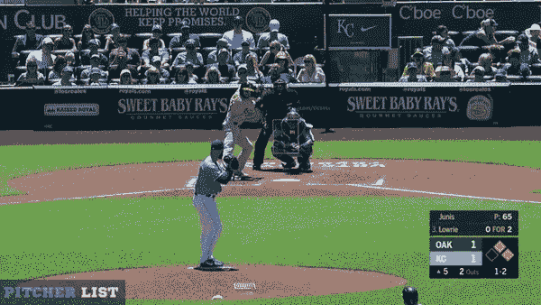
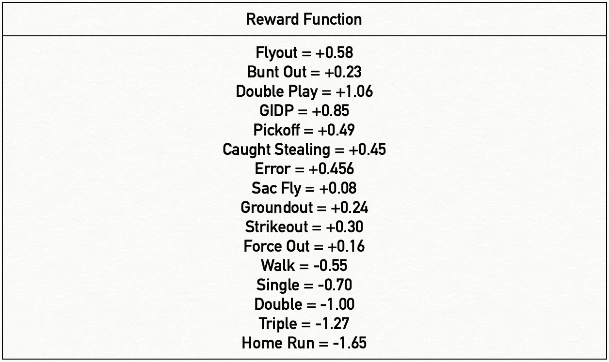
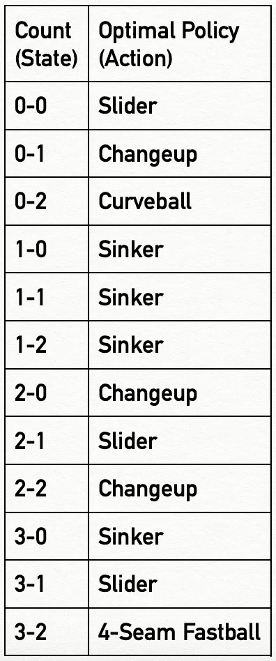
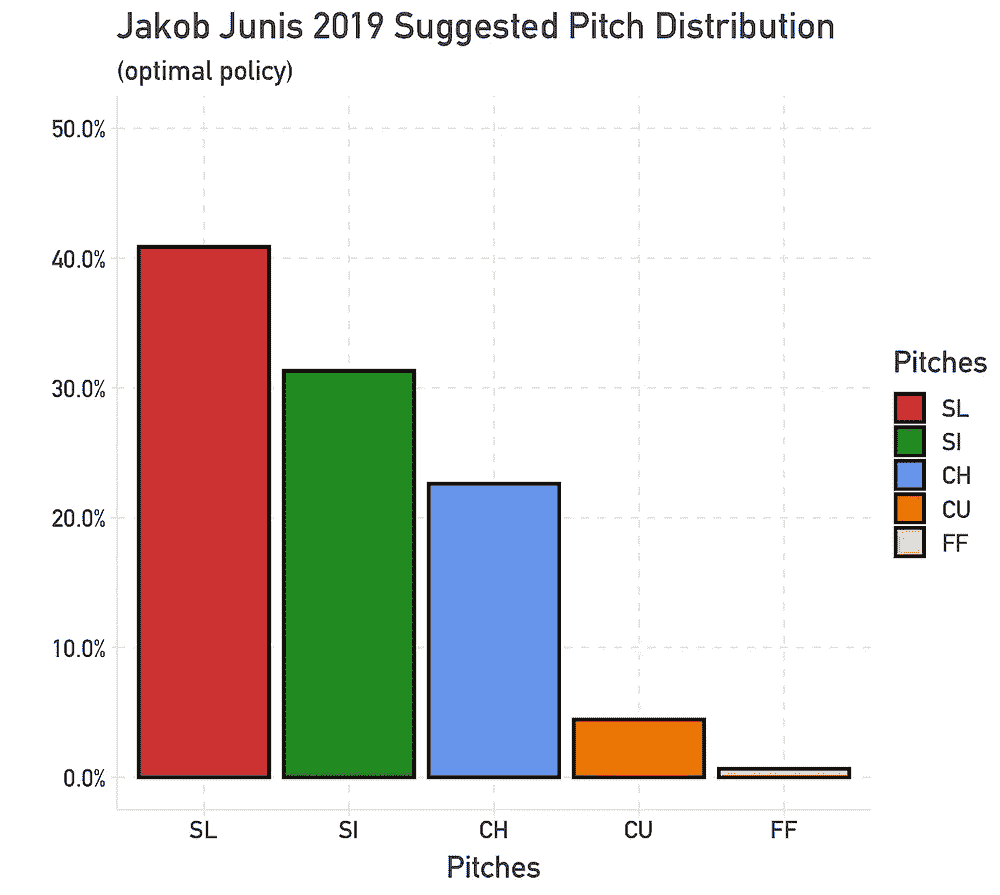
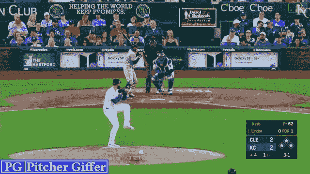
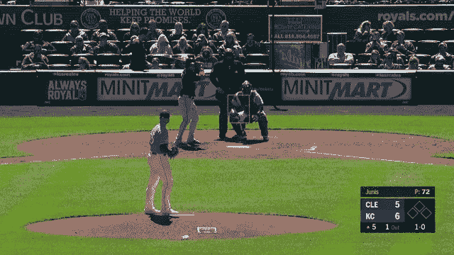

# 使用 Q-Learning 重塑 Jakob Junis

> 原文：<https://medium.com/analytics-vidhya/reinventing-jakob-junis-using-q-learning-ad4eb681d4f3?source=collection_archive---------26----------------------->

好吧，我承认…我有点暗恋雅各布·朱尼斯。当皇家队来到体育馆时，我有机会看他投球几次；我不禁认为这家伙拥有大联盟成功的工具，但出于这样或那样的原因，他无法将这些点联系起来。在过去的几年里，雅各布·朱尼斯在一直低于平均水平的皇家队中一直是低于平均水平的首发。他的不幸主要源于他控制投球的能力，或者说缺乏这种能力-特别是他的四缝线快速球，这是他在 2019 年第二次使用的投球，在 9.8%的桶百分比方面是最差的，并且投球值为-23 快速球低于平均水平。在过去的两年里，你可以在 Junis 的互联网上找到的任何分析都指出这是他的致命弱点。尽管有这些看似不可磨灭的负面影响，朱尼斯还有一张王牌——他的滑球，这可能是他穿着皇家队队服和任何给定的 3a 队服之间的区别。球场是肮脏的，他并不羞于使用它，因为球场对左撇子和右撇子一样有效。

朱尼斯展示他的滑球对杰德劳里

至少可以说，朱尼斯在大联盟的时间里慢慢偏离了主题，在他的三个赛季中，每个赛季都赢了九场比赛，但在他的最后两个赛季中，分别输了十二场和十四场。再一次，这很可能是球探报告抓到他的症状，这在大联盟中很快发生。尽管如此，在一个球员被视为发展中的球员，而不是固定价值的棒球时代，朱尼斯仍然是一个大联盟的投手，拥有大联盟的滑球。也许是因为我是湖人的球迷，我对历史上表现不佳、需要改造的球员情有独钟，但我真的相信朱尼斯有能力做出重大转变。显然，如果朱尼斯能够扭转他的职业生涯，他的个人发展将与挣扎中的皇家队正交，皇家队很可能至少在未来几年内处于重建阶段。所以必须要问一个问题——皇室如何重建雅各布·朱尼斯？

为了回答这个问题，我决定使用 Q-learning，这是一种强化学习，其中存在一个环境，由代理采取行动，在给定的状态空间内最大化回报。在我继续之前，我应该首先补充一点，这是受论文[*money barl-exploining Pitcher Decision-Making Using enforcement Learning*](https://arxiv.org/pdf/1407.8392.pdf)的启发。如果你不熟悉 Q-learning，这里的是一个很棒的视频，很清晰，不需要太长时间就能消化。当应用于棒球时，状态变成了击球时的计数，这个实例中的代理是 Jakob Junis，动作是 Junis 的五个投球；四缝线快速球、伸卡球、滑球、曲球和变速球。在 0-0 计数中，Junis 可以投出他的任何一个球，他会得到一个奖励，如果动作执行后没有达到终止状态(结束击球的状态),则该过程重新开始。主体的目标是基于一个奖励函数创建一个使其奖励最大化的策略，这被称为策略或最优策略。奖励函数背后有一个有点乏味的公式，所以我就不赘述了，只告诉你我为什么选择这些奖励。

**奖励功能**

奖励反映了棒球运动中所谓的“线性权重”。线性权重是一种按年计算棒球比赛结果的方法。例如，一个本垒打在 1964 年和 2016 年的价值不一样——见鬼，一个本垒打在 2010 年和 2019 年的价值不一样。从表面上看，这可能听起来很明显，但重要的是要认识到棒球是一个随着时间彻底改变的环境，任何对棒球的机器学习努力都应该记住这一点(如果它与项目相关的话)。让奖励函数值反映线性权重的目的是给出在给定时间棒球环境的最准确的表示。这并不理想，但我在这个项目中使用的线性权重来自 2015 年 MLB 赛季。从那以后，这些权重可能发生了巨大的变化，这可能是另一天的实验，但这里是奖励函数的样子。

奖励函数

**调整超参数**

Q-learning 算法使用 Junis 2018 赛季数据以及两个参数 alpha(学习率)和 gamma(折扣因子)进行训练。为了让代理能够足够快地学习，我发现将 alpha 设置为 0.25 是最合理的。alpha 设置过高将导致代理仅考虑最新的信息并忽略所有先前学习的信息，而 alpha 设置为 0.25 将导致代理对旧信息的重视程度略高于新获取的信息。棒球运动员以记忆力好、能从成功和错误中学习而闻名。投手通常不会因为一个糟糕的投球或一场糟糕的比赛而显著改变他们的方法，有时甚至不是糟糕的一年，这似乎符合 0.25 的学习率。

贴现因子负责评估未来奖励的重要性。伽马值为 1 导致代理人在以后的比赛中关心高的长期回报(即三振出局)比快速奖励(需要最少投球才能达到的出局)稍多，而 gamma 设置为 0 意味着代理人目光短浅，只关心即时奖励。将 gamma 设置为 0.5 意味着代理同等重视未来和当前奖励。对朱尼斯来说，一次三振不应该比快速两次投球出局或最终保持跑垒得分更有价值，这是投手的首要任务。

有人可能会说，我获取这些值的过程不够科学，也不够理想。同样，需要做更多的工作来消除这种球员分析方法中的缺陷。

**结果**

最优策略

在 Junis 的 2018 赛季数据上运行算法后，这里是产生的最优策略。这里关键的一点不是朱尼斯应该严格遵守这个政策(只在 0-0 计数时投滑球，在 0-1 计数时变速球，在 2-0 计数时投曲球等等。)，而是最优策略对 Junis 行为本质的暗示。最佳策略建议 ***朱尼斯应该将四缝线快速球从他的保留项目中删除，让他专门成为伸卡球投手*** 。这可能是 Junis 需要的令人耳目一新且切实可行的改变。他是一个相对平均速度的投手，有坚实的能力用他的伸卡球将球保持在地面上(他在 2019 年的最佳滚地球命中率为 56.8%)。这并不是说这将是一个容易的转变，但从统计数据来看，Junis 应该有更多的成功，并采用这种策略引发更多的滚地球——如果将球保持在地面上实际上是 Junis 挣扎的解毒剂(我相信是这样的)。

当这个最优策略应用于 Junis 的 2019 赛季数据时，这里是建议的音高分布与 Junis 的实际音高分布相比的样子。

实际与最佳

**球员发展分析**

这是一个球员不断重塑自我的时代，皇家队组织应该给朱尼斯配备合适的人来指导他开发更好的球场。有人可能会说，建议的音高混合有点重——这是公平的。然而，像兰斯·麦卡勒斯、帕特里克·科尔宾和里奇·希尔(以及其他人)这样的投手在历史上严重依赖他们的破球作为他们的主要投球。这不一定是朱尼斯的命运，但他的滑球仍然是他最好的投球，这应该不会很快改变。

过去，雅各布·朱尼斯一直在努力对付左手打者的悬挂变速球，因为他几乎只使用投球来对付左手打者；令人欣慰的是，有证据表明朱尼斯可以投出有效的变速球，因为这是他在 2019 年 WOBA (0.378)和 xWOBA (0.327)滑球之后的第二好的投球——这是一个一致性而不是可证明性的问题。在二月下旬的春训中投了几局之后，朱尼斯说:“我的曲球被三振了，这是我这个冬天一直在努力的。我挥杆失误，变速球没打中，太棒了。我指挥我的快速球很得体，我的滑球也投得很好。除了练习变速球，朱尼斯还调整了弧线球的握法，这应该会产生更锐利的突破，可能会帮助他在区域内悬挂得更少。

变化的两面

就球员发展而言，这是像我这样的人下车的地方。最好是给玩家他们认为合适的信息，然后离开他们的方式。这些是帮助投手改善他们的行为和投球组合的建议——不是严格的指导方针。

**Q-Learning 应用的未来**

这种球员分析方法当然需要改进。然而，它的优势在于它的多功能性，可以将投手行为与相应的音高值结合起来。该算法对诸如 PITCHf/x、桶百分比、旋转速率、速度等统计数据是盲目的。所有这些在评估投手时很重要的东西，但在大学水平上很大程度上没有使用或不可用。该算法不需要这些指标来评估什么是“坏”的投球，什么是“好”的投球，这些东西或多或少隐含在数据中，因此 ***我可以看到未来的应用在大学水平上最有效*** 那里的程序不仅不使用与专业人士相同的指标，而且充满了仍在了解自己的投手，他们需要一种超越“眼睛测试”的方法来评估他们的投球。这并不是要质疑亲自评估投手的重要性，但是有一个基于数据的策略也无妨。

有几个值得注意的障碍需要克服。一个是大学水平的一个个音高数据的开源数据库是不存在的。逐个音高的数据是这种强化学习方法中使用的数据背后的驱动力，大学课程可能会自己跟踪它，如果他们不这样做，开始也不迟。另一方面，幸运的是，通过 [Robert Frey](/@rfrey22/collegiate-linear-weights-f0237cf40451) 所做的大量工作，学院线性权重是存在的，并且可以用于 Q-Learning 算法的假设学院应用中。

我很有兴趣知道这个项目可以改进的更多方法，一如既往，如果有人有任何进一步的问题，我的 GitHub 链接如下，我的电子邮件也是如此。

感谢阅读！欢迎任何建设性的批评、问题或评论。

我的邮箱:logananthony510@gmail.com

我的领英:[https://www.linkedin.com/in/logan-mottley-922165196/](https://www.linkedin.com/in/logan-mottley-922165196/)

我的 GitHub:[https://github.com/logananthonymlb](https://github.com/logananthonymlb)