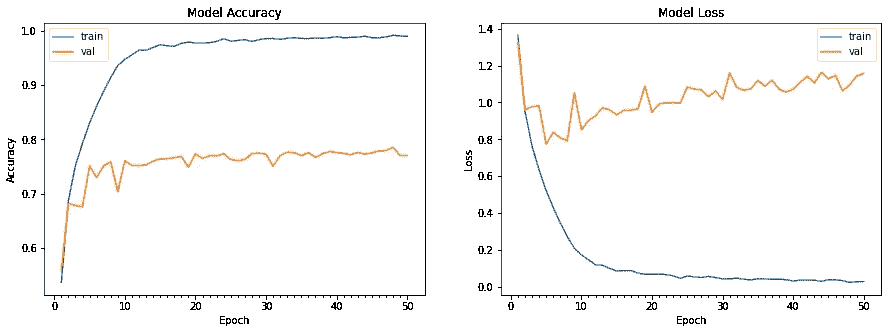

# ReLU 激活:靠贪心增加准确率！

> 原文：<https://medium.com/analytics-vidhya/relu-activation-increase-accuracy-by-being-greedy-6b93c7c40882?source=collection_archive---------7----------------------->


本文将帮助您决定在哪里使用 ReLU(校正线性单位),以及它如何在提高模型的准确性方面发挥作用。使用这个 [GitHub 链接](https://github.com/divyanshuraj6815/experiments/blob/master/activation_relu/Experiment_with_Activation_(Relu).ipynb)查看源代码。

下表是本文在 cifar10 数据集上训练 50 个时期的最终结果。我们对基本模型有 64%的准确率。激活层的优化使用将准确率提高到 80%。

```
+---------------------------+-----------------------------------+
|         **model_name** | **validation accuracy** | **time taken** |
+---------------------------+-----------------------------------+
|  without_any_activation   |               64.00 |  1171.98    |
|  with_relu_activation     |               78.52 |  1300.42    |
|  with_relu_activation_2   |               78.12 |  1305.67    |
|  with_relu_activation_2_3 |               77.55 |  1303.76    |
|  with_relu_activation_7   |               78.80 |  1349.62    |
|  with_relu_activation_7_10|               80.56 |  1368.53    |
+---------------------------+-----------------------------------+
```

## 内容

1.  ReLU 的定义
2.  模型的定义
3.  定义启发法
4.  实验和结果
5.  未来的工作

## 1.ReLU 的定义:


*   它从神经网络中代表该层的层或矩阵中删除所有负值。

```
def relu (x):
 return x if x > 0 else 0
```

*   我们也可以使用泄漏 ReLU。
*   我们使用了[批量标准化](https://en.wikipedia.org/wiki/Batch_normalization)，这是通过一个标准化步骤来实现的，该步骤固定了每一层输入的均值和方差。

## 2.本实验所用模型的定义

下面的例子是一个非常简单的模型，因为我们只想关注 **ReLU 激活的作用。**

```
_________________________________________________________________
**Layer (type)                 Output Shape              Param #** 
=================================================================
conv2d_1 (Conv2D)           (None, 30, 30, 48)          1344      
_________________________________________________________________
activation_1 (Activation)    (None, 30, 30, 48)            0         
_________________________________________________________________
batch_normalization_1 (Batc (None, 30, 30, 48)           192       
_________________________________________________________________
conv2d_2 (Conv2D)           (None, 28, 28, 48)         20784     
_________________________________________________________________
activation_2 (Activation)    (None, 28, 28, 48)            0         
_________________________________________________________________
batch_normalization_2 (Batc (None, 28, 28, 48)           192       
_________________________________________________________________
conv2d_3 (Conv2D)           (None, 26, 26, 96)         41568     
_________________________________________________________________
activation_3 (Activation)    (None, 26, 26, 96)            0         
_________________________________________________________________
batch_normalization_3 (Batc (None, 26, 26, 96)           384       
_________________________________________________________________
conv2d_4 (Conv2D)           (None, 24, 24, 96)         83040     
_________________________________________________________________
activation_4 (Activation)    (None, 24, 24, 96)            0         
_________________________________________________________________
batch_normalization_4 (Batc (None, 24, 24, 96)           384       
_________________________________________________________________
conv2d_5 (Conv2D)           (None, 22, 22, 96)         83040     
_________________________________________________________________
activation_5 (Activation)    (None, 22, 22, 96)            0         
_________________________________________________________________
batch_normalization_5 (Batc (None, 22, 22, 96)           384       
_________________________________________________________________
conv2d_6 (Conv2D)           (None, 20, 20, 96)         83040     
_________________________________________________________________
activation_6 (Activation)    (None, 20, 20, 96)            0         
_________________________________________________________________
batch_normalization_6 (Batc (None, 20, 20, 96)           384       
_________________________________________________________________
max_pooling2d_3 (MaxPooling2 (None, 10, 10, 96)            0         
_________________________________________________________________
conv2d_7 (Conv2D)           (None, 8, 8, 192)         166080    
_________________________________________________________________
activation_7 (Activation)    (None, 8, 8, 192)             0         
_________________________________________________________________
batch_normalization_7 (Batc (None, 8, 8, 192)            768       
_________________________________________________________________
conv2d_8 (Conv2D)           (None, 6, 6, 192)         331968    
_________________________________________________________________
activation_8 (Activation)    (None, 6, 6, 192)             0         
_________________________________________________________________
batch_normalization_8 (Batc (None, 6, 6, 192)            768       
_________________________________________________________________
max_pooling2d_4 (MaxPooling2 (None, 3, 3, 192)             0         
_________________________________________________________________
conv2d_9 (Conv2D)           (None, 1, 1, 192)         331968    
_________________________________________________________________
activation_9 (Activation)   (None, 1, 1, 192)              0         
_________________________________________________________________
batch_normalization_9 (Batc (None, 1, 1, 192)            768       
_________________________________________________________________
conv2d_10 (Conv2D)           (None, 1, 1, 10)           1930      
_________________________________________________________________
activation_10 (Activation)   (None, 1, 1, 10)              0         
_________________________________________________________________
batch_normalization_10 (Batc (None, 1, 1, 10)             40        
_________________________________________________________________
flatten_1 (Flatten)          (None, 10)                    0         
_________________________________________________________________
activation_11 (Activation)   (None, 10)                    0         
=================================================================
Total params: 1,149,026
Trainable params: 1,146,894
Non-trainable params: 2,132
```

在此模型中，我们将尝试通过使用这些层或根据一些启发不使用它们来提高准确性:

```
activation_1, activation_2, activation_3, activation_4, activation_5, activation_6, activation_7, activation_8, activation_9 and activation_10
```


CIFAR10 数据集

## 3.定义启发法

我们来看一个 3x3 的矩阵:

```
 A                                            B
+------+------+------+                      +------+------+------+
| -0.2 |  0.5 |  0.3 |                      |  **0.0** |  0.5 |  0.3 |
+------+------+------+                      +------+------+------+
|  0.4 | -0.6 |  0.4 |      =========>      |  0.4 |  **0.0** |  0.4 |
+------+------+------+         ReLU         +------+------+------+
| -0.3 |  0.9 |  0.1 |                      |  **0.0** |  0.9 |  0.1 |
+------+------+------+                      +------+------+------+
```

1.  **ratio_num :** 负数数量/正数数量
2.  **ratio_sum :** 负数之和/正数之和

**在给定矩阵**中:

```
+-----------------+----------------------+-------------------+ 
|     Heuristic   |       Matrix A       |     Matrix B      |
+-----------------+----------------------+-------------------+
|    ratio_num    |      3 / 6 = 0.5     |     0 / 6 = 0     |
+-----------------+----------------------+-------------------+
|    ratio_sum    |  -1.1 / 2.6 = -0.423 |    0 / 2.6 = 0    |
+-----------------+----------------------+-------------------+
```

现在，我们来看看图层 **conv2d_8** 和 **activation_8** 。它们分别代表**矩阵 A** 和**矩阵 B** 。它的尺寸是 6x6x192。这意味着它有 192 个 6×6 的矩阵。对于我们的用例，我们将它视为一维数组。

我们如何知道将矩阵 A (conv2d_8)转换为矩阵 B (activation_8)是否有利于提高精度？

因此，我们为 **conv2d_8** 找到 **ratio_num** 和 **ratio_sum** ，看看它是否能帮助我们做出任何决定。

## 4.实验

## ***1。无 _ 任何 _ 激活(模型 1):***

1.  我们在不包括任何激活层的情况下训练该模型，即在定义该模型时删除了所有激活 1、激活 2、激活 3、激活 4、激活 5、激活 6、激活 7、激活 8、激活 9 和激活 10 层。
2.  在第 10 个纪元中，我们获得了 64.07%的最佳验证准确率。
3.  我们从所有 10 个类中选择一个图像，并在训练模型 50 个时期后，找出每个类和每个层的启发法(之后我们应该使用 ReLU 激活)。我们还找出了启发式的平均值。
4.  在此查看结果:

所有类的所有卷积图层的 ratio_num 和 ratio_sum


精确度和损耗图

## **2。 *with_relu_activation(模型 2):***

1.  我们用所有激活层训练该模型，即所有激活 _1、激活 _2、激活 _3、激活 _4、激活 _5、激活 _6、激活 _7、激活 _8、激活 _9 和激活 _10 层。
2.  在第 48 个历元中，我们获得了 78.52%的最佳验证准确率。
3.  我们从所有 10 个类中选择一个图像，并在训练模型 50 个时期后的激活层之前的层中找出每个类的启发法。我们还找出了启发式的平均值。
4.  在此查看结果:

所有类的所有卷积图层的 ratio_num 和 ratio_sum



精确度和损耗图

> 我们观察到，通过添加 ReLU 激活，我们将准确率从 64%提高到了 78%。
> 
> 我们将尝试移除所有 ReLU 激活层的 20%(即 2 层)，看看我们是否可以进一步提高准确性。
> 
> 有两种方法可以去除激活层:
> 1。移除 ratio_num 和 ratio_sum 值最小的图层。(表中的索引 2)
> 
> 2.移除 ratio_num 和 ratio_sum 值最大的图层。(表中的索引 7)

## 3.with_relu_activation_2(型号 3):

1.  我们用激活 _1、激活 _3、激活 _4、激活 _5、激活 _6、激活 _7、激活 _8、激活 _9 和激活 _10 层来训练模型。请注意，我们已经从该模型中移除了**activation _ 2**。
2.  我们在第 45 个纪元达到了 78.12%的最佳验证准确率。
3.  我们从所有 10 个类中选择一个图像，并在训练模型 50 个时期后的激活层之前的层中找出每个类的启发法。我们还找出了启发式的平均值。
4.  在此查看结果:

所有类的所有卷积图层的 ratio_num 和 ratio_sum


精确度和损耗图

> 我们观察到验证准确率从 78.52%下降到 78.12%
> 
> 现在在这个模型中，我们可以从表中看到**索引 3** 现在有最低的 ratio_num 和 ratio_sum。
> 
> 所以我们将重新定义没有 **activation_2** 和 **activation_3** 层的模型，重新训练。

## 4.with_relu_activation_2_3(型号 4):

1.  我们用激活 _1、激活 _4、激活 _5、激活 _6、激活 _7、激活 _8、激活 _9 和激活 _10 层来训练该模型。请注意，我们已经从该模型中移除了**activation _ 2**和 **activation_3** 。
2.  我们在第 48 个纪元达到了 77.55%的最佳验证准确率。

> 整体精度下降了 1%，所以这不是有效的方法。
> 
> 我们现在将尝试移除具有最大比率 _ 数量和比率 _ 总和(即激活 _7)的层

## 5.with_relu_activation_7(型号 5):

1.  我们用激活 _1、激活 _2、激活 _3、激活 _4、激活 _5、激活 _6、激活 _8、激活 _9 和激活 _10 层来训练该模型。请注意，我们已经从这个模型中移除了 activation_7。
2.  在第 42 个历元中，我们获得了 78.80%的最佳验证准确率。
3.  我们从所有 10 个类中选择一个图像，并在训练模型 50 个时期后的激活层之前的层中找出每个类的启发法。我们还找出了启发式的平均值。
4.  在此查看结果:

所有类的所有卷积图层的 ratio_num 和 ratio_sum


精确度和损耗图

> 我们观察到验证准确率从 78.52%上升到 78.80%
> 
> 现在在这个模型中，我们可以从表中看到**指数 10** 现在具有最高的 ratio_num 和 ratio_sum。
> 
> 所以我们将重新定义没有**激活 _7** 和**激活 _10** 层的模型，重新训练。

## 6.with_relu_activation_7_10(型号 6):

1.  我们使用激活 1、激活 2、激活 3、激活 4、激活 5、激活 6、激活 8 和激活 9 层来训练该模型。请注意，我们已经从该模型中删除了**activation _ 7**和 **activation_10** 。
2.  在第 45 个历元中，我们获得了 80.56%的最佳验证准确率。


精确度和损耗图

> 总体精度提高了 2%，因此这似乎是一种有效的方法。

最后，我们得出这个结果:

```
+---------------------------+-----------------------------------+
**|         model_name        | validation accuracy | time taken  |** +---------------------------+-----------------------------------+
|  without_any_activation   |               64    |  1171.98    |
|  with_relu_activation     |               78.52 |  1300.42    |
|  with_relu_activation_2   |               78.12 |  1305.67    |
|  with_relu_activation_2_3 |               77.55 |  1303.76    |
|  with_relu_activation_7   |               78.80 |  1349.62    |
|  with_relu_activation_7_10|               80.56 |  1368.53    |
+---------------------------+-----------------------------------+
```

> **负值与正值的幅度比很高的层，我们不应应用 ReLU 激活。**

你可以在其他数据集上测试，让我知道你是否能够提高你的模型的准确性。

## 5.未来的工作

1.  更好的试探法:这里我们采用了简单的比率，这样我们就可以提出更好的试探法。例如，将标准偏差作为一个决定因素。
2.  不同的数据集:我们可以在不同的数据集上测试相同的原理，看看我们是否可以推广解决方案。
3.  我们可以选择其他激活功能，并尝试找到一种启发式方法来帮助我们决定是否要使用激活功能。
4.  这是一种贪婪的解决方案，可能不是最佳解决方案。我们需要找到一种有效的方法来达到最佳解决方案。