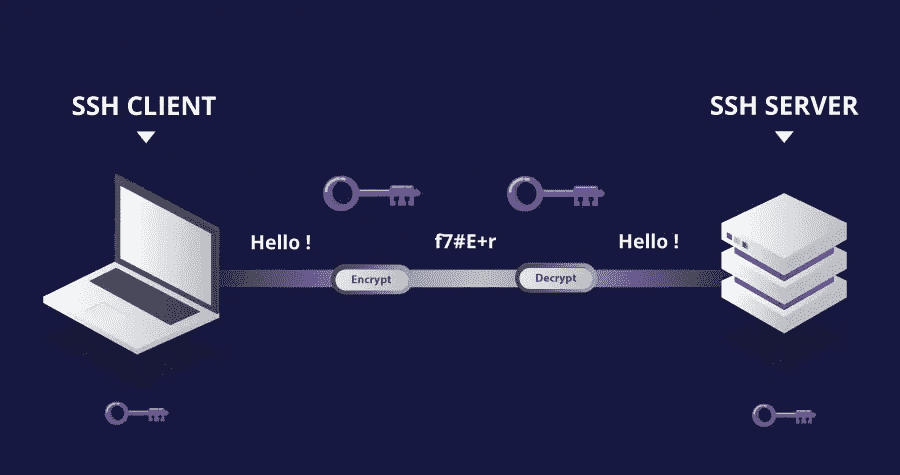
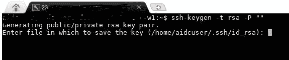
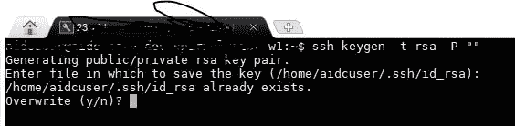
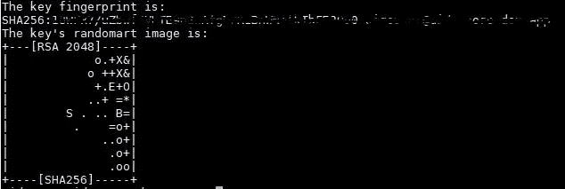

# 使用 SSH 远程登录虚拟机

> 原文：<https://medium.com/analytics-vidhya/remote-login-to-vm-using-ssh-dd5d6faf4ce4?source=collection_archive---------24----------------------->

# 什么是宋承宪？

安全外壳是一种加密网络协议，用于在不安全的网络上安全地运行网络服务。典型的应用程序包括远程命令行、登录和远程命令执行，但是任何网络服务都可以使用 SSH 来保护。

# 为什么要用 SSH？

**SSH** 通常被**用于**登录到远程机器并执行命令，但它也支持隧道、转发 TCP 端口和连接，它可以使用相关的 **SSH** 文件传输(SFTP)或安全复制(SCP)协议来传输文件**。 **SSH** 使用客户端-服务器模型。或多或少可以使用 SSH 安全地控制远程机器。**

# 执行 SSH 的步骤

1.  使用任何客户端(如 MobaXterm 或 Putty)打开您的虚拟机，并键入以下命令

***ssh-keygen-t RSA-P " "****—*它将创建 id_rsa 和 id_rsa_pub 文件，其中包含密钥。它将抛出类似的屏幕如下。

点击回车，你会看到如下屏幕。

输入是/是并继续。您将看到如下所示的屏幕。

2.从**复制*的按键。客户端机器的 ssh/id_rsa_pub*** 文件并粘贴到。远程机器上的 ssh/authorized_keys。

*   我们还可以使用***ssh-copy-id****将密钥从客户端复制到远程服务器。*

*3.尝试使用以下命令连接您的计算机:*

****ssh 用户名@ remote _ IP _ address****大功告成。**

**有各种方法来执行这个过程，这是最简单的方法之一。**

**谢谢:)**