# 用中值滤波去除椒盐噪声

> 原文：<https://medium.com/analytics-vidhya/remove-salt-and-pepper-noise-with-median-filtering-b739614fe9db?source=collection_archive---------0----------------------->

让我们来看看如何使用中值滤波去除图像中的椒盐噪声…

# 图像中的噪声是什么？

任何真实世界的传感器都会受到一定程度的噪声影响，无论是热噪声、电噪声还是其他噪声。

根据维基百科，噪音可能是由扫描仪或数码相机的图像传感器和电路产生的。图像噪声也可能源自胶片颗粒和理想光子探测器不可避免的散粒噪声。图像噪声是图像捕捉的一种不希望的副产品，它模糊了想要的信息。“噪音”的原意是“不想要的信号”；调幅收音机接收到的信号中不必要的电波动会产生可听见的噪声(“静电”)。以此类推，不需要的电波动也被称为**噪声**。图像噪声的范围可以从在良好光线下拍摄的数字照片上几乎察觉不到的斑点，到几乎完全是噪声的光学和射电天文图像，通过复杂的处理可以从中获得少量信息。这样的噪声水平在照片中是不可接受的，因为甚至不可能确定对象。有不同类型的噪音可用。

举个例子，

1.  高斯噪声

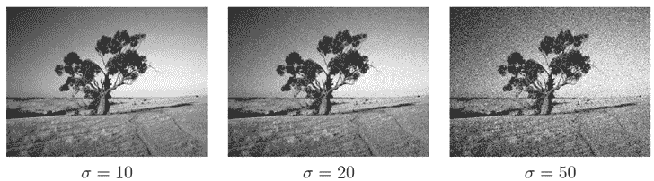

2.椒盐噪声

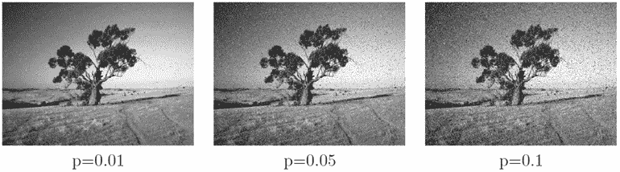

本文主要研究椒盐噪声以及如何利用中值滤波去除椒盐噪声。

# **什么是椒盐噪声？**

椒盐噪声是图像中的一种脉冲型噪声。我们考虑椒盐噪声，图像中一定数量的像素不是黑就是白(黑点或白点)。通常，如果图像中有黑点，我们称之为胡椒噪声，如果图像中有白点，我们称之为盐噪声。这种噪声通常是由数据传输错误、存储单元故障或模数转换器错误引起的。

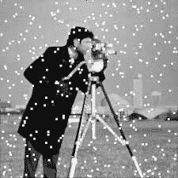

盐噪声图像

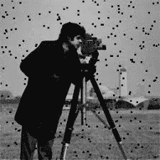

胡椒噪声图像

椒盐噪声图像

如果我们考虑 8 位图像，椒盐噪声随机出现在两个极端的一定数量的像素，要么 0 或 255。噪声极大地损害了图像信息，这导致后续图像处理任务(例如边缘检测或图像分割和图像识别任务)的困难。因为噪声像素不同于它的大多数局部邻居，它具有与边缘像素相同的大梯度值[1]。

# **去除图像中噪声的滤波技术有哪些？**

有这么多的过滤器可以用来减少图像中的椒盐噪声。我们可以使用的一些过滤器只能去除盐噪声或胡椒噪声。

1.  **最大过滤器**

*   此滤镜对于查找图像中的亮点非常有用。因为胡椒噪声具有非常低的值，所以作为子图像区域 Axy 的最大选择处理的结果，胡椒噪声被该滤波器减少。
*   我们可以使用 max 滤波器去除*的椒盐噪声。*

*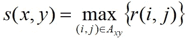*

***2。最小过滤器***

*   *此滤镜对于查找图像中最暗的点非常有用。此外，它还能降低 min 运算产生的盐噪声。*
*   *我们可以使用最小滤波器去除 ***盐噪声*** 。*

*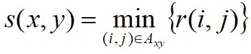*

*3.**中值滤波器***

*   *过程 is 用该像素的区域 Axy 中灰度级的中值替换该像素的值。*

*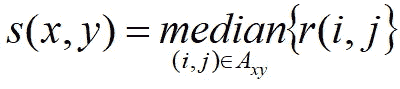*

*   *我们可以利用中值滤波去除 ***椒盐噪声*** 。本文主要研究如何利用中值滤波技术去除椒盐噪声。*

*4.**中点滤波器***

*   *中点滤波器简单地计算由滤波器包围的区域中最大值和最小值之间的中点，*

*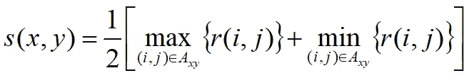*

*   *该滤波器最适合随机分布的噪声，如 ***高斯噪声或*** 均匀噪声。*

*5.**阿尔法修剪均值滤波器***

*   *假设我们删除区域 Axy 中 r(i，j)的 d/2 最低和 d/2 最高灰度值。*
*   *设 rk(i，j)代表剩余的 mn-d 个像素。并且平均这些剩余像素被表示为:*

*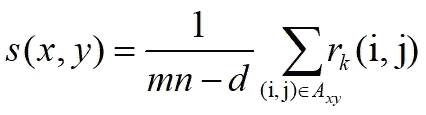*

*   *其中 d 的值可以在 0 到 mn-1 的范围内。当 d=0 时，为算术平均滤波器，d=(mn-1)/2 为中值滤波器。这对于多种类型的噪声是有用的，例如 ***椒盐噪声和*** 高斯噪声的组合。*

# *均值滤波器*

*   *这些是在空间域中减少噪声的简单方法。*

1.  ***算术平均滤波器***

*   *计算由 Ax，y 定义的区域中被破坏图像 r(i，j)的平均值。*
*   *恢复图像在任一点(x，y)的值，*

*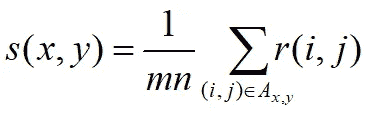*

*   *我们可以用这个滤波器去除 ***高斯噪声*** 。*

***2。几何平均滤波器***

*   *使用几何平均滤波器由以下表达式给出:*

*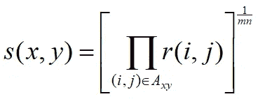*

*   *我们可以用这个滤波器去除 ***高斯噪声*** 。*

***3。谐波均值滤波器***

*   *谐波均值滤波器操作由以下表达式给出:*

*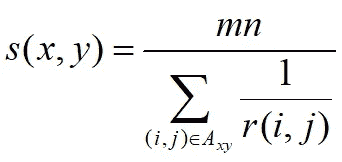*

*   *我们只能去除 ***盐噪声*** 而不能去除图像中的胡椒噪声。*

***4。反谐波均值滤波器***

*   *反谐波均值滤波器操作由以下表达式给出:*

*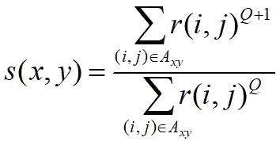*

*   *其中 Q 称为滤波器的阶数。该滤波器非常适合减少或几乎消除 ***椒盐噪声*** 的影响。*
*   *Q 值— (+) →If (Q>0)，最适合去除 ***椒盐噪声*** ，这类似于算术平均滤波器。*
*   *Q 值— (-) → If (Q <0), best for remove ***盐噪声*** 这类似于谐波均值滤波器。*

# ***中值滤波器***

*   *在这篇文章中，我们将看到如何使用中值滤波器去除**椒盐噪声**。*
*   *一组值的中值 *m* 是这样的:一半的值大于 *m* ，另一半小于*m**

**

*   *为了实现，对邻域中的像素值进行排序，选择中值并将该值分配给感兴趣的像素。强制具有不同亮度的像素更像它们的邻居。*
*   *我们知道滤镜是用来减少图像中的噪声的。我们来看看中值滤波是如何工作的？*

*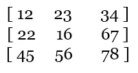*

*3 x 3 矩阵*

*   *中值滤波在减少椒盐噪声方面非常出色。过滤算法将使用一个小矩阵扫描整个图像，并通过对像素集进行排序并取矩阵内的中心像素值来重新计算值。*
*   *在上面的例子中，排序后的值是，*

*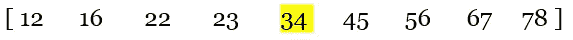*

*   *这组的中位数是 34。*
*   *中值滤波的例子，*

*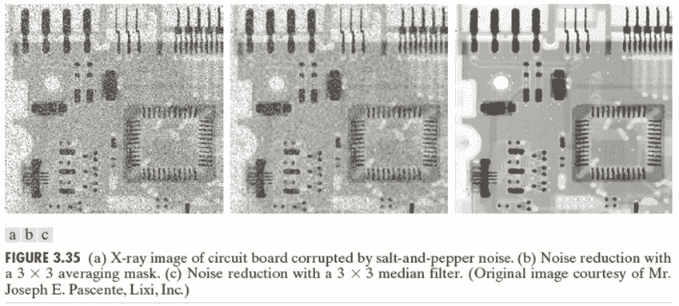*

# ***去除原始图像中的椒盐噪声***

*   *为此，我设计了一个小窗口窗体。*

*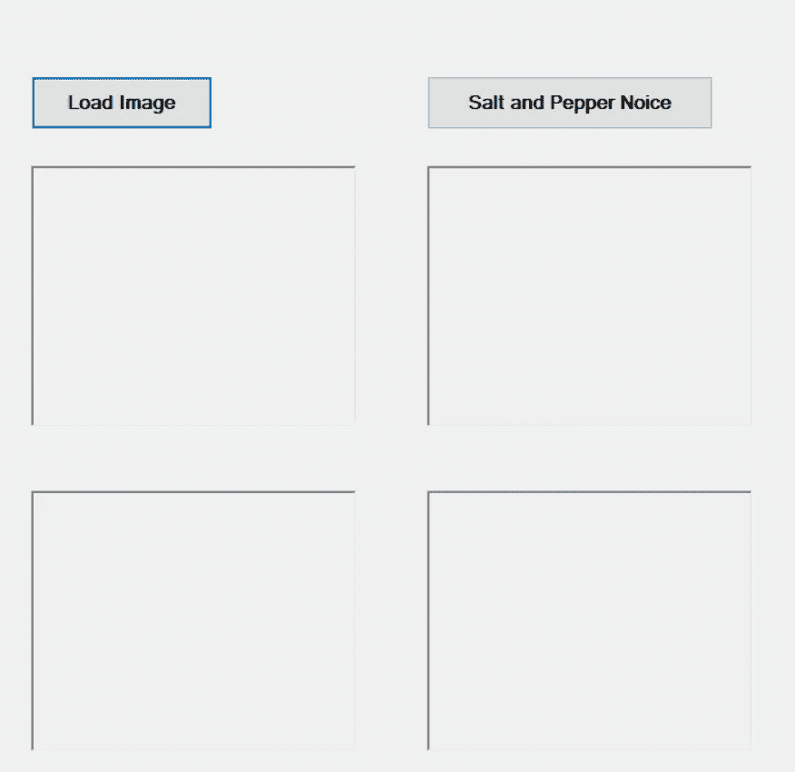*

*示例 windows 窗体*

*   *在这里，当我们点击加载图像按钮，它将加载原始图像。我使用了 2 个噪声图像来清楚地显示输出。*

*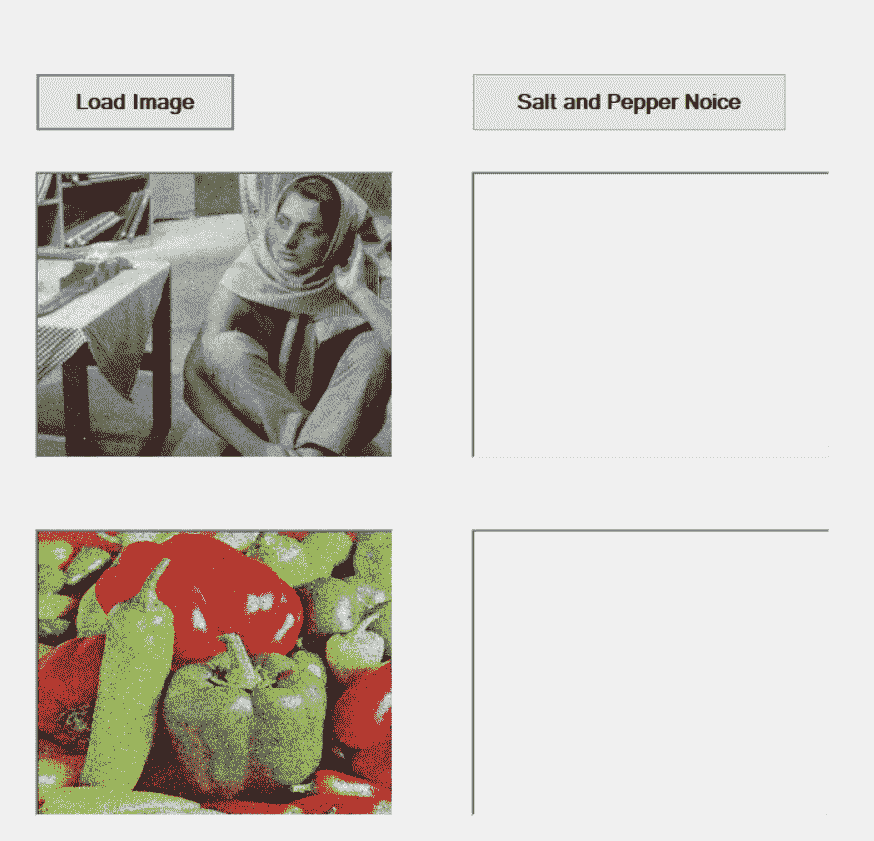*

*输入按钮*

*   *这段代码将图像加载到图片框中。在此之前，我们必须在预处理. cs 文件中创建函数。该函数是 LoadOrginalImage(字符串 fname)。所以我们必须在 load 按钮中调用这个函数。*
*   *通过使用 Cv。LoadImage()我们将加载原始图像。然后我们用 Cv。SaveImage()并保存原始图像的副本。我们会把那份拷贝放到图片框里。*

*   *之后，当我们点击椒盐噪声按钮，它将删除椒盐噪声和加载清晰的图像。*

*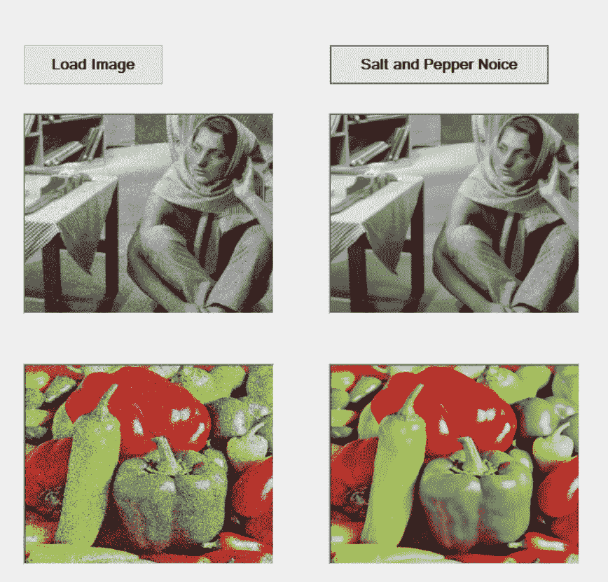*

*去除了盐和胡椒的噪音*

*   *在这里，我们还在 preprocessing.cs 文件中创建了 SaltPepperFilter()函数。这里我们用的是 Cv。平滑()去除杂色。在此之后，我们也必须使用 Cv 保存输出图像。openCV 中的 SaveImage()。这里我们使用 Cv 平滑图像。平滑()。*
*   *在椒盐噪声按钮中，我们必须调用 SaltPepperFilter()函数。我们将通过单击椒盐噪声按钮将保存的图像载入图片框。下面的代码将展示我们如何将图像加载到图片框中。*

# ***结论***

*在这篇文章中，我介绍了使用中值滤波减少椒盐噪声。中值滤波对于去除椒盐噪声非常有效，并且在滤除噪声后保留图像的边缘。在这里，中值滤波的实现非常简单。加载图像，通过 Cv 传递。平滑()我们可以得到清晰的图像。*

*所以，以后希望能和大家探讨更多的图像处理技术。*

*感谢您通读这篇文章，如果您觉得有帮助，请随意留下一些掌声。*

*   *最新的代码可以在 https://github . com/Prabhavi-Jayanetti/Remove-Salt-and-Pepper-Noise-by-using-Median-filter . git 中找到*

# ***参考文献***

*[1].“基于多级加权图和 IGOWA 算子去除受损图像中的椒盐噪声”，Hindawi，2018 年 5 月 15 日，[在线]:【https://www.hindawi.com/journals/mpe/2018/7975248/【访问日期:2020 年 10 月 15 日】*