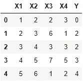
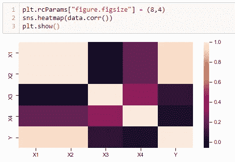
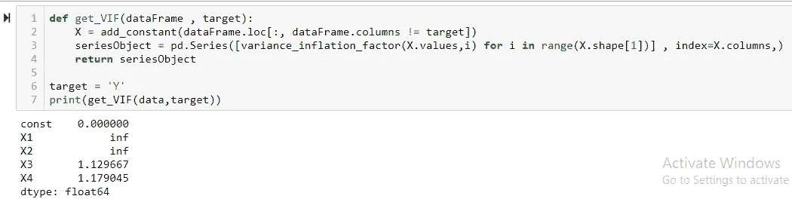

# 消除线性和逻辑回归的多重共线性。

> 原文：<https://medium.com/analytics-vidhya/removing-multi-collinearity-for-linear-and-logistic-regression-f1fa744f3666?source=collection_archive---------4----------------------->

## 多重共线性简介

***什么是多重共线性？***

**多重共线性**是指多元回归模型中两个或两个以上解释变量高度线性相关的情况。*【这是直接来自维基百科】*。*多重共线性*发生在您的模型包括多个不仅与您的目标变量相关，而且彼此相关的因素时。

现在让我们用简单的话来解释一下……

当数据集中的一列 A 增加时，它也会影响另一列 B，它可能会增加或减少，但它们有一个非常相似的行为。

假设我们有一个包含 4 个要素和 1 个连续目标值的数据集。

以 Y 为目标列的虚拟数据框架

现在，如果我们在这里观察到，随着 X1 列的值增加，X2 的值也增加。这表明 X1 和 X2 彼此有些关联。用统计学的话来说，X1 和 X2 的相关系数是相似的。

换句话说，X1 和 X2 高度相关，因此这种情况简单地称为多重共线性。

## 现在你可能会想，它会如何影响我正在构建的模型？

线性回归和逻辑回归的假设之一是特征列相互独立。因此，多重共线性明显违反了线性和逻辑回归的假设，因为它表明独立的要素(即要素列)相互依赖。

此外，虽然您的模型有时会在不消除多重共线性的情况下提供较高的准确性，但它不能依赖于真实世界的数据。此外，系数对模型中的微小变化非常敏感。简单地说，模型将不能一般化，如果您的模型在生产环境中，这会导致巨大的失败。从数据集中移除多重共线性的另一个重要原因是降低模型的开发和计算成本，这将使您离'*完美'*模型更近一步。 ***所以一定要谨慎，不要跳过这一步！！***

## 那么现在我们如何检测这种多重共线性呢？

> **使用相关系数热图**

一个简单的步骤是我们观察相关系数矩阵并排除那些具有高相关系数的列。使用 pandas 可以很容易地找到数据框架的相关系数，为了更好地理解[***seaborn***](https://seaborn.pydata.org/introduction.html)软件包有助于构建热图。

使用 seaborn 的热图

但是等等，当我们有很多特征的时候，这个方法不会变得复杂吗？

是啊！！这将适用于较小的数据集，但对于较大的数据集，分析这将是困难的。哎呀…我们被困住了吗？别担心，我们还有其他方法。

> **利用******(方差影响因子)****

## **VIF 的理念是什么？**

**它一次将一列作为目标，将其他列作为特征，并符合线性回归模型。之后，它计算 r 平方值，对于 VIF 值，我们取 1 平方的倒数，即 1/(1 平方)。**

**因此，在每次迭代之后，我们得到数据集中每一列*(上面作为目标)*的 VIF 值。VIF 值越高，在建立实际回归模型时删除列的可能性就越大。**

****

**计算每列的 VIF 的代码段**

**但是，如果你不想删除这些列，也许他们有一些重要的信息。如果是这样，你可以使用下面提到的这个小而有用的技巧:**

**我们可以使用 ***岭回归或*** 套索回归，因为在这些类型的回归技术中，我们添加了一个额外的λ值，该值对特定列的一些系数不利，从而降低了多重共线性的影响。**

## **这就是检测和移除数据集中多重共线性的方法。**

**很简单，对吧？去尝试一下吧，如果你通过这篇文章学到了新的东西，别忘了鼓掌！！**

**检查我的 GitHub 存储库中的基本 Python 代码:[https://GitHub . com/prince baretto 99/removaling _ multico linearity](https://github.com/princebaretto99/removing_multiCollinearity)**