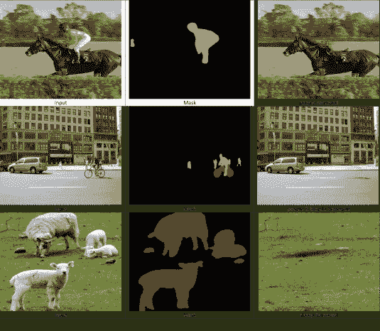
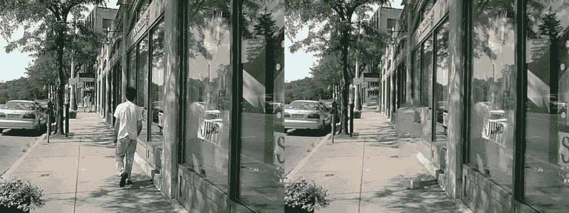
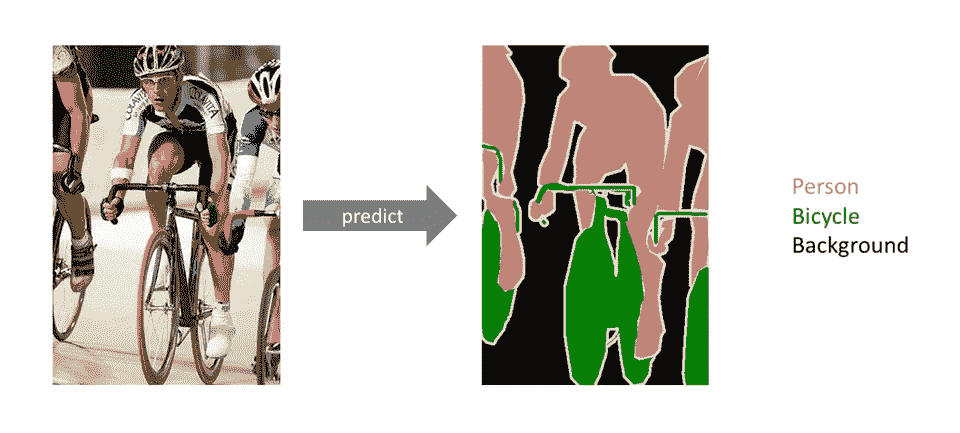
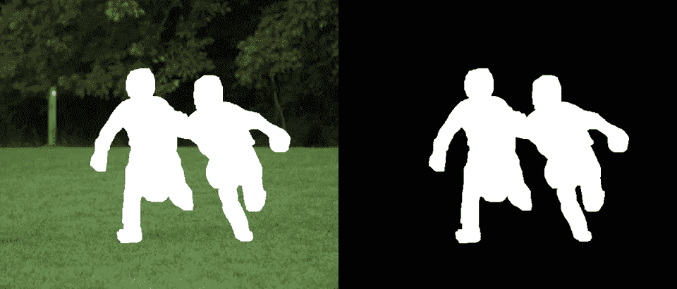
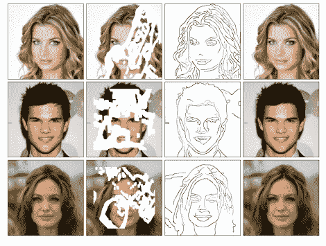
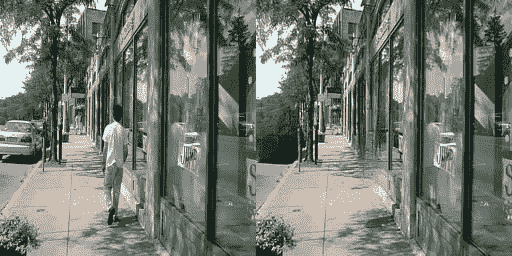
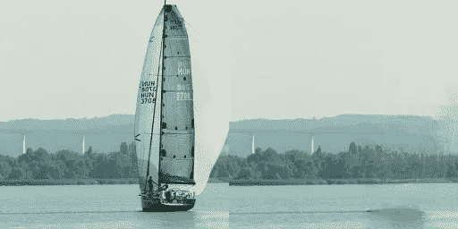
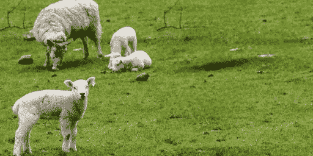
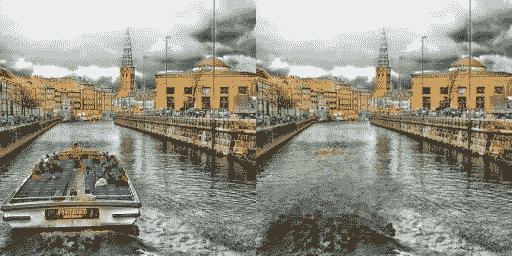

# 利用深度学习从图片中移除对象

> 原文：<https://medium.com/analytics-vidhya/removing-objects-from-pictures-with-deep-learning-5e7c35f3f0dd?source=collection_archive---------1----------------------->

计算机视觉如何帮助您检测不需要的对象并将其从图片中移除？



自动化对象移除过程

网上有很多付费和不付费的应用程序，可以让你选择图片的某个区域，将其替换为背景。它们中的大多数使用某种类型的修复算法来填充想要移除的部分。但是，即使使用最先进的修复算法，图像上的结果也总是不可预测的，因为它的准确性很大程度上取决于图像的背景、所需去除区域的面积以及图像的清晰度和复杂性。



结果来自一个免费的在线修复工具[【来源】](https://theinpaint.com/)

所以最好在多张图片上使用这个物体移除工具，并从中挑选一张看起来最好的。但我在网上找到的所有这些对象移除工具都要求用户选择要移除的区域，这可能是一项非常耗时的任务，尤其是在有大量图像的情况下。所以我将对象分割(选择要移除的区域)和修复(填充缺失区域)的算法结合起来，做了一些改动，创建了[自动对象移除修复器](https://github.com/sujaykhandekar/Automated-objects-removal-inpainter)。

这个工具可以让用户从 20 个最常见的物体中选择要移除的物体，比如人、车、鸟等等。并且使用现有技术的边缘连接修复网络来移除它们。

[](https://github.com/sujaykhandekar/Automated-objects-removal-inpainter) [## sujaykhandekar/自动物体移除修补程序

### 是一个结合了语义分割和边缘连接架构的项目

github.com](https://github.com/sujaykhandekar/Automated-objects-removal-inpainter) 

让我们简单了解一下项目中使用的这两个网络。

## **语义分割**



语义分割[【来源】](https://www.jeremyjordan.me/semantic-segmentation/)

三种最常用的图像分类技术是简单图像分类器，它简单地告诉我们图像中存在什么单个对象或场景；对象检测，它定位并分类图像中的多个对象，方法是在它们周围绘制边界框，然后对框中的内容进行分类；最后是语义分割，它是三种技术中最准确的，它不是矩形边界框，而是创建遮罩来对图像中的每个像素进行分类，就像上面的图像一样。

对于对象去除项目，可以使用对象检测或语义分割。但是语义分割更有意义，因为它通过创建最小可能的移除区域来减少修复算法的工作。

Pytorch 提供了两个内置的语义分段架构，它们的**预训练模型**权重 [**FCN resnet-101**](https://pytorch.org/hub/pytorch_vision_fcn_resnet101/) 和[**DeepLabV3 resnet-101**](https://pytorch.org/hub/pytorch_vision_deeplabv3_resnet101/)**。DeepLabV3 比 FCN 稍慢，但更准确，因此我让用户在代码中选择任意一个。**

> 简单地说，**预训练模型**是由其他人创建的**模型**来解决类似的问题。不是从零开始构建一个**模型**来解决一个类似的问题，而是使用在其他问题上训练过的**模型**作为起点。
> 
> —[www.analyticsvidhya.com](https://www.analyticsvidhya.com/blog/2017/06/transfer-learning-the-art-of-fine-tuning-a-pre-trained-model/#:~:text=Simply%20put%2C%20a%20pre%2Dtrained,build%20a%20self%20learning%20car.)

这些模型的输出是代表实际图像的单通道图像，但是像素值的范围从 0(对于背景)到 20(对于每个不同的类别从 1 到 20)。EdgeConnect 模型的输入需要移除了需要修补的区域的遮罩和实际图像。



边缘连接所需的输入图像(a)移除了需要修补的区域的实际图像(b)相同大小的遮罩

因此，分割模型的输出被转换成黑白图像，其中白色像素表示由模型检测的对象。该生成的掩模然后用于去除图像的一部分，以创建如上所示的两个输入图像。

## **边缘连接**

> 我们提出了一个两阶段对抗模型 EdgeConnect，它由一个边缘生成器和一个图像完成网络组成。边缘生成器产生图像缺失区域(规则的和不规则的)的幻觉边缘，并且图像完成网络使用幻觉边缘作为先验来填充缺失区域。
> 
> [— EdgeConnect:利用对抗性边缘学习的生成式图像修复(2019)](https://arxiv.org/abs/1901.00212)

[](https://github.com/knazeri/edge-connect) [## kna zeri/边缘连接

### 我们开发了一种新的图像修复方法，可以更好地再现填充区域，表现出良好的修复效果。

github.com](https://github.com/knazeri/edge-connect) 

当有人看着缺失部分的图片时，人类的思维足够强大，可以在完整图片的心理表征中传递缺失的信息。图像中物体的边缘最有助于传达这种感觉，因为它们帮助我们理解图像实际上是什么，并且我们可以在以后填充更好的细节。



(从左到右)原始图像，输入图像，生成的边缘(蓝线表示幻觉边缘)，未经任何后期处理的修复结果。[【来源】](https://github.com/knazeri/edge-connect)

在 EdgeConnect 中使用了类似的方法，他们使用两个阶段进行修复，而不是传统的一步。使用 canny 边缘检测器来检测图像中的现有边缘，而边缘生成器网络会产生幻觉来检测应该在缺失区域中的边缘。接下来是修复网络来填充颜色。

要了解更多关于 EdgeConnect 架构的信息，你可以点击这里查看他们的优秀论文。

## **如何使用自动物体清除？**

要使用这个项目，你可以到我的 [repo](https://github.com/sujaykhandekar/Automated-objects-removal-inpainter) 并按照那里的说明设置 pytorch 的先决条件、其他库和预训练权重，然后在终端中运行下面的命令

```
python test.py --input [input dir] --output [output dir] --remove [objects to remove}
```

对于 1000 张图像，在 GPU 上大约需要 10 分钟。输出中的图像将全部为 256 x 256 大小，因为 EdgeConnect 预训练模型是在该大小的图像上训练的。有许多其他选项可用于测试模型，包括在 CPU 上运行以获得较慢的运行时间，但质量稍好。所有可用选项都在 [github repo](https://github.com/sujaykhandekar/Automated-objects-removal-inpainter) 中进行了描述。

为了使输出图像的大小与输入图像的大小相同，我能想到的两个可能的选择是在更大的图像上训练 EdgeConnect 模型，或者在分割模型中检测到的每个对象周围创建 256 x256 的子图像，然后合并所有子图像以重新创建原始大小的图像。你可以参考这个[回购](https://github.com/javirk/Person_remover)了解一下。



自动物体移除的一些结果(左上)人被移除，(右上)船被移除，(左下)羊被移除，(右下)船和船上的人被移除

## **总结**

我希望你喜欢阅读这个项目！当我开始从事这项工作时，它只是一个辅助项目，帮助我从其他计算机视觉项目的图像中删除人，但在看到一些输出图像的质量后，我感到惊讶。所以我认为它可以不仅仅是花哨的照片编辑工具。经过一些改进，它也可以被 photoshop 插件如 RunawayML 所采用。凭借其速度和准确性，它还可以扩展为计算机视觉项目的数据增强技术。