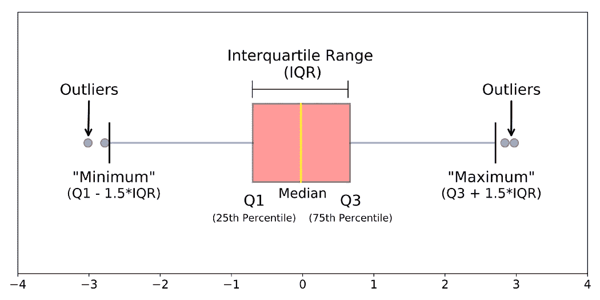

# 使用 Python 和 Pandas 移除数据中的异常值

> 原文：<https://medium.com/analytics-vidhya/removing-outliers-from-data-using-python-and-pandas-a3b5c6cded2c?source=collection_archive---------3----------------------->

# 极端值

显示中位数和四分位间距的箱线图是可视化分布的好方法，尤其是当数据包含异常值时。箱形图各方面的含义可解释如下-

# 生成一些数据