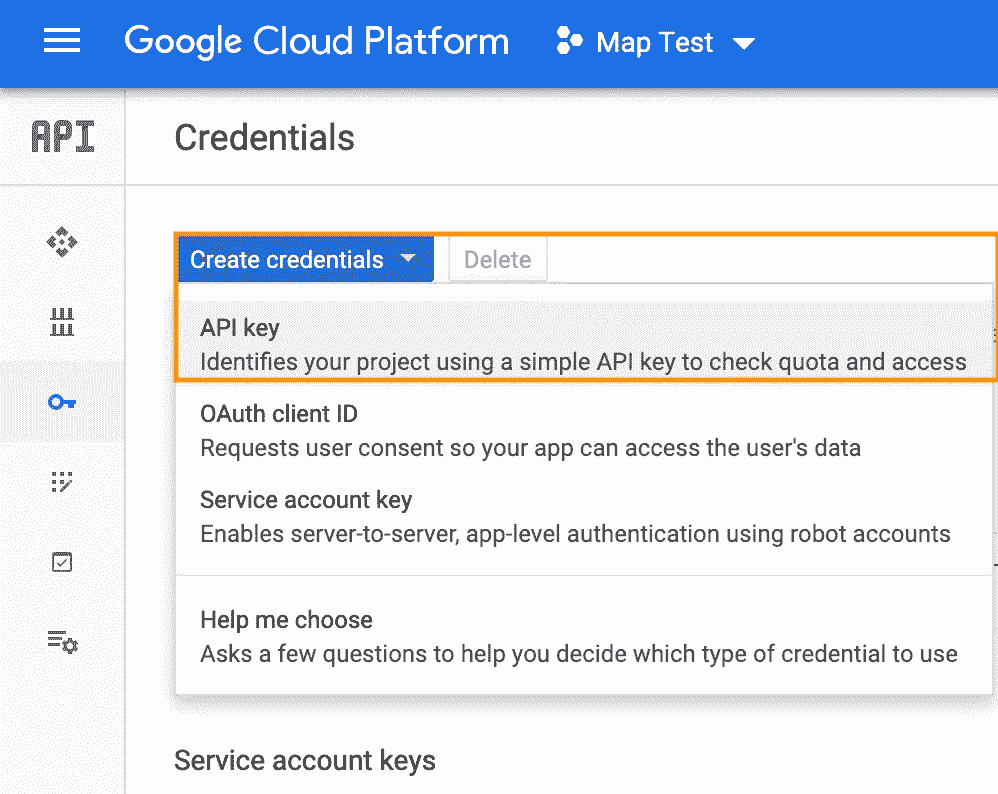

# 在 JavaScript 前端呈现谷歌地图

> 原文：<https://medium.com/analytics-vidhya/rendering-a-google-map-in-a-javascript-front-end-part-i-a076420a9ee9?source=collection_archive---------1----------------------->

## 第一部分:Google Maps 项目和 Maps API 的安装和设置

我是一名新的程序员，目前是熨斗学校的学生，具有土地保护和空间建模的背景。学习软件开发的一个主要动机是希望培养我的能力，去创造新的、有用的工具，来帮助自然资源管理者和自然资源保护者的关键性工作。

由于我过去的大部分工作都是基于地图的，我知道我希望我作为一名程序员的第一个项目是将交互式网络地图与实际应用结合起来。当面临用 JavaScript 前端创建 Rails 应用程序的挑战时，我决定使用 Google Maps JavaScript API 来构建一个工具，以帮助消防员和林务员跟踪野火并计划规定的燃烧。


# 谷歌云平台上的项目设置

在开始使用 Google Maps API 进行任何开发之前，我首先需要完成一些关键任务:

1.  在[谷歌云平台](https://cloud.google.com/console/google/maps-apis/overview)上创建一个谷歌地图项目
2.  选择一套谷歌地图产品应用到项目中
3.  获取 API 密钥
4.  启用项目计费

***创建谷歌云项目***

我首先在谷歌云平台上创建了一个账户。为了向我的帐户添加一个新项目，我导航到主页上的项目下拉菜单，


点击随后屏幕上的“新建项目”按钮，


并为新项目命名(可以选择将其分配到一个组织文件夹中)。


***选择谷歌地图产品套件***

随着一个新项目的创建，我需要仔细考虑，具体来说，我希望这个项目完成什么。我描绘了一个清晰的用户场景—我想用实时 wildfire 点数据填充地图，并让最终用户能够在地图上导航并与该数据交互。此外，我希望目标终端用户(例如，野火战斗人员和护林员)能够围绕每个野火点绘制持久的可编辑多边形，以在空间上表示火灾的当前范围。最后，我希望地图在渲染时自动地理参考用户的位置，以使绘制精确的多边形更简单。

Google Maps JavaScript API 提供了三组不同的产品和工具，开发者可以将它们应用到云平台的项目中:

1.  [**地图**](https://cloud.google.com/maps-platform/maps/) **:** 使开发人员能够向应用程序添加交互式地图，包括街景图像和 360 度全景图。
2.  [**路线**](https://cloud.google.com/maps-platform/routes/) **:** 让您的用户确定从一点到另一点的最有效路径。路线包还提供导航和实时交通更新。
3.  [**地点**](https://cloud.google.com/maps-platform/places/) **:** 允许用户使用电话号码和地址查找特定地点。Places 包包括额外的 API，这些 API 提供将地址地理编码到特定坐标的能力，并使用手机信号塔和 WiFi 节点数据返回设备的位置。

创建新项目时，系统会提示我选择希望项目访问的工具集。基于我设定的用户故事和目标，我认为地图和地点包都是必要的。

***获取 API 密钥***

为了在应用程序中渲染地图，我首先需要生成一个特定于我的 Google Cloud 帐户和项目的 API 密钥。为了创建一个新的 API 密钥，我导航回到了 [Google 云平台](https://cloud.google.com/console/google/maps-apis/overview)。在汉堡包菜单中，我选择了“API&服务”菜单中的“凭证”选项。


在随后的页面上选择“Create credentials”下拉菜单并选择“API key”生成了一个惟一的键，我保存了这个键以供参考，并在为我的应用程序构建 HTML 时使用。



***启用项目计费***

Google Maps JavaScript API 要求您输入信用卡信息并确认账单政策，然后才能在应用程序中使用产品。一个项目的每月总费用由所使用的谷歌地图产品和应用程序的使用情况决定。从[谷歌地图平台计费页面](https://developers.google.com/maps/billing/gmp-billing):

> 跟踪每个产品 SKU 的使用情况。
> 
> SKU 是产品 API +被调用的服务或功能的组合(例如，位置 API-位置细节)。
> 
> 一个产品可能有多个按不同费率计费的 SKU(例如，Places API—Place Details；Places API —自动完成—按请求)。
> 
> SKU 定价根据使用量分为三个等级:0-100，000 英镑；100,001–500,000;500,001+.
> 
> 成本的计算方法是 SKU 使用率 x 每次使用的价格。

# 渲染地图

***创建文件结构***

在浏览器中渲染地图需要两个关键文件:

1.  **index.html**:规定网页的基本结构和流程，通过容纳 API 键作为到谷歌地图 API 的链接，并通过回调函数初始化地图渲染。
2.  **index.js** :存放地图初始化函数和渲染时要执行的任何操作。

***构建 HTML***

我在 HTML 文件中包含了以下组件:

1.  在文件的顶部，我将文档的内容声明为 HTML5:

```
<!DOCTYPE html>
```

2.在文件的开头，我描述了文档的元数据，并给应用程序起了一个标题，如下所示:

```
<html lang="en" dir="ltr">
  <head>
    <meta
       charset="utf-8"
       name="viewport"
       content="width=device-width,
       initial-scale=1,
       shrink-to-fit=no">
    <title>Wildfire Tracker</title>
  </head>
```

3.我还创建了一个相关的 CSS 样式表，并使用 bootstrap(一个开源的样式工具包)来增强我的应用程序的外观。我在 head 标记中包含了样式表和 Boostrap CDN 的链接。

4.地图本身保存在 HTML 文件的 body 标签中。在使用 bootstrap 在页面顶部创建了 h1 和一个简单的导航栏之后，我为地图本身创建了一个占位符 div。

```
<div class="map-container">
   <div class = "map" id="map"></div>
</div>
```

5.在主体的底部，我链接到了相关的 JavaScript 文件 index.js。

```
<script src="src/index.js" type="text/javascript"></script>
```

6.最后，我包含了对一个 Google 文件的调用，该文件保存了 Google Maps JavaScript API 中包含的所有符号和定义。这个脚本标记还传递我生成的个性化 API 键，如上所述，以访问相关数据。此外，“callback”关键字引用了我的 JavaScript 文件中的一个函数，该函数设置要呈现的地图的属性。“Async defer”指定当页面的其余部分完成解析时，应执行脚本标记的内容。一旦 API 准备好了，它就调用回调参数中指定的函数(这里是 initMap)

```
<script
   async defer src="[https://maps.googleapis.com/maps/api/js?key={YOUR](https://maps.googleapis.com/maps/api/js?key={YOUR) API KEY}
   callback=initMap&libraries=drawing"
   type="text/javascript">
</script>
```

***用 JavaScript 渲染地图***

地图的核心功能和样式保存在一个初始化函数中，该函数在 HTML 文件呈现时执行。首先，调用一个函数并创建一个新的 Google Maps 元素，如下所示:

```
function initMap() {
    let map = new google.maps.Map(
      document.getElementById('map'){
```

该功能还保存地图上包含的每个元素的所需样式，如项目设置时在谷歌云平台中选择的谷歌地图产品所指示的。因为我希望明亮的 wildfire 点数据与底图形成良好的对比，所以我选择了我建立的暗模式样式，如下所示:

```
styles: [
 {elementType: 'geometry', stylers: [{color: '#242f3e'}]},
 {elementType: 'labels.text.stroke', stylers: [{color: '#242f3e'}]},
 {elementType: 'labels.text.fill', stylers: [{color: '#746855'}]},
 {
    featureType: 'administrative.locality',
    elementType: 'labels.text.fill',
    stylers: [{color: '#d59563'}]
  },
  {
    featureType: 'poi',
    elementType: 'labels.text.fill',
    stylers: [{color: '#d59563'}]
   },
   {
    featureType: 'poi.park',
    elementType: 'geometry',
    stylers: [{color: '#263c3f'}]
   },
   {
    featureType: 'poi.park',
    elementType: 'labels.text.fill',
    stylers: [{color: '#6b9a76'}]
   },
   {
    featureType: 'road',
    elementType: 'geometry',
    stylers: [{color: '#38414e'}]
   },
   {
    featureType: 'road',
    elementType: 'geometry.stroke',
    stylers: [{color: '#212a37'}]
   },
   {
    featureType: 'road',
    elementType: 'labels.text.fill',
    stylers: [{color: '#9ca5b3'}]
   },
   {
    featureType: 'road.highway',
    elementType: 'geometry',
    stylers: [{color: '#746855'}]
   },
   {
    featureType: 'road.highway',
    elementType: 'geometry.stroke',
    stylers: [{color: '#1f2835'}]
   },
   {
    featureType: 'road.highway',
    elementType: 'labels.text.fill',
    stylers: [{color: '#f3d19c'}]
   },
   {
    featureType: 'transit',
    elementType: 'geometry',
    stylers: [{color: '#2f3948'}]
   },
   {
    featureType: 'transit.station',
    elementType: 'labels.text.fill',
    stylers: [{color: '#d59563'}]
   },
   {
    featureType: 'water',
    elementType: 'geometry',
    stylers: [{color: '#17263c'}]
   },
   {
    featureType: 'water',
    elementType: 'labels.text.fill',
    stylers: [{color: '#515c6d'}]
   },
   {
    featureType: 'water',
    elementType: 'labels.text.stroke',
    stylers: [{color: '#17263c'}]
   }
  ]
})
```

在同一个初始化函数中，我还让我的最终用户能够访问 Google Maps [绘图管理器](https://developers.google.com/maps/documentation/javascript/examples/drawing-tools)，并引入了地理定位，使用用户的位置作为地图中心来呈现界面。

在我的下一篇文章中，我将讨论使用 Google Maps JavaScript API 和 Ruby on Rails 后端对各种类型的数据进行渲染、持久化和执行完整的 CRUD 操作。