# 用 ChexNet 替换 YoloV3 主干用于肺炎检测

> 原文：<https://medium.com/analytics-vidhya/replacing-yolov3-backbone-with-chexnet-for-pneumonia-detection-a29434a698b7?source=collection_archive---------3----------------------->

## 构建深度学习模型，自动检测和定位**胸片(CXR)** 上潜在的肺炎肺部阴影。

# 商业问题

在全球范围内，5 岁以下儿童的死亡中，肺炎占了 15%以上。2015 年，有 92 万名 5 岁以下儿童死于该疾病。在美国，2015 年，肺炎导致超过 500，000 次急诊和超过 50，000 例死亡，使这种疾病成为该国十大死亡原因之一。

虽然常见，但准确诊断肺炎是一项艰巨的任务。它需要由训练有素的专家对**胸片(CXR)** 进行审查，并通过临床病史、生命体征和实验室检查进行确认。肺炎通常表现为 CXR 上一个或多个区域**的不透明增加。然而，在 CXR 上肺炎的诊断是复杂的，因为肺部有许多其他情况，如液体超载(肺水肿)、出血、容量损失(肺不张或虚脱)、肺癌、或放疗后或手术后的变化。在肺外，胸膜腔内的液体(胸腔积液)在 CXR 上也表现为阴影增加。如果可以的话，在不同时间点对患者的 CXRs 进行比较，并与临床症状和病史相关联，有助于做出诊断。**

CXRs 是最常进行的诊断成像研究。许多因素，如患者的体位和吸气深度，会改变 CXR 的外观，使解释更加复杂。此外，临床医生每次轮班都要阅读大量图像。

我们的目标是建立一个深度学习模型，以检测医学图像中肺炎的视觉信号。具体来说，我们的模型需要自动定位胸片上的肺部阴影，从而帮助临床医生以高准确度和高效率检测和诊断肺炎。

为了实现上述目标，我们将 YoloV3 主干模型(即 DarkNet53)替换为 ChexNet(在胸部 x 光片上训练),并使用 ChexNet 主干重新训练整个 YoloV3 模型。

> 先决条件:-读者必须了解 YoloV3 模型的架构和功能及其基本概念，即:锚框，边界框，非最大抑制。

## 接下来讨论什么！！

因为这是一篇详细的文章，所以最好列出这篇文章中涉及的要点(如果你想忽略这个理论，可以直接跳到第 7 点)。

1.  **深度学习/计算机视觉的使用:-** 讨论了如何将这个问题提出来作为深度学习或计算机视觉问题。
2.  **数据来源:-** 提供了数据来源和对每个文件内容的深入解释。
3.  **评估指标:-** 解释了评估指标&对于给定问题的重要性。
4.  **探索性数据分析:-** 对数据进行分析，直观了解其广度&深度。
5.  **现有方法:-** 解释了此问题的现有解决方案。
6.  **第一次切割方法**:-解释了我解决这个问题的方法。
7.  **训练 ChexNet(二值图像分类模型):-** 讲解建模&训练 ChexNet (DensNet121)二值图像分类模型，将胸片分类为肺炎阳性或阴性。
8.  **使用 ChexNet 模型替换 YoloV3 主干并对其进行重新训练:-** 提供了关于如何使用 ChexNet (DensNet121 在胸片上训练)替换 YoloV3 主干(DarkNet53)并对其进行重新训练以进行肺炎混浊度检测的深入解释。
9.  未来的工作:- 讨论了我们未来可以做些什么来更好地解决这个问题。
10.  **Github Repo:-** 提供了到 Github 存储库的链接来访问全部代码。

# **深度学习/计算机视觉的使用**

随着成功的实验结果和广泛的应用，深度学习(DL)有可能改变医疗保健的未来。人工智能(AI)的使用已经变得越来越流行，并且现在被用于例如癌症诊断和治疗。计算机视觉的深度学习可以实现更精确的医学成像和诊断，本案例研究是其中的一部分

# **数据来源**

## 我需要什么文件？

我们将需要当前阶段的图像—提供为`stage_2_train_images.zip`和`stage_2_test_images.zip`。我们还需要训练数据——`stage_2_train_labels.csv`——和样本提交，它提供了测试集的 id，以及我们提交的样本应该是什么样子。文件`stage_2_detailed_class_info.csv`包含关于训练集中的正类和负类的详细信息，并且可以用于建立更细微的模型。

## 我应该期待什么样的数据格式？

训练数据以一组`patientIds`和`bounding boxes`的形式提供。边界框定义如下:`x-min` `y-min` `width` `height`还有一个二元目标列，`Target`表示肺炎或非肺炎。每个`patientId`可能有多行。

## 文件描述([下载](https://www.kaggle.com/c/rsna-pneumonia-detection-challenge/data))

***stage _ 2 _ train _ images . zip***

*   由 DICOM 格式的 26684 幅胸部 x 光图像组成，用于模型训练。
*   DICOM 文件是以医学数字成像和
    通信(DICOM)格式保存的图像。它包含来自医学扫描的图像，如超声波或核磁共振成像。DICOM 文件还可能包含患者的识别数据，以便将图像与特定的个人相关联。

***stage _ 2 _ test _ images . zip***

*   由 3000 张 DICOM 格式的胸部 x 光图像组成。

***stage _ 2 _ train _ labels . CSV(30227 x 6)***

*   `**patientId**` —一个患者 Id。每个患者 Id 对应一个
    唯一图像。
*   `**x**` —边界框的左上角 x 坐标。
*   `**y**` —边界框的左上角 y 坐标。
*   `**width**` —边界框的宽度。
*   `**height**` —边界框的高度。
*   `**Target**` —二元目标，表示该样本
    是否有肺炎的迹象。

***stage _ 2 _ detailed _ class _ info . CSV(30227 x 2)***

*   `**patientId**` —一个患者 Id。每个患者 Id 对应一个
    唯一图像。
*   `**class**` —告知患者肺部状况
    (即:-正常，无肺部阴影/不正常，肺部阴影)

***【stage _ 2 _ sample _ submission . CSV(3000 x 2)***

*   `**patientId**` —一个患者 Id。每个患者 Id 对应一个
    唯一图像。
*   `**PredictionString**` —由预测置信度
    &包围盒信息组成。

# **评估指标**

*   并集上的交集(IoU):-
    并集上的交集是两个边界框(或者，在更一般的情况下
    两个对象)之间重叠的
    大小的度量。它计算两个对象
    之间重叠的大小，除以两个对象
    合并的总面积。
    它可以被形象化为以下内容:

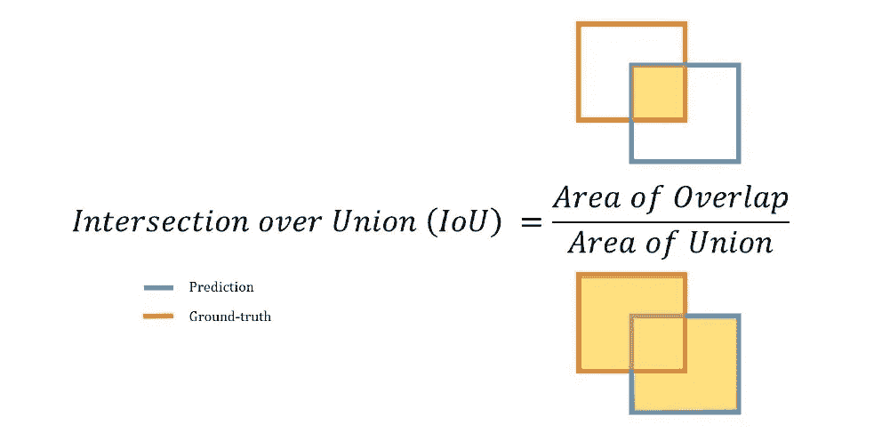

并集上的交集

*   可视化中的两个框重叠，但是
    重叠的区域与两个
    对象一起占据的区域相比是微不足道的。欠条会很低——在欠条阈值较高的情况下，可能不会将
    算作“命中”。

# **探索性数据分析**

## 不透明和不透明的 CXR 图像样本

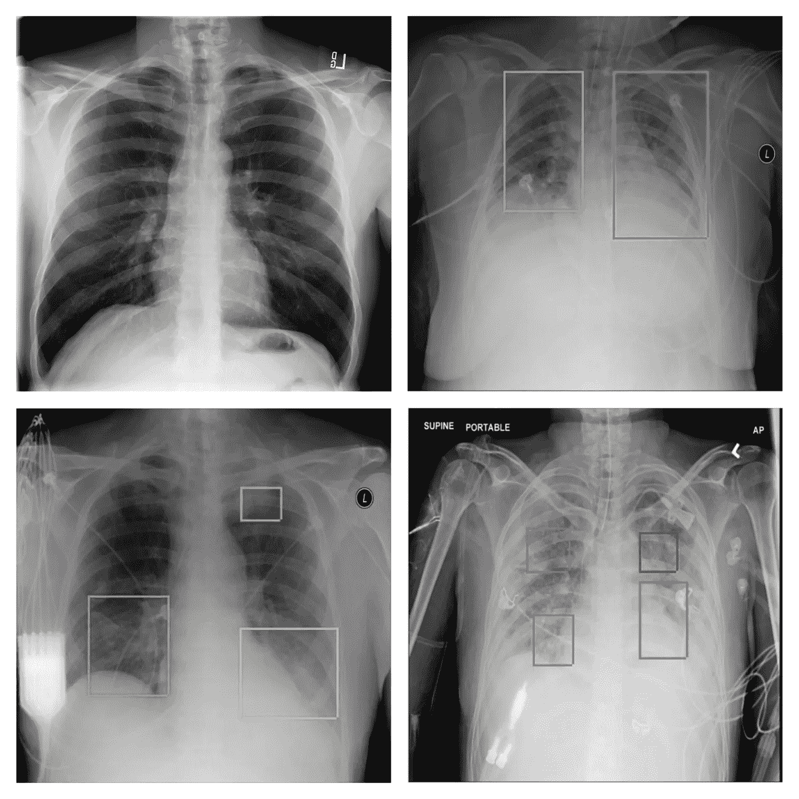

有和没有不透明的 CXR 图像

> **观察:-**
> 
> 在训练数据集中，我们有 26684 个独特患者的数据。
> 
> 不透明度的最小值是 1。
> 
> 不透明度的最大数量是 4。

## 阶级不平衡

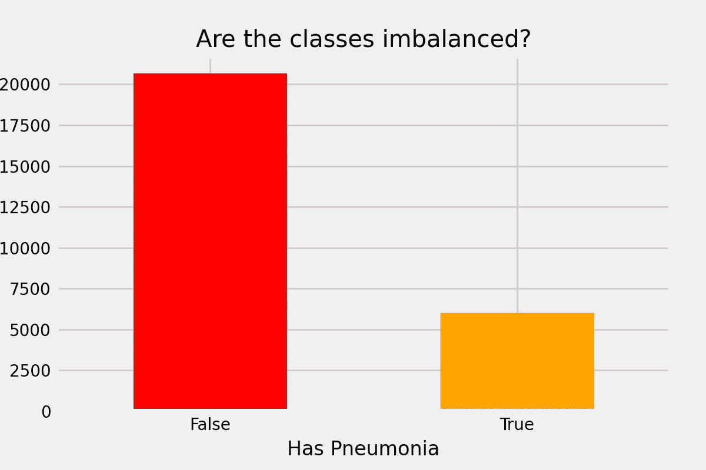

阶级不平衡

> **观察:-**
> 
> 从图中可以明显看出数据是高度不平衡的。
> 
> 大约有 5000 个积极点和 20000 个消极点。
> 
> 不平衡比例几乎是 4:1(负:正)
> 
> 不平衡背后的原因是有将近 11000 个数据点被分类为无肺部阴影/不正常，但是这些点也被认为是阴性的。

## 边界框 X 坐标

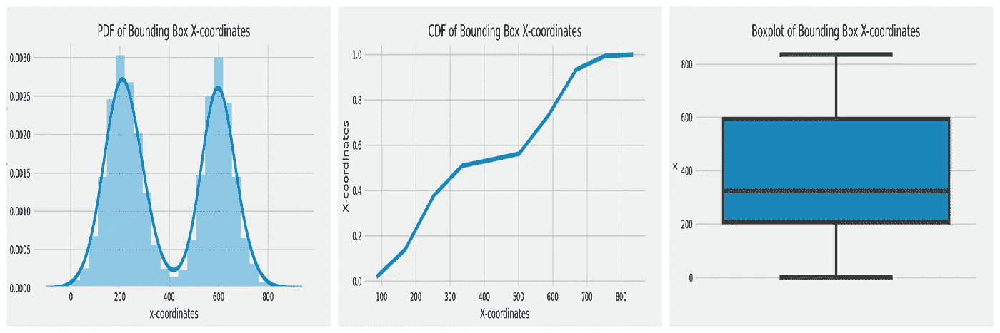

边界框 X 坐标

> **观察:-**
> 
> 我们在 x 坐标的 PDF 中得到的双钟曲线是由于肺的位置(因为不透明度边界框仅在肺上)。
> 
> 与没有肺的区域相比，穿过肺的 x 坐标具有较高的值。
> 
> 我们得到的 x 坐标范围是从 0 到 800。
> 
> 几乎 99%的 x 坐标值小于 750。
> 
> 我们得到的 IQR(四分位范围)是从 200(第 25 百分位)到 600(第 75 百分位)。
> 
> 我们得到的中间值是 300(大约)

## 边界框 y 坐标

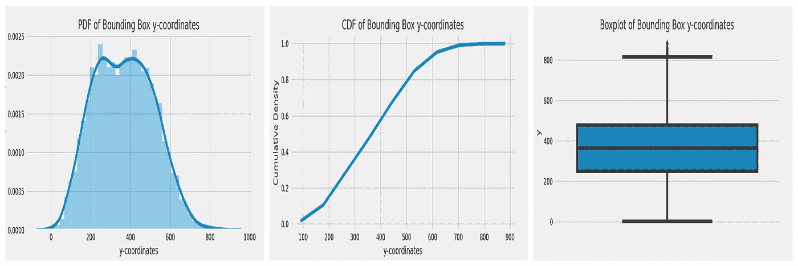

边界框 y 坐标

> **观察:-**
> 
> 我们可以在曲线中间观察到的下降是由于胸部的中心，因为在中心没有肺(边界框只在肺上)。
> 
> 我们得到的最小值和最大值分别是 0 和 800。
> 
> 几乎 99%的值都在 100 到 700 之间。
> 
> 我们得到的 IQR(四分位数范围)是从 250(第 25 百分位)到 500(第 75 百分位)。
> 
> 我们得到的中间值是 350(大约)。
> 
> 某些异常值也高于 800。

## 边界框宽度

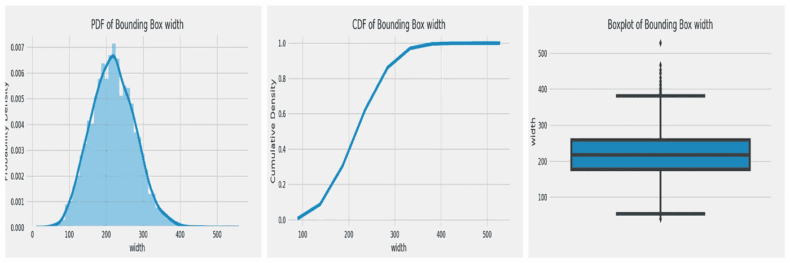

边界框宽度

> **观察:-**
> 
> 我们得到的边界框宽度的 PDF 是近似正态分布的。
> 
> 我们得到的最小和最大值是 50 和 400，某些异常值在 400 以上。
> 
> 几乎 99%的值都小于 350。
> 
> 我们得到的 IQR(四分位距)分别是从 175 到 275。
> 
> 我们得到的中间值是 225(大约)。

## 边界框高度

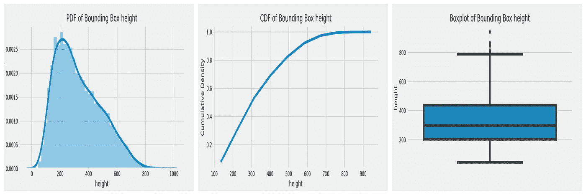

边界框高度

> **观察:-**
> 
> 我们得到的边界框高度的 PDF 是正倾斜的。
> 
> 我们得到的最小和最大值是 0 和 800，某些异常值在 800 以上。
> 
> 几乎 99%的值都小于 700。
> 
> 我们得到的 IQR(四分位距)分别是从 200 到 450。
> 
> 我们得到的中间值是 300(大约)。

## 边界框区域

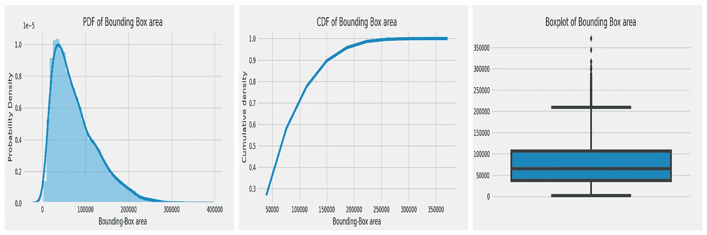

边界框区域

> 观察:-
> 
> 我们得到的包围盒包围盒区域的 PDF 是正倾斜的。
> 
> 我们得到的一般最小值和最大值分别是 0 和 200000 像素。
> 
> 几乎 99%的价值低于 250000。
> 
> 我们得到的 IQR(四分位距)分别是从 25000 到 100000。
> 
> 200000 以上有一定的离群值。

## 边界框纵横比

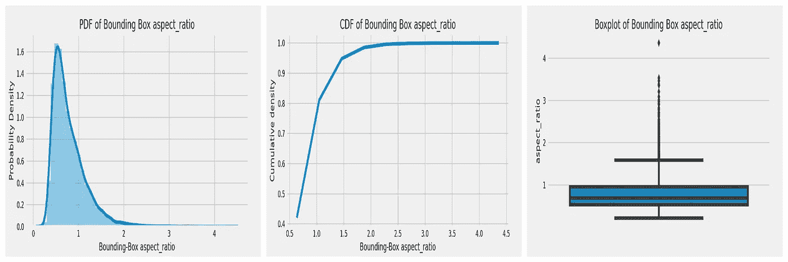

边界框纵横比

> 观察:-
> 
> 我们得到的包围盒包围盒区域的 PDF 是正倾斜的。
> 
> 我们得到的一般最小值和最大值分别是 0 和 2。
> 
> 几乎 99%的值都小于 2。
> 
> 我们得到的 IQR(四分位距)分别是从 0.5 到 1。
> 
> 1.75 以上有一定的离群值。

## 患者年龄

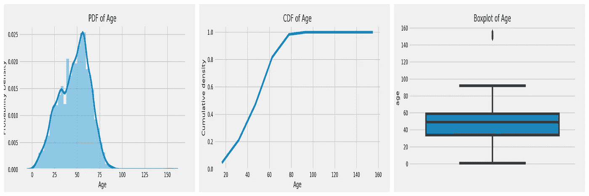

患者年龄

> 观察:-
> 
> 病人的年龄范围从 15 岁到 95 岁。
> 
> 在 140 年和 160 年之间有一些值肯定是异常值。
> 
> 30 岁至 95 岁的年龄组极易患这种疾病。
> 
> IQR 范围分别为 30 至 60 岁。
> 
> 患者的平均年龄为 50 岁。

## 按性别和目标分列的年龄分布

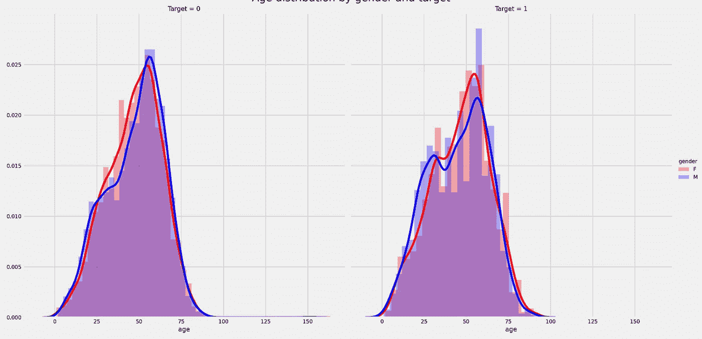

按性别和目标分列的年龄分布

> **观察** :-
> 
> 对于 Target=0 和 Target=1，两种性别的分布完全重叠。
> 
> 这两个关系看起来几乎相同，这解释了 Target = 0 和 Target = 1 在年龄方面遵循相同趋势的事实。
> 
> 它解释了疾病和遗传之间没有任何特定关系的事实。
> 
> 甚至当我们将这个基于目标和目标的图与上面解释的基于总年龄的图进行比较时，我们可以很容易地观察到，无论目标和目标如何，两者都遵循相同的趋势。

## 边界框质心图(检测边界框的异常值)

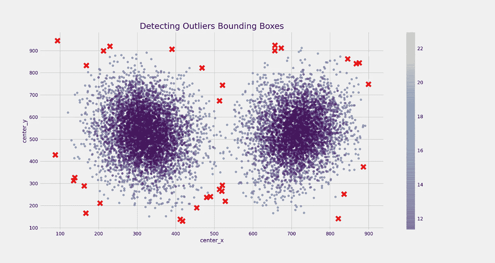

边界框质心图(检测边界框的异常值)

> **观察:-**
> 
> 我们可以观察到两个肺的中心区域是高度密集的，具有最大数量的包围盒质心。
> 
> 一旦我们远离中心，包围盒的密度就逐渐减小。
> 
> 我们在肺部边缘看到的红叉是异常值。
> 
> 通过去除这些异常值，我们可以消除异常值的影响。

## 长宽比与面积

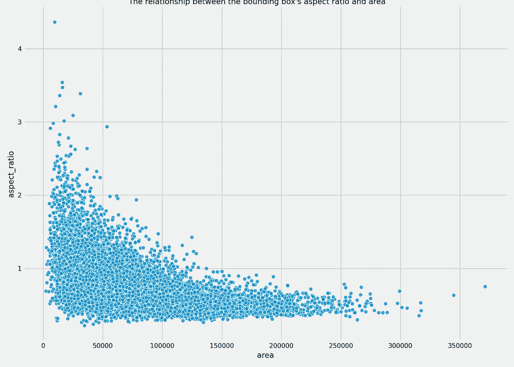

长宽比与面积

> **观察:-**
> 
> 该图描绘了边界纵横比和面积之间的反比关系。
> 
> 纵横比一增加，面积就减小，反之亦然。
> 
> 具有最大高度的边界框具有较小的宽度&反之亦然。
> 
> 某些边界框具有非常高的椭圆率。

# **现有方法**

## [胸片中的肺炎检测深度放射学
团队](https://arxiv.org/abs/1811.08939)

*   CoupleNet 构成了检测算法的基础。虽然
    回顾了几种开源对象检测架构
    ，但是从实验中发现 CoupleNet
    产生了最强的结果。
*   在 CoupleNet 中，图像通过基础网络传递，基础网络
    将图像输入区域建议网络(RPN)以生成
    建议。每份提案都被传递给两个分支机构。第一个
    使用位置敏感感兴趣区域(PSRoI)池来
    捕获本地信息。第二个分支提取全局
    上下文信息。这两个分支的输出被合并
    以基于局部和全局
    信息生成预测。CoupleNet 架构图示如下
    所示:-

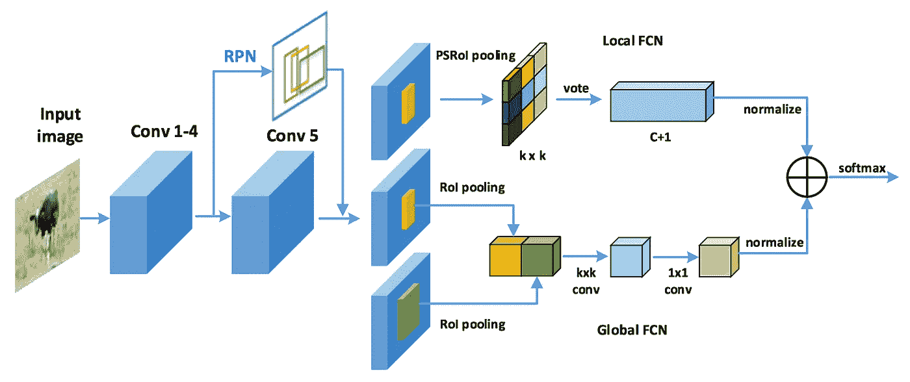

耦合网络体系结构

*   他们使用多任务损失端到端地训练他们的模型，并且
    在由训练集的
    10%分层样本组成的验证集上评估超参数。
*   在训练过程中，他们使用随机梯度下降(SGD)
    ，初始学习率为 0.001。这个学习率在 10 个时期
    下降了 90%,并且他们的模型在
    总共训练了 14 个时期。
*   他们将前景 IoU 阈值设置为 0.30，因此 ROI
    包含边界
    框坐标和类别分数的一小部分真实情况。
*   在训练期间，他们通过随机水平
    翻转以及批量内随机重新缩放来扩充数据。
*   最终预测由在整个训练集上训练的四个模型
    的集合生成。每个模型都产生
    独特的预测，其中，他们只考虑置信阈值为 0.50 或以上的边界
    框。
*   三个因素在他们的最终竞赛得分中发挥了重要作用，最终在 RSNA
    肺炎检测挑战赛中产生了一个获胜的解决方案。首先，选择一个具有全球和本地上下文的架构
    ，比如 CoupleNet，为生成准确的结果提供了额外的
    上下文。第二，在培训时使用合理的
    前景和背景提案阈值
    调整我们的网络，使其在竞争中表现出色。

## [CheXNet:通过 Pranav Rajpurkar &其他](https://arxiv.org/abs/1711.05225)的深度学习对胸部 x 光片进行放射科医师级别的肺炎检测

*   ChexNet 是一个 121 层的卷积神经网络，它输入一个
    胸部 x 光图像，并输出肺炎的概率
    以及一个热图，该热图定位图像中最能表明肺炎的区域
    。
*   他们使用密集连接和批量标准化来使
    这样一个深度网络的优化变得容易处理。
*   肺炎检测任务是二进制分类问题，
    其中输入是正面胸部 X 射线图像 X，
    输出是二进制标签 y，分别指示ε(0，1)肺炎的不存在或
    存在。
*   CheXNet 是在 ChestX-ray 14 数据集上训练的 121 层密集卷积网络(DenseNet)
    。
*   DenseNets 改善了通过网络的信息流和梯度，使得非常深的网络的优化变得容易处理。他们用一个有单一输出的
    取代了最后一个全连接层，之后他们应用了一个 sigmoid
    非线性。
*   网络的权重用来自 ImageNet 上预先训练的
    模型的权重初始化。使用具有标准参数(β 1 = 0.9 和
    β 2 = 0.999)的 Adam 对网络进行端到端训练
    。他们用 16 个小批量来训练这个模型。他们使用 0.001 的初始学习率，每次验证损失在一个
    时期后达到稳定状态时，该学习率就会衰减
    10 倍，然后选择验证损失最低的模型。
*   他们使用了由 Wang 等人
    (2017)发布的 ChestX-ray14 数据集，该数据集包含 112，120 张正面 X 射线图像，涉及
    30，805 名独特的患者。
*   使用放射学报告上的自动提取方法，用多达 14 种不同的胸部病理学
    标签对每张图像进行注释。
    将肺炎作为注释的
    病理之一的图像标记为阳性样本，将所有其他图像标记为
    阴性样本。对于肺炎检测任务，他们
    将数据集随机分为训练(28744 名患者，98637 张
    图像)、验证(1672 名患者，6351 张图像)和测试(389 名
    患者，420 张图像)。
    组之间没有患者重叠。在将图像输入网络之前，他们
    将图像缩小到 224x224，并根据 ImageNet 训练
    集中图像的
    平均值和标准偏差进行标准化。他们还通过随机水平翻转来增加训练数据。
*   CheXNet 在 ChestX-ray14 数据集中的所有 14 种
    病理上的表现优于已发表的最佳结果。在检测肿块、
    结节、肺炎和肺气肿时，CheXNet 比之前的最新结果多出
    > 0.05 AUROC，如下表
    所示:

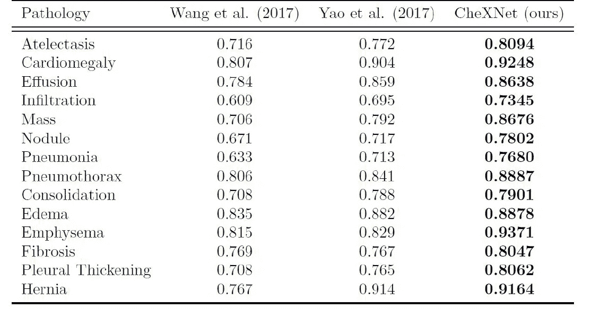

*   CheXNet 使用类别激活
    图对其识别的病理进行定位，该图突出显示了对特定病理分类最重要的 X 射线区域。每张图像的
    标题由一名实习
    放射科医生提供。

## [CNN 分割 Jonne 的连通分量内核](https://www.kaggle.com/jonnedtc/cnn-segmentation-connected-components)

*   卷积神经网络用于分割图像，
    直接使用边界框作为掩模。
*   连接组件用于分离
    预测肺炎的多个区域。
*   围绕每个连接的
    组件简单地绘制边界框。
*   该网络由多个具有
    卷积的残差块和具有最大池的下采样块组成。
*   在网络的末端，单个上采样层将
    输出转换为与输入相同的形状。
*   由于网络的输入是 256×256(而不是原来的
    1024×1024 ),并且网络在没有任何有意义的上采样的情况下多次
    下采样(最后的上采样只是
    以匹配 256×256 掩码),所以最终的预测非常粗略。如果
    网络向下采样 4 次，最终边界框可以
    仅改变至少 16 个像素。
*   数据集太大，内存容纳不下，使用生成器
    动态加载数据。
*   生成器接受一些文件名、batch_size 和其他
    参数。
*   生成器随机输出一批 NumPy 图像和
    NumPy 遮罩。
*   模型损失、准确性和 iou 得分图如下

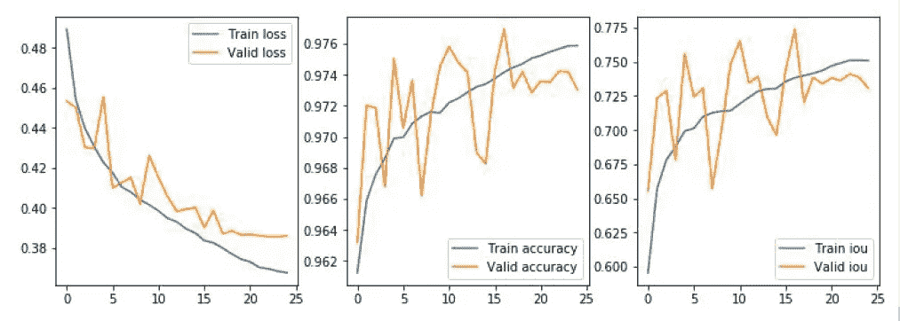

# **第一次切割方法**

1.  由于数据是高度不平衡的(几乎 4:1 的负比正比)，我们对少数类图像(正类)执行图像增强，以便两个类之间的比率变得几乎相等。
2.  我们采用预训练的 ChexNet 多类分类模型(因为 ChexNet 被训练用于 14 个类),并通过替换其最终密集层转换成二元分类模型(以对肺炎进行阳性和阴性分类)。
3.  我们冻结了 ChexNet(二元分类器)的最初几层。
4.  然后，我们使用自己的扩充数据重新训练 ChexNet(二元分类器)。
5.  我们保存了经过训练的 ChexNet(二元分类器)模型的权重。
6.  我们采用了用作 YoloV3 主干的 DarkNet53 架构，并将其与我们通过适当分析层输入和输出维度训练的 ChexNet(二进制分类器)模型进行了比较。
7.  然后我们将 YoloV3 中的 DarkNet53 模型替换为我们通过连接 ChexNet 作为 YoloV3 主干而训练的 ChexNet 模型。
8.  最后，我们以 ChexNet 为骨干，使用 Yolo-loss、锚盒和非最大值抑制对整个 YoloV3 进行重新训练，得到最终的不透明度包围盒预测。

# **训练 ChexNet(二值图像分类模型)**

## 数据预处理

**DICOM 到 JPG 的转换:-**

*   由于图像存在于* **。DCM**(DICOM-医学数字成像和通信)格式，我们必须转换成 jpg 或 png 格式。
*   去表演。dcm 到。jpg 转换我们使用了以下函数:-

*   该函数返回一个包含图像目录和目标值(类别标签)的数据帧，这对`ImageDataGenerator`很有用。

**图像增强:-**

*   由于图像的形式非常不均衡，我们使用来自`albumentation`库的`transform`对象对少数族裔图像进行了图像增强，如下所示

*   上面的函数执行扩充并返回一个包含图像目录和目标(类标签)的`DataFrame`，它将在`ImageDataGenerator`中使用。
*   最后，我们将扩充的数据与原始可用数据相结合。

**创建** [**图像数据生成器**](https://www.tensorflow.org/api_docs/python/tf/keras/preprocessing/image/ImageDataGenerator) **用于模型训练:-**

*   使用`ImageDataGenerator`的原因是我们的数据集很大，无法放入 ram，ImageDatagenerator 让我们很容易，因为它在模型训练时读取图像，因此很有效。
*   之前，我们将原始数据和增强数据结合起来，创建了一个包含图像目录和两个原始图像的目标(类标签)的`DataFrame`增强图像，它在`ImageDataGenerator`的`flow_from_dataframe`方法中使用，如下所示

## 创建模型

*   我们首先使用`DenseNet121` `tensorflow`创建 ChexNet 基本模型(14 类)，以便加载[可用权重](https://github.com/brucechou1983/CheXNet-Keras)(因为模型权重可用于 14 类分类模型，而不可用于我们的二元分类器):-

*   我们冻结了`base_model`的最初几层，因为我们拥有的初始权重也来自使用胸片数据训练的模型:-

*   然后使用上面的`base_model`我们创建了我们的 ChexNet(二进制分类器)，用一个单元`Dense`层替换最后的密集层

*   我们使用`accuracy`和`f1_score`作为带有`adam`优化器和`binary_crossentropy`损失的指标。
*   ChexNet(二进制分类器)模型总结如下(它很长，但如果不包括它，我们将无法获得要点):-

*   您可能已经观察到模型的输入维度为`416x416`，这是因为 YoloV3 的输入维度也是`416x416`，我们将使用这个模型作为 YoloV3 的主干。

## 模型性能

**精度与历元:-**

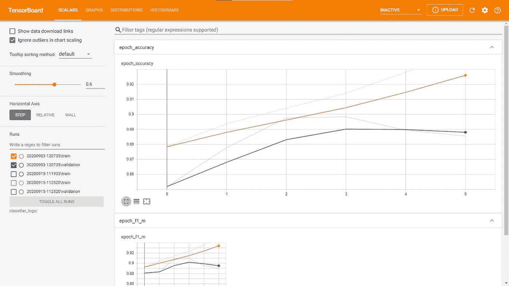

**F1 _ 分数 vs 纪元:-**

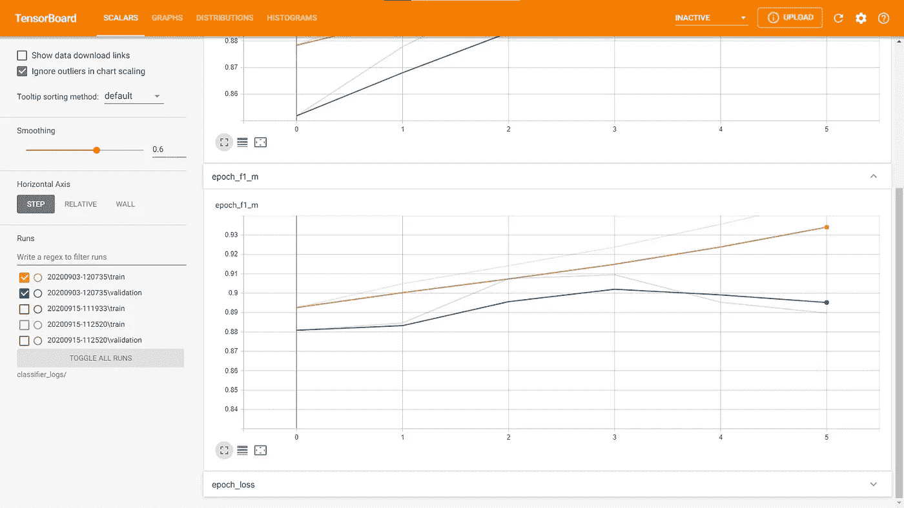

**损失对比纪元图:-**

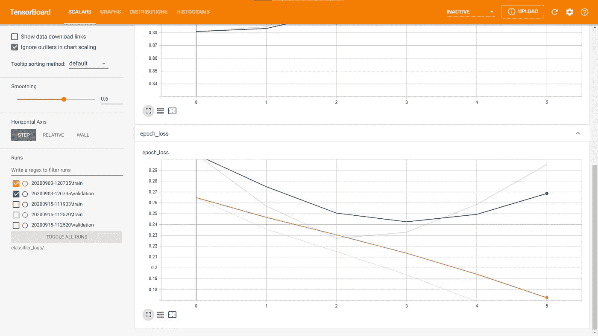

*   我们得到的最好的模型性能是第 3 历元的 **val_loss: 0.2554，val_accuracy: 0.8832，val_f1_m: 0.8658** 。

# **用 ChexNet 模型替换 YoloV3 主干网并对其进行重新训练**

## 数据预处理

**将数据格式化为**[**Pascal VOC**](http://host.robots.ox.ac.uk/pascal/VOC/)**格式&创建 TFRecords:-**

*   由于我们已经利用了张子豪的 YoloV3 实现( [GitHub](https://github.com/zzh8829/yolov3-tf2) )，我们必须将我们的数据集转换成 [Pascal VOC](http://host.robots.ox.ac.uk/pascal/VOC/) 对于每个 CXR 图像，我们必须创建以下格式的 XML 注释文件:-

*   为了为每个 CXR 图像创建上述注释文件，我们实现了以下函数:-

*   我们必须创建一个. names 文件，在新的一行中包含每个类的名称，因为在我们的例子中，我们只有一个类“opacity”。
*   我们必须创建两个文件文本文件，第一个包含训练 CXR 图像的名称，第二个包含验证 CXR 图像的名称(名称应该没有扩展名)
*   我们必须遵循指定的目录结构 [Pascal VOC](http://host.robots.ox.ac.uk/pascal/VOC/) 格式。
*   最后，我们必须使用张子豪( [GitHub](https://github.com/zzh8829/yolov3-tf2) )提供的脚本将数据集转换成训练和验证 [TFRecords](https://www.tensorflow.org/tutorials/load_data/tfrecord)

**生成锚盒:-**

*   我们已经使用使用了 k-means 算法的[这个](https://github.com/AlexeyAB/darknet/blob/master/scripts/gen_anchors.py)脚本为我们的数据生成了锚定框，但是要使用该脚本，我们必须为我们的每个 CXR 图像创建文本文件，该文件包含边界框信息，其格式为每个边界框信息应该是(**object_class x _ mid y _ mid width height)**其中 object _ class 是对象的类索引，x_mid & y_mid 是边界框的中心坐标，所有这些值都应该标准化。
*   为了将我们的数据转换成上述格式，我们实现了以下函数:-

*   在上述转换之后，我们使用[脚本](https://github.com/AlexeyAB/darknet/blob/master/scripts/gen_anchors.py)来计算锚盒，我们得到的锚盒是:-

*   总共有 9 个锚盒，YoloV3 在 3 个尺度上执行检测，因此在每个尺度上使用 3 个锚盒。

## 在 YoloV3 中用 ChexNet 替换 DarkNet53

*   让我们首先观察输入形状为`416x416`的 DarkNet53 模型的概要

*   让我们观察暗网 53 的输出形状

*   正如我们可以从 DarkNet53 返回的输出形状中观察到的，我们得到了三种形状的输出，即(52，52，256)，(26，26，512)和(13，13，1024)，所有这三种输出都被传递给 YoloV3 前端模型。
*   让我们将它与以下三层 ChexNet 返回的输出进行比较

*   我们可以观察到上面三层 **ChexNet** 的输出与 **DarkNet 的输出完美匹配。**
*   我们要做的是修改 ChexNet 的输出，使其返回上述三层的输出，这就是我们在以下函数中所做的

*   `chexnet_weights`是我们训练 ChexNet 二元分类模型后得到的权重。
*   为了得到特定层的输出，我们使用了 tf.keras.Model API 的`[get_layer()](https://www.tensorflow.org/api_docs/python/tf/keras/Model#get_layer)`方法。
*   为了将上述 ChexNet 主干与 YoloV3 连接起来，我们修改了张子豪( [GitHub](https://github.com/zzh8829/yolov3-tf2) )的如下函数

*   我们传递了一个带有值`darknet`和`chexnet`的参数`backbone`，以保持它的模块化，并相应地改变 YoloV3 的主干。
*   要获得带有 ChexNet 主干的 YoloV3 模型，我们必须做的是用`backbone=’chexnet’`调用上面的`YoloV3`函数。
*   这就是我们如何用 ChexNet 替换 YoloV3 主干 DrakNet 的。

## 比较 YoloV3_DarNet 和 YoloV3_ChexNet

*   让我们观察一下 YoloV3_DarkNet 模型的概要:-

*   现在让我们观察一下 YoloV3_ChexNet 模型的概要:-

*   比较 YoloV3_DarkNet 和 YoloV3_ChexNet 的参数:-

*   正如我们所观察到的，yolov3_chexnet 中的参数数量几乎是 yolov3_darknet 的一半，因此 yolov3_chexnet 非常轻便，训练速度也很快。
*   另一件事是 DarNet53 是在 ImageNet 数据集上训练的，这就是为什么它在检测容易看到和区分的对象时工作得非常好，但是使用它来检测不可区分的肺炎阴影等问题是不可行的，因此在胸部 x 光照片上训练的 ChexNet 将是这个问题的完美选择。

## 培训 YoloV3_ChexNet

*   我们只使用正面图像训练 YoloV3_ChexNet，其背后的原因是 YoloV3 和大小为`416x416`的图像被细分为`13x13` `(as 416/32 = 13)`的网格，并对`13x13`网格的每个网格单元进行预测，如果锚盒的数量为`3`，则`13x13`网格中的每个网格单元也与`3`锚盒相关联，这使得总维度等于`13x13x3=507`。这意味着对于单个图像，我们进行`507`预测，并且即使图像是正面的并且其中存在`2`不透明度，我们也将只有`2`正面预测和`507–2 = 505`负面预测，因此已经存在大多数负面预测。如果我们再次将负面图像添加到模型中进行训练，这将使我们的模型偏向于负面类。这就是我们只使用正面图像来训练模型的原因。
*   转换后的训练特征和标签的形状如下

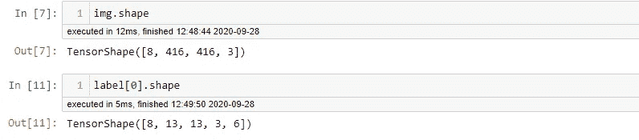

*   其中 8 是样本批次大小，416x416x3 是输入图像尺寸。
*   在标签中，8 是批量大小，13x13 是网格大小，每个网格单元与 3 个锚点相关联，对于每个锚点，我们有一个 6 维数组，用于边界框、对象和格式为 **(x_min，y_min，x_max，y_max，objectness_score，class)** 的类信息，在我们的示例中，只有一个类，如果有更多的类，则该数组的大小将随着类的增加而增加
*   我们使用为`epochs=30`、`batch-size=16`、`optimizer=adam`和`learning_rate=1e-3`和`loss=YoloLoss`生成的 TFRecods 来训练 YoloV3ChexNet

**车型性能:-**

*   纪元与损失图:-

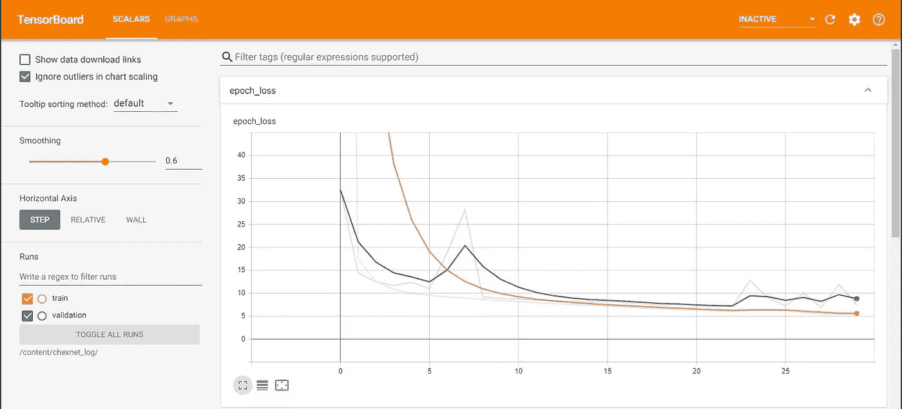

*   Epoch vs yolo_output_0_loss

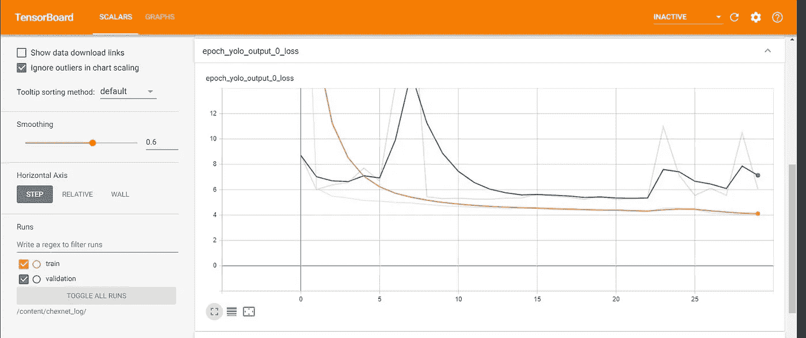

*   Epoch vs yolo_output_1_loss

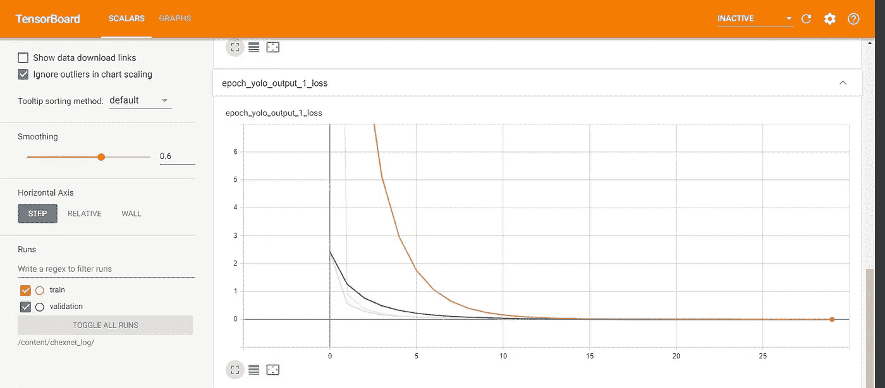

*   Epoch vs yolo_output_2_loss:-

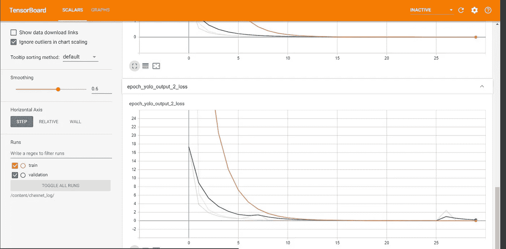

## 推理 YoloV3_ChexNet

*   在推断时，通过添加 lambda 层来修改模型的最终层，因为存在 Yolo _ boxes 和非最大抑制的额外计算。
*   在推理时，模型摘要如下所示

*   几个预测:-

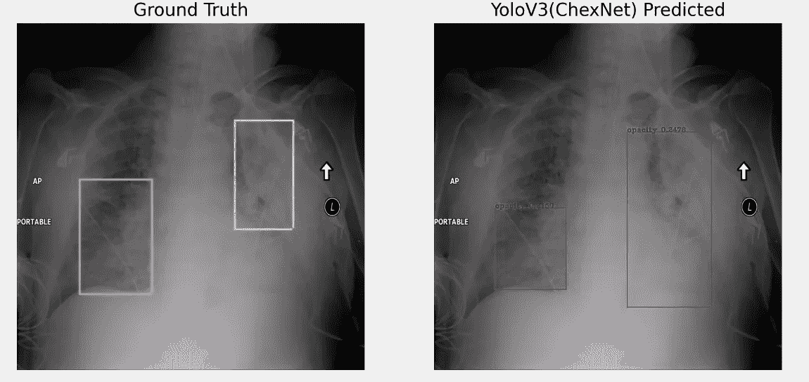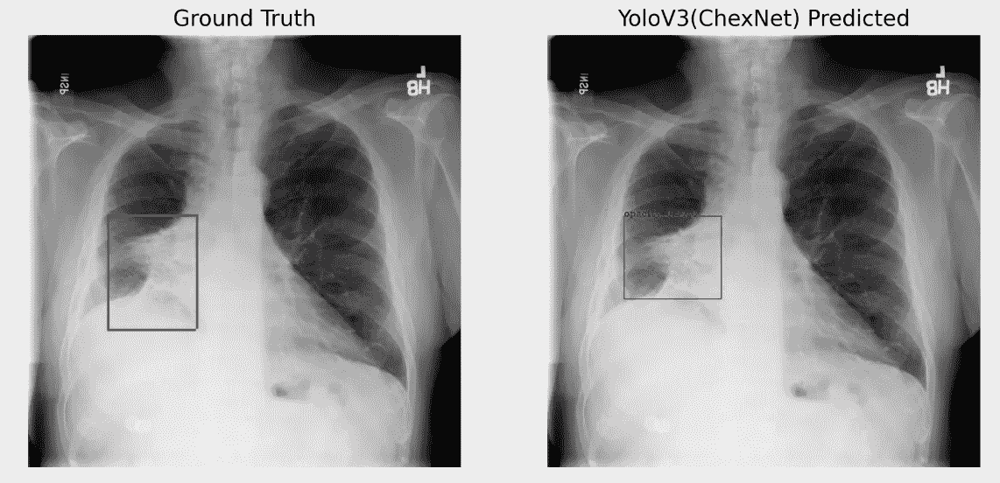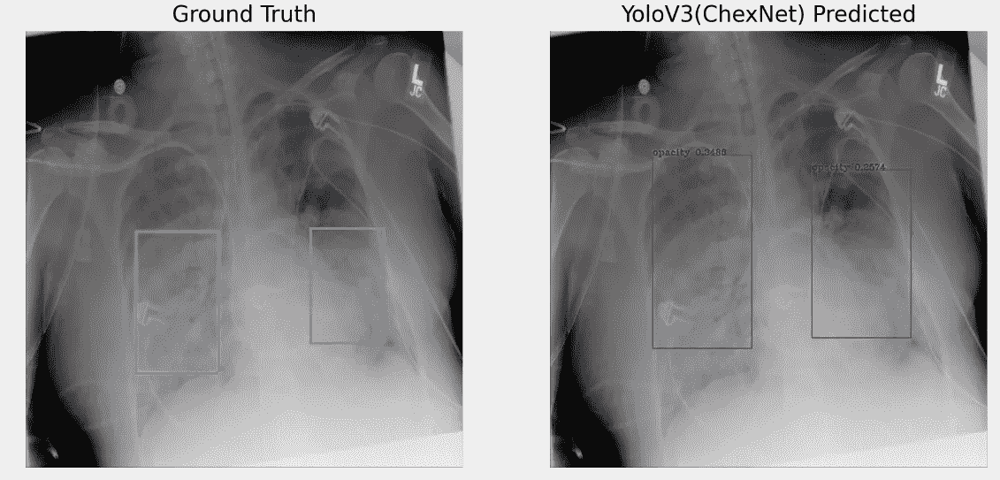

## 摘要:-

*   **yolo v3 _ darknet**共有**61576342**个参数， **yoloV3_chexnet** 共有**27993206**个参数。
*   在 **yoloV3_darknet** 的对比中， **yoloV3_chexnet** 的参数数量几乎是 **yoloV3_chexnet** light &快速训练的一半。
*   我们设置**yolo _ iou _ threshold = 0.5**&**yolo _ score _ threshold = 0.2**，因为在与正常物体的比较中，不透明度很难识别。
*   我们使用 **k-means** 计算定制锚盒。
*   我们得到的最终验证损失是**val _ loss:7.4992—val _ yolo _ output _ 0 _ loss:6.0457—val _ yolo _ output _ 1 _ loss:9.3626 e-04—val _ yolo _ output _ 2 _ loss:0.0028**。
*   由于数据集相当复杂，而且不透明度边界框人眼无法分辨，我们用 **yoloV3_chexnet** 得到了相当不错的结果(如果没有达到标准)

# **未来工作**

*   我们可以为其他医学图像训练这个模型，也可以将其用于其他特定的疾病诊断
*   该模型可以被转换成完全成熟的应用程序或 API，其可以被医疗从业者用作医疗诊断中的初始筛选工具。
*   由于我们已经根据医疗保健中的特定应用将 YoloV3 主干替换为 ChexNet，并获得了最佳结果，因此我们也可以将其替换为最适合其他应用(如空间研究、海洋应用)的其他型号。

# **Github 回购**

*   如果您对这个案例研究感兴趣，或者想进一步改进它，那么包含全部代码的 Jupyter Notebook 可以在我下面的 repo 中找到

 [## junaidnasirkhan/用 ChexNet 替换-yolov 3-Backbone-用于肺炎检测

### 构建深度学习模型，自动检测和定位胸部潜在的肺炎肺部阴影…

github.com](https://github.com/junaidnasirkhan/Replacing-YoloV3-Backbone-with-ChexNet-for-Pneumonia-Detection) 

# 参考

1.  [https://pjreddie.com/media/files/papers/YOLOv3.pdf](https://pjreddie.com/media/files/papers/YOLOv3.pdf)
2.  [https://arxiv.org/abs/1811.08939](https://arxiv.org/abs/1811.08939)
3.  [https://arxiv.org/abs/1711.05225](https://arxiv.org/abs/1711.05225)
4.  [https://www . ka ggle . com/c/rsna-肺炎-检测-挑战/概述](https://www.kaggle.com/c/rsna-pneumonia-detection-challenge/overview)
5.  [https://github . com/zzh 8829/yolo v3-tf2/blob/master/docs/training _ VOC . MD](https://github.com/zzh8829/yolov3-tf2/blob/master/docs/training_voc.md)
6.  [https://github.com/brucechou1983/CheXNet-Keras](https://github.com/brucechou1983/CheXNet-Keras)
7.  [https://github . com/AlexeyAB/darknet/blob/master/scripts/gen _ anchors . py](https://github.com/AlexeyAB/darknet/blob/master/scripts/gen_anchors.py)
8.  [https://www . ka ggle . com/jonnedtc/CNN-segmentation-connected-components](https://www.kaggle.com/jonnedtc/cnn-segmentation-connected-components)
9.  【https://www.appliedaicourse.com/ 

*与我连线*[***LinkedIn***](https://www.linkedin.com/in/junaidnasirkhan/)*或*[***GitHub***](https://github.com/junaidnasirkhan/)