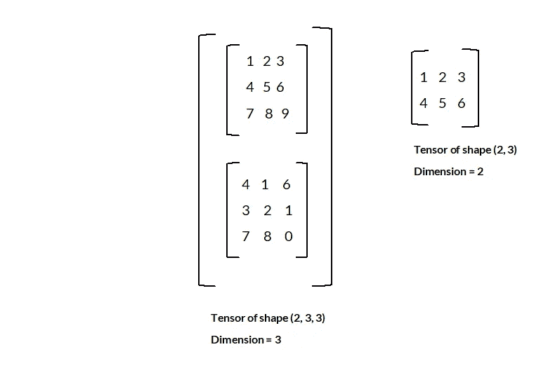
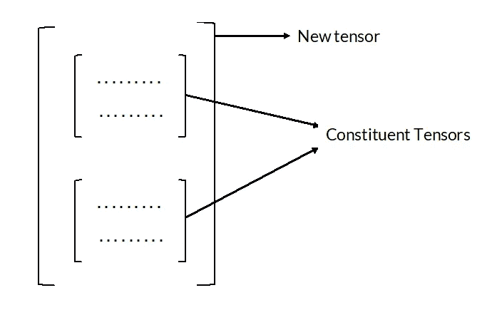

# 将数据表示为张量。

> 原文：<https://medium.com/analytics-vidhya/representing-data-as-tensors-513f51706f1d?source=collection_archive---------22----------------------->

机器学习模型的开发包括在大型数据集上训练它们，以获得更好的结果。大多数神经网络要求其输入数据(来自如此大的数据集)为张量形式。在 ML 模型中实现张量时，张量通常与以下**属性**、**形状和轴数**相关联，也称为**维。**

矩阵本身是二维的张量，意味着它们有两个轴。让我们考虑一个阶数为( *m，n* )的矩阵，其中 *m，n* 为非负整数，然后我们考虑一个具有 ***m* 行**和 ***n* 列的矩阵。**我们上面刚刚描述的顺序是矩阵(张量)的**形状**，它表示每个轴包含多少个元素。这里**轴**可以想象为元组中元组元素的**位置索引**，从 1 开始直到元组的长度，其中 1 表示第一轴，2 表示第二轴，以此类推，直到元组长度给出的最后一个数字。所以按上面的记法有两个轴既然元组的长度是两个**，张量的第一个轴**有 ***m 个*** 元素和**第二个轴**有*n 个* 元素。然后我们来看看这些元素在矩阵中是如何排列的。第一轴具有 *m* 元素，这些 *m* 元素对应于矩阵的 m 行，因此该轴具有作为其组成元素的行(可以被认为是一些有限大小或长度的数组)。现在考虑这些行中的任何一行，它们有 n 个元素，对应于构成矩阵列的第二轴中的元素数量。因此，张量的形状可以被认为是一个**元组**，它的 **le** ngth 给出了张量的维数，它在每个索引处的元素给出了元素的数目，每个轴都包括。

让我们考虑一个涉及数字的更具体的例子，考虑一个形状为(2，3)的矩阵，元组的长度是 2，这是张量的维数。元组的第一个元素给出了第一个轴中的元素数，即 2，这两行或数组以及这两行中的每一行具有由第二个元组元素给出的 3 个数字或列。但是，没有理由把我们自己局限于矩阵，张量的概念允许我们把我们的概念更进一步，创建另一个张量，在第一轴上用矩阵作为它的组成元素。例如，考虑一个形状为(2，3，3)的张量，它的长度为 3，因此它的维数为 3，那么它的第一轴有 2 个元素，现在每个元素本身是一个维数为(3，3)的张量，它是一个具有 3 行 3 列的张量(矩阵)，所以我们有两个矩阵作为我们新张量中第一轴的元素。然后我们可以创建另一个张量，它有一些我们在前面的例子中创建的有限数量的张量，作为它的第一个轴的组成元素，然后我们可以通过重复前面的方法，继续构建这样的新张量。

或者，一般来说，矩阵可以被认为是一个**容器**，其组成元素是长度为 ***n*** 的 ***m*** 个数组(行)。此外，每个阵列具有其 ***n*** 个组成元素(列)。**张量**允许我们扩展这个想法，使容器可以包含有限数量的**矩阵**作为它们的组成元素。

**概化张量，该图仅用于表示张量。**

然后我们可以进一步扩展这个思路，构造一个张量，包含我们之前创建的张量，如上图所示。因此，一般来说，张量允许我们构建容器，该容器可以具有有限数量的有限维的**个张量，作为其组成张量(元素)，其中每个组成张量具有相同的维数。**

那么维数小于 2 的张量呢？维数为 1 的张量是行或列向量，例如[1 2 3]是长度为 3 的**向量，**维数为** 1 的张量及其**形状**由(3)给出。例如 32 这样的任意数称为**标量**，是一个**零维张量。****