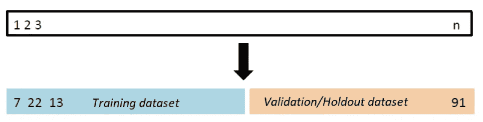
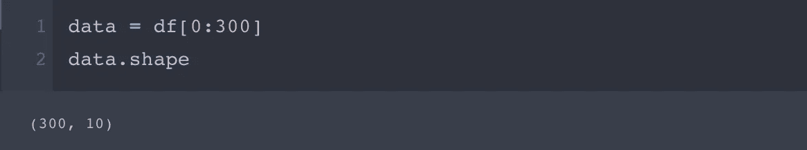
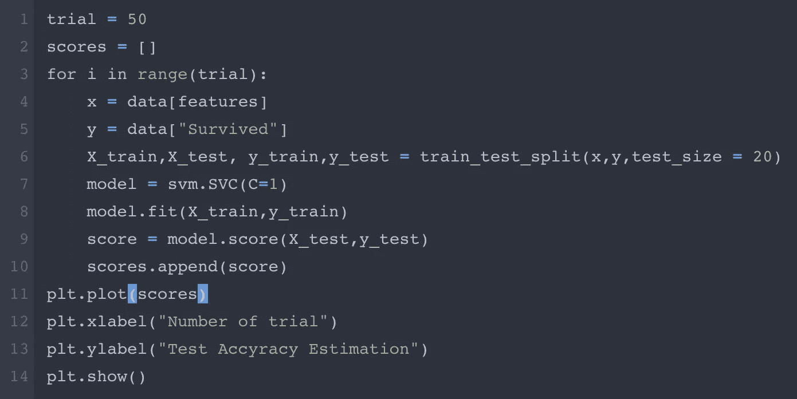
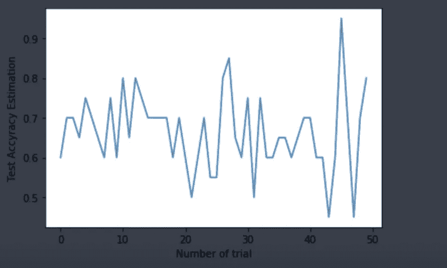
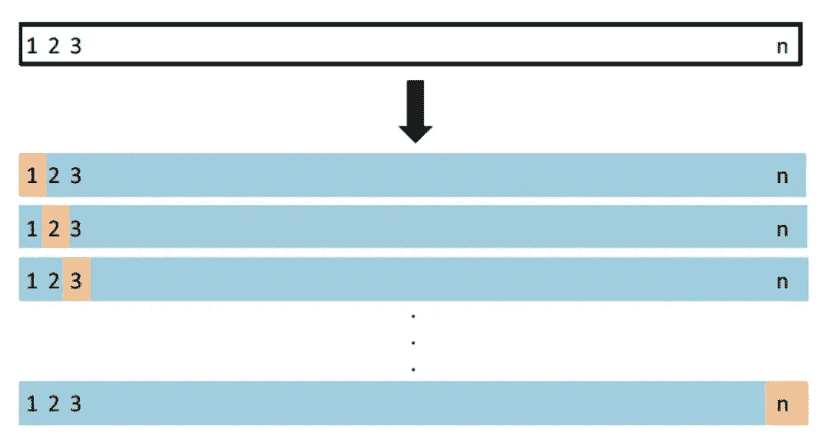
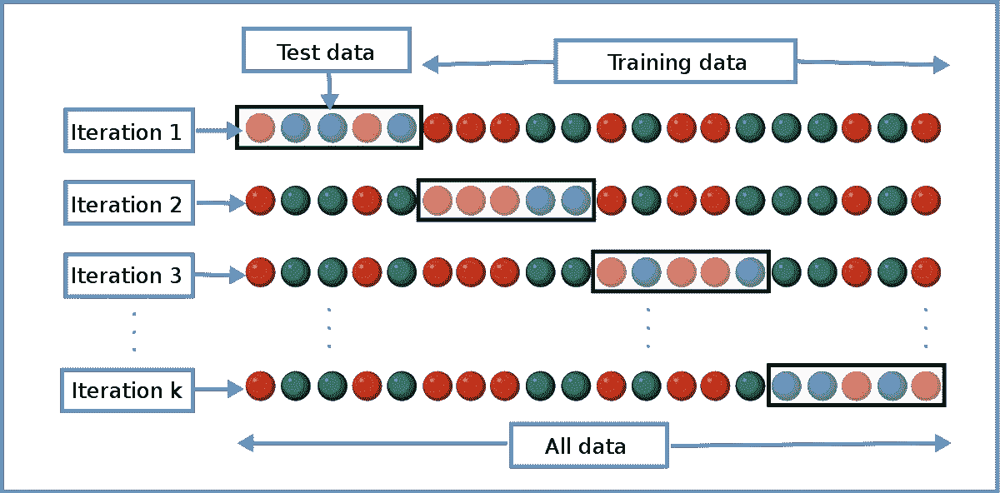
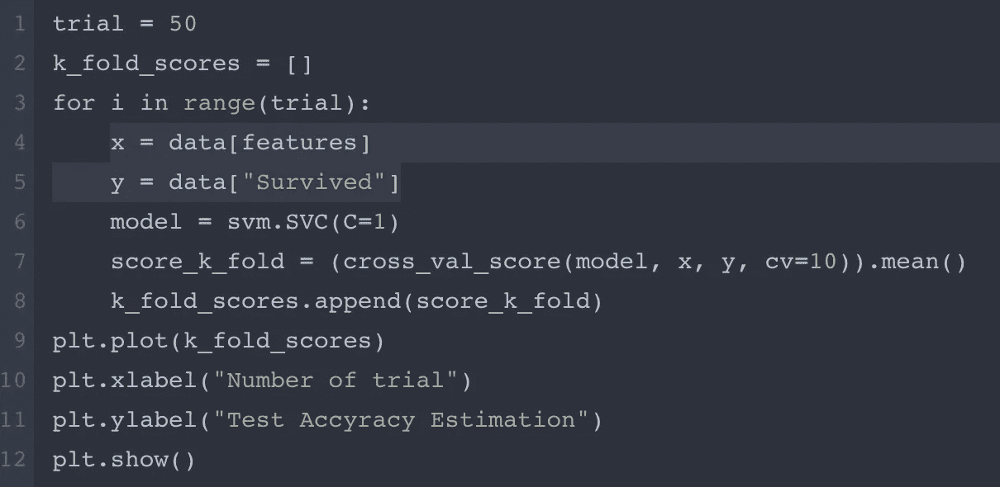
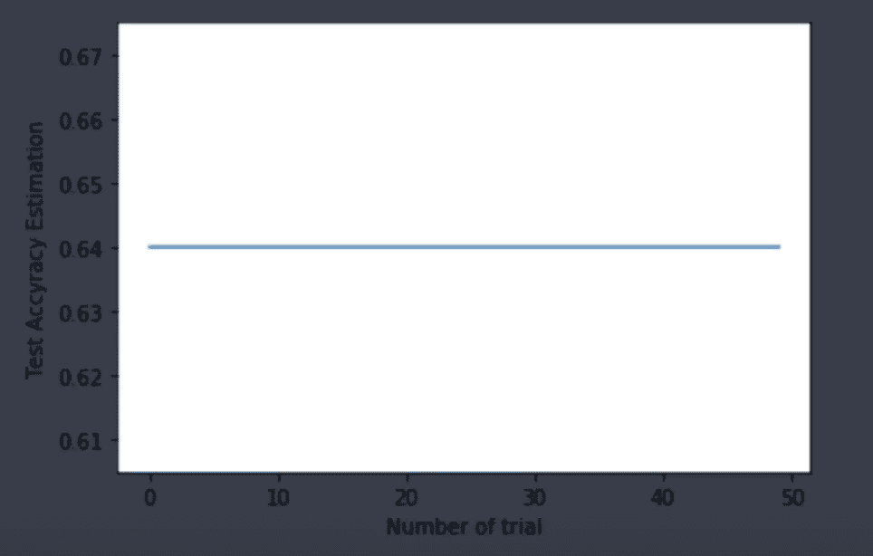
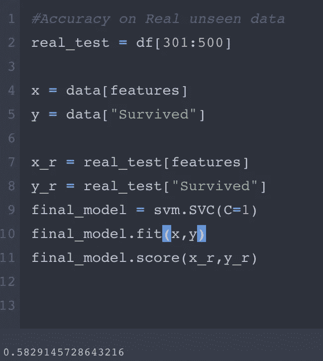

# 机器学习中的重采样方法:交叉验证

> 原文：<https://medium.com/analytics-vidhya/resampling-methods-in-machine-learning-cross-validation-677485fa1b4d?source=collection_archive---------10----------------------->

重采样方法在统计学和机器学习中非常有用，有利于拟合更精确的模型、模型选择和参数调整。他们从训练数据中抽取样本并拟合模型，以检查模型的可变性并获得额外的信息。如果没有对不同的样本进行测试，我们无法仅仅通过独特的拟合来最好地确定模型的结果。因为要拟合多个模型，所以计算量很大，但是最近的改进很容易解决这个问题，不需要太多的努力。

在这篇文章中，我将讨论一种叫做交叉验证的重采样方法及其类型，这是实践中经常使用的方法。例如，交叉验证是估计模型对未知数据的误差、确定模型的灵活性、参数选择等的有效方法。

**交叉验证:**

机器学习建模的要点是模型的训练。基本上，我们根据现有的训练数据建立一个模型。如果我们没有额外的测试数据来检查模型的准确性，我们就不能确定我们的模型在看不见的数据上的结果。只有训练精度不能很好地估计测试精度，因为在一个点(最佳点)后，训练分数往往会降低，这将导致过度拟合。这意味着，当我们的模型的灵活性增加时，模型试图准确地预测训练集中的每个观察值，在这种情况下，我们获得了几乎 100%的训练准确性，但这是一个好的估计吗？不，由于在灵活性测试误差的最佳点之后的偏差-方差权衡增加，这是我们不希望的。我们的主要目标是得到提供较低测试误差的最优模型。为了达到我们的目标，我们应该将数据分成训练集和测试集，并总是在我们自己的测试集上检查准确性。(或集合)。这种方法是交叉验证，有一些类型的交叉验证，如:验证集方法，留一交叉验证(LOOCV)，和 k-fold 交叉验证。

**验证集方法:**

当有足够多的观测值来得到合理的结果时，验证集方法是一种非常简单且常用的方法。它基本上是将我们拥有的数据分为训练集和验证集(或维持集)，并在训练集上建立模型，然后在验证集上检查模型的准确性。从验证集中得到的精度是对真实测试数据(看不见的数据)的估计。

但是这种方法也有一些缺点。首先，我们将数据集随机分为训练和验证部分，并根据这些训练观察值拟合我们的模型。因此，我们的模型只训练那些观察值，也许验证集中的观察值很容易预测，这导致准确性的高度可变性，特别是在小数据集内。如果我们选择十倍不同的子集作为训练集和验证集，并检查准确性，我们可以看到它并不总是相同的。

此外，我们只在部分观察值上训练我们的模型，这导致如果我们没有足够的数据，它可能会高估真实的准确性。例如，KNN 可能是我们问题的最佳分类器，但当我们在小集合上训练时，我们的验证集准确性将会降低，我们会认为它不是合适的模型，但事实上它是。

如果我们有小规模的数据，我们可以在 python 中检查它，以查看使用验证集方法时估计的可变性。

我们的数据有 300 个观察值:

我们将使用验证集方法拟合并检查模型准确性 50 次:

我们可以看到在试验中分数是如何不同的:

**LOOCV:**

遗漏交叉验证法是针对验证集法的缺点而提出的，也是一种与验证集法一样简单的方法。这里的要点是将每个观察作为一次验证集。这意味着，如果我们有“n”个观察值，我们将拟合“n”次模型。在每次尝试中，我们将保留一个观察值作为测试样本，并将在“n-1”个观察值上训练模型。最后我们会有“n”个准确度分数，我们可以将这些分数的平均值作为模型的总分数。

因为在这种方法中，每次观察都成为一次测试样本，所以这是一种用于估计真实精度的高度无偏的方法。但是正如我们所说，偏差不是唯一的情况，也应该有低方差。在 LOOCV，方差很高，因为我们每次都在单个观察值上测试我们的模型，这不足以获得更精确的估计。此外，它在计算上是昂贵的，因为我们要拟合模型“n”次。例如，如果我们有 1000 个观察值，这意味着我们将拟合 1000 个模型。

**k 倍交叉验证**:

最常用的交叉验证技术是 k 折法。这里的程序实际上与 LOOCV 相同，但我们不适合“n”次模型。“K”是折叠数，例如 5 重交叉验证。假设我们有 100 个观察值，我们将使用 5 重交叉验证。这意味着我们将只适合模型五次。在每次迭代中，我们将保留 20 个观察值作为验证集，80 个观察值作为训练集。如下图所示:

经过 5 次迭代后，我们将得到 5 个分数，我们可以将这些分数的平均值作为准确度的总体估计值。该方法是最优方法，偏倚不如验证集方法高，方差不如 LOOCV 方法高。并且在计算上也不那么昂贵。实践中常用的是 5 折和 10 折。

我们可以使用我们的数据进行建模，并使用 10 倍法估计 50 次精确度:

我们可以看到，分数估计是常数，大约是 64，所以我们可以说，我们的模型不是这个问题的好选择。但是在验证集方法中，我们可以看到由于随机分裂，我们的测试准确率偶然超过 80，并认为这是一个很好的模型:

而真实测试分数是:0.58。我们可以看到，5 重验证为未知数据的准确性提供了更准确的估计

总之，基于我们拥有的数据的大小，我们可以使用上面的采样和模型选择方法来估计模型的准确性、参数调整等等。

感谢阅读！！！