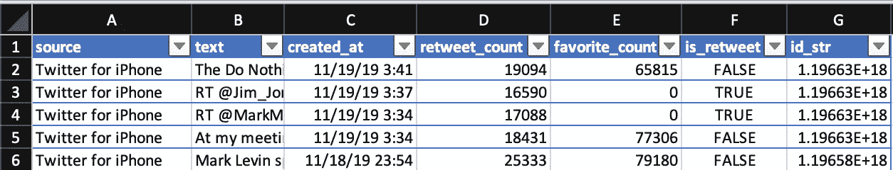
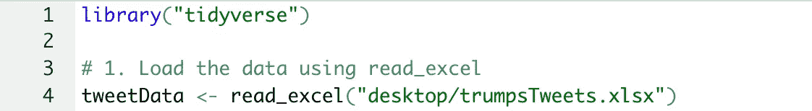
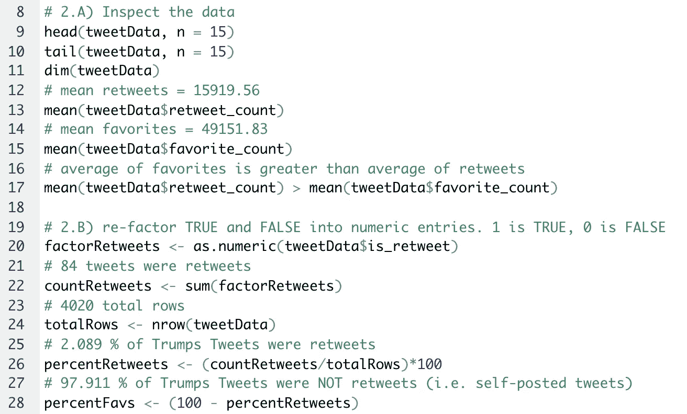
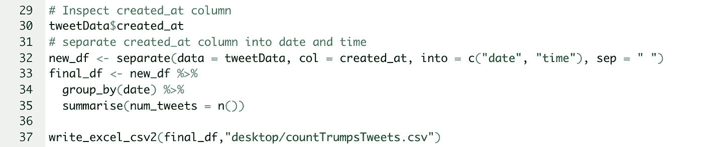
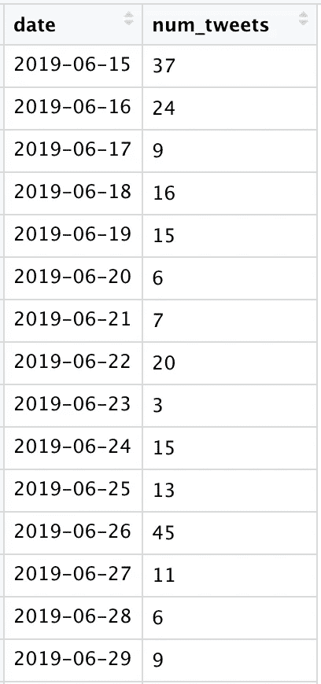

# 用 R &一个有用的技巧将数据分割成列

> 原文：<https://medium.com/analytics-vidhya/research-with-r-a-helpful-trick-for-splitting-data-into-columns-d9f24ff4f2f3?source=collection_archive---------13----------------------->

## 概述和问题

前几天，我正在处理唐纳德·特朗普从 2016 年 6 月 15 日到 2019 年 11 月 19 日的推文数据集。我一直在分析这个数据集，看看唐纳德·特朗普每天的推文数量和标准普尔 500 指数基金价格的百分比变化之间是否存在统计上的显著关系。“唐纳德特朗普推文”数据集的初始列名如下所示:

尺寸:4020 行 X 7 列。

虽然这些数据中的大部分已经被清理了，但是在“created_at”列中出现了一个主要问题。在这一栏中，推文的**日期**和**时间**都包括在内。这让我很难准确统计在每个**日期**发布的推文总数(因为同一个日期可能会出现不止一次，并附带不同的时间)。为了解决这个问题，我决定将“created_at”列分成两个部分: **date** 和 **time。这样我就可以很容易地计算出每个日期的推文数量。**

## 第 1 部分:探索性数据分析

在意识到这个问题之前，我研究了我的数据集并回答了一些基本问题。首先，我必须将这个数据集加载到 r 中，为了完成这个任务，我使用了一个方便的名为 readxl 的库。这个库没有外部依赖性，这使得它比其他现有的库(如 gdata、xlsx 和 xlsReadWrite)更容易使用。此外，readxl 可以处理 xls 和 xlsx MS Excel 文件。我编写的加载数据集的基本代码如下:

包括一个包 tidyverse，然后将我的数据集加载到一个名为“tweetData”的变量中。

在这之后，我对我的数据集进行了一些基本的分析，以进一步理解:1 .我正在处理的数据类型(文本、数字等。), 2.我可以问什么样的问题。我可能会遇到什么样的问题。我执行的一些基本 EDA 如下图所示:

简单 EDA

第 9 行和第 10 行检查我的数据集的第一行和最后 15 行。此外，第 11 行返回我的数据集的维度。然后，第 12 行到第 15 行计算每条推文的平均转发数和收藏数，第 17 行比较这两个值。

在这之后，在第 19 到 28 行，我将“is_retweet”列中的 TRUE 和 FALSE 条目分解为数字(0 和 1)。然后，我进行一些简单的统计测量。在这之后，我检查我的“created_at”列。这是我第一次意识到我需要将这个专栏分解成两部分，以便计算每个日期的推文数量。

**第 2 部分:在 R 中拆分列的有用技巧**

下面是我编写的将一列分成两列的代码:

第 32 行:将数据分成两列的有用过程！

在第 32 行将“created_at”列分成“date”和“time”之后，我创建了一个名为“final_df”的数据帧。在这个数据框中，我按照每个日期对数据进行分组(第 34 行)，并使用“num_tweets = n()”对每个日期进行汇总。“num_tweets = n()”将报告每个日期在我的数据集中出现的次数(这为我提供了每个日期的 tweets 数量！).我在第 37 行导出的最终数据集的一部分显示在下面的屏幕截图中。

有什么想法或问题吗？请评论或发电子邮件给我在 danielmurph8@gmail.com。

