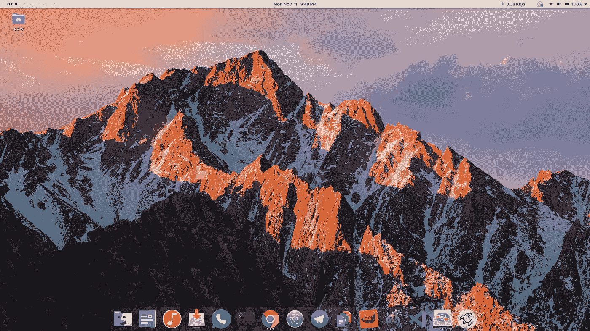
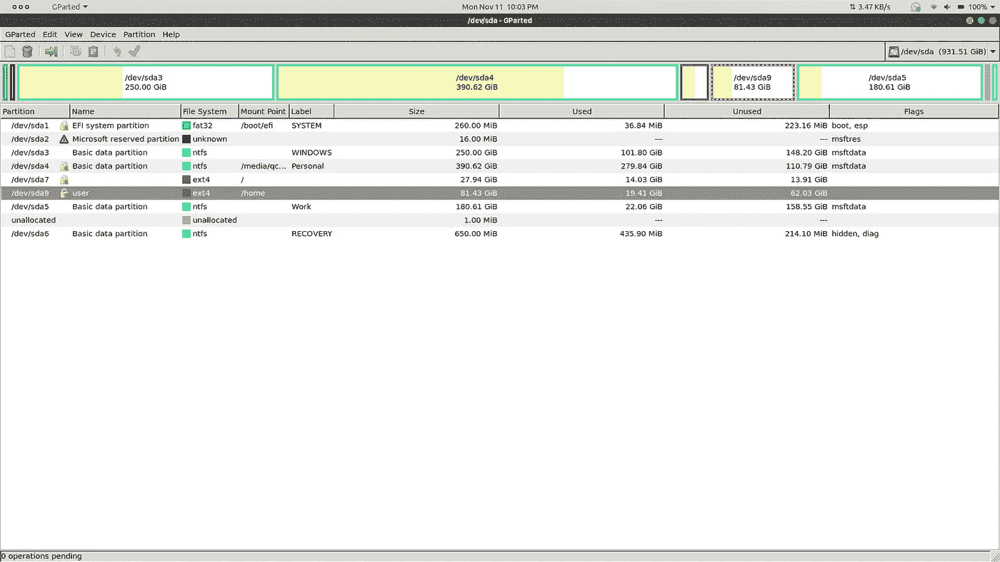

# 调整 Ubuntu 19.10 中/home 分区的大小

> 原文：<https://medium.com/analytics-vidhya/resizing-home-partition-in-ubuntu-19-10-a88bcd94479e?source=collection_archive---------1----------------------->


在 [Unsplash](https://unsplash.com?utm_source=medium&utm_medium=referral) 上 [Sai Kiran Anagani](https://unsplash.com/@_imkiran?utm_source=medium&utm_medium=referral) 拍摄的照片

所以，我最近在我的笔记本电脑上双启动了 Ubuntu 19.10，犯了一个错误，给/home 目录分配了大约 16 GB，给/ (root)目录分配了 104 GB。在使用 Ubuntu 的一个星期里，我发现我犯了一个错误，在软件中心周围安装了很多小程序，几乎完全占用了我的/home 分区。因此，作为一个初学开发的学生，我在 StackOverflow、UbuntuForums、AskUbuntu 和 LinuxForums 中搜索了一个解决方案，以及如何切换/ (root)目录和/home 的分区大小。

所以最后，经过一段时间令人厌倦的搜索，我最终使用了官方文档的一些部分，并汇编了一些其他指南，以创建一个完美的解决方案。虽然我找了很多教程来帮我解围，用 GParted 似乎没有一个对我有用。就在那时，我开始用自己的方式去克服它。因为我发现这个方法有效，所以我想把它写下来，让所有困惑的 Linux 用户克服这个问题。那么，我们开始吧。



我的默认工作区

# 第一部分:第一个

因此，首先，从软件中心下载 GParted 会有所帮助，因为我们知道一些复杂的细节。一旦安装完毕，检查你的分区是否都在它们的位置上，不要碰 Windows 分区。

我有 6 个 Windows 分区，所以/dev/sda7 和/dev/sda8 是我的/(根)和/home 分区，因此在本指南中使用相同的分区作为示例。目前，它们分别有 90 GB 和 200 MB 剩余空间。现在，您想要做的第一件事是减小根分区的大小，这可以通过以下方式实现:

```
RIGHT CLICK "dev/sda7" > SELECT "Resize/ Move" > SLIDE THE BAR TO SET THE REQUIRED or ENTER ALLOCATION MEMORY VALUE TO "New Size (MiB):" > PRESS "Resize" > CLICK "Edit" IN MENU > CLICK "Apply All Operations".
```

因此，作为一个例子，我给 root 分配了 16 GB，其余的(74 GB)现在作为“未分配的内存”可用。使用以下命令创建一个新分区:

```
RIGHT CLICK "unallocated" > SELECT "New" > SLIDE THE BAR TO SET THE REQUIRED or ENTER ALLOCATION MEMORY VALUE TO "New Size (MiB):" > PRESS "Add"> CLICK "Edit" IN MENU > CLICK "Apply All Operations".
```

现在，您将看到刚刚创建的新分区，名为 dev/sda9。现在，把那部分留在外面。快速记下/复制分区的 UUID，使用:

```
RIGHT CLICK "dev/sda9" > SELECT "Information" > COPY "UUID".
```

好了，现在你已经完成了 GParted。

# 第 2 部分:带 Fstab 的那个(bing)

你的 Fstab 是一个用来告诉 Ubuntu 在启动时挂载哪些分区的文件。以下命令将复制您当前的 Fstab，将年-月-日附加到文件名的末尾，比较两个文件并打开原始文件进行编辑。我们将使用它来让系统知道有一个新的分区供它查看和挂载。现在使用 Ctrl+Alt+T 启动终端。

```
sudo cp /etc/fstab /etc/fstab.$(date +%Y-%m-%d)
```

在这里，我们复制了名为 Fstab 的文件。我们还需要使用下一个命令检查它是否与原始文件匹配:

```
cmp /etc/fstab /etc/fstab.$(date +%Y-%m-%d)
```

检查之后，我们终于可以使用文本编辑器打开它了:

```
sudo gedit /etc/fstab
```

好了，我们有了 Fstab 文件，要向其中添加新的分区，请使用下面的语法。用您复制的 UUID 替换<your_uuid>，并根据您自己的分区格式将 ext4 改为 ext3:</your_uuid>

```
# (identifier)  (location, eg sda5)   (format, eg ext3 or ext4)      (some settings) 
UUID=<Your_UUID>   /media/home    ext4          defaults       0       2
```

保存并关闭 Fstab 文件，并返回到终端:

```
sudo mkdir /media/home
```

这样，我们就为之前创建的新分区的临时挂载创建了一个新目录。您将看到有一个新挂载的目录，分配了 74 GB 内存。当我们的要求达到时，我们最终会删除这个目录。

最后，重新启动，或者执行这个命令(对你们这些懒虫来说):

```
sudo mount -a
```

# 第 3 部分:有重复的那个

现在，我们需要将文件从旧的/主目录复制到新的媒体/主目录。一种有效的方法是使用以下命令:

```
sudo rsync -aXS -- progress --exclude='/*/.gvfs' /home/. /media/home/.
```

你会看到你所有的文件都被复制过来，成吨的东西快速滚动。因为我有巨大的 16 GB (>200000 个文件)，所以我花了大约 20 分钟来完成这个。存储的数据量将决定这个过程需要多长时间。耐心等待，直到它结束。完成一次后，使用相同的命令多次，以确保所有内容都被完全复制。同样，不要担心命令被任何方式中断(Ctrl+C，等等)。)因为 Rsync 可以根据需要被中断任意多次，当您再次启动它时，它会检查已经完成了多少。

当你知道几乎什么都没留下后；使用以下命令检查您的复制是否有效:

```
sudo diff -r /home /media/home -x ".gvfs/*"
```

此命令检查/home 和/media/home 中文件的差异。这也可能需要一段时间才能完成。所以，耐心等待。

# 第 4 部分:有开关的那个

现在我们完成了复制，我们现在有了相同数据的两个副本，分别位于/home 和/media/home。现在，让我们重命名/media/home，并使它成为我们的默认目录。使用命令返回 Fstab:

```
sudo gedit /etc/fstab
```

并且，编辑我们不久前添加的最后几行；将/media/home 更改为/home:

```
# (identifier)  (location, eg sda5)   (format, eg ext3 or ext4)      (some settings) 
UUID=<Your_UUID>   /home    ext4          defaults       0       2
```

按保存并关闭文件。

下一步需要您使用 LiveUSB。所以，插上你的 LiveUSB，重启。在 GRUB GNU 菜单上，使用“试用 Ubuntu”；并登录到默认帐户。现在，打开终端，输入:

```
cd / && sudo mv /home /old_home && sudo mkdir /home
```

我们使用 LiveUSB 的原因是，安装的 Ubuntu 与/home 一起工作，因此，我们不能在使用它时移动它的内容。因此，我们使用前者来提交对已安装的 Ubuntu 的更改。使用这个命令，我们已经将旧主目录的内容移走，并创建了一个空的“占位符”目录作为新分区的“挂载点”。

现在，当你移除 LiveUSB 时，重新启动，启动到普通的 Ubuntu。

# 第五部分:最后一个

这是最后一步。请注意这一点，以避免任何不必要的数据丢失。打开 GParted，用/home 挂载点找到 dev/sda8 和 dev/sda9。现在，安装 dev/sda9:

```
RIGHT CLICK "dev/sda9" > SELECT "Mount" > CLICK "Edit" IN MENU > CLICK "Apply All Operations".
```

现在，检查文件的属性，查看是否有您需要的分配空间。但是，在我们完成之前，我们还需要卸载 dev/sda8。所以，打开终端，输入:

```
sudo umount /dev/sda8
```

这就对了。您可以将未分配的空间找回来，然后将其添加回 dev/sda9。



并且，如果最后一步没有成功，返回一个错误；重新启动并重试。否则，把它放在评论区，我会尽力帮助你。

这是我父亲目前的照片。

此外，这是我第一次尝试在媒体上写作，我将非常感谢你对指南的建设性批评。

我希望我能解决你的问题，你的眼中充满了满足感。如果真的有帮助，请鼓掌，并分享给遇到这个问题的人。日安！