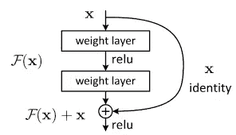
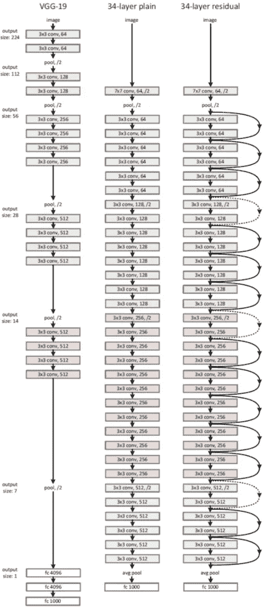

# 雷斯内特

> 原文：<https://medium.com/analytics-vidhya/resnet-10f4ef1b9d4c?source=collection_archive---------2----------------------->

*cifar 10 上的残差神经网络*


有时候，跳过比一个一个处理好

在我之前的帖子中，我们已经讨论过了

1.  [深度学习——人工神经网络(ANN)](/analytics-vidhya/deep-learning-artificial-neural-network-ann-13b54c3f370f?source=your_stories_page---------------------------)
2.  [张量 PyTorch 编程基础](/@arun.purakkatt/tensors-basics-of-pytorch-programming-5de82ea45ebf?source=your_stories_page---------------------------)
3.  [使用 PyTorch 进行线性回归](/analytics-vidhya/linear-regression-with-pytorch-147fed55f138)
4.  【PyTorch 图像分类 *—逻辑回归*
5.  [用 PyTorch 在 GPU 上训练深度神经网络](/analytics-vidhya/training-deep-neural-networks-on-a-gpu-with-pytorch-2851ccfb6066)
6.  [用 CNN 进行图像分类](/swlh/image-classification-with-cnn-4f2a501faadb)

*本文基于何等人【2】(微软研究院)*[](https://arxiv.org/pdf/1512.03385.pdf)*的图像识别深度残差学习*

*残差网络(ResNet)是一种卷积神经网络(CNN)架构，可以支持数百或更多的卷积层。ResNet 可以添加许多具有强大性能的层，而以前的体系结构每增加一层，效率就会下降。
ResNet 提出了“消失梯度”问题的解决方案。*

**

*ResNet 块*

*神经网络通过反向传播来训练，反向传播依赖于梯度下降来寻找最小化损失函数的最佳权重。当增加更多层时，其导数的重复相乘最终会使梯度变得极小，这意味着增加层不会提高性能，甚至会降低性能。*

**

*[来源](https://arxiv.org/pdf/1512.03385.pdf)*

*ResNet 使用“身份快捷连接”解决了这个问题，这些层最初什么也不做。在训练过程中，跳过这些相同的层，重用来自先前层的激活函数。*

*这将网络缩减为几层，从而加快了学习速度。当网络再次训练时，相同的层扩展并帮助网络探索更多的特征空间。*

## *内置 PyTorch ResNet 实现:*

*PyTorch 提供了 [torchvision.models](https://pytorch.org/docs/stable/torchvision/models.html) ，其中包括多个深度学习模型，在 ImageNet 数据集上进行了预训练，随时可以使用。*

*预训练让您可以利用迁移学习-一旦模型在庞大的 ImageNet 数据集上学习了许多对象、特征和纹理，您就可以将这种学习应用到您自己的图像和识别问题中。*

*torchvision.models 包括以下 ResNet 实现:ResNet-18、34、50、101 和 152(数字表示模型中的层数)，以及 Densenet-121、161、169 和 201。*

# *ResNet 块*

*ResNet 中使用了两种主要类型的块，这主要取决于输入和输出维度是相同还是不同。*

*   *身份块:当输入和输出激活维度相同时。*
*   *卷积块:当输入和输出激活维数彼此不同时。*

*例如，要将激活维数(HxW)减少 2 倍，可以使用步长为 2 的 1x1 卷积。*

*下图显示了剩余块的外观以及这些块中的内容。*

**

**来源:*[*Coursera:Andrew NG*](https://www.coursera.org/lecture/convolutional-neural-networks/resnets-HAhz9)*

****第一步:准备数据集****

*下载数据集并创建 PyTorch 数据集来加载数据。*

*在创建 PyTorch 数据集时，我们将进行一些重要的更改:*

1.  ***使用测试集进行验证**:我们将简单地使用测试集作为我们的验证集，而不是从训练集中留出一小部分(例如 10%)数据进行验证。这只是为训练提供了更多的数据。*
2.  ***通道式数据标准化**:我们将通过减去平均值并除以每个通道的标准偏差来标准化图像张量。*
3.  ***随机数据扩充**:我们将在从训练数据集中加载图像时应用随机选择的变换。具体来说，我们将每个图像填充 4 个像素，然后随机裁剪大小为 32 x 32 像素的图像，然后以 50%的概率水平翻转图像。*

```
**# Data transforms (normalization & data augmentation)*
stats = ((0.4914, 0.4822, 0.4465), (0.2023, 0.1994, 0.2010))
train_tfms = tt.Compose([tt.RandomCrop(32, padding=4, padding_mode='reflect'), 
                         tt.RandomHorizontalFlip(), 
                         tt.ToTensor(), 
                         tt.Normalize(*stats,inplace=True)])
valid_tfms = tt.Compose([tt.ToTensor(), tt.Normalize(*stats)])*# PyTorch datasets*
train_ds = ImageFolder(data_dir+'/train', train_tfms)
valid_ds = ImageFolder(data_dir+'/test', valid_tfms)*
```

*接下来，创建用于批量检索图像的数据加载器。我们将使用相对较大的批量 400，以利用 GPU RAM 的较大部分。如果遇到“内存不足”的错误，您可以尝试减少批处理的大小&重新启动内核。*

```
*batch_size = 400*# PyTorch data loaders*
train_dl = DataLoader(train_ds, batch_size, shuffle=True, num_workers=3, pin_memory=True)
valid_dl = DataLoader(valid_ds, batch_size*2, num_workers=3, pin_memory=True)*
```

****第二步:使用 GPU****

*为了无缝地使用 GPU，如果有可用的 GPU，我们定义了几个助手函数(`get_default_device` & `to_device`)和一个助手类`DeviceDataLoader`，以便根据需要将我们的模型&数据移动到 GPU。*

```
*device = get_default_device()
devicetrain_dl = DeviceDataLoader(train_dl, device)
valid_dl = DeviceDataLoader(valid_dl, device)*
```

****第三步:残留块****

*这是一个非常简单的剩余块*

```
*class **SimpleResidualBlock**(nn.Module):
    def **__init__**(self):
        super().__init__()
        self.conv1 = nn.Conv2d(in_channels=3, out_channels=3, kernel_size=3, stride=1, padding=1)
        self.relu1 = nn.ReLU()
        self.conv2 = nn.Conv2d(in_channels=3, out_channels=3, kernel_size=3, stride=1, padding=1)
        self.relu2 = nn.ReLU()

    def **forward**(self, x):
        out = self.conv1(x)
        out = self.relu1(out)
        out = self.conv2(out)
        return self.relu2(out) + x *# ReLU can be applied before or after adding the input*simple_resnet = to_device(SimpleResidualBlock(), device)

for images, labels in train_dl:
    out = simple_resnet(images)
    print(out.shape)
    break

del simple_resnet, images, labels
torch.cuda.empty_cache()*
```

*这是我们的 resnet 架构，resnet 9*

```
*def **conv_block**(in_channels, out_channels, pool=False):
    layers = [nn.Conv2d(in_channels, out_channels, kernel_size=3, padding=1), 
              nn.BatchNorm2d(out_channels), 
              nn.ReLU(inplace=True)]
    if pool: layers.append(nn.MaxPool2d(2))
    return nn.Sequential(*layers)

class **ResNet9**(ImageClassificationBase):
    def **__init__**(self, in_channels, num_classes):
        super().__init__()

        self.conv1 = conv_block(in_channels, 64)
        self.conv2 = conv_block(64, 128, pool=True)
        self.res1 = nn.Sequential(conv_block(128, 128), conv_block(128, 128))

        self.conv3 = conv_block(128, 256, pool=True)
        self.conv4 = conv_block(256, 512, pool=True)
        self.res2 = nn.Sequential(conv_block(512, 512), conv_block(512, 512))

        self.classifier = nn.Sequential(nn.MaxPool2d(4), 
                                        nn.Flatten(), 
                                        nn.Linear(512, num_classes))

    def **forward**(self, xb):
        out = self.conv1(xb)
        out = self.conv2(out)
        out = self.res1(out) + out
        out = self.conv3(out)
        out = self.conv4(out)
        out = self.res2(out) + out
        out = self.classifier(out)
        return outmodel = to_device(ResNet9(3, 10), device)
model*
```

****第四步:训练模型****

*在我们训练模型之前，我们将对我们的`fit`函数做一些小而重要的改进:*

*   ***学习率调度**:我们不使用固定的学习率，而是使用学习率调度器，它会在每一批训练后改变学习率。在训练过程中有许多改变学习率的策略，我们将使用的一种策略称为**“一个周期学习率策略”**，它涉及从低学习率开始，在大约 30%的时期内逐批逐渐增加到高学习率，然后在剩余时期内逐渐减少到非常低的值。*
*   ***权重衰减**:我们也使用权重衰减，这是另一种正则化技术，它通过向损失函数添加一个附加项来防止权重变得太大。*
*   ***渐变裁剪**:除了层权重和输出，将渐变值限制在一个小的范围内也有助于防止由于大的渐变值而导致参数发生不希望的变化。这种简单而有效的技术被称为渐变裁剪。*

```
***@torch.no_grad()**
def **evaluate**(model, val_loader):
    model.eval()
    outputs = [model.validation_step(batch) for batch in val_loader]
    return model.validation_epoch_end(outputs)

def **get_lr**(optimizer):
    for param_group in optimizer.param_groups:
        return param_group['lr']

def **fit_one_cycle**(epochs, max_lr, model, train_loader, val_loader, 
                  weight_decay=0, grad_clip=None, opt_func=torch.optim.SGD):
    torch.cuda.empty_cache()
    history = []

    *# Set up cutom optimizer with weight decay*
    optimizer = opt_func(model.parameters(), max_lr, weight_decay=weight_decay)
    *# Set up one-cycle learning rate scheduler*
    sched = torch.optim.lr_scheduler.OneCycleLR(optimizer, max_lr, epochs=epochs, 
                                                steps_per_epoch=len(train_loader))

    for epoch in range(epochs):
        *# Training Phase* 
        model.train()
        train_losses = []
        lrs = []
        for batch in train_loader:
            loss = model.training_step(batch)
            train_losses.append(loss)
            loss.backward()

            *# Gradient clipping*
            if grad_clip: 
                nn.utils.clip_grad_value_(model.parameters(), grad_clip)

            optimizer.step()
            optimizer.zero_grad()

            *# Record & update learning rate*
            lrs.append(get_lr(optimizer))
            sched.step()

        *# Validation phase*
        result = evaluate(model, val_loader)
        result['train_loss'] = torch.stack(train_losses).mean().item()
        result['lrs'] = lrs
        model.epoch_end(epoch, result)
        history.append(result)
    return history*
```

*为了训练我们的模型而不是 SGD(随机梯度下降),我们将使用 Adam 优化器，它使用动量和自适应学习率等技术来加快训练。*

```
*epochs = 8
max_lr = 0.01
grad_clip = 0.1
weight_decay = 1e-4
opt_func = torch.optim.Adam%%time
history += fit_one_cycle(epochs, max_lr, model, train_dl, valid_dl, 
                             grad_clip=grad_clip, 
                             weight_decay=weight_decay, 
                             opt_func=opt_func)*
```

*我们的模型仅用 4 分钟就训练出超过 90%的准确率！*

****第五步:精度绘图****

*绘图精度与历元数*

**

*精确度与纪元数量*

*绘制损失与时代数。*

**

*丢失与纪元数量*

*从趋势来看，我们的模型显然还没有过度符合训练数据。最后，让我们想象一下学习率是如何随着时间的推移而变化的，一批接一批地变化。*

**

*学习率与批号*

*请在笔记本 [*Github*](https://github.com/Arun-purakkatt/Deep_Learning_Pytorch) 上查看完整代码，在 中链接[*与我保持联系。*](https://www.linkedin.com/in/arun-purakkatt-mba-m-tech-31429367/)*

**

*[来源](https://www.dashe.com/blog/motivation/inspiring-learning-quotes/)*

****演职员表&参考文献:****

1.  *【https://arxiv.org/pdf/1512.03385.pdf】T5[T6](https://arxiv.org/pdf/1512.03385.pdf)*
2.  *[https://jovian.ml/arun-purakkatt/05b-cifar10-resnet-2009f](https://jovian.ml/arun-purakkatt/05b-cifar10-resnet-2009f)*
3.  *[https://towards data science . com/residual-blocks-building-blocks-of-resnet-FD 90 ca 15d 6 EC](https://towardsdatascience.com/residual-blocks-building-blocks-of-resnet-fd90ca15d6ec)*
4.  *[https://towards data science . com/batch-normalization-and-dropout-in-neural-networks-explained-with-py torch-47d 7a 8459 BCD](https://towardsdatascience.com/batch-normalization-and-dropout-in-neural-networks-explained-with-pytorch-47d7a8459bcd)*
5.  *[https://ruder.io/optimizing-gradient-descent/index.html](https://ruder.io/optimizing-gradient-descent/index.html)*