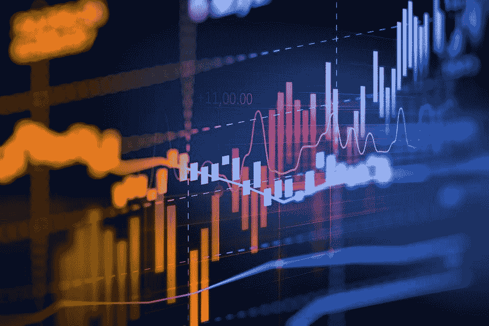

# 数据科学中学习统计学的资源

> 原文：<https://medium.com/analytics-vidhya/resources-for-learning-statistics-in-data-science-f98d7b305cd8?source=collection_archive---------19----------------------->

统计学被认为是学生们最难学的科目之一。没有最好的统计学书籍，学习一门统计学是不容易的。所以我们先从统计学的小介绍开始。

统计学是关于数据和数字的。事实上，它提供了对给定的数据集和数字执行特定功能的方法。最好的统计学书籍是掌握统计学的第一要务。此外，最好的统计学书籍为学生提供计算技巧和诀窍。

这绝不是一个完整的列表——特别是，我不想涵盖核心主题之外的任何内容——但这是一个坚实的开端。和往常一样，我的推荐告诉你我的偏好和兴趣，就像告诉你其他事情一样。

**应用统计学和统计计算**

*统计学(Freedman，Pisani & Purves)* 无疑是统计思维的最佳入门书籍。这里几乎没有数学，但是阅读和做练习会迫使你接触到材料。

*工程和科学的概率和统计(Devore)* 是一个非常好的基础应用统计的介绍。

现代应用统计学是一门更高级的应用统计学课程，强调计算方法。它使用的所有方法在 R 中都有，所以您可以不用 S-Plus 就能使用它。

*数据分析软件*:用 R (Chambers)编程是用 R 编程的入门，你不会在这里找到很多统计数据，但它仍然是你需要知道的材料。

R 编程的艺术:统计软件设计之旅(Matloff)是另一本关于 R 编程的好书。

*线性回归分析(Seber & Lee)* 对于有很强线性代数背景的人来说，这是一个很好的线性回归介绍。

*贝叶斯数据分析(Gelman，Carlin，Dunson，Vehtari & Rubin)* 是开始应用贝叶斯方法的唯一合理选择。

*使用回归和多级/层次模型的数据分析(Gelman & Hill)* 是一个非常重要的回归模型类的精彩介绍。这是一个面向广大观众的节目。

*统计学习的要素*:数据挖掘、推理和预测(Hastie，Tibshirani & Friedman)是一本关于机器学习方法的经典著作。

**数理统计与统计理论**

*数理统计与应用(Wackerly，Mendenhall & Scheaffer)* 。这是一本好书，但有很多内容没有涉及到。

*统计推断(Casella & Berger)* 是数理统计的标准书籍。它仍然缺少一些东西，但这绝对是必不可少的。

*数理统计:*基本思想和选定的主题(比克尔& Doksum)是一本关于推理的更高级的书，涵盖了统计决策理论。如果你想真正理解统计方法，你必须理解这个框架的基础。

*大样本理论课程(Ferguson)* 是经典渐近的标准介绍。

渐近统计(van der Vaart) 是一本关于渐近的更现代、更百科的书。

*贝叶斯选择:*从决策理论基础到计算实现(Robert)是贝叶斯统计的数学介绍。我可以把这个放在应用统计部分，但放在这里也没错。

所以在这里，我只是想说这还不够，你还需要学习更多。这些书只是资源。

“如果你愿意学习，没有人能阻止你”