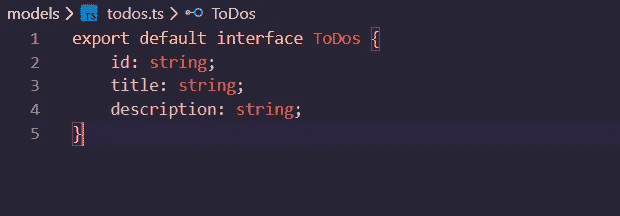
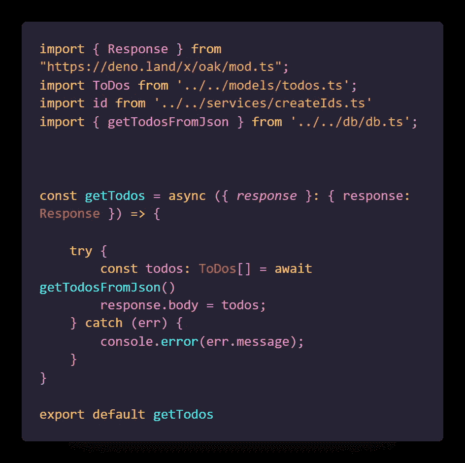

# 带 Deno 的 REST API

> 原文：<https://medium.com/analytics-vidhya/rest-api-with-deno-1e23b5bad1bd?source=collection_archive---------12----------------------->


# 什么是 Deno，它的主要特征是什么？

**Deno** 是 JavaScript 和 TypeScript 的运行时，基于 V8 JavaScript 引擎和 Rust 编程语言。它是由 Node 的最初创建者**瑞安·达尔**创建的。js，并且专注于安全性和生产力。

它由以下材料制成:

*   Rust (Deno 的内核用 Rust 编写，Node 的用 C++)
*   Tokio(用 Rust 编写的事件循环)
*   TypeScript (Deno 支持 JavaScript 和现成的 TypeScript)
*   V8(谷歌在 Chrome 和 Node 等平台上使用的 JavaScript 运行时)

尽管如此，Deno 仍处于开发阶段，它有许多缺陷。但是我们可以使用 Deno 构建简单的 REST API。Deno 项目中也没有 node_modules。

在这里，我将向您展示如何使用 Deno 构建一个带有 CRUD 操作的简单 REST API。我不打算使用任何数据库和所有存储在 JSON 文件中的数据。

首先，我们需要在电脑上安装 Deno。你可以根据你的操作系统参考[https://deno.land/](https://deno.land/)来实现。

在 windows 中打开 power shell，复制并粘贴它

`iwr https://deno.land/x/install/install.ps1 -useb | iex`

命令并按回车键(这将需要一些时间)

# 文件夹和文件结构


由于 Deno 中没有 node_modules，我们需要从互联网上导入库和依赖项。

让我们构建我们的 REST API(忽略截图中的红色下划线，我没有在 vs 代码中安装 Deno 扩展)

首先，我们创建主文件(index.ts)


```
// oak is pretty much similar to express in nodejs
import { Application } from “https://deno.land/x/oak/mod.ts";// Import App host and Port from config file
import { APP_HOST, APP_PORT } from “./config/config.ts”;// Import router from routes file
import router from ‘./routes/routes.ts’;*// Create Application Like Express* const app = new Application()*// Add Routes* app.use(router.routes())
app.use(router.allowedMethods())*// Display App running* console.log(`App Started at Port ${APP_PORT}`)await app.listen(`${APP_HOST}:${APP_PORT}`)
```

**config/config.ts** 文件


```
const env = Deno.env();export const APP_HOST = env.APP_HOST || "127.0.0.1";export const APP_PORT = env.APP_PORT || 5000;export const DB_PATH = env.DB_PATH || "./db/todos.json";
```

**models/todos.ts** 文件



```
export default interface ToDos { id: string; title: string; description: string;}
```

**routes/routes.ts** 文件


```
import { Router } from "https://deno.land/x/oak/mod.ts";import getTodos from './todos/getTodos.ts';import getTodo from './todos/getTodo.ts';import addTodo from './todos/addTodos.ts';import deleteTodo from './todos/deleteTodo.ts';import editTodo from './todos/editTodo.ts'; const router = new Router()router.get('/todos', getTodos) router.get('/todo/:id', getTodo)router.post('/addTodo', addTodo)router.put('/editTodo/:id', editTodo)router.delete('/deleteTodo/:id', deleteTodo)export default router;
```

**db/todos.json** 文件


```
[{"id":"010fbf79-048e-4508-ac65-5c8b326aa026","title":"Learn TypeScript","description":"TypeScript is typed version of JavaScript"},{"id":"38bd9aad-4047-47e1-b879-7a9ab77761c5","title":"Learn React","description":"React is a Front-End web Library"},{"id":"81ded252-661c-4fb1-a1e0-aad717b84891","title":"Learn Deno","description":"Deno is the next version of nodejs"}]
```

**db/db.ts** (我们从 todos.json 文件中添加和获取数据的地方)文件


```
import { DB_PATH } from '../config/config.ts';import ToDos from '../models/todos.ts';export const getTodosFromJson: () => Promise<ToDos[]> = async () =>{try {*// Read Files In Deno* const data: any = await Deno.readFile(DB_PATH);*// Decode Data From File* const decode = new TextDecoder()const decodedData = decode.decode(data)return JSON.parse(decodedData)} catch (err) {console.error(err.message);}}export const writeDataToJson: (*todos*: ToDos[]) => Promise<void> = async (*todos*: ToDos[]): Promise<void> => {try {*// encode Json*const encode = new TextEncoder();*// Write Files in Deno*await Deno.writeFile(DB_PATH, encode.encode(JSON.stringify(*todos*)))} catch (err) {console.error(err.message);}}
```

**routes/todos/gettodos . ts**文件



```
import { Response } from "https://deno.land/x/oak/mod.ts";import ToDos from '../../models/todos.ts';import id from '../../services/createIds.ts'import { getTodosFromJson } from '../../db/db.ts';const getTodos = async ({ *response* }: { response: Response }) => {try {const todos: ToDos[] = await getTodosFromJson()response.body = todos;} catch (err) {console.error(err.message);}}export default getTodos
```

**routes/todos/gettodo . ts**文件


```
import { Response } from "https://deno.land/x/oak/mod.ts";import { getTodosFromJson } from '../../db/db.ts';const getTodo = async ({ *params*, *response* }: { params: any, response: Response }) => {const id = params?.idif (!id) {response.status = 400;response.body = { msg: 'Invalid Id' }}const todos = await getTodosFromJson()const todo = todos.find(*todo* => *todo*.id === id)if (!todo) {response.status = 404;response.body = { msg: `No Todo Found on ${id}` }return;}response.status = 200;response.body = todo;}export default getTodo
```

**routes/todos/addtodos . ts**文件


```
import { Request, Response } from "https://deno.land/x/oak/mod.ts";import { v4 as uuid } from "https://deno.land/std/uuid/mod.ts";import ToDos from '../../models/todos.ts';import { writeDataToJson, getTodosFromJson } from '../../db/db.ts';const addTodo = async ({ *request*, *response* }: { request: Request, response: Response }) => {*// Check Request Has a body or not*if (!request.hasBody) {response.status = 400;response.body = { msg: "Invalid data, Please Add Title and Description" };return;}*// Get Title and description from Request*const {value: { title, description }} = await request.body();*// Check title and description is valid*if (!title || !description) {response.status = 422;response.body = { msg: "Title and Description is required" };return;}*// Create New Todo*const newTodo: ToDos = { id: uuid.generate(), title, description }*// Get All Todos*let allTodos: ToDos[] = await getTodosFromJson()*// Add New Todo to allTodos Array*allTodos = [newTodo, ...allTodos]*// Save Data In ToDos.json File*await writeDataToJson(allTodos)*// Response To the Client*response.body = { msg: "New Todo Created", newTodo };};export default addTodo
```

**routes/todos/edit todo . ts**文件


```
import { Response, Request } from "https://deno.land/x/oak/mod.ts";import { getTodosFromJson, writeDataToJson } from '../../db/db.ts';import ToDos from '../../models/todos.ts';const editTodo = async ({ *params*, *request*, *response* }: { params: any, request: Request, response: Response }): Promise<void> => {try {*// Save todo id to a variable*const id = params.id;*// Check Request Has a body or not*if (!request.hasBody) {response.status = 400;response.body = { msg: "Invalid data, Please Add Title and Description" };return;}*// Get Title and description from Request*const {value: { title, description }} = await request.body();*// Check title and description is valid*if (!title || !description) {response.status = 422;response.body = { msg: "Title and Description is required" };return;}*// Get All Todos From Json File And Save it in to a Variable*let allTodos: ToDos[] = await getTodosFromJson();*// Check if todo is here in that Id sent by client*const todo: ToDos | undefined = allTodos.find((*todo*: ToDos) => *todo*.id === id)*// check todo is undefined, if so then response 404*if (!todo) {response.status = 404;response.body = { msg: `No Todo Found on this ${id} id` }return;}*//    Add New Title And Description to Old One*todo.title = title;todo.description = description;await writeDataToJson(allTodos)response.status = 200;response.body = { msg: "Todo has been Edited", todo }} catch (err) {console.error(err.message);}}export default editTodo;
```

**routes/todos/delete todo . ts**文件


```
import { Response } from "https://deno.land/x/oak/mod.ts";import { getTodosFromJson, writeDataToJson } from '../../db/db.ts';import ToDos from '../../models/todos.ts';const deleteTodo = async ({ *params*, *response* }: { params: any, response: Response }): Promise<void> => {try {*// Save todo id to a variable*const id = params.id;*// Get All Todos From Json File And Save it in to a Variable*let allTodos = await getTodosFromJson();*// Check if todo is here in that Id sent by client*const index = allTodos.findIndex((*todo*: ToDos) => *todo*.id === id)*// if todo is here index > 0**// if todo is not here index = -1**// check index < 0, if so then response 404*if (index < 0) {response.status = 404;response.body = { msg: `No Todo Found on this ${id} id` }return;}*// if index > 0 then filter the array and delete todo and save*allTodos = allTodos.filter((*todo*: ToDos) => *todo*.id !== id)await writeDataToJson(allTodos)response.status = 200;response.body = { msg: "Todo has been Deleted" }} catch (err) {console.error(err.message);}}export default deleteTodo;
```

现在我们简单的 REST API 完成了。要运行 server，我们需要做的就是打开项目文件夹中的 cmd 或终端并运行

# **deno run-allow-all index . ts**


yot 会得到这样的消息。现在，您可以使用 postman 这样的工具来测试您的 REST API。

Github 回购:-[https://github.com/Hasi6/REST-API-Using-Deno](https://github.com/Hasi6/REST-API-Using-Deno)

这就是快乐编码。谢谢你。