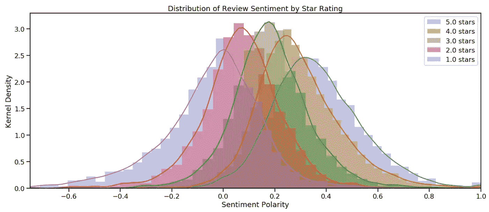
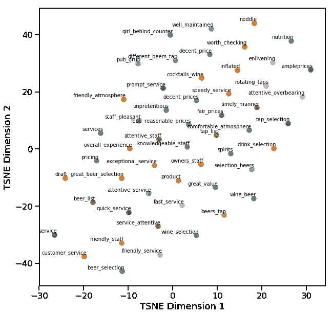

# 餐馆评论分析

> 原文：<https://medium.com/analytics-vidhya/restaurant-reviews-analysis-3feed3764592?source=collection_archive---------11----------------------->

# 网页抓取

数据科学更令人沮丧的一个方面是收集大量的好数据。在我最近的项目中，我实现了一个**网络抓取器来收集来自 yelp.com 的餐馆评论文本**。我曾计划使用 yelp API，但很快发现它仅限于为每个企业返回 3 条评论。这对于我的特定项目来说是不可接受的，所以我决定第一次尝试抓取…我必须说，网络抓取有一些非常令人满意的东西。每次我的循环将从另一个网页提取业务和审查数据，我都觉得自己生活在危险的 T2。我应该在这里澄清一下，这些数据并不是以滥用的方式收集的——搜集发生在一天的过程中，并且只针对这个项目所需的数据集。此外，收集的数据不会用于任何商业目的。结束免责声明。

我用 ***请求*** 和 ***BeautifulSoup*** 来抓取网页。我使用 requests.get(url)只是为了获取网页内容。在那里，我使用请求返回的内容创建了一个 BeautifulSoup 对象。一旦创建了 BeautifulSoup 对象，我就可以立即遍历页面内容或者保存该对象供以后使用。为了定位和访问我的 soup 对象中的条目，我需要知道一些 html 标签和类名。这些可以通过访问 yelp 评论页面的 url，并在 Chrome 中使用 *inspect* 查看页面内容来找到。我遇到的一个挑战是 yelp 上的一些评论页面使用不同的 html 结构，所以我被迫为评论页面创建两种不同风格的 scraper 函数。完成后，我得到了纽约州奥尔巴尼市 1081 家餐馆的 59274 条评论。

要查看我的 web scraper 代码，请访问该项目的 Github 资源库。我在这里提供了[网络抓取笔记本的直接链接。](https://github.com/DTrimarchi10/nlp_yelp_review_data/blob/master/Project_Data_Gathering.ipynb)

# 文本分析

有一个很棒的 python 库叫做 ***textblob*** ，内置了测量一段文字的情绪的函数。参见下面的片段。

```
from textblob import TextBlob
my_text_blob = TextBlob("My random block of text")
my_test_blob.sentiment.polarity
```

我将每条评论的极性测量值与餐馆评论者给出的星级进行了比较。谢天谢地，他们相处得很好。



每组评论(按星级分组)遵循正态分布。此外，情绪与星级相匹配，1 星评论在群体中情绪最负面时达到峰值，5 星评论在更积极的方向达到峰值。这可能看起来不太有趣，但它确实意味着评论文本本身的**情感与星级**一致。如果它们不一致，我会开始质疑我的数据、评级系统或 texblob 的能力。

由于来自 texblob 的**情绪值是连续的** (-1 比 1)，我能够使用它来获得评论数据的更细微的视图，例如在更细粒度的尺度上随时间推移的评论情绪。

对评论文本数据的进一步分析包括使用***gensim . models . phrases***库来查找在我的数据集中使用的短语。这样做了两次。首先，得到二元模型。第二，从已经有**二元模型**的文本中获取二元模型——这将产生**三元模型**和 4 元模型……四元模型……或者其他任何应该被称为的东西。

总之，**gensim 分析会取出宝石，如**:

> 免费赠送 _ 薯片 _ 莎莎
> 尝起来 _ 喜欢 _ 纸板
> 冷 _ 芝麻 _ 面条
> 脆 _ 外 _ 软 _ 内
> 爱 _ 恨 _ 关系
> 服务员 _ 似乎 _ 恼火
> 呆 _ 远 _ 远 _ 远

老实说，语法分析可能是这个项目中最有趣的部分。**调整 gensim phraser 阈值和评分功能可能会极大地影响我的短语质量。**我发现“ *npmi* ”评分会返回更多短语，但它们没有使用默认评分器时返回的那些敏感。我的 phraser 拟合函数包含在下面。它返回一个合适的短语，然后可以应用于任何文本块。

```
#Function Definition
def fit_phraser(sentences, 
                min_count=5, 
                threshold=8, 
                scoring='default'):
    """
    This function returns a gensim bigram phraser. The phraser is fit to the sentences passed in and passes the min_count, threshold, and scoring parameters to Phrases in gensim.models.
    """ bigram = Phrases(sentences=sentences, 
                     min_count=min_count, 
                     threshold=threshold, 
                     scoring=scoring)
    return Phraser(bigram)#Fit and apply bigram Phraser to text
bigram_phraser = fit_phraser(all_sentences)
phrased_sentence = bigram_phraser[text_block]
```

措辞之后，我使用 TF/IDF 分析来提取每个企业的关键词。这是通过为每个星级餐厅创建评论文档，然后对文档集执行 TF/IDF 分析来完成的。我用了***sk learn . feature _ extraction . text . tfidf vector er***得到单词分数。因为我已经对我的评论文本进行了清理、标记和措辞，所以我需要为 TfidfVectorizer 中的预处理器和标记器使用一个哑函数。令我惊讶的是，TF/IDF 分析运行得相当快。请参见下面的矢量器对象实例化:

```
#Instantiate TfidfVectorizer object
tfidf_vectorizer = TfidfVectorizer(ngram_range=(1,1),
                                   tokenizer=dummy_function,
                                   preprocessor=dummy_function,
                                   token_pattern=None)#The dummy function simply returns the document.
def dummy_function(doc):
    return doc
```

提取关键词后。我决定生成**单词嵌入模型，以便测量单词之间的相似度**。这是使用***gensim . models . word 2 vec***矢量器完成的。

```
#Words to measure similarity
positive = ['beer_selection','draft','service']#number of words to put into word_list
n_words = 10model = Word2Vec(doc_list, 
                 size=20, 
                 window=5, 
                 min_count=1,
                 workers=4)model.train(doc_list, 
            total_examples=model.corpus_count,
            epochs=10)word_list = [w[0] for w in model.wv.most_similar(
                           positive=positive, topn=n_words)]
```

这将返回一个单词列表，这些单词与传递到模型中的正面单词最相似。因为单词向量是 20 维的，所以需要降维以便图形化地查看单词距离。我用了来自***sk learn . manifold . tsne***的 t 分布随机邻居嵌入(t-SNE)降维。使用 5 星评论来训练模型的单词相似度的结果图如下:



TSNE 地块的代码在我的知识库中提供，链接如下。

我真的很喜欢这个项目的网页抓取和文字分析部分。除了这篇博文中讨论的部分，我还将一系列模型与评论文本相结合，以预测星级。我可能会创建一个单独的博客帖子来讨论这些模型，但是这个项目的所有项目 jupyter 笔记本和 python 文件都可以在 [GitHub repo 这里](https://github.com/DTrimarchi10/nlp_yelp_review_data)查看。