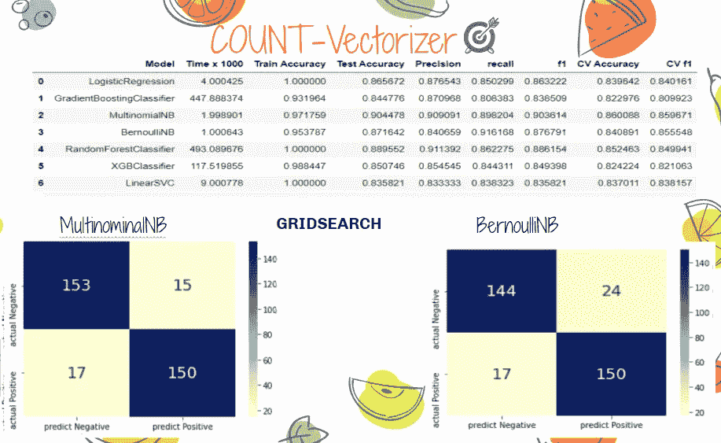

# 餐馆评论:情感分析和推荐

> 原文：<https://medium.com/analytics-vidhya/restaurant-reviews-sentiment-analysis-and-reccomendation-9bdf31a0b20?source=collection_archive---------4----------------------->

照片由[丹金](https://unsplash.com/@danielcgold?utm_source=medium&utm_medium=referral)在 [Unsplash](https://unsplash.com?utm_source=medium&utm_medium=referral) 上拍摄

在本文中，我们将对伦敦前 300 家餐馆评论进行情感分类，并通过餐馆描述、摘要和用户评论使用余弦相似度开发推荐系统。最后，我们将被部署在 Flask 上。

首先，让我们用**来定义这个问题。**

我们先来看一下对排名前 300 的餐厅进行情感分析的大致情况。人们最喜欢这些餐馆的什么特点？或者他们抱怨最多的是什么？

对 TripAdvisor.com 的正面和负面评价

我们将关注的另一个问题是，假设我们饿了，我们将去我们经常去的餐馆，但是 Ops！

那天餐馆关门了。那么看看其他 10 家和我们最喜欢的相似的餐馆怎么样？那我们开始吧！

# 数据收集和存储数据库

我用 BeautifulSoup 库从**tripadvisor.com**抓取数据，并存储到 MongoDB 中。

存储到 MongoDB

MongoDB 是一个灵活的数据库。如果结构化数据库中有 4 个字段，如果我们必须填充全部 4 个字段，那么在 MongoDB 中不会出现这种情况。我们可以定义任意多的列，也可以输入不完整的列。

# **探索数据**

我收集的数据量

伦敦总共有 19k 家餐厅，但我没有和它们都合作过。

当我们查看“信息”栏时，我们看到的“尝试”代表土耳其里拉。如果我们把它转换成英镑，它会更正确:)这在推荐系统中是一个有用的特性，但是我没有使用它。那我们准备好了就来介绍我们的栏目吧。“信息”栏包含价格范围，特殊饮食(素食友好，纯素食选择，无麸质选择等。)、膳食(晚餐、午餐等。)、美食和特色(送货、外卖、预订、座位、高脚椅、无障碍轮椅、免费 Wifi、接受信用卡、餐桌服务、数字支付、自带设备等。).“总结”栏目是餐厅介绍。

当我们看图表时，我们看到极性一般在 0 以上，评级大多在 4 以上。用户评论的字数很少超过 85。像食物和服务这样的词是评论中最常见的词，这并不奇怪。

# 预处理文本

在将其放入模型之前，我们应该清除文本中的特殊字符、表情符号、停用词、数字，并删除大小写分隔，以便模型不会将同一个词视为不同。此外，分离单词的词根将减少我们将包括在模型中的单词的数量。我用雪球图书馆把它挖了出来。

现在，我们可以使用文本挖掘算法。

# 分类

我们看到 EDA 的部分，正面评论似乎占主导地位。

虽然我们的模型可以以很高的比率预测正面评论，但它将无法预测负面评论，所以我使用了随机欠采样方法。

我们不能在 ml 算法中直接使用文本数据。为了在机器学习算法中使用它，我们必须将文本转换为数字特征向量。为此，我们可以使用 Tfidf 和 CountVectorizer。我们可以用 CountVectorizer 统计一个单词在文档中出现的次数。Tfidf 使用一种统计方法来做这件事。我用计数向量器得到了多项式朴素贝叶斯的最佳结果。

功能重要性:

对排名前 300 的餐厅的负面评价很突出:“平淡”、“冷”、“差”(对食物而言)、“粗鲁”(对服务员而言)。

# 建议

1.  基于餐厅信息，描述(摘要):

2.基于餐厅信息、描述(摘要)和用户评论:

瓶

Flask 是一个微型框架，允许你开发 web 应用程序。在项目的最后阶段，我用 Flask 部署了我的推荐项目。

如果你想找到和你最喜欢的餐厅相似的餐厅，你可以访问[我的 heroku 页面！](https://london-restaurant-rec.herokuapp.com)

 [## aybukemeydan/restaurant reviews-感觉和建议

### permalink dissolve GitHub 是超过 5000 万开发人员的家园，他们一起工作来托管和审查代码，管理…

开源代码库](https://github.com/aybukemeydan/RestaurantReviews-SentimentAndRecommendation/blob/main/recc-flaskapp/flask.gif) 

感谢阅读！你可以在 [linkedin](https://www.linkedin.com/in/ayb%C3%BCke-meydan-330363162/) 和 [github](https://github.com/aybukemeydan) 上找到我。