# 基于机器学习的餐馆销售预测

> 原文：<https://medium.com/analytics-vidhya/restaurant-sales-prediction-using-machine-learning-24928a2e3206?source=collection_archive---------6----------------------->

餐馆销售预测对任何餐馆生意的成功都起着重要的作用。具有良好商业知识的餐馆老板大多专注于餐馆销售，以便为成功经营餐馆业务进行有效的规划。

我们将讨论在考虑影响销售的多种因素的情况下，机器学习如何帮助更准确地预测销售。我们将使用 Azure 机器学习工具来开发模型，并使用 web 服务来部署它。

想象一下，如果你是一个餐馆老板，需要找出未来 3 个月的销售预测。根据业务性质确定最佳的预测算法是一个非常繁琐和耗时的过程，这样会更准确地预测销售额。然而，如果你只是将信息输入手机或网站，并获得销售预测，那会怎么样呢？听起来很棒吧！这个解决方案有助于使用机器学习技术确定最佳算法，并通过几次点击部署 web 服务，我们可以在应用程序或网站甚至 excel 上使用它。

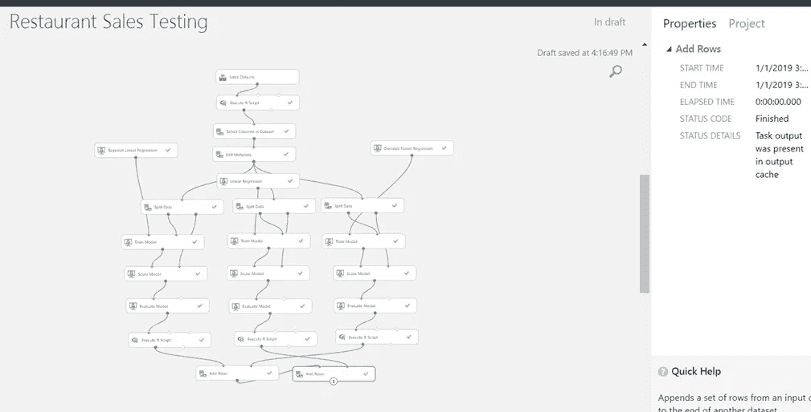

对于对机器学习没有任何概念的人来说，它是人工智能的一种应用，为系统提供了自动学习和根据经验进行改进的能力，而无需显式编程。有 3 种机器学习。监督、非监督和强化学习。在本文中，我们将重点关注监督机器学习。

对于本文，我们假设您已经掌握了一些关于 Azure ML studio 的知识(如何注册)和 R 语言的基础知识。

好了，说够了！我们开始吧！！！

## **第一步:在 Azure Machine learning studio 中创建一个空白实验**

首先，你要打开 Azure 机器学习工作室，点击新的实验。

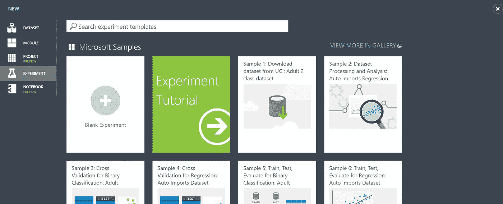

点击“空白实验”。一旦你打开实验，你将默认看到下面的实验标题和日期。你可以通过点击来重命名你的实验。

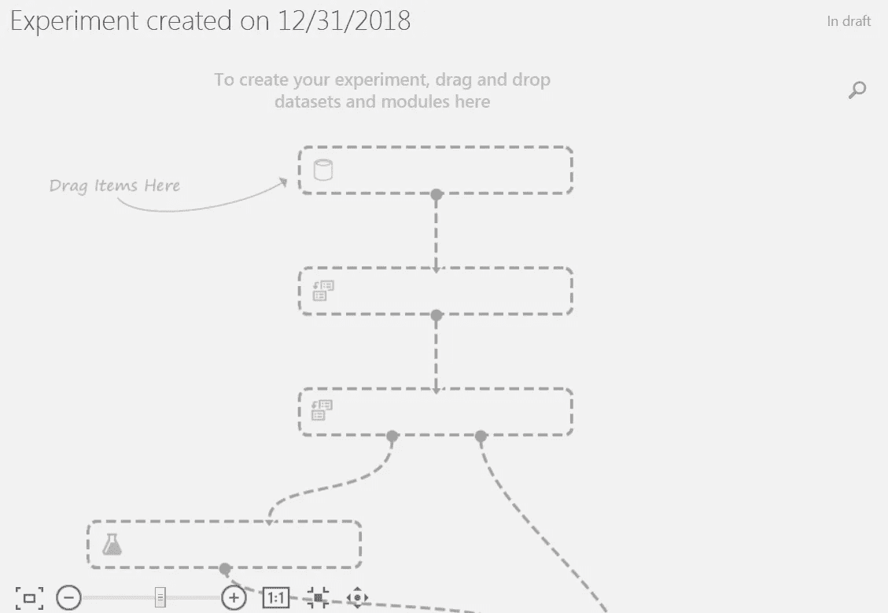

在左侧，您会发现不同的选项，我们可以使用它们从头开始开发模型。

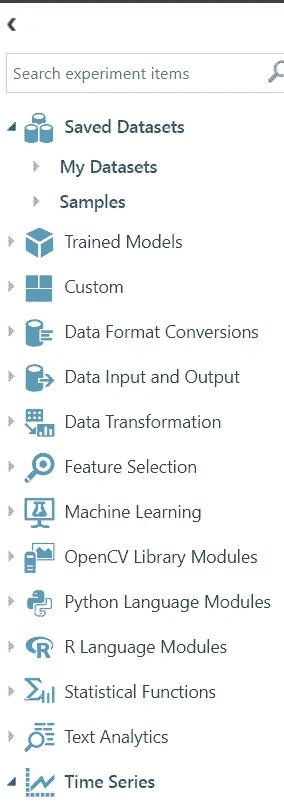

我不会详细讨论每个选项，因为我们的重点是开发销售预测模型。第二步是准备我们将用来训练模型的数据集。您可以导入数据或手动创建数据，也可以选择使用 Azure ML studio 提供的样本数据集，并根据您的需求进行修改。

## **第二步:导入餐厅销售数据**

我从其中一家餐馆获取了 11 个菜单项的销售数据样本。销售数据包括菜单 Id、日期、销售额、天气、假日、节日和促销。

天气被分类为 0 代表寒冷，1 代表温暖。同样，我将假日分类为 0 表示没有假日，1 表示有假日。除了天气和假期，我们还分别考虑了节日和当月的促销活动。这些因素很重要，因为它们会极大地影响餐馆的销售。

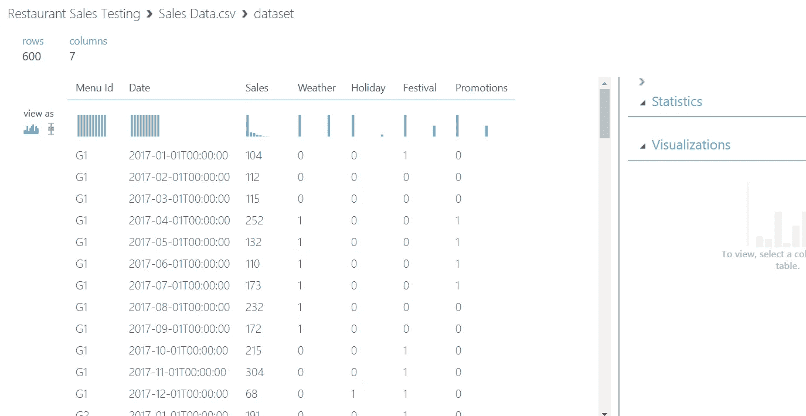

## **第三步:根据模型要求清理销售数据**

下一步是清理数据，只选择需要的列来执行实验。为此，我们使用 R 脚本将日期列转换为月份和年份。

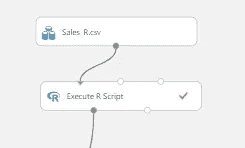

下面的 R 脚本用于添加 2 列月和年。

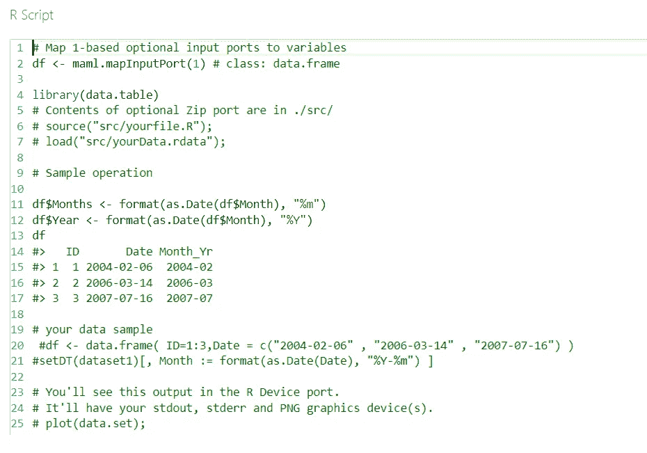

在执行 R 脚本之后，您会发现另外两列 Month 和 Year。

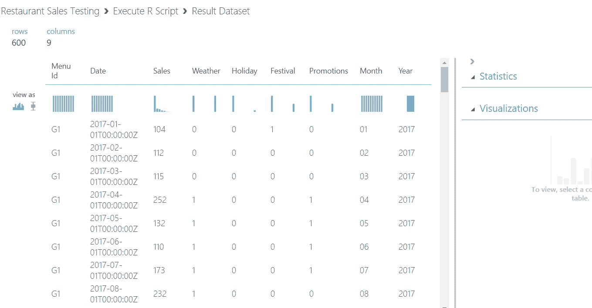

## **第四步:火车模型**

好了，下一步是训练模型。您可以用两种方式测试模型。首先，您可以使用备忘单并确定最佳的机器学习算法，或者您可以尝试不同的算法并选择误差较低的最佳算法。我们将采用第二种方法。

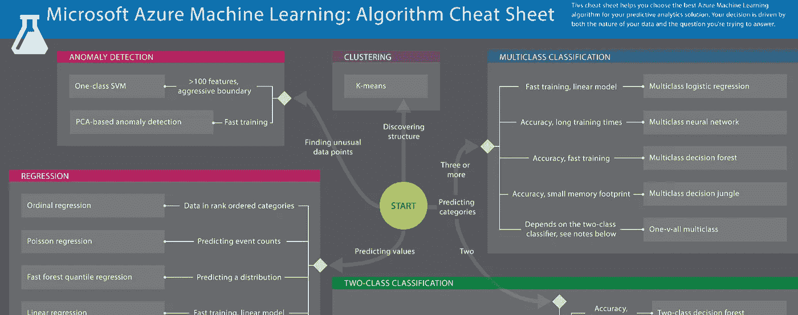

为了识别给出最小误差的算法，我们将把数据分成训练和测试数据。通过训练数据，我们将应用算法来预测销售，通过测试数据，我们将比较预测销售和实际销售。为了分割数据，我们将使用如下所示的分割模块。

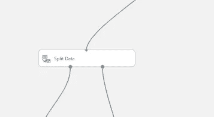

对于这个实验，我们将数据分成 75%用于训练模型，剩下的 25%用于测试模型。拆分数据后，我们将对训练数据应用贝叶斯线性回归算法，并使用如下所示的评分模型将预测值与测试数据进行比较。

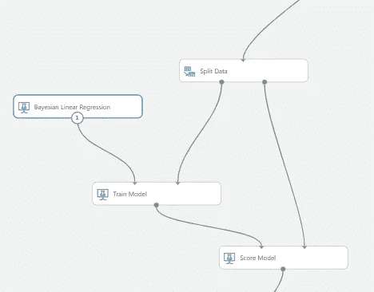

## **第五步:评估结果**

完成实验后，我们将使用评估模型来评估结果。我们必须检查的重要因素是决定系数。决定系数越接近 1，模型越好。

在我们的例子中，决定系数(R2)是 0.9213，这表明 92 %的数据可以用模型来解释。

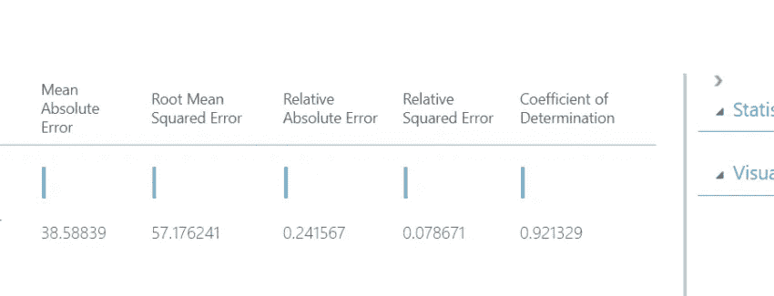

让我们运行其他算法，看看我们是否可以获得更好的准确性。下面是运行其他模型时的结果。

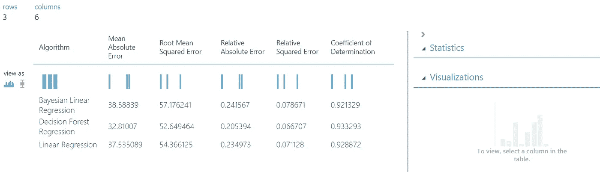

我们使用贝叶斯线性回归、决策森林回归和线性回归对模型进行了检验。通过查看结果，决策森林回归是最适合的算法，平均绝对误差为 32.81

## **步骤 6:部署 web 服务**

下一步是创建和部署 web 服务。成功运行实验后，我们将选择决策森林回归训练模型，并单击“预测 Web 服务[推荐]”。

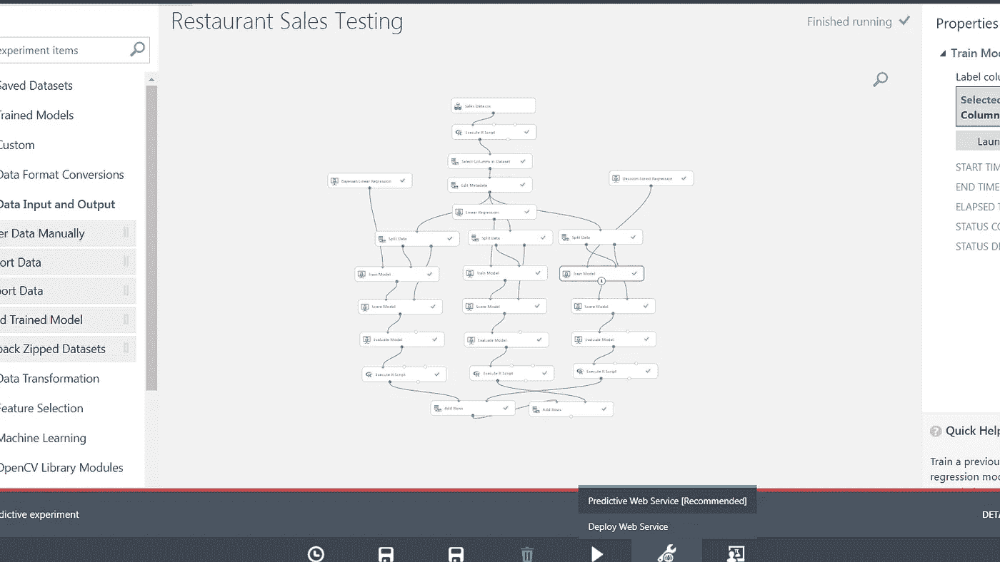

您将看到 Webservice 预测实验正在创建，如下所示，带有 Webservice 输入和输出模块。我们将再次运行模型并检查输出。

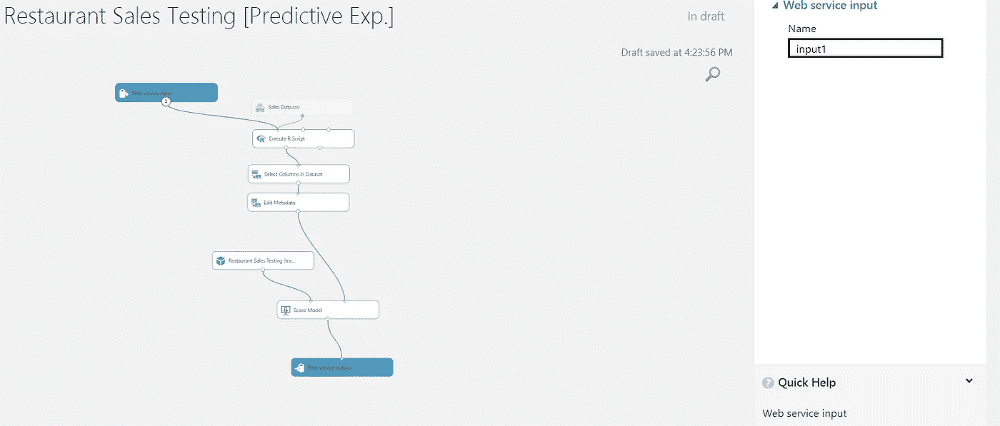

运行模型并单击 Deploy Web service 后，它将重定向到如下所示的页面。

您将看到 API 密匙是自动生成的，我们将使用它通过 Web 服务访问模型。此外，我们可以下载 excel 插件并远程运行模型，不会出现任何问题。

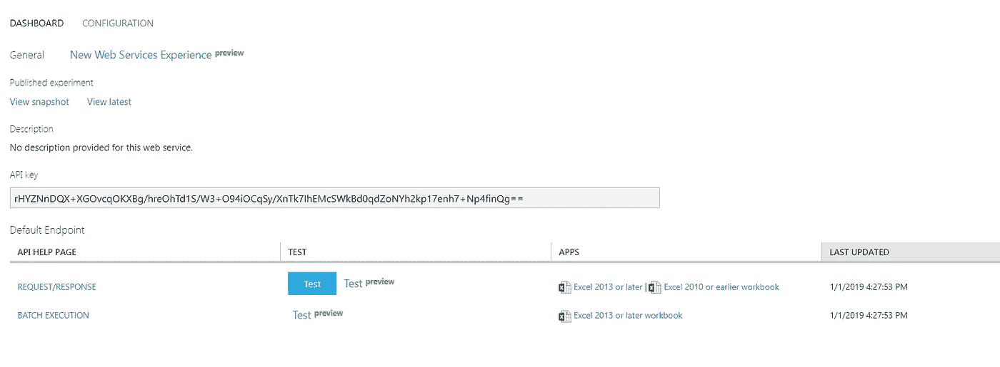

厉害！我们刚刚开发了完整的餐馆销售预测模型，并部署了 Web 服务。