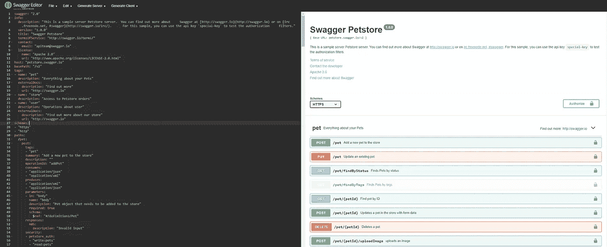

# RESTful API，如何|第 1 部分—设计

> 原文：<https://medium.com/analytics-vidhya/restful-api-how-to-part-1-design-4f89803dff15?source=collection_archive---------12----------------------->


设计和实施服务是我日常工作的一部分，我想分享一些最佳实践和技巧，可以帮助你的工作。

在这个关于 RESTful API 的系列文章中，我将讨论几个主题:

*   **设计**
*   履行
*   测试
*   部署

如今微服务世界是由 restful APIs 驱动的。有很多文章是关于什么是 RESTful APIs 以及它们能做什么的。

在这篇文章中，我想告诉你如何组织你的工作流程(通常在一个团队中)，以便采用**的最佳实践**，并从这项技术中获得最大收益。对于这个范围，我们将创建一个简单的应用程序，一个待办事项列表。在这个旅程的最后，您将已经创建了一个工作服务器。

在最初的步骤中，我们将面对**设计**部分，通常被认为是理所当然的，但却是项目中最重要的**阶段之一。**

# 一些信息

> 我们将使用 [**swagger editor**](https://editor.swagger.io/) 来设计我们的 API， [**python**](https://www.python.org/) 语言来创建微服务，最后 [**Docker**](https://www.docker.com/) 来交付最终的解决方案。所有的代码都可以在这个 [**回购**](https://github.com/dandpz/restfulapi-howto) 中找到。

准备好了吗？我们走吧！


# 方案

一个典型的场景是将功能**需求**转化为技术需求。要么你将实现所请求功能的代码，要么你将管理一个开发团队，描述服务应该如何工作是非常重要的。对于这个范围，标准文档非常合适。遵循 **OpenAPI** 规范，你可以对服务做一个容易理解的描述。

让我们现在开始设计我们的微服务。

首先让我们转到 https://editor.swagger.io/的。编辑器已经填充了 *petstore* 示例，删除所有文本并从头开始！



Swagger 编辑器默认页面

在 Swagger 的描述符中有许多标签。让我们看看他们:

## **一般数据**

开始时，将这几行添加到空白页:

```
swagger: “2.0”
info:
 description: “This is an example server for TO-DO list. \nThis is part of the collection of articles dedicated to the development of RESTful API. To know more visit the [repository](https://github.com/dandpz/restfulapi-howto) containing the code for these examples and more.”
 version: “1.0.0”
 title: “TO-DO list”
 license:
 name: “MIT”
 url: “https://choosealicense.com/licenses/mit/"
host: “localhost:8080”
basePath: “/v1”
tags:
- name: “todo”
 description: “Everything about your Todo”
schemes:
- “https”
- “http”
```

第一个片段描述了 swagger 版本，关于我们的 API 服务的一些信息，主机和版本，API 将使用的标签和方案。

## 模型

我们现在应该描述模型，以便定义将存储在服务器中的**对象**。
对于这个范围，有一个*定义标签:*

```
definitions:
  Todo:
    type: "object"
    properties:
      id:
        description: "The id of this record, generated by the server"
        type: "integer"
        format: "int64"
      name:
        type: "string"
      description:
        type: "string"
      dueDate:
        type: "string"
        format: "date"
      status:
        type: "string"
        description: "Todo Status"
        enum:
        - "done"
        - "late"
        - "in progress"
        - "to do"
    xml:
      name: "Todo"
    example:
      name: "Xmas presents"
      dueDate: "2020/12/25"
      description: "remember to buy Christmas presents"
      status: "to do"

  PaginatedResponseData:
    type: "object"
    properties:
      total:
        type: "integer"
      count:
        type: "integer"
      page:
        type: "integer"
      size:
        type: "integer"
      resources:
        type: "array"
        items:
          type: "object"
          properties: {}
    xml:
      name: "PaginatedResponseData"
    example:
      total: 10
      size: 5
      count: 5
      resources:
      - {}
      - {}
      - {}
      - {}
      - {}
      page: 1
```

> 这里我们刚刚定义了一个 Todo 对象及其所有字段，后面是示例数据。我们还为分页响应添加了一个模型。

## 小路

现在让我们关注一下*路径*标签，在这里您将描述您的服务的**端点**和客户端将调用的 **HTTP 动词**。

我们将有两条主要路径:

*   /todo
*   /todo/{todoId}

第一个将包含检索待办事项列表和创建新待办事项的方法。第二个是资源操作(检索、更新、删除)的路径。

让我们看看它们是什么样子:

```
paths:
  /todo:
    get:
      tags: 
      - "todo"
      summary: "Retrieve list of To-Do"
      description: "Return a paginated list of Todo objects"
      operationId: "getTodoList"
      produces:
      - "application/json"
      parameters:
      - $ref: '#/parameters/page'
      - $ref: '#/parameters/size'
      - in: "query"
        name: "status"
        description: "filter result on todo status"
        required: false
        type: "string"
        enum:
        - "done"
        - "late"
        - "in progress"
        - "to do"
      responses:
        "200":
          description: "Successful operation"
          schema:
            $ref: "#/definitions/PaginatedResponseData"
        "400":
          description: "Bad request"
        "401":
          description: "The request requires user authentication."
        "403":
          description: "The server understood the request, but is refusing to authorize it."
    post:
      tags:
      - "todo"
      summary: "Create a new Todo"
      description: "Create a Todo"
      operationId: "createTodo"
      consumes:
      - "application/json"
      produces: 
      - "application/json"
      parameters:
      - in: "body"
        name: "body"
        schema:
          $ref: '#/definitions/Todo'
        required: true
      responses:
        "201":
          description: "Created"
        "400":
          description: "Bad request"
        "401":
          description: "The request requires user authentication."
        "403":
          description: "The server understood the request, but is refusing to authorize it."
        "405":
          description: "Invalid input"

  /todo/{todoId}:
    get:
      tags: 
      - "todo"
      summary: "Retrieve Todo by Id"
      description: "Return a Todo object if exists"
      operationId: "getTodoById"
      produces:
      - "application/json"
      parameters:
      - in: "path"
        name: "todoId"
        type: "string"
        required: true
      responses:
        "200":
          description: "Successful operation"
          schema:
            $ref: "#/definitions/Todo"
        "400":
          description: "Bad request"
        "401":
          description: "The request requires user authentication."
        "403":
          description: "The server understood the request, but is refusing to authorize it."
        "404":
          description: "Resource not found"

    put:
      tags: 
      - "todo"
      summary: "Update existing Todo by Id"
      description: "Update a Todo object if exists"
      operationId: "updateTodoById"
      produces:
      - "application/json"
      parameters:
      - in: "path"
        name: "todoId"
        type: "string"
        required: true
      - in: "body"
        name: "body"
        schema:
          $ref: '#/definitions/Todo'
        required: true
      responses:
        "200":
          description: "Successful operation"
        "400":
          description: "Bad request"
        "401":
          description: "The request requires user authentication."
        "403":
          description: "The server understood the request, but is refusing to authorize it."
        "404":
          description: "Resource not found"

    delete:
      tags: 
      - "todo"
      summary: "Delete existing Todo by Id"
      description: "Delete a Todo object if exists"
      operationId: "deleteTodoById"
      produces:
      - "application/json"
      parameters:
      - in: "path"
        name: "todoId"
        type: "string"
        required: true
      responses:
        "200":
          description: "Successful operation"
          schema:
            $ref: "#/definitions/Todo"
        "400":
          description: "Bad request"
        "401":
          description: "The request requires user authentication."
        "403":
          description: "The server understood the request, but is refusing to authorize it."
        "404":
          description: "Resource not found"
```

基本上，我们添加了要执行的操作的方法。

> 在参数中，您可能已经注意到了*页面*和*大小*，它们引用了文件底部定义的标签**参数**，有助于避免代码重复。

## 安全性

现在是讨论安全会话的时候了，这需要另外写一篇文章，但是对于这个简单的例子，让我们为 RESTful API 使用一个基本的 **Auth** 。

```
securityDefinitions:
  BasicAuth:
    type: basic

security:
- BasicAuth: []
```

在第一个标签中，我们定义了类型为 *basic* 的 Auth，在第二个标签中，我们将它设置为整个项目的 Auth 方法。

## 概观

如果您遵循所有这些步骤，您应该会得到如下结果:


决赛成绩

我们刚刚定义了一个描述我们服务的最小文档。这个文档非常重要，在典型的工作流中，它是不同团队(通常是后端和前端)之间关于服务行为的**协议**。

# 结论

在本文中，我们讨论了 RESTful API 的**设计**,我们使用了 Swagger 编辑器，这是一个非常有用的工具，可以**改进**您的开发。

在构建服务描述的过程中，我们遇到了 swagger 语法的一部分，为了对它有一个完整的了解，你可以在官方网站上浏览文档。

在下一篇文章 中，我们将看到如何从我们刚刚描述的服务开始生成服务器。

**敬请期待！**

> 下一篇文章链接:[https://medium . com/@ daniele . dapuzzo/restful-API-how-to-part-2-implementation-E3 BCA 6072 b 70](/@daniele.dapuzzo/restful-api-how-to-part-2-implementation-e3bca6072b70)