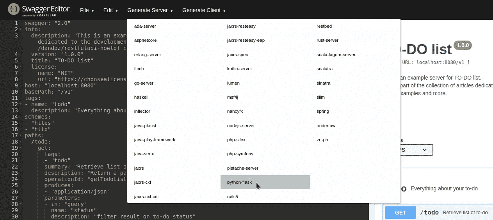

# RESTful API，如何|第 2 部分—实现

> 原文：<https://medium.com/analytics-vidhya/restful-api-how-to-part-2-implementation-e3bca6072b70?source=collection_archive---------7----------------------->


设计和实施服务是我日常工作的一部分，我想分享一些最佳实践和技巧，可以帮助你的工作。

在这个关于 RESTful API 的系列文章中，我将讨论几个主题:

*   [设计](/analytics-vidhya/restful-api-how-to-part-1-design-4f89803dff15)
*   **实施**
*   测试
*   部署

# 一些信息

> *我们将使用*[***swagger***](https://editor.swagger.io/)*来设计我们的 API，*[***python***](https://www.python.org/)*语言来创建微服务，最后*[***Docker***](https://www.docker.com/)*来交付最终的解决方案。所有的代码都可以在这个* [***回购***](https://github.com/dandpz/restfulapi-howto) *中找到。*

在[之前的](/@daniele.dapuzzo/restful-api-how-to-part-1-design-4f89803dff15)文章中，我们写了我们服务的 swagger 描述符。多亏了 Swagger 编辑器，可以下载不同编程语言的自动生成的服务器(见下图)。



生成服务器— Swagger 编辑器

让我们在编辑器页面点击*生成服务器*并选择 **python-flask** ，几秒钟后一个包含源代码的 ZIP 文件就会下载到你的电脑上。

生成的服务器是我们服务的一个存根，但是让我们避免创建项目、所有模型等所有无聊的东西，只留下业务逻辑来实现。它利用了[连接，一个由 Zalando 开发的 OpenAPI 框架，该框架包装了基于](https://pypi.org/project/connexion/) [OpenAPI 规范](https://www.openapis.org/)处理 http 请求的 Flask 服务器。

# 次要重构

> 此重构引用了旧版本的 swagger codegen，在新版本中可能没有必要。

乍一看，服务器似乎已经完成了，但是默认情况下它使用的是旧版本的 connexion，所以让我们做一些修改来改进它。

如果你按照 README.md 的说明去做，你会注意到 Swagger 页面和编辑器的略有不同。

首先，我们将编辑需求:

```
flask==1.1.1
werkzeug==0.16.0
connexion[swagger-ui]==2.5.1
python_dateutil==2.6.0
setuptools==40.8.0
swagger_ui_bundle==0.0.6
Flask-SQLAlchemy==2.4.1
```

在运行应用程序之前，让我们也编辑一下 *__main__。py* 文件，并添加一些我们稍后会用到的文件夹和文件。特别是，我们添加了一个包含不同环境配置的文件和一个包含数据库实例的文件。稍后我们将深入了解这两者。

> __main__。巴拉圭

```
#!/usr/bin/env python3

import connexion
from flask import Flask
from swagger_ui_bundle import swagger_ui_3_path
import os
from swagger_server.database import db

from swagger_server import encoder

options = {"swagger_path": swagger_ui_3_path}

def create_app():
    _app = connexion.App(__name__, specification_dir='./swagger/')
    _app.app.json_encoder = encoder.JSONEncoder
    _app.add_api('swagger.yaml', arguments={'title': 'TO-DO list'}, options=options, )
    configure_app(_app.app)
    init_app(_app.app)
    return _app

def configure_app(flask_app):
    flask_app.config.from_object(f"swagger_server.config.{os.getenv('APPLICATION_ENV', 'Development')}")

def init_app(flask_app: Flask):
    db.init_app(flask_app)

if __name__ == '__main__':
    app = create_app()
    app.run(port=app.app.config["PORT"])
```

现在我们已经设置了一些东西，我们可以继续实现业务逻辑和数据库集成了。正如你可能已经看到的，我们将使用 [Flask-SQLAlchemy](https://pypi.org/project/Flask-SQLAlchemy/) 一个 Flask 插件在 [SQLAlchemy](https://www.sqlalchemy.org/) 之上，这是一个著名的 ORM，可以让你轻松使用 SQL。

## 配置

首先，我们应该开始创建开发/测试/生产配置。

从默认配置值的基类开始，我们一次添加一个其他的；我们将使用环境变量来定义当前设置，以便“通过配置”运行我们的应用程序。

```
import os

class Config(object):
    PORT = 8080
    HOST = "0.0.0.0"
    DEBUG = True

    SQLALCHEMY_TRACK_MODIFICATIONS = False

class Development(Config):
    SQLALCHEMY_DATABASE_URI = 'sqlite:////tmp/test.db'
    FLASK_ENV = "development"

class Testing(Config):
    SQLALCHEMY_DATABASE_URI = 'sqlite:////tmp/test.db'
    FLASK_ENV = "development"

class Production(Config):
    PORT = os.getenv("PORT")
    HOST = os.getenv("HOST")
    DEBUG = False
    TESTING = False
    FLASK_DEBUG = False
    FLASK_ENV = "production"

    SQLALCHEMY_DATABASE_URI = os.getenv("DB_URI")
```

在 __main__。py 我们检查“APPLICATION_ENV”的环境变量值，如果没有找到，就给出一个默认值。

> 关于生产配置的一个特别注意事项是，我不喜欢为这个设置设置默认值，这样，如果出现问题，整个应用程序就不会开始避免隐藏可能的错误或安全漏洞。

## 证明

您可能已经注意到，在尝试运行应用程序时，控制台消息显示***“…x-basic info func missing”***。这是因为我们还没有定义一个方法来实现我们在 API 描述符中声明的身份验证。

因此，让我们开始创建一个文件 *auth.py* ，它包含一个方法，允许我们检查向我们的服务发送请求的客户端是否被允许这样做。

```
def basic_auth(username, password, required_scopes=None):
    if username == 'guest' and password == 'secret':
        return {
            'sub': 'guest',
            'valid': True
        }
    return None
```

我们刚刚定义了一个身份验证检查函数；这还不是全部，我们必须将这个函数链接到 swagger 文件，以便让 Connexion 将它添加到它的流中。

```
securityDefinitions:
  BasicAuth:
    type: "basic"
    **x-basicInfoFunc: "swagger_server.auth.basic_auth"**
```

这只是一个例子，在现实环境中，您可能会使用 Oauth2 流来检查调用者是否被允许使用这个服务。但这不是本文的目的。

## 数据库ˌ资料库

对于这个简单的应用程序，我们将使用 [sqlite](https://www.sqlite.org/index.html) 进行开发和测试，我们将在下一篇文章中看到如何处理生产数据库。

现在让我们为将要存储在数据库中的对象创建模型。我们将创建一个 DAO(数据访问对象),即一个表示数据库表模型的对象，它将包含 CRUD 操作的所有方法。
在数据库文件夹中，我们放置了另一个名为 models 的文件夹(我们可以保持一个更简单的方案，但是当我们有很多模型时这很有用，所以让我们试着把它变成一种习惯)。

对于待办对象模型，我们将定义我们在 API 定义中描述的所有字段。这一次我们将与数据库进行交互，因此它将与生成的模型略有不同。我们还添加了助手方法来调整数据库和控制器之间的对象。

```
import enum

from swagger_server.database import db
from swagger_server.models import Todo, PaginatedResponseData

class Status(enum.Enum):
    done = "done"
    late = "late"
    in_progress = "in progress"
    to_do = "to do"

class TodoModel(db.Model):
    __tablename__ = "todo"
    id = db.Column(db.Integer, primary_key=True)
    name = db.Column(db.String(64))
    description = db.Column(db.String(256), nullable=True)
    due_date = db.Column(db.Date, nullable=True)
    status = db.Column(db.Enum(Status), nullable=False)

    def to_obj(self) -> Todo:
        return Todo(
            id=self.id,
            name=self.name,
            description=self.description,
            due_date=self.due_date,
            status=self.status.value,
        )

    def __repr__(self):
        return "<Todo %r>" % self.name

    @classmethod
    def from_obj(cls, obj: Todo) -> "TodoModel":
        return cls(
            id=obj.id,
            name=obj.name,
            description=obj.description,
            due_date=obj.due_date,
            status=Status(obj.status)
        )

    def save(self):
        db.session.add(self)
        db.session.commit()

    @classmethod
    def get_all(
            cls,
            page: int = 1,
            size: int = 20,
            status: str = None
    ):
        if status:
            query = cls.query.filter_by(status=Status(status)).paginate(page, size, False)
        else:
            query = cls.query.paginate(page, size, False)
        total = query.total
        items = query.items
        return PaginatedResponseData(
            page=page,
            size=size,
            total=total,
            count=len(items),
            resources=[i.to_obj() for i in items],
        )

    @classmethod
    def get_by_id(cls, _id: str) -> Todo:
        res = cls.query.filter_by(id=_id).first_or_404()
        return res.to_obj()

    @classmethod
    def update_by_id(cls, _id: str, body: Todo):
        _ = cls.query.filter_by(id=_id).first_or_404()
        cls.from_obj(body).save()

    @classmethod
    def delete_by_id(cls, _id: str):
        res = cls.query.filter_by(id=_id).first_or_404()
        db.session.delete(res)
        db.session.commit()
        return res.to_obj()
```

现在是时候将控制器连接到我们的数据库了！

## 控制器

```
import connexion
from werkzeug.exceptions import BadRequest

from swagger_server.database.models.todo import TodoModel
from swagger_server.models.paginated_response_data import (
    PaginatedResponseData,
)  # noqa: E501
from swagger_server.models.todo import Todo  # noqa: E501

def create_todo(body):  # noqa: E501
    *"""Create a new to-do

    Create a to-do # noqa: E501

    :param body: 
    :type body: dict | bytes

    :rtype: None
    """* if connexion.request.is_json:
        body = Todo.from_dict(connexion.request.get_json())  # noqa: E501
        TodoModel.from_obj(body).save()
        return None, 200
    else:
        raise BadRequest("missing body")

def delete_todo_by_id(todoId):  # noqa: E501
    *"""Delete existing to-do by Id

    Delete a to-do object if exists # noqa: E501

    :param todoId: 
    :type todoId: str

    :rtype: Todo
    """* return TodoModel.delete_by_id(todoId)

def get_todo_by_id(todoId):  # noqa: E501
    *"""Retrieve to-do by Id

    Return a to-do object if exists # noqa: E501

    :param todoId: 
    :type todoId: str

    :rtype: Todo
    """* return TodoModel.get_by_id(todoId)

def get_todo_list(status=None, page=None, size=None):  # noqa: E501
    *"""Retrieve list of to-do

    Return a paginated list of to-do objects # noqa: E501

    :param status: filter result on to-do status
    :type status: str
    :param page: Page number
    :type page: int
    :param size: Number of records to return per page
    :type size: int

    :rtype: PaginatedResponseData
    """* return TodoModel.get_all(page, size, status)

def update_todo_by_id(todoId, body):  # noqa: E501
    *"""Update existing to-do by Id

    Update a to-do object if exists # noqa: E501

    :param todoId: 
    :type todoId: str
    :param body: 
    :type body: dict | bytes

    :rtype: None
    """* if connexion.request.is_json:
        body = Todo.from_dict(connexion.request.get_json())  # noqa: E501
        return TodoModel.update_by_id(todoId, body), 200
    else:
        raise BadRequest("missing body")
```

我们刚刚将所有端点映射到 DB 模型的方法。

您现在已经**准备好**通过 web 浏览器的 Swagger UI 进行一个简单的测试。尝试创建一些待办事项，编辑和删除它！

> 这只是熟悉 UI 的一个简单的手动测试。
> 在下一篇文章中，我们将讨论测试，如何向我们的应用程序添加单元测试，以及如何使用 Flask-Testing 框架来模拟客户端测试我们的 API。

## 记录

我们将使用 Flask 的默认记录器，我们不会为这个简单的应用程序添加太多定制。如果你想了解更多关于*烧瓶测井*的信息，请访问[烧瓶文档](https://flask.palletsprojects.com/en/1.1.x/logging/)。

现在我们想在应用程序中引入一个日志记录器，假设我们想知道发送请求的客户机的 IP 地址。我们可以使用烧瓶记录器:

```
from flask import current_app, request

def create_todo(body):  # noqa: E501
    *"""Create a new to-do

    Create a to-do # noqa: E501

    :param body: 
    :type body: dict | bytes

    :rtype: None
    """* current_app.logger.debug(f"Client IP ADDRESS: {request.remote_addr}")
    if connexion.request.is_json:
        body = Todo.from_dict(connexion.request.get_json())  # noqa: E501
        TodoModel.from_obj(body).save()
        return None, 200
    else:
        raise BadRequest("missing body")
```

这里我们已经导入了 *current_app* 来使用记录器。一切看起来都很完美，但是正如你所看到的，使用这个方法我们应该在每个方法中添加对记录器的调用，现在它是**简单的**，因为我们只想记录远程 IP 地址，但是**如果**我们会知道其他信息，或者更糟，如果我们添加了更多信息，然后我们想要修改它们。

我们可以使用 Python 中的一个有用工具:装饰器。

让我们开始在 util.py 中定义我们的装饰器:

```
def log(func):
    @wraps(func)
    def wrapper(*args, **kwargs):
        current_app.logger.debug(f"Client IP ADDRESS: {request.remote_addr}")
        current_app.logger.debug(f"Client IP ADDRESS: {request.endpoint}")
        current_app.logger.debug(f"Client IP ADDRESS: {request.user_agent}")
        return func(*args, **kwargs)
    return wrapper
```

现在很容易使用它，只需将" **@log"** 放在我们想要修饰的函数之前，让我们看看会发生什么:

```
@log
def get_todo_list(status=None, page=None, size=None):  # noqa: E501
    *"""Retrieve list of to-do*--------------------[2020-02-02 19:21:53,934] DEBUG in util: Client IP ADDRESS: 127.0.0.1
[2020-02-02 19:21:53,934] DEBUG in util: Client IP ADDRESS: /v1.swagger_server_controllers_todo_controller_get_todo_list
[2020-02-02 19:21:53,934] DEBUG in util: Client IP ADDRESS: Mozilla/5.0 (X11; Linux x86_64) AppleWebKit/537.36 (KHTML, like Gecko) Chrome/78.0.3904.97 Safari/537.36
```

如您所见，我们现在可以在控制台中查看日志，只添加一行来修饰目标函数。如果我们想改变什么，我们只需要编辑我们的实用函数！

这就是本文的全部内容，我们已经看到了如何实现我们在前面的章节中设计的内容。在下一篇文章中，我将向您展示如何向应用程序中添加测试，以及为什么它们是开发中的要素。

> **提醒:**你可以在[**这个 GitHub 库找到所有更新的代码！**](https://github.com/dandpz/restfulapi-howto)
> 
> 链接到上一篇文章:[https://medium . com/analytics-vid hya/restful-API-how-to-part-1-design-4f 89803 dff 15](/analytics-vidhya/restful-api-how-to-part-1-design-4f89803dff15)