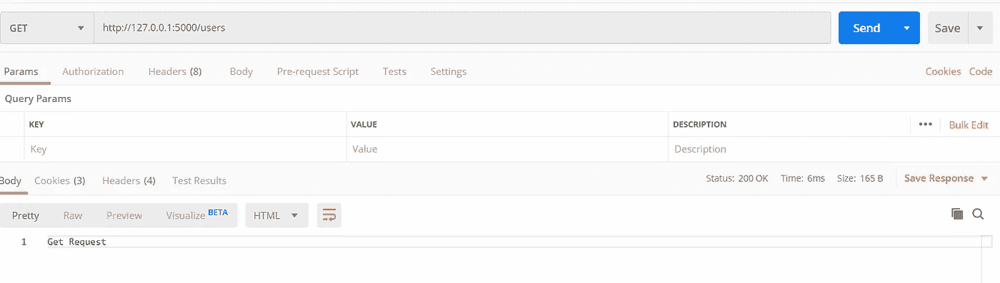
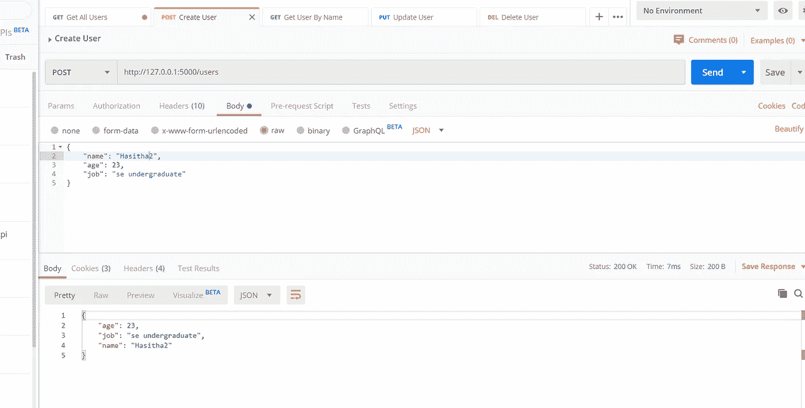

# 使用 Python 和 Flask 的 RESTful API

> 原文：<https://medium.com/analytics-vidhya/restful-api-with-python-and-flask-6e65e79a5e15?source=collection_archive---------6----------------------->

Python 是最流行的编程语言之一。python 中有很多框架和库。Flask 就是其中之一。在本文中，我将向您展示如何使用 Flask 构建一个简单的 RESTful API。

开始之前，您需要在您的计算机上安装 python 3。点击[这里](https://www.python.org/downloads/)可以下载安装 python 3。之后，您可以通过在终端上键入 python-version 或在 windows 中键入 cmd 来验证这一点。

要构建 flask 应用程序，首先我们需要通过 pip 类型安装 Flask。在终端中安装 Flask，然后按 enter。flask 安装成功后，现在我们可以构建我们的 RESTApi 了。

# 创建服务器

首先，我们需要使用 flask 创建一个服务器。为此，我们需要创建一个新的 python 文件。我把它命名为 app.py，代码看起来像贝娄。

在这里，我所做的是从 flask 导入 Flask，并在端口 5000 创建我们的服务器。现在我们可以访问我们在[的服务器 http://localhost:5000。](http://localhost:5000.)现在在项目目录中打开终端，输入 python app.py，按回车键。如果你看到类似贝娄的东西，我们就可以走了。

我们可以使用应用程序变量创建路线。我将向您展示如何创建获取、发布、上传和删除路线。

# 获取请求

“/users”是我们的端点，所以如果我们使用 postman 转到“http://localhost/users”并且请求类型是 get，我们就可以得到响应。

# 获取带参数的请求

我们可以像这样传递参数。我们需要把我们的参数类型放在 rute 路径中。

# 发布请求

在 post 请求中，我们需要从 flask 导入请求。

然后我们可以访问请求体。如果我们需要以 JSON 的形式返回数据，那么我们需要以 JSON 的形式转换数据。我们可以使用“ *jsonify* ”进行转换。首先，我们也需要导入它。

现在我们可以进行 post 请求，并将数据作为 JSON 返回给客户机。代码看起来像贝娄。

# 上传请求

Put 请求更有可能是 POST 请求。代码是这样的，

# 删除请求

在删除请求中，我们传递参数，通过参数找到元素并删除该项。像这样的代码，

现在我向你展示一个使用 flask 的完整 CRUD 应用程序。在这个例子中，我的所有数据保存在一个变量中，但在现实世界中，我们需要将数据保存在一个数据库中。

在我的示例中，我将创建具有姓名、年龄和职务的用户，并显示所有用户，按用户名称显示用户，如果没有找到用户，则显示错误消息，按用户名称编辑用户，最后按用户名称删除用户。这是我的完整例子。

源代码 [*此处*](https://github.com/Hasi6/flask-rest-api) 。

谢谢你。