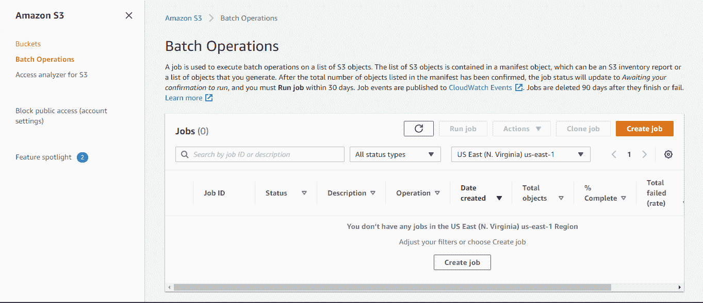

# 使用 S3 库存和 S3 批处理操作从 S3 冰川恢复数百万个对象和万亿字节的数据

> 原文：<https://medium.com/analytics-vidhya/restoring-millions-of-objects-and-terabytes-of-data-from-s3-glacier-using-s3-inventory-and-s3-e966091e594d?source=collection_archive---------7----------------------->

从 S3 冰川和深层档案中恢复数据

亚马逊简单存储服务(亚马逊 S3)是一种对象存储服务，提供行业领先的可扩展性、数据可用性、安全性和性能。S3 提供多种经济高效的存储类别，以相应的速率支持不同的数据访问级别。

为了节约成本，我们通常使用 S3 生命周期策略，随着时间的推移自动将对象从一个存储类别转移到另一个存储类别。我们可以使用 S3 冰川和深层档案来归档我们的对象，这些对象一年可能需要一次或两次。S3 冰川是亚马逊 S3 的一个特殊存储类，提供极其廉价的存储。

在我们的项目中，需要从冰川存储中检索一年前的数据。我们已经配置了生命周期策略，将数据转换为 Glacier 存储类别以进行数据归档。我们必须恢复的数据量大约为 **4.5TB** ，并且有**35 亿多个对象**。恢复如此大量的数据对我们来说是一项挑战。

我们花了大量时间寻找恢复如此大量数据的方法，最终我们找到了使用 S3 库存和 S3 批处理操作的解决方案。

要从 S3 冰川恢复数据，您应该有一个要恢复的对象列表，然后您可以针对每个对象启动恢复请求。我们使用 S3 选择来获取我们要恢复的对象列表，然后使用 S3 批处理操作来启动这些对象的恢复请求。

我们的 S3 文件夹结构

```
(S3 Bucket)
     S3_folder/another_s3_folder/date=YYYYMMDD/some_folder/objects
     S3_folder/another_s3_folder/date=YYYYMMDD/some_folder/objects
     S3_folder/another_s3_folder/date=YYYYMMDD/some_folder/objects
```

# **配置 S3 库存**

我们必须在一个存储桶中配置 S3 库存，在这个存储桶中有我们的冰川对象，也就是我们的源存储桶。

1.  我们需要创建一个新的 S3 存储桶来存储库存输出，这将是我们的目标存储桶。新的 S3 存储区应该位于同一区域
2.  转至源 S3 时段，单击管理，然后单击库存


来源 S3 时段

3.点击添加新按钮

*   输入库存名称
*   在过滤器添加前缀，如果你想为任何特定的 s3 文件夹记录。您也可以在过滤器中使用部分文件夹名称。在我的例子中，我使用了 s3 文件夹/另一个 S3 文件夹/dt=YYYYMM。这将匹配给定前缀下的所有对象
*   对于目标存储桶，选择您在步骤 1 中创建的新 s3 存储桶
*   您还可以选择为目标存储桶指定前缀
*   对于频率，选择您想要的频率

> **注意:** —在设置库存时保持加密为无，因为在 S3 批处理操作中不允许加密对象。我们将使用清单输出中的 manifest.json 文件作为批处理操作作业的输入

将其余内容保留为默认值，然后单击 save。保存库存后，它将在目标存储桶中创建一个 S3 存储桶策略。第一份报告可能需要 48 小时才能送达您的目的地。

4.发布清单列表时，清单文件会发布到目标存储桶中的以下位置

*   目的地前缀/源桶/配置 ID/YYYY-MM-DDTHH-MMZ/manifest . JSON
*   目的地前缀/源桶/配置 ID/YYYY-MM-DDTHH-MMZ/清单.校验和

***恭喜恭喜！您已成功配置 S3 库存。***

# **配置 S3 批量操作**

1.  在亚马逊 S3 控制台的导航窗格中选择批处理操作



S3 控制台批量操作

2.点击创建工单

*   选择您要创建工作的地区
*   在 Manifest 下，输入作为 S3 库存的一部分接收的 manifest.json 文件的路径(路径:—destination-prefix/source-bucket/config-ID/YYYY-MM-DDTHH-MMZ/Manifest . JSON)


S3 批处理操作 manifeat.json 文件

*   单击下一步，并在操作下选择恢复。输入您希望对象的临时副本保持可用的天数，选择您的检索层，然后单击“next”


S3 批处理操作还原作业

*   单击下一步，并在完成报告下选择您要获取作业报告的路径。在我的例子中，我只选择了一个库存时段。当您恢复如此大量的数据时，完成报告非常有用。它将为启动恢复请求的所有对象项生成一个 CSV 文件


S3 批处理作业完成报告

*   您应该有一个 IAM 角色，该角色可以由 S3 批处理操作承担。选择您的 IAM 角色，然后单击下一步


IAM 角色 S3 批处理作业

*   检查您的配置，然后单击创建作业

一旦您创建了一个作业，它将处于准备状态，此时它将识别您的 manifest.json 文件中的对象数量，一旦它准备就绪，您将能够看到它。

此后，作业状态将变为等待您的确认，这基本上意味着您必须查看作业详细信息，并确认您想要在批处理操作可以开始处理它之前运行它。检查您的配置并运行作业。要运行作业，您必须选择作业，然后选择确认并运行。在您确认之前，作业不会运行。

***恭喜恭喜！*** 您已经成功配置了 S3 选择和 S3 批处理操作，以启动从 S3 冰川恢复您的对象。

***谢谢！***

# 参考

*   [https://docs . AWS . Amazon . com/Amazon S3/latest/user-guide/configure-inventory . html](https://docs.aws.amazon.com/AmazonS3/latest/user-guide/configure-inventory.html)
*   [https://docs . AWS . Amazon . com/Amazon S3/latest/dev/storage-inventory . html](https://docs.aws.amazon.com/AmazonS3/latest/dev/storage-inventory.html)
*   [https://docs . AWS . Amazon . com/Amazon S3/latest/dev/batch-ops-basics . html # specify-batch job-manifest](https://docs.aws.amazon.com/AmazonS3/latest/dev/batch-ops-basics.html#specify-batchjob-manifest)
*   [https://AWS . Amazon . com/premium support/knowledge-center/S3-batch-operation-initiate-restore/](https://aws.amazon.com/premiumsupport/knowledge-center/s3-batch-operation-initiate-restore/)
*   [https://docs . AWS . Amazon . com/Amazon S3/latest/dev/batch-ops-create-job . html](https://docs.aws.amazon.com/AmazonS3/latest/dev/batch-ops-create-job.html)
*   [https://docs . AWS . Amazon . com/Amazon S3/latest/dev/batch-ops-initiate-restore-object . html](https://docs.aws.amazon.com/AmazonS3/latest/dev/batch-ops-initiate-restore-object.html)