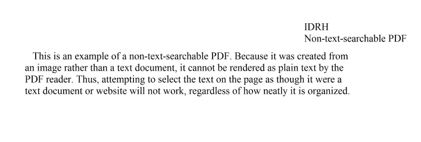

# 从 PDF 图像恢复文本

> 原文：<https://medium.com/analytics-vidhya/restoring-text-from-a-pdf-image-f0fd4841a287?source=collection_archive---------7----------------------->

蟒蛇之道…


科林·尼克森在 www.freeimages.com 拍摄的照片

您是否曾经将文档扫描成 pdf 格式的图像，然后意识到您实际上需要能够编辑该文档？Adobe 内置了光学字符识别(OCR)软件，如果您有 adobe professional，该软件可以轻松解决任何问题。如果你没有这个闲心但有几分钟，那就继续读下去吧。

您需要的是…

1.  Python3
2.  宇宙魔方 OCR: sudo apt-get 安装宇宙魔方 OCR
3.  这些 python 库:wand、Pillow、pyocr、PySimpleGUI

设置您的虚拟环境，导入您选择的 python 版本，安装库并运行代码:

```
import PySimpleGUI as sg
from wand.image import Image
from PIL import Image as PI
import pyocr
import pyocr.builders
import iosg.theme('DarkAmber')tool = pyocr.get_available_tools()[0]
lang = tool.get_available_languages()[1] # Sets language to English# Set GUI layoutlayout = [ [sg.Text("Chose PDF:")], 
   [sg.FileBrowse(key='user_file_conv'), sg.Text('', size=(32,1)),],
   [sg.Text("Name Your File:"), sg.InputText(key='user_file_save')],
   [sg.Button('Convert'),sg.Cancel()]
   ]window = sg.Window('PDF_Converter', layout)def produce_text(cmd_input):

 req_image = []
 final_text = []

 image_pdf = Image(filename=cmd_input, resolution=300)
 image_jpeg = image_pdf.convert('jpeg')for img in image_jpeg.sequence:
  img_page = Image(image=img)
  req_image.append(img_page.make_blob('jpeg'))for img in req_image:
  txt = tool.image_to_string(
   PI.open(io.BytesIO(img)),
   lang=lang,
   builder=pyocr.builders.TextBuilder()
   )
  final_text.append(txt)with open('{}.txt'.format(values['user_file_save']),'+w') as file:
  for txt in final_text:
   file.write(txt)# ---------Event Loop-------------------------------while True:event, values = window.read()
 if event in (None, 'Cancel'):
  break
 if event == 'Convert':
  produce_text(cmd_input=values['user_file_conv'])window.close()
```


生成的 PDF_Converter GUI

如果你不喜欢“深琥珀色”,那就随意更换吧。

您可能遇到的一个问题是/etc/ImageMagick-6/policy.xml 文件的权限。如果程序无法读取 pdf，请在超级用户中编辑文件，并将 pdf 权限从“无”更改为“读取”。保存文件，你就可以开始了。

现在让我们测试一下。以下是一个不可编辑的 pdf 图像示例:



这是通过我们的 pdf_OCR 运行后的输出:

```
IDRH
Non-text-searchable PDFThis is an example of a non-text-searchable PDF. Because it was created from an image rather than a text document, it cannot be rendered as plain text by the PDF reader. Thus, attempting to select the text on the page as though it were a text document or website will not work, regardless of how neatly it 1s organized.
```

该计划的伟大之处在于，它将阅读和转换文本从其他图像以及 pdf 图像。这是我从一些垃圾邮件里拿的一张菜单照片。


垃圾邮件图片存储为。使用 jpeg 文件交换格式存储的编码图像文件扩展名

这是通过程序运行图像后的结果文本。

```
MENUFirst Course
Shrimp Gumbo | Pappadeaux SaladSecond Course
Filet Mignon
Salmon Alexander
Big Bay Platter
Giant Shrimp & Creamy GritsThird CourseVanilla Cheesecake
With fresh strawberriesTurtle Fudge Brownie
With pecans, chocolate and caramel sauce
```

这个程序不能很好地处理手写笔记，但也许这是另一个时间的项目。