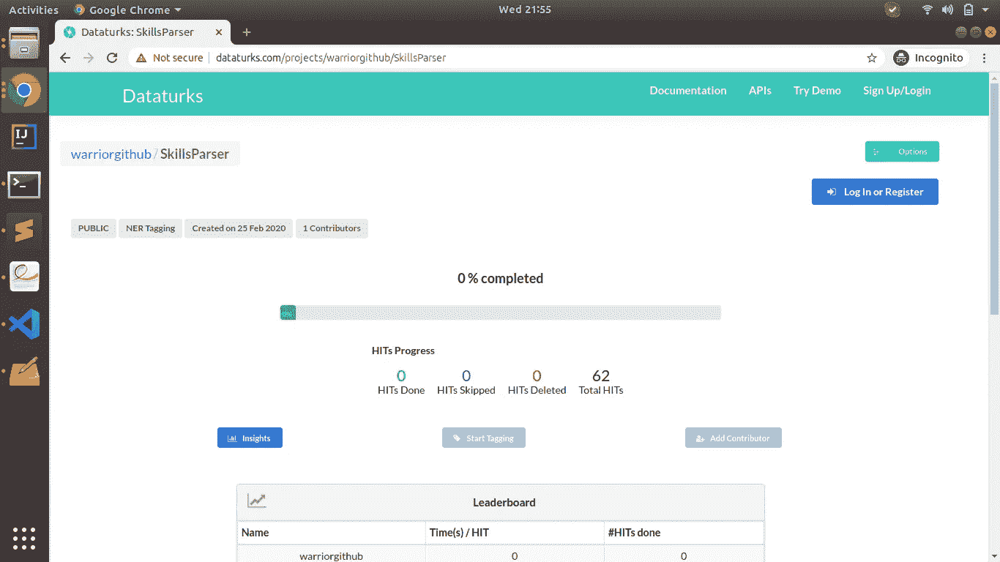

# 使用 Spacy 的自定义命名实体识别(恢复实体提取)

> 原文：<https://medium.com/analytics-vidhya/resume-parser-name-entity-recognization-using-spacy-86663d4683fa?source=collection_archive---------3----------------------->


我希望你知道什么是 NER。让我们不要把时间花在了解 NER 的基本知识上。如果你还想了解什么是 NER。请与此 [*链接*](https://en.wikipedia.org/wiki/Named-entity_recognition) *。*

***问题陈述*** *:我们需要从简历中提取* ***技能*** *。(直截了当的问题陈述)*

为了解决这个任务，我们将使用***Spacy****。*

***什么是 Spacy******Spacy****是 Python 中高级自然语言处理(NLP)的免费开源库。SpaCy 为 python 中的 NER 提供了一个非常有效的统计系统，它可以将标签分配给连续的标记组。它提供了一个默认模型，可以识别各种各样的命名或数字实体，包括人、组织、语言、事件等。除了这些默认实体之外，spaCy 还允许我们通过训练模型，用更新的训练样本更新模型，从而向 NER 模型添加任意的类。*

***安装空间***

```
*!pip3 install spacy*
```

***让我们潜入*** 的解决方案

*先做第一件事。我们需要* ***数据*** *。你能做的就是从你的朋友、同事或任何你想去的地方收集简历样本。现在，我们需要将这些简历组合成文本，并使用任何文本注释工具来注释这些简历中可用的技能，因为* ***为了训练模型，我们需要带标签的数据集*** *。*

*第一步:* ***数据预处理*** *(标签数据)*

*我们用*[***datacarts***](https://dataturks.com/)*。*



***请观看此视频*** *(来源:*[*https://www.youtube.com/watch?v=vU3nwu4SwX4*](https://www.youtube.com/watch?v=vU3nwu4SwX4)*)了解如何用 datatrucks 注释文档。*

在注释完我们的数据后，它应该是这样的。

labelled_data.json

```
*{
 "content": "▪  Experience in performing Smoke Testing, Component Testing, Integration Testing, System",
 "annotation": [{
  "label": ["Skill"],
  "points": [{
   "start": 28,
   "end": 80,
   "text": "Smoke Testing, Component Testing, Integration Testing"
  }]
 }],
 "extras": null,
 "metadata": {
  "first_done_at": 1583145213000,
  "last_updated_at": 1583145240000,
  "sec_taken": 0,
  "last_updated_by": "TvSX0qlucOT0EK1n1E5FNxOgJvw2",
  "status": "done",
  "evaluation": "NONE"
 }
}*
```

Datatrucks 提供了以 JSON 格式下载注释文本的功能。

*第二步:* ***数据格式转换***

*我们需要将这个 json 数据转换成* ***spacy 接受的数据*** ***格式*** *，我们可以通过下面的代码来执行。*

*json_to_spacy.py*

*运行以上。py 文件命中此命令:****python 3 JSON _ to _ spacy . py-I labelled _ data . JSON-o JSON spacy***

*   *i - >是我们从数据卡车*下载的数据
*   *o - >是输出文件(spacy 数据格式文件)*
*   labelled_data.json ->标记数据后，我们从 datatrucks 获得的标记数据文件。

*第三步:* ***列车型号***

*我们需要用这个* ***空间*** *数据来训练我们的模型。*

***train _ model . py***

*要运行上面的代码打这个命令:****python 3 train _ model . py-m ' en '-nm ' skill entities '-o your model path-n 30***

*   *m->‘en’英文默认型号*
*   *nm->‘skill entities’是我们的火车模型名称*
*   *o - >目录保存你的火车模型*
*   *n - >训练模型的迭代次数*

*第四步:* ***测试模型***

现在我们需要测试我们的模型。为此，我们可以编写简单的代码。我已经编写了 flask api，这样您就可以向任何人公开您的模型。

测试 _ 模型. py

*第五步:* ***评估模型***

*evaluate_model.py*

*这里告一段落。*

请留下您的意见和建议。

*享受学习。*

*感谢*