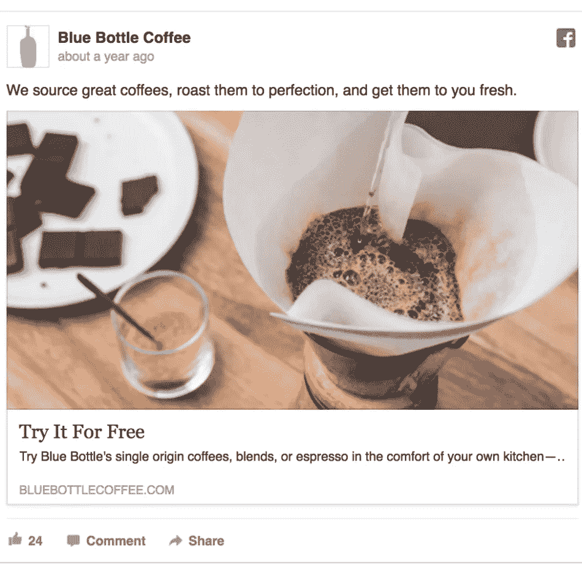

# 数据——“新石油”——新黄金

> 原文：<https://medium.com/analytics-vidhya/retail-business-personalization-as-a-story-9ddc0d8326d3?source=collection_archive---------29----------------------->

信息就是财富——来自 2003 年泰米尔电影《男孩》的对话

从原油、**到汽油、柴油等成品油**创造了巨大的收入。类似地，应用于用户数据的**分析**提供模式和洞察力来推动业务。

在这篇博客中，我们将看看数据是如何以用于决策的信息形式成为任何组织的另一种财富的。

我希望你们都知道 WhatsApp 和 Fitbit 应用程序。想想为什么脸书需要购买 WhatsApp，而谷歌必须花费数十亿美元购买 Fitbit。

如果你在任何在线聊天或移动应用程序中与你的朋友聊起喝咖啡，过一段时间后，你可能会看到打折咖啡的广告。类似的情况可能适用于你在 IRCTC 网站、YouTube 视频等上观看的广告。

脸书某咖啡品牌的广告样本

# 在线广告

你会添加一个产品到购物车，然后不付款就离开网站。或者你已经搜索了一个产品很多次，但是还没有购买。通过这些活动，您可以在以后访问的网页中看到相关的广告弹出。我想你还记得沃达丰的广告。

> 无论你走到哪里，我们的广告都会跟着你，直到你买了产品。

借助当今来自大数据、机器学习和人工智能的尖端技术，零售商可以为消费者提供高性能的购物体验。我知道，向你暗示你的数据已经暴露并被他人使用是没有用的。因为不管愿不愿意，我们都是向分析世界提供数据的人。