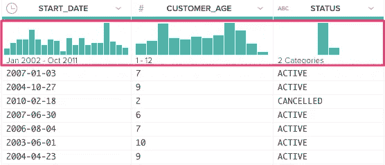
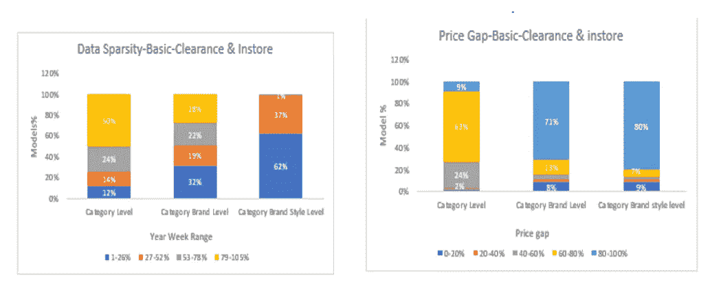
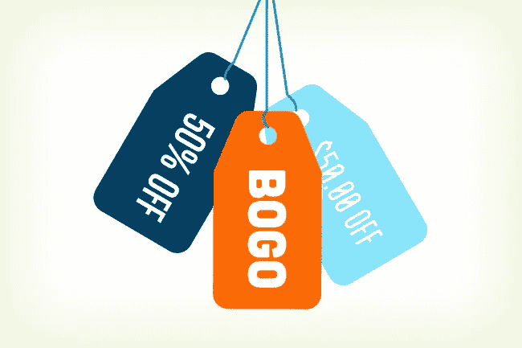

# 使用优化的零售定价

> 原文：<https://medium.com/analytics-vidhya/retail-pricing-using-optimization-c74e9ae3015c?source=collection_archive---------5----------------------->

传统上，营销人员依靠直觉做出大部分定价决策，而不考虑客户行为、市场趋势、促销效果、假期以及它们如何影响产品对价格的敏感度。随着时间的推移和高计算能力的出现，高计算能力反过来支持对海量数据的分析，大多数企业都在利用大数据技术来优化定价决策，旨在提供更具竞争力的定价，确保最大的结算/收入/利润目标。


决定正确的折扣率不是一件简单的事情

出于几个原因，最优定价或决定最优折扣百分比是一个具有挑战性的问题。一个是定价模型的复杂结构，它通常包括需要优化的多个变量，如标价、折扣和特价。另一个原因是需求和利润预测的复杂性，这使得很难准确评估新的定价策略。最后，最佳建模和优化技术的选择增加了该过程的技术挑战。

下面描述的是价格优化策略的详细过程，该策略将考虑消费者行为、假期、竞争对手定价、同类产品的影响、定价促销的有效性，最重要的是描述如何决定价格以最大化某一指标，同时保持其他指标在某一最小值。例如，零售商可能需要在夏季最大化冬装的销售，同时将利润目标设定在最低 20%以上。

我还在一些章节中加入了相关代码，以帮助实施。

为了加速所有大数据流程的编码，在 PySpark 上编码尽可能多的流程总是很方便的。许多 PySpark 库仍在开发和改进中。但是，用于预处理(常见计算和聚合)和一般线性建模的库已经完全开发出来，可以很好地使用。因此，我们将在 PySpark 中完成所有初始步骤，在 Python 中完成优化步骤，因为在 PySpark 中还没有完全测试过的库来满足我们的情况的需求。

对于没有 Spark 设置或者不太关心数据大小的用户来说，同样的功能可以用 Python 实现，只需在语法上做相应的改变。

**流程**

**对数据进行健全性检查**



无论何时处理零售数据，都需要确保一些基本的检查。

交易 id、商店 id、成本价、促销价、出厂价、折扣百分比等数据字段应始终为正数

根据数据中的时钟类型，可以检查时间和日期字段，以获得 12 个不同的月份、适当的购买时间(0 到 24/12)

根据数据字段，还可以检查其他内容。当您检查数据的完整性时，您也可以正确理解数据中的唯一值。应该修复这些问题，并在继续之前相应地清理数据。

**上卷**

零售数据通常在日期/时间戳级别上可用。为了查看销售趋势并使数据可用于建模和预测，应该从日期级别汇总到天/年-周级别。这通常要求遵循以下两个步骤:

基于一个主键(通常是 SKU id 或 SKU id+商店号)连接各个表中的可用数据。这主要要求将交易数据表与类别数据、商店数据、库存数据、日历(假日)数据、促销数据、竞争对手数据和其他可用的相关数据集连接起来

下面是一个事务和日历表的连接示例，用于将假日/特殊事件包含在分析数据集中:

```
df_analytical = join(df_transaction,
            df_calendar,
            on=[('trans_date', 'calendar_date')],
            drop=[df_calendar.FiscalWeekNumber, df_calendar.FiscalYear])
```

一旦连接，数据可以累计到决定的水平，同时确保估算值是实际值的良好代表。例如，对于一天的平均价格(一般用于在线销售)或一周的平均价格，加权平均值通常比正常平均值给出更好的表示。同样，在累计时应增加销售量

```
df_analytical = df_analytical.groupBy('StoreId',                                        
                                        'SkuId',                                        
                                        'Year',
                                        'WeekNo',
                                        'HolidayName',
                                        'HolidayFlag',                       
                                       ) \
    .agg(F.sum('VolumeSold').alias('total_volume_sold'),
         F.sum('RegularPrice').alias('total_regular_price'),
         F.sum('PromotionPrice').alias('total_promotion_price'),         
         F.sum(F.abs(df_transaction.UnitCost * df_transaction.UnitsSold)).alias('total_volume_cost'),
         F.sum('ShippingCost').alias('total_shipping_cost'),
         F.count('*').alias('total_transaction_count'))
```

**EDA**

它包括分析分析数据集以总结主要特征。在此过程中，探索性数据分析的主要动机之一是决定建模的级别，即根据类别数据(SKU/品牌/类别/区域等)在零售层级的哪个级别开发模型。).一种方法是检查不同层次上的数据稀疏性和价格范围。

*数据稀疏性检查* **:** 对于每个级别(SKU、品牌、类别等)，计算每个模型的数据中的空值百分比(即列中的空值/相关列总数)。这将需要每次将数据汇总到不同的级别。最后，可以比较不同级别的数据稀疏度，以决定哪个级别的最大数据百分比具有较低范围内的数据稀疏度

*价格差异分析* **:** 这是指价格从一个水平上升到另一个水平时价格的跳跃。为确保相关信息不会丢失，请选择数量较少的型号差距较大的级别

```
for col in cols:    
    col_null_count = df_analytical.select(F.col(col)).filter(F.col(col).isNull()).count()    
    col_distinct = df_analytical.select(F.col(col)).filter(F.col(col).isNotNull()).distinct().count() 
    if dtypes[col] in ['int', 'double']:
        stats = df_analytical.select(F.stddev(col).alias('stddev'),
                          F.mean(col).alias('mean'),
                          F.min(col).alias('min'),
                          F.max(col).alias('max'),
                          F.sum(col).alias('sum')).collect()[0]
        neg_val_count = df_analytical.filter(df_analytical[col] < 0).count()
        fraction_negative = neg_val_count / float(records)
        sum_value = stats.sum
    else:
        stats = None
        neg_val_count = None
        fraction_negative = None
        sum_value = None
```



使用 EDA 统计数据在不同层级进行绘制

这是一个针对需要*基本清仓和店内定价的用户的示例分析:*

*数据稀疏性检查*:

对于*类别级别*，50%的模型具有 79–105%年周的数据，即较少的数据稀疏性。在*类别-品牌层面，这一数字为 28%。*我们将这两者都用于价格差距分析。

*价格差异分析:*

对于*类别级别*，较高价格差距范围内的数据较少(80–100%差距范围内的数据为 9%)，较低价格差距范围内的数据较多(约 26%)。因此，在*类别级别，可以选择*对清仓商店数据进行建模。希望在价格差距较小的范围内有更多的数据，这样累计不会在数值上产生太大的变化，并且模型更精确(当项目相似时)*。*

**自相残杀**

自相残杀是一种常见的动态。它是指公司现有产品的销售额(单位或美元)由于推出新产品或现有同类产品而减少。一个常见的例子是品牌 A 的产品销售被品牌 b 的类似定价产品吞噬。同类相食是一个非常突出的影响，在为价格优化建模时经常被忽略。根据假设，在模型中至少包括每种产品的前 5 名同类产品的价格/折扣百分比，可以通过系数说明很多影响，并在优化期间将价格推向各自的方向。

*如何获得我们产品的前 5 名食人族？*

如果我们是在 SKU 层面建模，那么对于任何一款牛仔布的 SKU 来说，它可能的同类都是来自不同品牌的牛仔布。因此，如果 SKU1 的产品层次结构为

服装->底裤->品牌-> SKU1

为了获得 SKU1 的同类产品，我们在层次结构中向上移动一个级别，即品牌级别，并计算不同品牌的 SKU 的所有可能组合的销售单位和折扣百分比之间的相关性。对于要成为同类产品的 SKU，折扣和单位的相关性应该是负的。具有负相关性的组合被过滤，基于相关值的绝对值挑选前 n 个同类产品，并且每个同类产品的折扣百分比被用作建模期间的特征。

下面是获取食人族键之间的相关性的过程的快照。可以相应地过滤要考虑的食人族的数量:

```
df_AD = (df_analytical.groupBy('key_one_above_model', "key_model_level","year_week")
        .agg(sum("tot_otd_price").alias("tot_otd_price"),
             sum("tot_reg_price").alias("tot_reg_price"),
            sum("tot_volume_sold").alias("tot_volume_sold")))                    
unique_cat_for_correlation = (df_analytical                        .select("key_one_above_model").distinct().collect())
unique_cat_for_correlation = (list(map(lambda x: x['key_one_above_model'],unique_cat_for_correlation)))                                   
df1 = df_AD.filter(df_AD['key_one_above_model'].isin (unique_cat_for_correlation))
dummy1 = (df1.withColumnRenamed('key_model_level', 'Cannibals')
          .select('key_one_above_model', 'Cannibals', 'year_week', 'discount_percent'))
dummy2 = (df1
          .select('key_one_above_model', 'key_model_level', 'year_week', 'tot_volume_sold'))
df2 = (dummy2.join(dummy1, (dummy2.key_one_above_model == dummy1.key_one_above_model) &
                   (dummy2.year_week == dummy1.year_week) &
                   (dummy2.key_model_level != dummy1.Cannibals))
       .drop(dummy1.key_one_above_model).drop(dummy1.year_week))
count_df = (df2.groupBy('key_one_above_model', 'key_model_level', 'Cannibals')           .agg(F.count('year_week').alias('Weeks_sold_together')))
keys = (count_df.select('key_model_level').rdd
        .map(lambda x: x['key_model_level']).collect())
cannibal_keys = (count_df.select('Cannibals').rdd
                 .map(lambda x: x['Cannibals']).collect())
product_combinations = list(zip(keys, cannibal_keys))
for cat_id_volume, cat_id_discount in product_combinations:
    print(cat_id_volume.split('_')[:-1] == cat_id_discount.split('_')[:-1],
          cat_id_volume.split('_')[-1],
          cat_id_discount.split('_')[-1])
    df_corr = (df1.filter((df1["Cannibals"] == cat_id_discount) &
                        (df1["key_model_level"] == cat_id_volume)))   
    correlation_data.append({'cat_id_volume': cat_id_volume,
                             'cat_id_discount': cat_id_discount,
         'corr_value': df_corr.stat.corr('discount_percentage', 'tot_volume_sold')})
corr_result = pd.DataFrame(correlation_data,columns = ['cat_id_volume','cat_id_discount','corr_value'])
```

**聚类**

这一步可以通过两种方式使用 1)将具有相似产品弹性和客户行为的商店聚集在一起，以减少模型的数量并解决数据稀疏的问题。因此，不是为商店中的每个键建模，而是在商店集群中对每个键建模。2)如果计算能力不是一个障碍，聚类数可以用来为模型提供一个方向，以了解类似商店的一些情况。

k-means 聚类可用于根据可用数据决定聚类。

这篇[论文](https://thesis.eur.nl/pub/37405/Rooij.pdf)可以提供关于如何根据消费者行为和产品弹性对商店进行聚类的详细见解，并进一步用于定价，从而带来更高的收入/利润。

**造型**

价格弹性模型通常是优选的，以便可以使用系数来设计优化方程，并且直觉地判断是否对正确的特征给予了正确的权重。

价格弹性给出了价格变化 1%时需求量的百分比变化。当你用数量对数对价格对数进行回归时，系数会给出斜率，即数量变化对价格单位变化。

在拟合模型之前，您可能必须标准化/规范化这些值，并确保其他预处理步骤，以确保数据遵循线性回归的假设。

在尝试模型时，您可以从一般线性回归(OLS)开始，然后根据变量选择的需要尝试岭/套索模型。

当您完成模型选择和调整后，模型的系数将为您提供方程的值。

因此，每种产品的最终等式看起来会像这样:

*Log(成交量)=价格弹性* log(价格)+ β2 *(食人族 1 _ 价格)+ β3 *(食人族 2 _ 价格)+ β4 * (holidayflag1) + …。根据变量重要性，等式 1*

**优化**

为一个目标优化价格需要你相应地塑造上面的等式。例如，为了使收入最大化，等式将是:

收入= ∑价格*数量

收入= ∑价格* (e^(价格弹性* log(价格)+ β2 *(食人族 1 _ 价格)+ β3 *(食人族 2 _ 价格)+∑βI *变量 I)

*………………………………………………………………。从等式 1*

约束和业务规则的等式可以用同样的方式设计:

约束 1:利润率> 30%

毛利= 1-(成本/收入)= 1- (∑(数量*成本)/∑(数量*价格))>/30%……30%..……… *约束 1*

上述等式需要进行优化以实现最大化。这就是我们使用上一步获得的 AD 切换到 python 的地方。python 中的大部分算法都是为了最小化。在等式中加一个“-”会导致负数的最小化，即最大化。

下面是根据业务需求定义目标函数、约束和界限后如何优化的快照。定义约束和边界的数据结构对于每个库都是不同的，建议在编写任何技术的代码时通读文档。

```
import numpy as np
from scipy.optimize import minimize
minimize(func, cost_price, method='SLSQP', constraints=con, bounds=[(cost_price, MRP) for i in range(len(modeling_AD))])
```

使用梯度下降优化是广泛使用的优化技术之一。使用算法时需要注意的几件事:

梯度可以手动指定或留给算法处理。手动设计和指定它总是更好

tol 应该非常小心地调整，因为它告诉优化器何时停止，即，如果连续迭代中梯度的变化量小于 tol，它假定达到最小值，因此返回它。

该方程应该是凸的，以便优化停止在全局最小值，并且不收敛在局部最小值。在方程不凸时，应使用*盆地跳跃*优化

为了使优化产生显著的结果，应该非常有效地捕获模型，尤其是弹性值。这背后的原因从我们正在优化的方程的偏微分中非常明显

一旦获得价格，就可以进行比较分析，以展示与传统定价方法相比，优化价格的收入预计会有怎样的飞跃。此外，应该打电话修改价格。如果店内定价工作和人工需要更换纸质价格标签，则需要每周或每两周更新一次。然而，在网上定价的情况下，价格可以在一天内变化多次。因此，只要需要刷新，就可以添加新数据，并且可以刷新模型。

这里有一个详细的关于优化技术的[阅读](https://towardsdatascience.com/optimization-with-scipy-and-application-ideas-to-machine-learning-81d39c7938b8)。

**BOGO 还是五折？哪种变体更有效？**



对于零售商来说，上述两种促销活动产生的收入是相等的。然而，当涉及到这两者时，客户倾向变化很大。有时，我们可能需要在两个变量中选择哪个更有效，并利用折扣心理

这可以通过添加模型中应用的促销标志来实现。这可以用来分析哪种推广更有效。

零售是一个非常广泛的领域，但这些技术肯定会让用户接近目标。