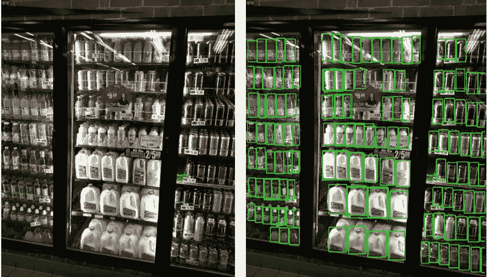
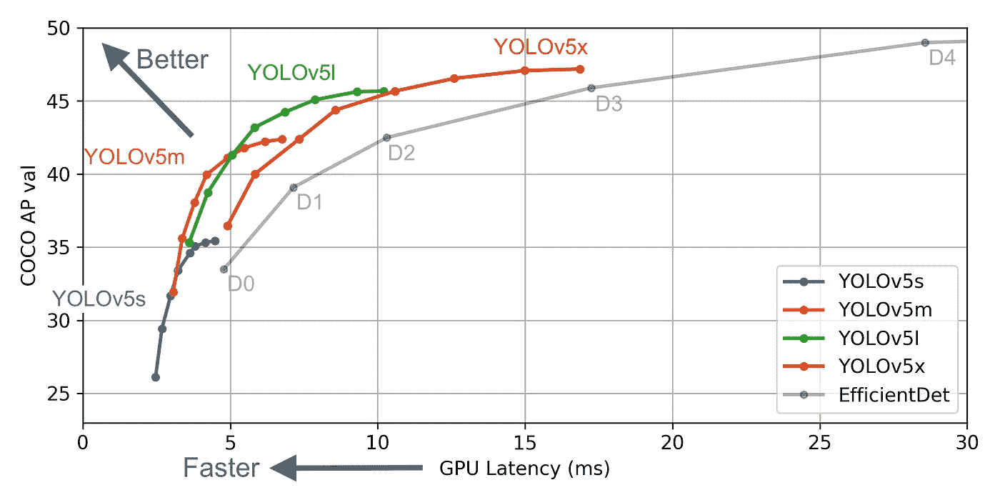
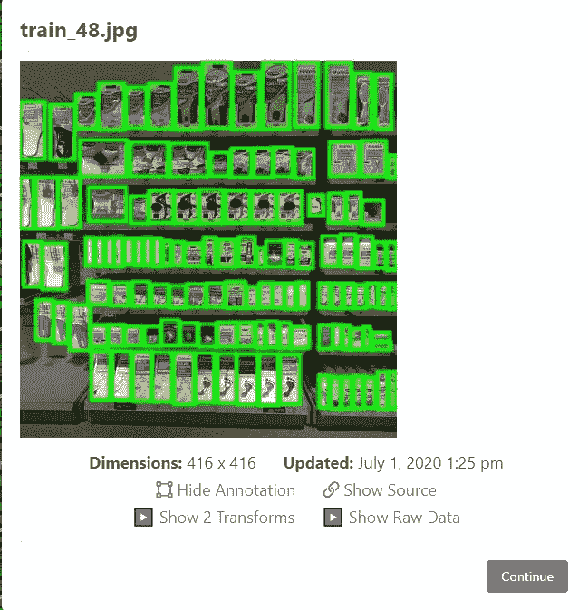
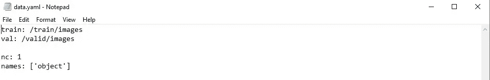
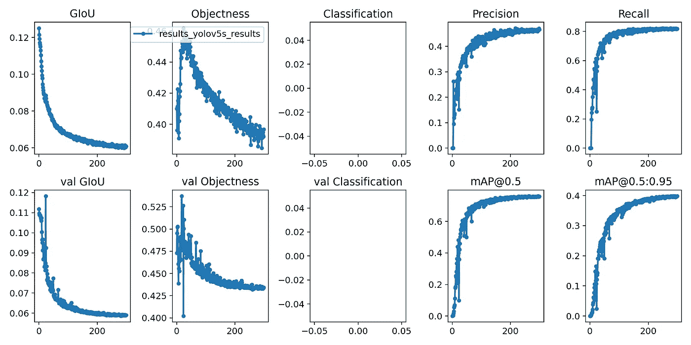
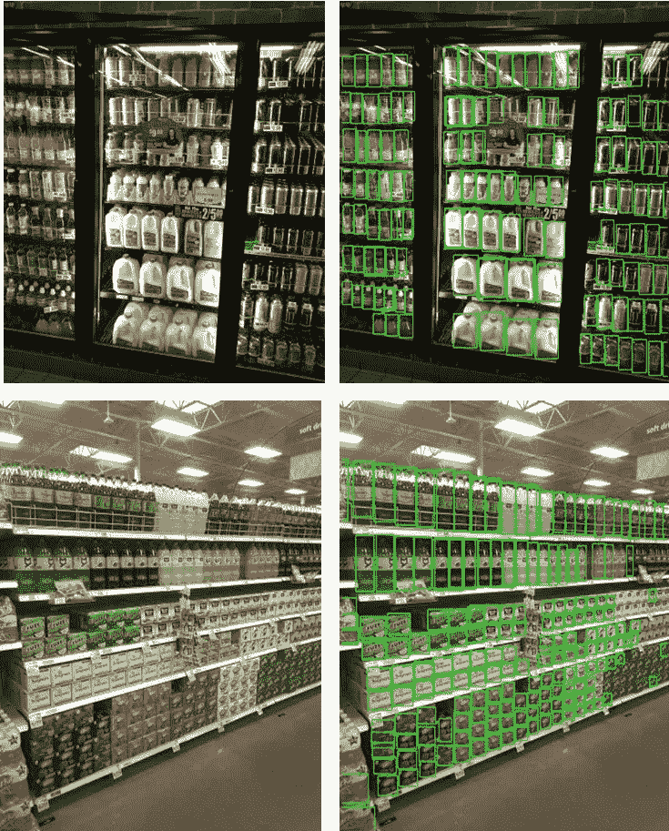

# 使用 YOLOv5 检测零售店商品

> 原文：<https://medium.com/analytics-vidhya/retail-store-item-detection-using-yolov5-7ba3ddd71b0c?source=collection_archive---------2----------------------->

在这篇文章中，我介绍了流行的深度学习算法 YOLO 的最新版本(即 YOLOv5)的应用程序，以检测零售店货架上的商品。这个应用程序可以简单地使用货架上物品的图像来跟踪物品的库存。

# **简介**

目标检测是一项计算机视觉任务，需要对目标进行检测、定位和分类。在这项任务中，首先我们需要我们的机器学习模型来判断图像中是否存在任何感兴趣的对象。如果存在，则围绕图像中存在的对象绘制一个边界框。最后，模型必须对由边界框表示的对象进行分类。这项任务需要快速的目标检测，以便能够实时实现。其主要应用之一是用于自动驾驶车辆中的实时物体检测。

Joseph Redmon 等人最初设计了执行实时对象检测的 YOLOv1、v2 和 v3 模型。YOLO“你只看一次”是一种最先进的实时深度学习算法，用于图像和视频中的对象检测、定位和分类。这种算法非常快速、准确，是基于对象检测的项目的前沿。

每个版本的 YOLO 都在准确性和性能上不断改进。然后是另一个团队开发的 YOLOv4，进一步提高了模型的性能，最后是 Glenn Jocher 在 2020 年 6 月推出的 YOLOv5 模型。这个模型大大减小了模型的大小(Darknet 上的 YOLOv4 有 244MB 大小，而 YOLOv5 最小的模型只有 27MB)。YOLOv5 还声称比 YOLOv4 更快的精度和每秒更多的帧数，如下图所示，摘自 **Roboflow.ai 的**网站。

图 1.1: YOLOv5 比 EfficientDet 模型更快

关于 YOLO 如何工作的更多细节可以在互联网上找到。在本文中，我将只关注 YOLOv5 在零售商品检测中的应用。

# 目标

使用 YOLOv5 在使用 SKU110k 数据集的图片中的零售产品上绘制边界框。

图 1.2:商店货架图像(左图)与在对象上绘制边界框的期望输出(右图)

# 资料组

为了完成这项任务，首先我从以下链接下载了 SKU110k 图像数据集:

[http://trax-geometry . S3 . Amazon AWS . com/cvpr _ challenge/SKU 110k _ fixed . tar . gz](http://trax-geometry.s3.amazonaws.com/cvpr_challenge/SKU110K_fixed.tar.gz)

SKU110k 数据集基于密集包装环境中零售物品的图像。它提供了训练、验证和测试集图像以及相应的。包含这些图像中所有对象的边界框位置信息的 csv 文件。的。csv 文件将对象边界框信息写入以下各列:

*图像名称，x1，y1，x2，y2，类别，图像宽度，图像高度*

其中 x1，y1 是边界框的左上坐标，x2，y2 是边界框的右下坐标，其余参数不言自明。一个边界框的 train_0.jpg 图像的参数示例如下所示。每个图像有几个边界框，每个对象一个框。

*train_0.jpg，208，537，422，814，object，3024，3024*

在 SKU110k 数据集中，测试集中有 2940 幅图像，训练集中有 8232 幅图像，验证集中有 587 幅图像。每个图像可以具有不同数量的对象，因此具有不同数量的边界框。

# 方法学

从数据集中，我只从训练集中提取了 998 幅图像，并访问了 Roboflow.ai 网站，该网站提供不同格式的在线图像注释服务，包括 YOLOv5 支持的格式。仅从训练集中挑选 998 幅图像的原因是，Roboflow.ai 的图像注释服务仅对前 1000 幅图像免费。

**预处理**

图像的预处理包括将图像大小调整为 416x416x3。这是在 **Roboflow 的**平台上完成的。下图显示了一幅经过标注和调整大小的图像:

图 1.3:由 Roboflow 注释的图像

**自动标注**

在 Roboflow.ai 网站上，边框标注。csv 文件和来自训练集的图像被上传，Roboflow.ai 的注释服务使用。csv 文件如上图所示。

**数据生成**

Roboflow 还提供了基于用户定义的分割生成数据集的选项。我使用 70–20–10 训练-验证-测试集分割。在 Roboflow 上生成数据后，我们在每个图像的单独文本文件中获得原始图像以及所有带注释对象的所有边界框位置，这很方便。

最后，我们得到一个链接来下载带有标签文件的生成数据。此链接包含一个仅限您的帐户使用的密钥，不应共享。

# **使用的硬件**

该模型在配有特斯拉 P100 16GB 显卡的 Google Colab Pro 笔记本上进行训练。它的价格是 9.99 美元，可以使用一个月。谷歌 Colab 笔记本也可以免费使用，但使用会话时间有限。

# 密码

我推荐使用 Roboflow.ai 在
[www.models.roboflow.ai/object-detection/yolov5](https://models.roboflow.ai/object-detection/yolov5)
提供的 Google Colab 笔记本，它最初是为 COCO 数据集训练的，但可以为定制任务进行调整，这就是我所做的。我从克隆 YOLOv5 并安装 requirements.txt 文件中提到的依赖项开始。此外，该模型是为 Pytorch 构建的，所以我将其导入。

接下来，我下载我在 Roboflow.ai 创建的数据集。它还创建了一个. yaml 文件，该文件包含训练和验证集的路径以及数据中存在的类。

该文件告诉模型训练集和验证集图像的位置路径，以及类的数量和类的名称。对于这个任务，类的数量是“ **1** ”，类的名称是“**对象**”，因为我们只希望预测边界框。data.yaml 文件如下所示:

图 1.4:data . YAML 文件的视图

**网络架构**

接下来让我们定义 YOLOv5 的网络架构。这与作者 Glenn Jocher 在 COCO 数据集上进行训练时使用的架构相同。我没有改变网络中的任何东西。然而，需要一些调整来改变边界框的大小，颜色，并删除标签，否则标签会因为太多的框而使图像混乱。这些调整是在 detect.py 和 utils.py 文件中进行的。网络保存为 custom_yolov5.yaml 文件。

**训练**

现在我开始训练过程。我将图像大小(img)定义为 416x416，批次大小为 32，模型运行 300 个时期。如果我们不定义权重，它们会被随机初始化。

在谷歌 Colab Pro 提供的特斯拉 P100 16GB GPU 上完成训练花了 4 小时 37 分钟。训练完成后，模型的权重将作为 last_yolov5_results.pt 保存在 Google drive 中

# 观察

在使用以下代码对模型进行训练之后，我们可以可视化重要的评估指标:

以下 3 个参数通常用于对象检测任务:

GIoU 是并集上的广义交集，它告诉我们的边界框有多接近真实情况。

**物体性**表示物体存在于图像中的概率。这里它被用作损失函数。

**mAP** 是平均精度，表示我们的边界框预测平均有多准确。它是精确召回曲线的曲线下面积。

可以看出，对于训练和验证，广义交集(GIoU)损失和目标损失都减少了。然而，对于 0.5 的边界框 IoU 阈值，平均精度(mAP)为 0.7。召回率为 0.8，如下所示:

图 1.5:yolo V5 模型训练中观察到的不同评估参数

现在，我们使用以下代码来检查我们的模型在测试集图像上的表现:

# 结果

下图显示了我们的 YOLOv5 算法在物体上绘制边界框的结果。结果相当不错。

图 1.6:原始测试集图像(左图)和 YOLOv5 绘制的边界框图像(右图)

推断时间只有 0.009 秒，权重文件只有 13.9MB

# 链接到存储库

以下链接包含项目的存储库。请确保您在 Google Colab 中复制了 jupyter notebook 中的代码，因为它最初是在那里编写的。

[https://github . com/shayanalibhatti/Retail-Store-Item-Detection-using-yolov 5](https://github.com/shayanalibhatti/Retail-Store-Item-Detection-using-YOLOv5)

对存储库中的 utils.py 和 detect.py 文件进行了调整，删除了对象标签并创建了绿色的薄边界框。

# 结论

撇开命名争议不谈，YOLOv5 表现很好，可以根据我们的需要进行定制。然而，训练该模型可能需要大量的 GPU 能力和时间。建议至少使用配有 16GB GPU 的 Google Colab，或者最好使用 TPU 来加速大型数据集的训练过程。

这个零售对象检测器应用程序可以用来跟踪商店货架库存，或者用于智能商店概念，人们可以挑选商品并自动收费。YOLOv5 的小重量尺寸和良好的帧速率将为其成为基于嵌入式系统的实时对象检测任务的首选铺平道路。