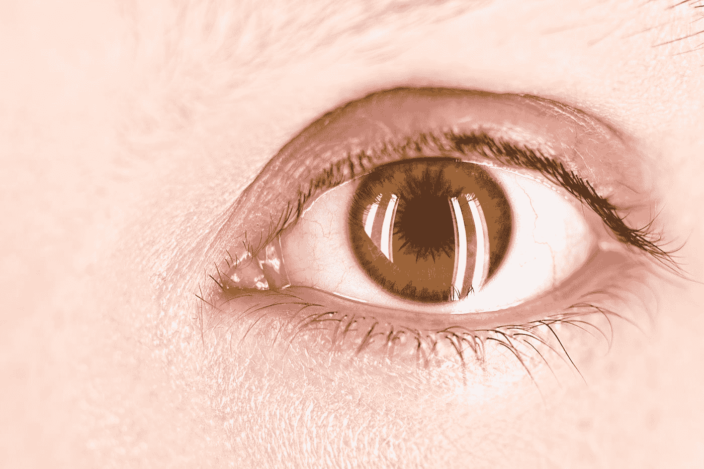
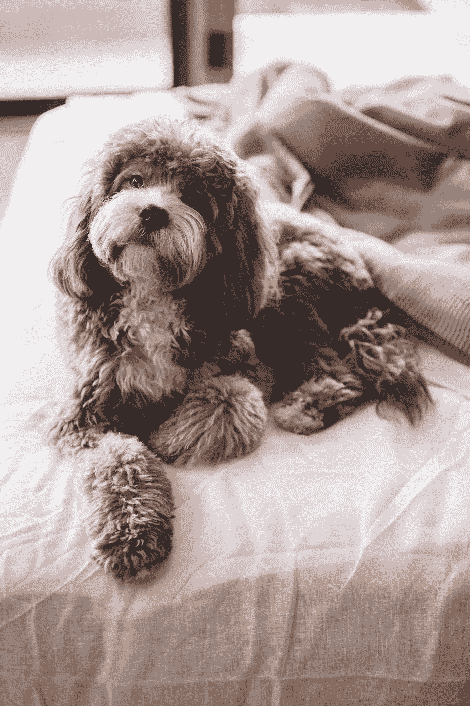
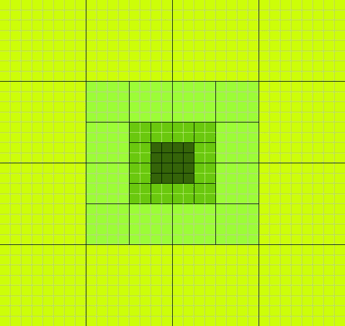
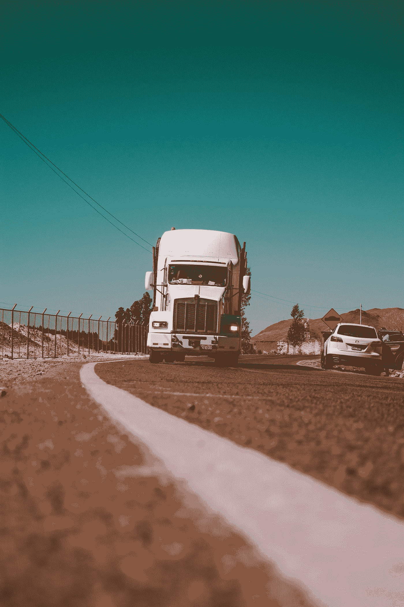

# 视网膜启发的神经网络结构

> 原文：<https://medium.com/analytics-vidhya/retinal-inspired-neural-network-structure-79a3fed50cc2?source=collection_archive---------20----------------------->

如果你曾经训练过 GAN(生成对抗网络)或图像分类神经网络，你就会知道它对数据有多饥渴。尤其是当您想要处理更高分辨率的图像时。前几天，我试着对几百张照片进行比对。分辨率为 256x256，计算时间接近一个小时。我还有一个相当不错的显卡:GeForce RTX 2070 Super。

这让我开始思考:动物到底是如何在旅途中处理如此多的视觉信息的？想一想你自己的眼睛。

保罗·斯科鲁普斯卡斯在 [Unsplash](https://unsplash.com?utm_source=medium&utm_medium=referral) 上的照片

我们聚焦在中心的一个点上，而其他的都不在焦点上。如果你能在显微镜下观察眼球后部，你会看到大约 1.3 亿个视杆细胞(想想亮/暗)和 700 万个视锥细胞(想想颜色)。但是大部分的视杆细胞和视锥细胞就在你眼睛的中心。

由[萨尔瓦托·文图拉](https://unsplash.com/@salvoventura?utm_source=medium&utm_medium=referral)在 [Unsplash](https://unsplash.com?utm_source=medium&utm_medium=referral) 上拍摄的照片

将所有这些传感器放在中心可以让您在焦点处看到高清晰度，同时还可以看到周围是否有任何感兴趣的东西。

所以我想知道一个基于自然的模型是否可以以任何方式帮助降低对 GPU 的高要求。事实证明，**是可以的，**而且比我想象的要重要得多。

## 问题是

首先，让我们考虑一个典型的 GAN，假设我们以 4，096 x 4，096 的分辨率向其输入 10，000 幅图像。如果你拿出你的便携式计算器，你会发现每幅图像的灰度数据不到 1700 万点，是 RGB 数据的 3 倍。相比之下，我之前处理的是 256x256 的图片，每张图片总共大约 65kb。因此，我们谈论的是较大图像的大小增加 256 倍。

但这并没有考虑到训练一个神经网络需要对庞大的矩阵进行运算。计算两个矩阵的乘积所花费的时间在*呈指数增长，只有微不足道的** n！！！([https://en . Wikipedia . org/wiki/Matrix _ 乘法 _ 算法](https://en.wikipedia.org/wiki/Matrix_multiplication_algorithm))

**一丝讥讽*

这将我们 256 倍的数据增长转化为将近 1700 万倍的处理时间！看到问题了吗？因此，任何减少需要处理的数据量的方法都会带来好处。

此外，并不是图像的每一部分对决定你在看什么都很重要。快速瞥一眼一只狗，你就知道你在看你毛茸茸的同伴，而不是一只饥饿的鳄鱼。

罗伯特·尼克森在 [Unsplash](https://unsplash.com?utm_source=medium&utm_medium=referral) 上的照片

但你不必关注墙壁、地板、皮毛等。一切都在那里，只是不太清楚。

那么，我们如何将简单的一瞥转化为数字代码呢？我发明了一种方法来做到这一点。

## RNN 一号结构

认识一下视网膜启发神经网络输入法，简称 RNN-i。

首先，我们要选择一个焦点区域的大小。对于这个例子，我们将使用 4x4。这将是我们关注的焦点。我们将把所有这些数据点传递到我们的第一行“浏览”数据中。因为它是 4x4，所以在我们的第一行中将有 16 个数据点。

第二，我们将需要一个 8x8(两倍的宽度和高度)的区域，以同一个焦点为中心。但是我们将处理每个 2x2 部分，取平均值。平均平均值正好是(x1+x2+x3+x4)/4。将这四个像素变成一个平均像素。然后，我们对 8×8 部分中的每个 2×2 子部分继续这样做。这又给了我们 16 个点的数据，我们现在将这些数据输入第二行。

第三，我们继续这个过程，但是用 16x16 作为我们的面积，4x4 的子部分被平均。

RNN 一号网格

第四，我们可以尽可能多次地这样做，直到我们的整个图像“出现”为止。每次我们将宽度和高度增加一倍，我们只添加了一行 16 条数据。

您现在可能会问，“这难道不会令人困惑吗，因为每一行数据都是从一个新的左上角开始的？”也许对我们来说。但神经网络最酷的一点是，只要你保持一致，它们可以适应你输入数据的任何方式。如果你只是确保每次都以相同的顺序发送，顺序并不重要。

## 结果呢

那么这种方法到底能保存多少数据呢？以我们之前的 4，096 x 4，096 像素图像为例，使用这种方法，我们每次“看”将只输入**176 个数据点**，而不是输入近 1700 万个数据点。

照片由[本·怀特](https://unsplash.com/@benwhitephotography?utm_source=medium&utm_medium=referral)在 [Unsplash](https://unsplash.com?utm_source=medium&utm_medium=referral) 上拍摄

> 游戏规则改变者。

现在，这么少的数据点，你会失去很多的准确性。但是我在 MNIST 时装秀上测试了这个方法。并且，在这个实验中，使用这种方法，准确度损失仅从整个图像的 88.3%降低到单次扫视中心的 81.4%。

下面是 GitHub 论文和代码的链接:【https://github.com/therealjjj77/RNNi】

## **怎样才能提高准确率？**

**仅仅看一眼，我们就已经在对图像进行分类方面做得非常出色了。但假设我们有一辆自动驾驶汽车，80%的存活率并不是我们希望留给人工智能的那种几率。那么我们将需要一个更全面的解决方案。**

****RNN-布朗****

**所以你在路上开车，眼角的余光看到一辆卡车向你驶来。在很短的时间内，你的眼睛会迅速看到向你驶来的巨大物体，并决定如何避开它，或者在进入它的路径之前你是否有时间停下来。**

****

**照片由[埃内斯托·莱昂](https://unsplash.com/@thekidflame?utm_source=medium&utm_medium=referral)在 [Unsplash](https://unsplash.com?utm_source=medium&utm_medium=referral) 上拍摄**

**在这种情况下，你需要多次观察来理解物体并做出一些决定。你大脑的某个部分(想想神经网络)，已经被训练来识别周围的威胁，给了你一个“抬头”，你应该看那个方向，看看发生了什么。**

**同样，RNN-i 将需要一个分层的处理神经网络来分析输出、分类的确定性，并决定在什么阈值以下需要对物体进行第二次或第三次观察。最后，新焦点相对于第一个焦点的位置。**

**利用对物体的第二次观察可以大大提高精确度，但是只需要额外的 176 个数据点。我们甚至还没有触及整个 4,096 x 4,096 图像视图在时间和数据上的成本！**

**这就是视网膜启发的神经网络双向中继节点(简称 RNN-Brn)的用武之地。这将允许我们，如果必要的话，通过我们训练过的 RNN-i 循环回去，看看在图像的另一部分的第二次观察是否提高了分类的确定性。**

**我可能会在以后的后续文章中继续这个话题，这取决于人们对这个话题的兴趣程度。如果你有任何想分享的问题或想法，请留下评论。**