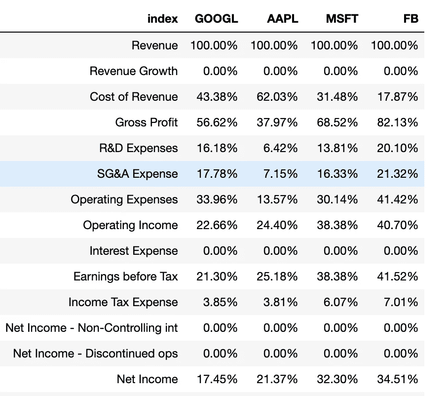

# Python 股票分析-检索和比较损益表

> 原文：<https://medium.com/analytics-vidhya/retrieving-and-comparing-income-statement-data-with-python-a6f184b160cc?source=collection_archive---------3----------------------->

在准备 CFA 考试的时候，我遇到了很多比率、分析、表格等等。非常有用的方法和分析，以便更好地理解公司背后的东西，并找到有趣的公司。然而，令人沮丧的是，如果我要分析一家公司，我需要花费大量时间收集所有需要的数据，浏览每份超过 100 页的年度报告。


手动收集股票数据是一项乏味的任务，我不愿意承担。我没有时间，也没有动机去做那件事。幸运的是，还有另一种方法。利用我在 Python 和 Pandas 方面的知识，我可以获得继续分析所需的信息。我打算通过 Python 来自动化我的财务分析。

## 在自动化了一些财务分析工具后，我想为什么不在网上和其他人分享，这样每个人都能受益。

然后，我突然想到，为什么不创建一个媒体账户，开始与所有感兴趣的人分享内容呢？这就是我在这里发布 Python 金融系列文章和创建 Youtube 视频教程的原因。我将发布更多的媒体故事，分享我迄今为止所做的所有分析。开始吧！

**在 Python 股票分析**的第一个故事中，我想向你展示如何使用 Python、Pandas 和一个名为 [financialmodelingprep](https://financialmodelingprep.com/developer/docs/) 的免费 API 以编程的方式从不同的公司检索损益表。

然后，一旦我们检索到财务数据，我们将建立一个纵向通用规模的损益表，它将允许对各种损益表项目进行简单的比较，如毛利润、净收入等。不同的公司。

> 普通规模的损益表只是将损益表的每个项目表示为收入的百分比。

这是一个非常有用的工具，可以比较同行业的不同公司，或者跨不同时期的相同公司。在 [Investopedia](https://www.investopedia.com/terms/c/commonsizeincomestatement.asp) 中了解有关该分析工具的更多信息。

一旦脚本准备好，通过传递我们想要分析的公司名称，我们将在几秒钟内得到我们的分析！不精彩吗？

我有一个 Youtube 视频，一步一步地解释如何编写脚本从多个公司获取损益表数据。我会强烈推荐你观看它来学习如何自己做。如果你不喜欢看视频，那完全没问题，我会在这里张贴 Python 代码，这样你就可以尝试一下，自己得到所有的财务数据。

用 Python 比较损益表

让我们从编码开始。首先，我们将使用一个函数" *selectquote"* ，在这里我们将传递我们想要从中获取信息的股票。在这种情况下，我们需要通过公司的股票代号，例如，*代表苹果*。然后，我们调用 API 来获取一个字典，其中包含我们传递给函数的公司损益表。

```
def selectquote(quote):
    r= requests.get(f"[https://financialmodelingprep.com/api/v3.](https://financialmodelingprep.com/api/v3/financials/income-statement/{quote}?period=quarter)...")
    r = r.json()

    stock = r['financials']
    stock = pd.DataFrame.from_dict(stock)
    stock = stock.T
```

我们将 get 请求的响应存储在一个变量中，然后将这个变量转换成一个字典。从我们的字典中，我们可以很容易地将其转换为 Pandas 数据帧，以便使用它并执行一些基本的数据操作。我们将重命名 DataFrame 列，删除一些无用的数据，并将 object 列转换为 numbers。

最后，我们将收益表的每个项目除以收入。我们用下面的代码完成了所有的工作。希望它是清楚的，否则观看上面嵌入的视频，所有的脚本是一步一步解释。

```
 stock.columns = stock.iloc[0]
    stock.reset_index(inplace=True)
    stock = stock.iloc[:,0:2]
    stock.rename(columns={ stock.columns[1]: quote }, inplace = True)
    cols = stock.columns.drop('index')
    stock[cols] = stock[cols].apply(pd.to_numeric, errors='coerce')
    stock = stock.iloc[1:,]
    #Divide whole dataframe for first row (i.e. revenue)
    stock[quote] = (stock[quote]/stock.iloc[0,1])
    #Format numbers as Percentage
    stock[quote] = pd.Series(["{0:.2f}%".format(val * 100) for val in stock[quote]], index = stock.index) return stock
```

在代码的最后一部分，为了获得不止一家公司的数据并实现可比性，我们将遍历一个我们想要分析的股票列表，并将它们合并到一个我称为 x 的 combine Pandas DataFrame 中。

在下面的例子中，我们将苹果、微软、脸书和谷歌结合在一起:

```
listofstocks = ['AAPL','MSFT','FB']x = selectquote('GOOGL')for item in listofstocks:
    y = selectquote(item)
    x = x.merge(y,on='index')
```

我们的最终结果呈现在下图中。几秒钟之内，我们就可以清楚地对比每家公司的表现。

从下面，我们可以看到苹果的*收入成本*比脸书高得多，这使得脸书的毛利润占收入的比例更高。



使用 Python 的普通大小损益表

在下一个故事中，我将向您展示如何从不同的公司下载财务比率，并将它们合并到一个单一的 Pandas 数据框架中，以便进行比较。