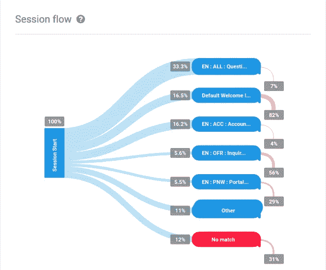

# 从对话流中检索对话历史记录

> 原文：<https://medium.com/analytics-vidhya/retrieving-conversation-history-from-dialogflow-bf3d41320420?source=collection_archive---------4----------------------->


# 什么是 Dialogflow？

根据 Dialogflow 的官方文档，

> Dialogflow 是一个自然语言理解平台，可以轻松设计对话式用户界面并将其集成到您的移动应用程序、web 应用程序、设备、机器人、交互式语音响应系统等中。使用 Dialogflow，您可以为用户提供新的、引人入胜的方式来与您的产品进行交互。
> 
> Dialogflow 可以分析来自客户的多种类型的输入，包括文本或音频输入(如来自电话或录音)。它还能以几种方式回应你的客户，通过文本或合成语音。

嘿，如果你还没有在 Dialogflow 上训练你自己的聊天机器人，请访问他们的[文档](https://cloud.google.com/dialogflow/docs/)开始吧。简单又好玩！！

如果您已经将 Dialogflow 聊天机器人集成到您的网站、移动应用程序或社交媒体页面，并且您想要检索对话历史，以便您可以执行某种分析并了解您的客户或用户，这就是您的理想选择！！

# 对话流分析

Dialogflow 包含一个分析页面，让您深入了解您的代理的表现，以便您可以进一步改善您提供的用户体验。它显示了与代理及其参与的对话相关的两种数据类型:

*   使用数据:会话数和每个会话的查询数。
*   NLU 数据:最常用的意向和退出百分比。

点击左侧菜单中的**分析**将带您进入 UI 仪表板。在这里，您可以查看与特定代理相关的统计信息。



# 登录对话流

Dialogflow 不提供任何 API 来直接检索对话历史。你必须将对话记录到谷歌云，并从那里检索。要在 Dialogflow 中启用日志记录，请通过单击控制台左侧菜单中的⚙️图标并在`LOG SETTINGS`下启用`Log interactions to Google Cloud`来进入聊天机器人设置。这将把 Dialogflow 日志写到 [Google Stackdriver](https://en.wikipedia.org/wiki/Stackdriver) 。点击`GOOGLE PROJECT`下的`project id`，将带你进入谷歌云控制台。在云控制台转到`Logs View`。


这将向您显示来自 Dialogflow 的日志，您可以通过运行查询来过滤结果。


# 将日志导出到本地计算机

现在你的 Dialogflow 日志在 Google Stackdriver 里了。您可以将这些日志存储在云中，也可以将日志导出到第三方服务器。为此，您必须配置一个[日志路由器](https://cloud.google.com/logging/docs/routing/overview)。根据谷歌云文档，

> 所有日志，包括审计日志、平台日志和用户日志，都被发送到云日志 API，在那里它们通过日志路由器。日志路由器根据现有规则检查每个日志条目，以确定要丢弃的日志条目、要在云日志中接收(存储)的日志条目以及要使用日志接收器导出的日志条目。

下图说明了日志条目的路由:


> 云日志记录收到的每个日志条目都会与排除过滤器和包含过滤器进行比较。这些比较是独立的。
> 
> 为了确定日志条目是否被导出到目标，将日志条目与包含过滤器的日志接收器查询进行比较。当出现匹配时，日志条目被导出到接收器目标。一个日志条目可能匹配多个包含过滤器。
> 
> 为了确定日志条目是被丢弃还是被保存在云日志存储中，将日志条目与排除过滤器进行比较。如果它匹配任何排除过滤器，日志条目将被丢弃。否则，日志条目将保存在云日志存储中。

欲了解更多信息，请访问[文档](https://cloud.google.com/logging/docs/routing/overview)页面。

为了更好地控制日志，您需要将它们保存在本地环境的文件或数据库中。因此，您必须将它们路由到 [Google Cloud Pub/Sub](https://cloud.google.com/pubsub/docs/overview) 。点击`Logs Router -> CREATE SINK`。


在下一个视图中，为您的**接收器**命名，并选择`Pub/Sub`作为**接收器服务**。在**接收目的地**下拉菜单中选择`Create new Cloud Pub/Sub topic`。为您的发布/订阅主题命名，然后点击`Create`。然后点击`Create Sink`。这会将您的日志路由到云发布/订阅。


从云控制台菜单中选择`Pub/Sub -> Topics`。


您可以看到您的主题已经创建。我在这里创建的题目是`chitti-logs`。要将日志放到您的本地环境中，您需要订阅您的主题。让我们创建一个订阅。点击主题旁边的⋮，然后选择`Create subscription`。给你的订阅起一个名字，其他的都保持默认，选择`Create`。您的日志已经准备好被拉到您的本地机器上。但在此之前，请遵循此处的教程[并在您的机器中设置 Google Cloud SDK。](https://cloud.google.com/sdk)

在你的命令行运行 [gcloud init](https://cloud.google.com/sdk/gcloud/reference/init) 来初始化 SDK。

```
./google-cloud-sdk/bin/gcloud init
```

一旦一切都设置好了，下面的命令将在命令行或终端中打印您的日志。这里，`chitti-sub`是我的发布/订阅 id。
`gcloud pubsub subscriptions pull --auto-ack chitti-sub`

将 Dialogflow 日志导出到本地机器的目的是为了执行某种分析并了解您的客户或用户。在我的例子中，我想为我的聊天机器人开发一个仪表板，这样我就可以在一个地方查看我分析过的所有信息。为了实现这一点，我必须将发布/订阅消息写到 [Elasticsearch](https://www.elastic.co/) 。我将在下一篇文章中解释我是如何与[Spring Boot·GCP](https://spring.io/projects/spring-cloud-gcp)一起实现这一点的。敬请关注…