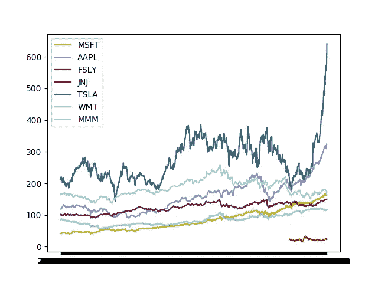

# 通过 Yahoo Finance 在 Python 中检索历史股票数据

> 原文：<https://medium.com/analytics-vidhya/retrieving-historical-stock-data-in-python-via-yahoo-finance-fba37fb18727?source=collection_archive---------12----------------------->

检索历史股票数据进行分析可能是一项艰巨的任务。许多提供这种信息的 API 需要某种类型的成员资格、帐户，甚至是费用，才能访问数据。幸运的是，雅虎财经在他们的网站上免费提供信息，并可以下载历史股票数据。然而，使用该网站来做这件事可能会成为一个麻烦…