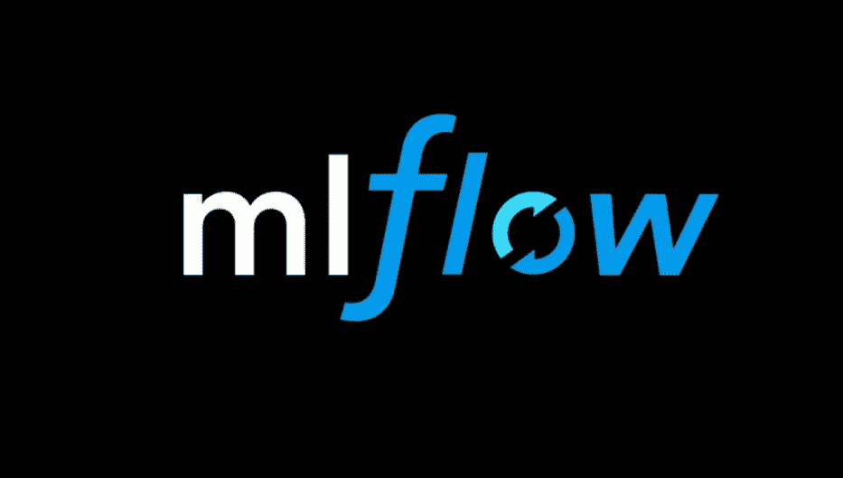

# 使用 Python API 为 MLflow 检索最佳模型

> 原文：<https://medium.com/analytics-vidhya/retrieving-the-best-model-using-python-api-for-mlflow-7f76bf503692?source=collection_archive---------5----------------------->



这是我的 MLflow 教程系列的第五篇文章:

1.  [在生产中设置 ml flow](/@gyani91/setup-mlflow-in-production-d72aecde7fef)
2.  [MLflow:基本测井功能](/@gyani91/mlflow-basic-logging-functions-e16cdea047b)
3.  [张量流的 MLflow 测井](/@gyani91/mlflow-logging-for-tensorflow-37b6a6a53e3c)
4.  [MLflow 项目](/@gyani91/mlflow-projects-24c41b00854)
5.  [使用 Python API 为 MLflow 检索最佳模型](/@gyani91/retrieving-the-best-model-using-python-api-for-mlflow-7f76bf503692)(你来了！)
6.  [使用 MLflow 服务模型](/@gyani91/serving-a-model-using-mlflow-8ba5db0a26c0)

本教程展示了如何从 MLflow 运行中检索先前记录的模型。

假设您使用不同的参数对以下示例进行了多次试验:

```
mlflow run git@github.com:databricks/mlflow-example.git -P alpha=0.5
```

现在，您想要检索根据特定标准表现最佳的存储模型。你需要导入你的模型所属的 MLflow 库的深度学习模块。在我的例子中，我使用的是 Sklearn 工具包模型，所以我导入了[**ml flow . sk learn**](https://www.mlflow.org/docs/latest/python_api/mlflow.sklearn.html)。

```
import mlflow.sklearn
import pandas as pd
import os
```

接下来我们需要使用 MLflow 的 Python API 来查询 MLflow 跟踪服务器。我们使用[**ml flow . search _ runs()**](https://www.mlflow.org/docs/latest/python_api/mlflow.html#mlflow.search_runs)函数。这个函数使用 *filter_string，*作为查询的过滤器，并返回一个 *pandas。运行的 DataFrame* ,其中每个指标、参数和标记都被展开到它们自己的名为 metrics 的列中。*，参数。*、和标签。*分别为。对于没有特定度量、参数或标记的运行，它们的值将分别为(NumPy) Nan、None 或 None。

```
df = mlflow.search_runs(filter_string="metrics.rmse < 1")
```

一旦我们有了运行的熊猫数据框架，我们就可以通过使用熊猫的 [idxmin()](https://pandas.pydata.org/pandas-docs/stable/reference/api/pandas.DataFrame.idxmin.html) 或 [idxmax()](https://pandas.pydata.org/pandas-docs/stable/reference/api/pandas.DataFrame.idxmax.html) 函数根据一个度量找到最佳模型。DataFrame，这取决于我们是尝试最小化还是最大化指标。 [idxmin()](https://pandas.pydata.org/pandas-docs/stable/reference/api/pandas.DataFrame.idxmin.html) 返回具有最小度量值的行的索引。然后我们使用这个索引作为 [loc()](https://pandas.pydata.org/pandas-docs/stable/reference/api/pandas.DataFrame.loc.html) 函数的输入来获取整行。最后， *['run_id']* 将给出给出最佳模型的运行的 run_id。

```
run_id = df.loc[df['metrics.rmse'].idxmin()]['run_id']
```

我们使用从上一步获得的 *run_id* 在 Python 运行时加载模型。为此我们使用深度学习模块的 [load_model()](https://www.mlflow.org/docs/latest/python_api/mlflow.sklearn.html#mlflow.sklearn.load_model) 函数(在我们的例子中为[**ml flow . sk learn**](https://www.mlflow.org/docs/latest/python_api/mlflow.sklearn.html)**)。**

```
model = mlflow.sklearn.load_model("runs:/" + run_id + "/model")
```

**最后，我们从加载的模型中进行推断。这个步骤对于模型和深度学习框架来说是非常特定的，并且在不同的模型之间变化很大。**

```
wine_path = os.path.join(os.path.dirname(os.path.abspath(__file__)), "wine-quality.csv")
data = pd.read_csv(wine_path)
test = data.drop(["quality"], axis=1)print(model.predict(test))
```

**完整代码:**

```
import mlflow.sklearn
import pandas as pd
import os#Reading Pandas Dataframe from mlflow
df=mlflow.search_runs(filter_string="metrics.rmse < 1")#Fetching Run ID for
run_id = df.loc[df['metrics.rmse'].idxmin()]['run_id']#Load model
model = mlflow.sklearn.load_model("runs:/" + run_id + "/model") #Inference
wine_path = os.path.join(os.path.dirname(os.path.abspath(__file__)), "wine-quality.csv")
data = pd.read_csv(wine_path)
test = data.drop(["quality"], axis=1)print(model.predict(test))
```

**在下一篇文章中，我们将探讨如何使用 MLflow 服务来服务一个模型。**