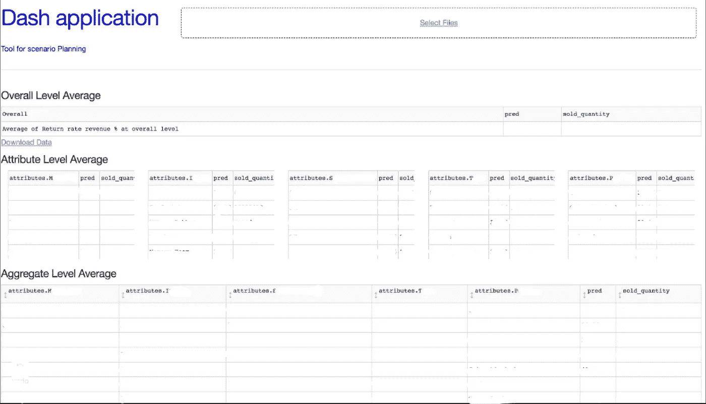

# 使用 Python Dash 报告仪表板

> 原文：<https://medium.com/analytics-vidhya/returns-pain-point-of-e-commerce-industry-a62c47819800?source=collection_archive---------14----------------------->


在这篇文章中，我将带你快速地使用 Python Dash 来展示从 ML 模型中获得的实时结果。

Python Dash 是基于 Python 框架的，用于构建漂亮的基于 web 的分析 web 应用程序。Dash 基于 Flask、Plotly.js 和 React.js 编写，非常适合构建数据可视化应用程序和使用纯 Python 的高度定制用户界面报告仪表板。更多信息可以在 Dash 官方文档中找到。

不谈背景背景，产品退货一直是电商企业的痛点。处理数据清理、EDA 和预测建模非常重要，以清晰易读的形式向业务用户展示这些结果也非常重要。

我曾经使用 Python dash 来呈现不同切割的预测回报数字，以便进行分析和商业决策。下面是我准备的中级 Dash web 应用程序的快照:



快照是从中间步骤，有很多像下拉，用户界面改进等附加功能..

F ***功能性*** :用户通过提供的链接打开 Dash app，通过预定义的模板上传数值，存储在 pickle 中的 ML 训练模型在服务器上运行，结果通过 Dash 呈现给业务用户。

跳到代码前面，导入必要的包后，我们需要初始化 dash app。

```
app = dash.Dash()
```

然后我们需要定义 App 布局。下面是标题文本对齐的初始代码片段:

```
app.layout = html.Div([
 html.Div([
 html.H1(
 children =’Dash application’, 
 style = {
 ‘textAlign’: ‘left’,
 ‘color’: colors[‘text’],
 ‘display’: ‘inline-block’
 }
 ),
 ],
 style={‘width’: ‘25%’, ‘display’: ‘inline-block’}),
```

我放了一个上传按钮，让用户通过预定义的模板上传值，这些值将输入 pickle 文件以运行模型。

```
html.Div([
 dcc.Upload(
 id=’datatable-upload’,
 children=html.Div([ 
 html.A(‘Upload File’) 
 ]),
 style={
 ‘width’: ‘`00%’, ‘height’: ‘60px’, ‘lineHeight’: ‘60px’,
 ‘borderWidth’: ‘1px’, ‘borderStyle’: ‘dashed’, #customizing csv upload option
 ‘borderRadius’: ‘5px’, ‘textAlign’: ‘center’, ‘margin’: ‘10px’,

 },
 ),
 ],
 style={‘width’: ‘50%’, ‘display’: ‘inline-block’}),
```

还可以定制 python 函数，并在回调中调用它们。在我的 dash 应用程序中放置主表的回调函数。

```
[@app](http://twitter.com/app).callback(Output(‘output-data-upload4’, ‘children’),
 [Input(‘datatable-upload’, ‘contents’)],
 [State(‘datatable-upload’, ‘filename’)])
def update_output(contents,filename):
 if contents is not None:
 df_result = parse_contents(contents, filename)
 gf_new = df_result
 gf_new = gf_new.round(2)
 gf_new = gf_new.applymap(str)
 children = [html.Div([dash_table.DataTable(data=gf_new.to_dict(‘records’),columns=[{‘name’: i, ‘id’: i} for i in gf_new.columns],
 sorting=True,
 pagination_mode=”fe”,
 pagination_settings={
 “displayed_pages”: 1,
 “current_page”: 0,
 “page_size”: 10,
 },
 navigation=”page”,
 #style_cell={‘textAlign’: ‘left’}
 )])]
 return children
```

您还可以添加一些特色和定制，比如分页模式、pagination_settings、导航等。如果您可以通过 HTML 和 CSS 进行定制，Dash 可以提供很多功能。

也可以在回调中添加类似下载 csv 或 Excel 的按钮。

```
[@app](http://twitter.com/app).callback(Output(‘download-link4’, ‘href’),
 [Input(‘datatable-upload’, ‘contents’)],
 [State(‘datatable-upload’, ‘filename’)])
def update_output(contents,filename):
 if contents is not None:
 df_result = parse_contents(contents, filename)
 gf_new = df_result
 gf_new = gf_new.round(2)
 gf_new = gf_new.applymap(str)
 csv_string = gf_new.to_csv(index=False, encoding=’utf-8')
 csv_string = “data:text/csv;charset=utf-8,” + urllib.pathname2url(csv_string)
 return csv_string
```

您还可以添加预定义的自定义 CSS 模板以获得更好的用户界面:

```
app.css.append_css({“external_url”: “[https://codepen.io/chriddyp/pen/bWLwgP.css](https://codepen.io/chriddyp/pen/bWLwgP.css)"}) #CSS Stylesheet-1app.css.append_css({“external_url”: “[https://codepen.io/chriddyp/pen/brPBPO.css](https://codepen.io/chriddyp/pen/brPBPO.css)"}) #CSS Stylesheet-2
```

最后但同样重要的是，不要忘记将代码包装在 Main 函数中，以便在 flask 服务器上运行。

```
ap=app.server
if __name__ == ‘__main__’:
 ap.run()
```

从部署的角度来看，你可以在 AWS/Azure 或任何 VM 或 Heroku 上部署你的应用。一旦部署了 app，就可以使用 Nohup.out(对于 AWS)这样的命令来查看日志。您还可以在较大负载和多个用户的情况下调整其性能。

Dash 拥有惊人而广泛的功能。我仍在学习过程中，以完全探索其能力。

这是所有的乡亲。

> *(免责声明:代码片段可能会有所不同，并且可能不会在快照中显示应用程序，因为两者是在不同的时间记录的)*