# 日常使用的可重用 ML 代码片段——第一部分

> 原文：<https://medium.com/analytics-vidhya/reusable-ml-code-snippets-for-everyday-use-part-i-f313903c2b37?source=collection_archive---------19----------------------->

如果你是 ML 专业人员或学生，你必须处理多个可重复使用的代码片段。有时，在您到达建模和超参数调整阶段之前，它会浪费相当多的时间。记住这一点，我创建了这个博客来整理许多这样的代码块。如果你发现这个列表中缺少任何重要的部分，请在评论中提出。我在这里补充一下。我使用 Google Colab 进行我所有的分析和探索性编码工作。虽然我已经尝试了大多数其他 IDE，但它是一个您可以满足于每种类型的模型的 IDE，例如，当您需要针对 CNN 的 GPU 时，或者当您需要针对大型数据集的大型 RAM 时。不用说，它在云上。它有一种为 **Jupyter note** 定制的味道，这使得它更加用户友好。让我们不要浪费时间，直接跳到下一节的片段。

1.  **从 Kaggle** 下载数据，我们将使用来自 ASHRAE 能源预测大赛的数据。如果您正在处理任何 Kaggle 挑战，这将非常有用。

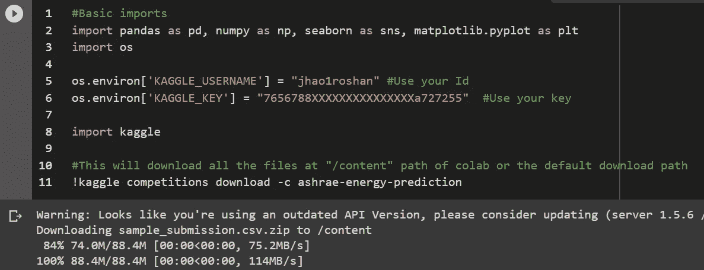

代码和输出—从 Kaggle API 下载数据

**2。**让我们加载 **CSV 文件**并检查**基本功能**以检查我们的数据。这些函数根据*异常值、NAN 比率、类别列*为您提供数据意义。图像中显示的输出是最后一个命令的输出。"[*【value _ counts()*](https://pandas.pydata.org/pandas-docs/stable/reference/api/pandas.Series.value_counts.html)"对于分类特征变得非常重要，因为基本 EDA 可用的大多数图主要用于数字特征。

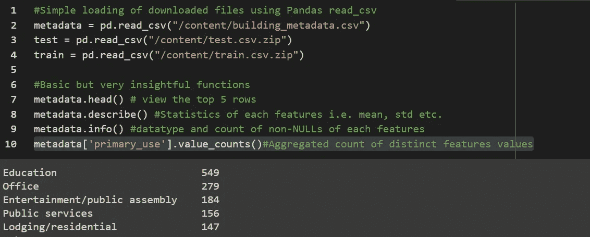

代码和输出—基本数据帧功能

**3。探索性数据分析。**这是一种使用强大的图表更深入研究数据的便捷方式。只要足够留心，在你的计划中创建一个“*洞察力对行动*”的地图。我们只是进行 EDA，然后进入下一步预处理，而没有采取行动来获得洞察力，这种情况并不罕见。

*答:*首先是 ***热图*** *。它给出了所有特征对之间的相关性的非常清晰的视图。我们将使用 [*Seaborn 库*](https://seaborn.pydata.org/#) 的 [*热图*](https://seaborn.pydata.org/generated/seaborn.heatmap.html) 函数。使用*图尺寸*调整地图 esp 的尺寸。当你有很多特征的时候。*

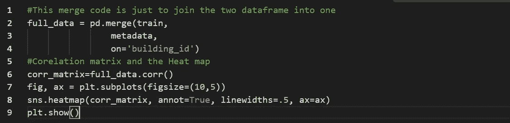

代码—关联矩阵和热图

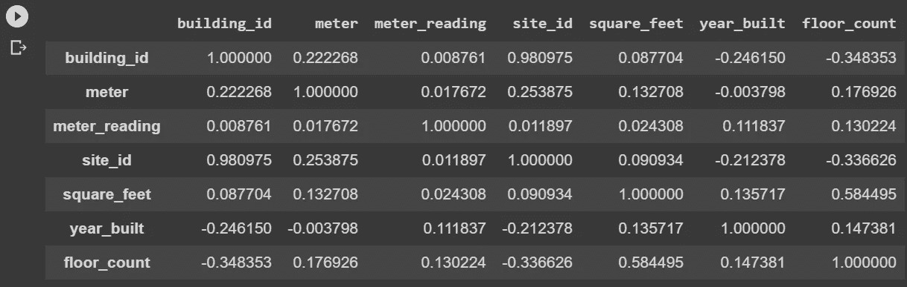

输出-相关矩阵

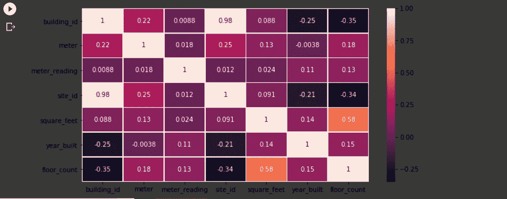

输出—热图

*b .接下来会出现* ***方框图*** *。*它让我们对数据中的*中位数*、*分位数*以及最重要的*异常值*有了一个统一的认识。我们将使用*的 [*boxplot*](https://seaborn.pydata.org/generated/seaborn.boxplot.html) 功能。您可以绘制多种风格的箱线图*，例如，一个图表中的所有列、数字特征与分类 a 特征等*。正如我们所看到的，许多异常值在图上显示为点。如果你不知道如何阅读方框图，请查看 [*和*](https://www.statisticshowto.datasciencecentral.com/probability-and-statistics/descriptive-statistics/box-plot/) 。*

*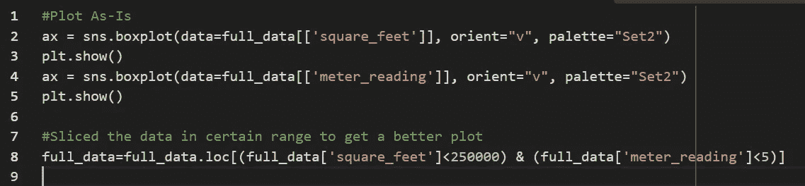*

*代码盒图*

*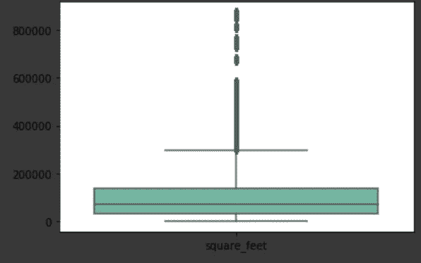*

*平方英尺的输出箱线图*

*第三个也是最后一个是 Pairplot。它给出了特征间相关性的放大视图，我们应该更多地使用它来检查每个输入特征与输出特征的相关性。在这种情况下，就是*抄表*。我们将使用 [*Seaborn 库*](https://seaborn.pydata.org/#) 的 [*pairplot*](https://seaborn.pydata.org/generated/seaborn.pairplot.html?highlight=pairplot#seaborn.pairplot) 函数。我选择了 3 个特征来保持图的整洁，但是你必须对所有的非分类特征都这样做。*

*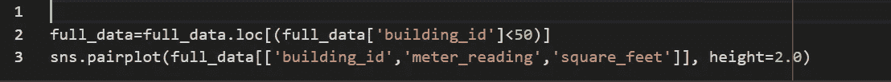*

*代码对图*

*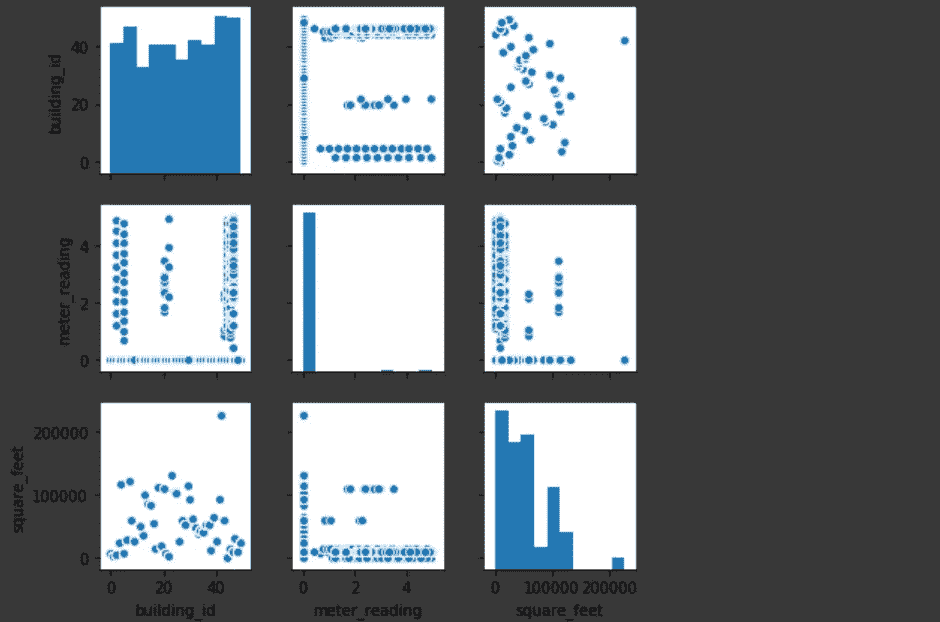*

*输出对绘图*

***4。通用代码片段。**这是本帖的最后一部分。在这一节中，我们将看到我们经常需要的 Python 代码片段的健康列表。*

*[*reset _ index*](https://pandas.pydata.org/pandas-docs/stable/reference/api/pandas.DataFrame.reset_index.html#pandas.DataFrame.reset_index)—对数据帧进行大量操作可能会使其索引无序，这将导致连接产生 NAN 行。我们必须在连接之前重置索引*

**原地* —几乎所有的函数都支持这个属性，只是要注意这一点，尽量多使用。*

**timestamp —* 代码片段将字符串特征转换成时间戳，然后我们可以提取*日、月、年等的单个值。*并做出新的特色。这将在特征提取方面对您有很大帮助，因为时间戳本身在许多数据场景中不会增加太多差异。一天或一个月会更好。*

**在列*上循环——这是一个非常简单但非常有效的方法来分析你的特征的不同属性。大多数属性取决于列类型，即字符串、数字。在同一个代码片段中，您有代码填充 NAN *即*[*fillna()*](https://pandas.pydata.org/pandas-docs/stable/reference/api/pandas.Series.fillna.html#pandas.Series.fillna)*用于分类数据和数值数据。我使用了*最常用的*值作为分类特征，使用了[*mean()*](https://pandas.pydata.org/pandas-docs/stable/reference/api/pandas.Series.mean.html#pandas.Series.mean)*作为数值特征。根据您对各自特征的分析，您可以更改方法*，即 0、某个常数、*[*median()*](https://pandas.pydata.org/pandas-docs/stable/reference/api/pandas.Series.median.html#pandas.Series.median)*，删除行*。***

**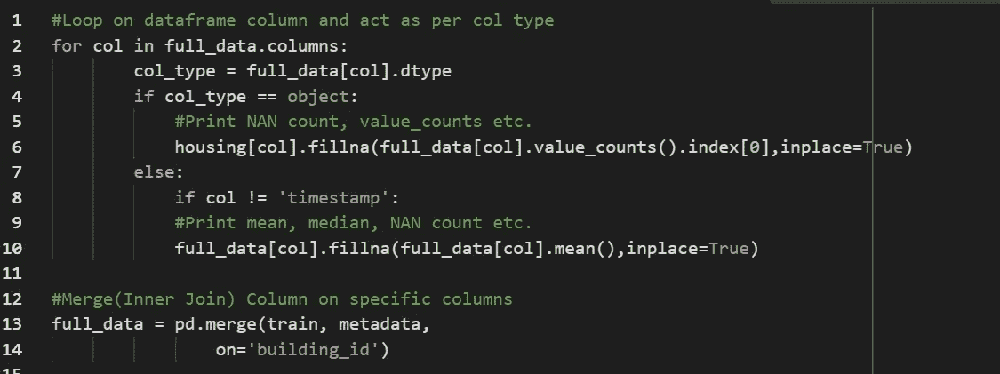**

**代码—通用代码片段[0，2]**

**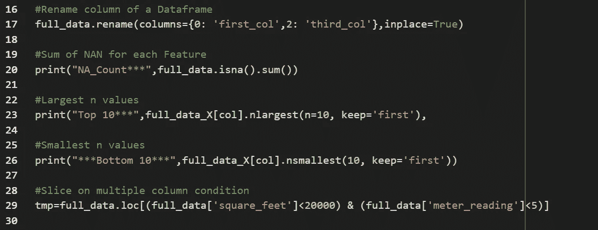**

**代码—通用代码片段[2:7]**

**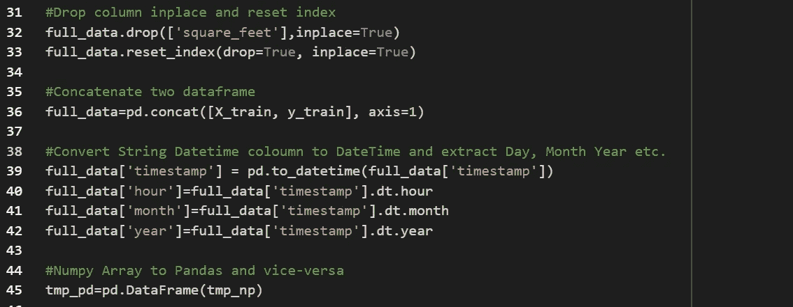**

**代码—通用代码片段[7:11]**

**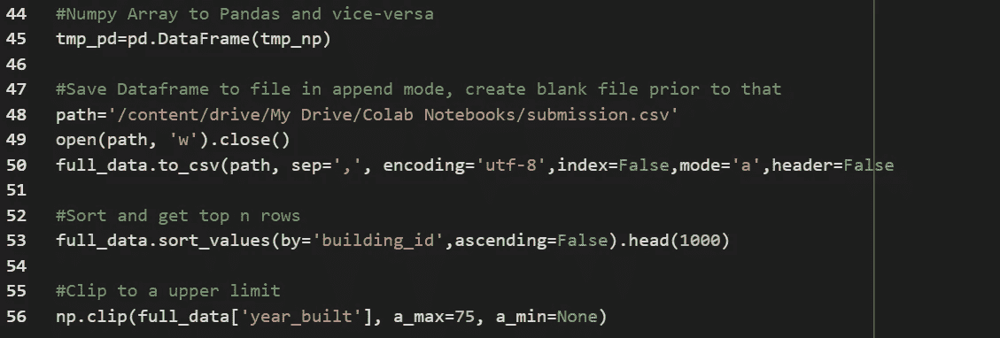**

**代码—通用代码片段[11:15]**

**这都是我为这篇文章写的。我将在帖子的第二部分继续这方面的内容，我将涉及到*缩放、宁滨、一位热码、标签编码、数据帧的内存优化、交叉验证、Kaggle 中使用的不同指标的代码以及更多内容*。重点会更多放在 ML 车型上。下面是这篇文章代码的 Colab 笔记本的链接。请在这个帖子和笔记本上发表你的评论。**

**[链接到代码](https://colab.research.google.com/drive/1FAqVuLLMYDijq4Cm4xZaFI69ZFyPJV0o)的 Colab 笔记本**

** [## 谷歌联合实验室

### 笔记本

colab.research.google.com](https://colab.research.google.com/drive/1FAqVuLLMYDijq4Cm4xZaFI69ZFyPJV0o)**