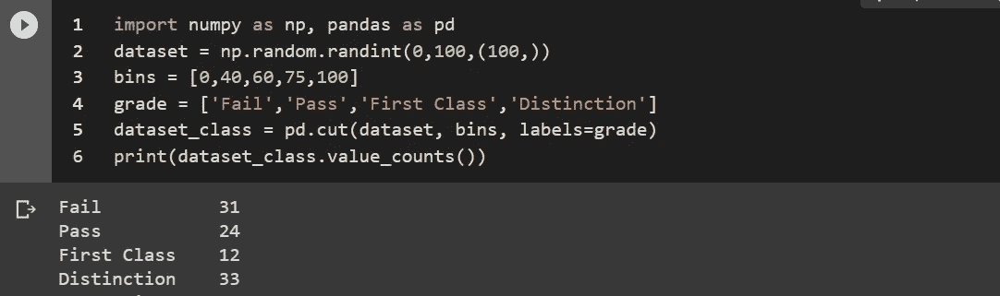
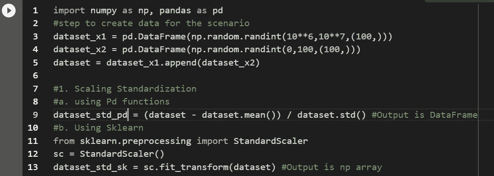
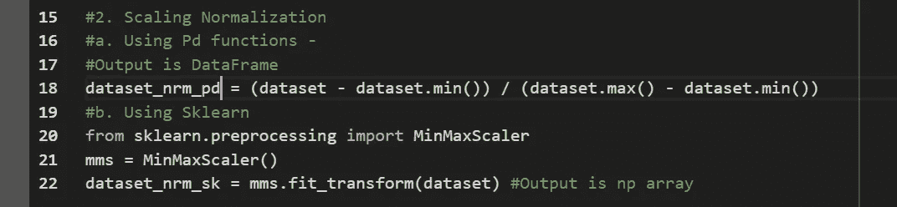
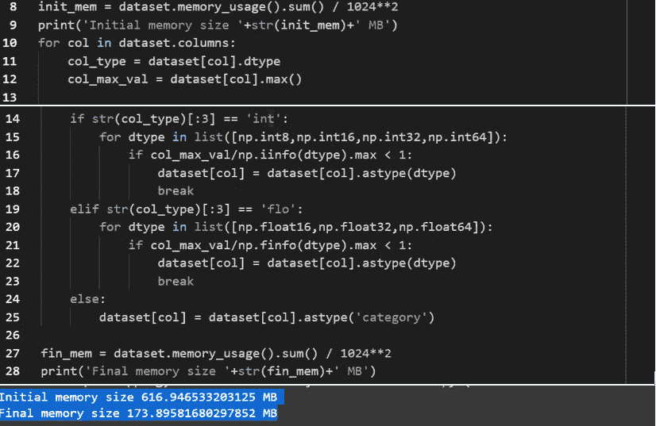
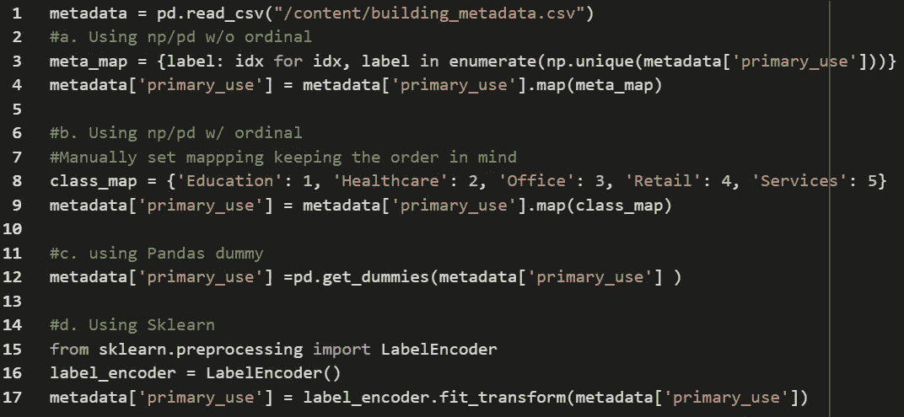
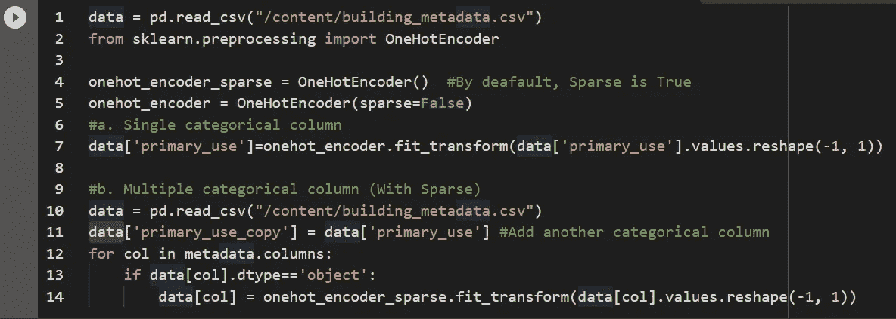
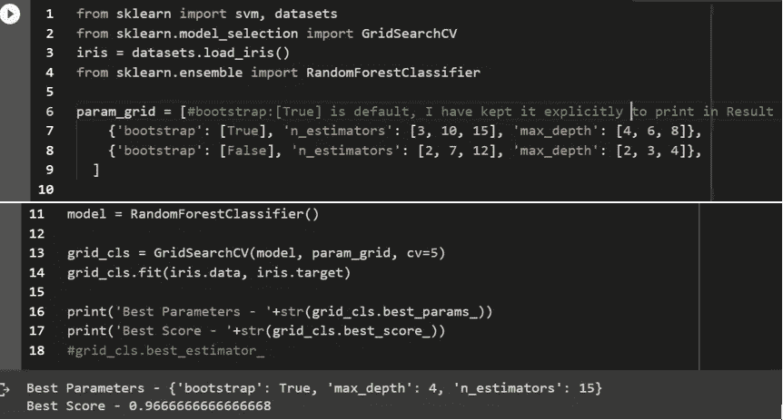
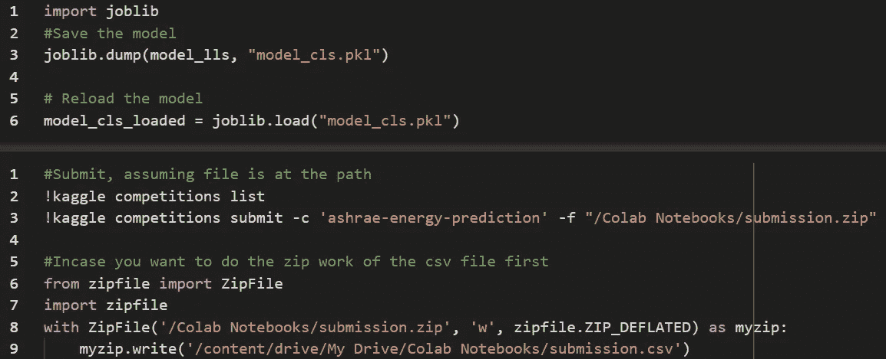
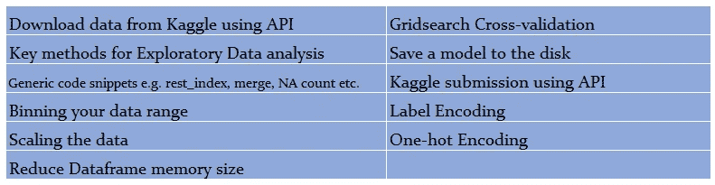

# 日常使用的可重用 ML 代码片段——第二部分

> 原文：<https://medium.com/analytics-vidhya/reusable-ml-code-snippets-for-everyday-use-part-ii-f5656a68f5dd?source=collection_archive---------23----------------------->

朋友们，你们好，我这里是这个系列的第二部分。如果你还没有检查第一部分，检查一下我们这里的****。虽然我对第三部和未来的部分没有立即的计划，但我仍然不会称之为结尾部分，因为我可能会想到特定地区的片段，例如 CNN、RNN、Ensemble 等。在接下来的 3-4 篇 [10XAI](/@10XAI) 的文章中，我将深入到令人困惑的主题，例如 PCA/SVD 和元主题，例如 ML 路线图等。让我们跳到下一节的片段。****

1.  ****宁滨你的数据范围**，当你想把你的连续数据转换成一个类别数据时就需要这个武器。把分数转换成等级就是一个典型的例子。在这个片段中，我从 100 分中随机抽取了 100 分，根据不同的步骤分别进行评分。**

****

**代码和输出—宁滨**

**2.**缩放数据**是最关键的步骤之一，没有它，许多算法将不会收敛到可用的输出。几乎每个 ML 活动都需要将它们的所有特性提升到相同的水平。在这个片段中，我已经用两种方法对两种变体进行了缩放，即标准化和规范化，例如 Sklearn 和 Pandas 的函数，因为我们还必须知道如何从头开始编写任何代码。创建两个数据集并将其合并以创建我们的示例数据集的原因是为了获得一个包含不同比例要素的数据集。*要注意 Sklearn 的输出数据类型和 Pandas 的函数之间的细微差别。* **Sklearn 输出是一个 Numpy 数组。****

****

**代码-缩放['标准']**

****

**代码-缩放['Nrm']**

**3.**减小数据帧大小并释放 RAM** —当我们加载 CSV 或任何其他文件时，Pandas 会创建一个数据帧，该数据帧并未按照某个特性的最大值进行优化。它的意思是，一个特性的最大值可以容纳在 int16 大小的内存中，但它可能被分配给 int64 大小的 RAM。使用这个代码片段，您可以节省高达 70%的内存。如果你正在进行 Kaggle 比赛，这是必须的。正如您在输出中看到的，**616 MB 的数据帧通过这个简单的调整减少到了 173 MB。代码简单明了。*我们对每一列进行循环，得到它的最大值，然后把它的数据类型改成 max limit 大于该列最大值的类型。*****

****

**代码和输出—内存优化**

****4。标签编码** — ML 学习库不接受 String/Char 作为输入。所以所有的分类特征都必须转换成一个数值。这项任务是通过使用标签编码或一键完成的。在我们的代码片段中，我们使用四种不同的方法对数据进行了编码。在没有现成函数的代码方法中，我们通过枚举特性的唯一值来创建映射字典，然后将该字典映射到数据序列本身。**

****

**代码—标签编码**

****5。One-hot Encoding** —当我们不想向模型传递任何关于特性数值的消息时，使用一个 hot Encoding。OHE 的缺点是它增加了模型的维数。我们已经使用 Sklearn 实现了这个任务。当你得到一个稀疏矩阵或非稀疏矩阵的时候要小心。**

****

**代码—一键编码**

****6。Gridsearch 交叉验证** —当您想要尝试多个参数组合以获得最佳工作模型时，Gridsearch 是一种方便的方法。您可以为想要尝试的参数值创建一个字典。字典的关键字必须与模型的参数同名。在这种情况下，这些是 Sklearn RandomForestClassifer 的 parm。然后将模式和字典传递给 GridSearch 构造函数。最后，Gridsearch fit 方法的输入和标签数据。然后你就可以看到最好的 parm 组合，最好的分数。**

****

**代码和输出—网格搜索**

****7。将一个模型保存到磁盘和 Kaggle 提交文件**——这是这篇文章的最后一部分。这里我们有两个简单的代码，第一个是将你的模型保存到磁盘，稍后再重新加载。这个片段可以用于任何 Python 对象。第二，使用 Kaggle API 提交你对任何 Kaggle 比赛的预测。**

****

**代码—保存到磁盘，提交给 Kaggle**

**8.**两个帖子的总结**，在两个帖子中，我们通过这些代码片段算出。随身携带这两个 Colab 笔记本的副本，用你的学习增强它，提高你的生产力。下面是这篇文章代码的 Colab 笔记本链接。请在这个帖子和笔记本上发表你的评论。**

****

**摘要**

**[链接到代码](https://drive.google.com/open?id=1ERJ3sUWZPvQBksNi79OofD_MKHCLr465)的 Colab 笔记本**

** [## 谷歌联合实验室

10XAI —笔记本电脑](https://colab.research.google.com/drive/1ERJ3sUWZPvQBksNi79OofD_MKHCLr465#scrollTo=sObTJPSTAfvq)**